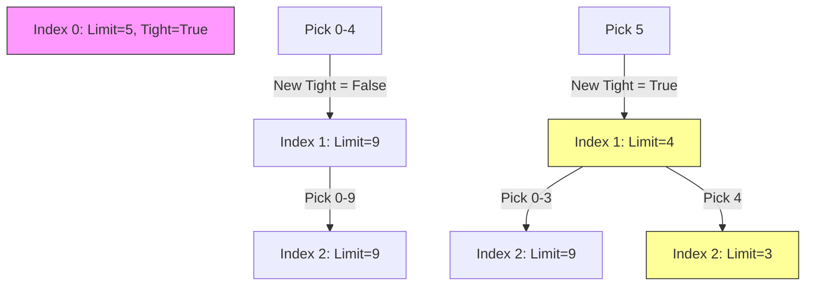
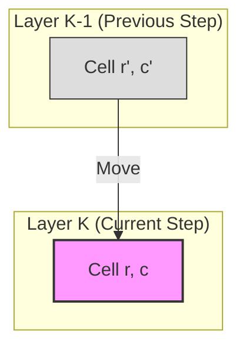

# **Introduction**

🧩 1. **State**

A **DP state** defines what subproblem you're solving.

**In other words:**

> It is a representation of the problem with a subset of inputs that leads to the full solution.

**Examples:**

* `dp[i]` = the optimal solution (e.g., max/min/count/etc.) considering the first `i` elements.
* `dp[i][j]` = the solution when considering the first `i` items and a total capacity of `j`.
* `dp[mask]` = the result when a subset of elements (represented by bitmask `mask`) has been processed.
* `F(n)` =the result (e.g., number of ways, max value, min cost, etc.) for input size or parameter n.

**You choose a state by answering:**

> What parameters do I need to uniquely define a subproblem?


🔁 2. **Transition**

A **transition** tells you how to compute the value of the current state using previously computed states.

**In other words:**

> It defines how to move from smaller subproblems to bigger ones.

**Example:**

If `dp[i]` is the number of ways to reach step `i`, and you can take 1 or 2 steps at a time:

```
dp[i] = dp[i-1] + dp[i-2]
```

Transitions are based on:

* Choices you can make
* Constraints of the problem
* Recurrence relations
  - Recurrence Relation is an equation that defines the solution to a larger problem in terms of the solutions to its smaller, overlapping subproblems.
  - It defines the relationship between the problem and its subproblems

Notes
- A **transition rule** (or transition function) defines how a system moves from one state to another in response to an input or event.

- An **induction rule** is a method of mathematical proof used to establish that a given statement is true for all natural numbers (or any well-ordered set).

   - **Key Idea:** It establishes a chain of reasoning. If the first case is true, and there's a rule that shows if any case is true then the next one must also be true, it follows that all subsequent cases are true.

🧱 3. **Base Case**

A **base case** is where your DP starts — the smallest or simplest subproblem that can be solved directly.

**In other words:**

> It provides the initial value(s) to build the rest of the DP table.

**Example:**

If you are counting the number of ways to climb stairs:

```
dp[0] = 1   # 1 way to stay at ground level (do nothing)
dp[1] = 1   # 1 way to take the first step
```

You **must always define** the base case correctly — it anchors your solution.


# **Optimization Techniques**

- Space Optimization (Reducing DP Array Dimensions, rolling arrays or swap between two arrays)
- State Compression (Bitmask DP)
- Convex Hull Trick / Li Chao Tree (for certain DP recurrences)
- Divide and Conquer Optimization
- Monotonic Queue Optimization
- Knuth’s Optimization


# Patterns

## Linear DP

### 1. The General Framework

When solving a Linear DP problem, you must answer three specific questions in this order:

#### A. How to Identify the State ($dp[i]$)
The "State" is the definition of the sub-problem. In Linear DP, the state usually answers the question for a **prefix** of the array.
* **Common Definition:** Let $dp[i]$ be the (max value / min cost / number of ways) to reach index $i$ or process the first $i$ items.
* **Key Distinction:** You must decide if $dp[i]$ means:
    1.  The result **ending exactly at** index $i$.
    2.  The best result **somewhere within** the range $0$ to $i$.

#### B. How to Find the Recurrence Relation (Transitions)
This is the equation that links the current state to previous states.
* **Technique ("Last Step Analysis"):** Imagine you have already solved the problem for everything before $i$. Now, ask yourself: *"What is the very last decision I make to arrive at $i$?"*
* **The Math:** $dp[i] = \text{Function}(dp[i-1], dp[i-2], \dots) + \text{Cost}(i)$

#### C. How to Identify Base Cases
These are the smallest sub-problems that cannot be broken down further.
* **Technique:** Look at the constraints. If $i$ represents steps, what happens at step 0 or step 1?
* **Common Base Cases:** $dp[0]$, $dp[1]$, or sometimes a dummy $dp[-1]$ initialized to 0.

---

### 2. Common Linear DP Sub-Patterns

Based on the problem list you uploaded, here are the four most common patterns in Linear DP and how to derive their relations.

#### Pattern 1: The "Step" Pattern (Fibonacci Style)
These problems involve moving from $i$ to $i+1$ by taking a fixed set of moves (e.g., 1 step or 2 steps).

* **Example:** *Climbing Stairs*, *Min Cost Climbing Stairs*.
* **The Logic:** To reach step $i$, you must have come from step $i-1$ OR step $i-2$.
* **State:** $dp[i]$ = Number of ways (or min cost) to reach step $i$.
* **Recurrence:**
    $$dp[i] = dp[i-1] + dp[i-2]$$
    *(For Min Cost, replace addition with $\min$ and add the cost of the current step).*
* **Base Cases:**
    * $dp[0] = 1$ (1 way to stand still)
    * $dp[1] = 1$ (1 way to take a single step)

#### Pattern 2: The "Take or Skip" Pattern (House Robber Style)
You iterate through an array and at every index, you have a constraint preventing you from picking adjacent elements.

* **Example:** *House Robber*, *Delete and Earn*.
* **The Logic:** At house $i$, you have two choices:
    1.  **Rob** house $i$: You gain $nums[i]$, but you couldn't have robbed house $i-1$. So you add to $dp[i-2]$.
    2.  **Skip** house $i$: You gain 0, but you keep the profit from $dp[i-1]$.
* **State:** $dp[i]$ = Max money robbed from the first $i$ houses.
* **Recurrence:**
    $$dp[i] = \max(\underbrace{dp[i-1]}_{\text{Skip } i}, \quad \underbrace{nums[i] + dp[i-2]}_{\text{Take } i})$$
* **Base Cases:**
    * $dp[0] = nums[0]$
    * $dp[1] = \max(nums[0], nums[1])$

#### Pattern 3: String Partitioning (Decoding Style)
You are traversing a string and valid items might be formed by 1 character or 2 characters combined.

* **Example:** *Decode Ways*.
* **The Logic:**
    1.  Can the single digit at $s[i]$ be decoded? If yes, add $dp[i-1]$.
    2.  Can the two digits at $s[i-1 \dots i]$ be decoded together (e.g., "10" to "26")? If yes, add $dp[i-2]$.
* **State:** $dp[i]$ = Number of ways to decode the string up to length $i$.
* **Recurrence:**
    $$dp[i] = (\text{valid single} ? dp[i-1] : 0) + (\text{valid double} ? dp[i-2] : 0)$$

#### Pattern 4: The State Machine (Stock Trading)
Sometimes, knowing "I am at index $i$" is not enough. You need to know the **status** (e.g., Do I hold a stock? Did I just sell?). This requires multiple arrays or variables per index.

* **Example:** *Best Time to Buy and Sell Stock with Cooldown*, *Best Time to Buy and Sell Stock with Transaction Fee*.
* **The Logic:** You define states based on your actions.
    * $Held[i]$: Max profit at day $i$ if I **have** a stock.
    * $Sold[i]$: Max profit at day $i$ if I **do not** have a stock.
* **Recurrence:**
    * To be holding today ($Held[i]$): Either I was holding yesterday ($Held[i-1]$) OR I bought today ($Sold[i-1] - \text{price}$).
    * To be empty today ($Sold[i]$): Either I was empty yesterday ($Sold[i-1]$) OR I sold today ($Held[i-1] + \text{price}$).


    Here is the detailed breakdown for **Interval DP**.

This pattern is distinct because instead of moving linearly from left to right ($0 \to N$), you build solutions based on the **size** of the subarray (Length $1 \to N$).


-----

## Interval DP

### 1\. The General Framework

Interval DP is used for problems where a solution for a range $[i, j]$ is formed by merging or modifying the solutions of its sub-intervals (e.g., $[i, k]$ and $[k+1, j]$).

#### A. How to Identify the State ($dp[i][j]$)

The state usually represents the optimal answer for the specific subarray starting at index $i$ and ending at index $j$.

  * **Common Definition:** $dp[i][j]$ = Max value / Min cost / Count of ways for the interval `arr[i...j]`.
  * **Key Distinction:** Unlike 2D Grid DP (where $i, j$ are coordinates), here $i$ and $j$ represent the **start** and **end** boundaries of a range.

#### B. How to Find the Recurrence Relation (Transitions)

The transition involves finding the best "pivot" point or "split" point $k$ inside the interval $[i, j]$.

  * **Technique ("The Split Point"):** To solve the big interval $[i, j]$, try breaking it into two smaller pieces at every possible position $k$.
  * **The Math:**
    $$dp[i][j] = \max_{i \le k < j} \{ dp[i][k] + dp[k+1][j] + \text{Cost of merging} \}$$

#### C. How to Identify Base Cases

The smallest subproblems are usually intervals of length 1 or 2.

  * **Technique:** What is the cost if I only have one item?
  * **Common Base Cases:**
      * Length 1: $dp[i][i] = \text{value of } arr[i]$ (or 0, depending on the problem).
      * Length 2: $dp[i][i+1]$ often needs explicit handling if the problem requires pairs.

-----

### 2\. Common Interval DP Sub-Patterns

Based on your list (*Burst Balloons, Stone Game, Palindromic Substrings*), here are the three primary patterns.

#### Pattern 1: Merging / Cutting (Matrix Chain Style)

You need to combine elements, but the cost depends on the *order* you combine them. You must try all last steps.

  * **Example:** *Minimum Cost to Merge Stones*, *Burst Balloons*, *Minimum Score Triangulation of Polygon*.

  * **The Logic:** "If I treat the interval $[i, j]$ as one block, what was the *last* split that created this block?"

  * **Recurrence:**
    $$dp[i][j] = \min_{i \le k < j} (dp[i][k] + dp[k+1][j] + \text{cost}(i, k, j))$$

  * **Visual Logic:**

    ```mermaid
    graph TD
      Goal[Interval i to j]
      Split{Split at k}
      Left[Interval i to k]
      Right[Interval k+1 to j]
      
      Goal --> Split
      Split -->|Option 1| Left
      Split -->|Option 2| Right
    ```

#### Pattern 2: Palindrome Expansion

You are checking properties related to symmetry. The relationship connects the **outermost** characters $s[i]$ and $s[j]$ to the **inner** interval $[i+1, j-1]$.

  * **Example:** *Longest Palindromic Subsequence*, *Palindromic Substrings*, *Count Different Palindromic Subsequences*.
  * **The Logic:** "If $s[i] == s[j]$, how does that extend the solution found in the middle $[i+1, j-1]$?"
  * **Recurrence:**
      * If $s[i] == s[j]$: $dp[i][j] = 2 + dp[i+1][j-1]$
      * If $s[i] \neq s[j]$: $dp[i][j] = \max(dp[i+1][j], dp[i][j-1])$ (Discard either left or right char).

#### Pattern 3: Game Theory (Ends Selection)

Players can only take items from the **beginning** ($i$) or **end** ($j$) of the current array.

  * **Example:** *Stone Game*, *Predict the Winner*.
  * **The Logic:** "If I am player A and it's my turn on interval $[i, j]$, I want to maximize my score minus the opponent's best response."
  * **Recurrence:**
    $$dp[i][j] = \max(nums[i] - dp[i+1][j], \quad nums[j] - dp[i][j-1])$$
    *(Taking left leaves $[i+1, j]$ for opponent; Taking right leaves $[i, j-1]$ for opponent)*.

-----

### 3\. Critical Implementation Detail: The Loop Order

The biggest mistake beginners make in Interval DP is the loop order. You **cannot** just loop `i` from $0 \to N$ and `j` from $i \to N$.

Because $dp[i][j]$ depends on smaller intervals ($dp[i+1][j-1]$), you must iterate by **Length**.

**The Template:**

```java
int n = 4; // Let's assume indices [0, 1, 2, 3]

// 1. OUTER LOOP: Controls the size of the window/interval
//    We start small (len 2) and grow to the full array (len 4)
for (int len = 2; len <= n; len++) {
    
    // --- TRACE: Iteration 1 (len = 2) ---
    // We are looking at pairs: [0,1], [1,2], [2,3]
    
    // 2. MIDDLE LOOP: Slides the window across the array
    for (int i = 0; i <= n - len; i++) {
        int j = i + len - 1; 

        // Current Interval: dp[i][j]
        
        // 3. INNER LOOP: Tries every possible split point 'k'
        //    Splits interval [i, j] into LEFT [i, k] and RIGHT [k+1, j]
        for (int k = i; k < j; k++) {
            
            /* * TRACE DETAILS:
             *
             * IF len = 2:
             * i=0, j=1 -> Range [0,1]
             * k=0: Splits into [0,0] and [1,1]  (Uses base cases)
             * i=1, j=2 -> Range [1,2]
             * k=1: Splits into [1,1] and [2,2]
             * i=2, j=3 -> Range [2,3]
             * k=2: Splits into [2,2] and [3,3]
             *
             * IF len = 3:
             * i=0, j=2 -> Range [0,2]
             * k=0: Left [0,0], Right [1,2] (Computed in len=2)
             * k=1: Left [0,1], Right [2,2] (Computed in len=2)
             * i=1, j=3 -> Range [1,3]
             * k=1: Left [1,1], Right [2,3]
             * k=2: Left [1,2], Right [3,3]
             *
             * IF len = 4:
             * i=0, j=3 -> Range [0,3] (The Full Array)
             * k=0: Left [0,0], Right [1,3] (Computed in len=3)
             * k=1: Left [0,1], Right [2,3] (Computed in len=2)
             * k=2: Left [0,2], Right [3,3] (Computed in len=3)
             */
             
            // Code: dp[i][j] = Math.min(...)
        }
    }
}
```

-----

## String DP

### 1\. The General Framework

String DP almost always asks: *"What is the best result using the first `i` characters of String A and the first `j` characters of String B?"*

#### A. How to Identify the State ($dp[i][j]$)

The state represents the solution for the prefixes `A[0...i]` and `B[0...j]`.

  * **Common Definition:** $dp[i][j]$ = Length of LCS / Min Edit Distance / Boolean (Is Match?) for prefixes of length $i$ and $j$.
  * **Key Distinction:** Indices usually run from $0$ to $Length$.
      * `i=0` usually means an **empty prefix** (not the first character).
      * Therefore, the DP table size is usually $(N+1) \times (M+1)$.

#### B. How to Find the Recurrence Relation (Transitions)

The transition focuses on the **last characters** `A[i]` and `B[j]`.

  * **Technique ("Character Match"):** Compare the current characters.
    1.  **If Match (`A[i] == B[j]`):** We "shrink" the problem by looking at the diagonal ($i-1, j-1$).
    2.  **If Mismatch (`A[i] != B[j]`):** We must handle the mismatch by skipping a character from A ($i-1, j$), skipping from B ($i, j-1$), or replacing/deleting both ($i-1, j-1$).
  * **The Math (General Form):**
    $$dp[i][j] = \begin{cases} dp[i-1][j-1] + \text{Bonus} & \text{if } A[i] == B[j] \\ \text{Function}(dp[i-1][j], dp[i][j-1]) & \text{if } A[i] \neq B[j] \end{cases}$$

#### C. How to Identify Base Cases

What happens if one of the strings is empty?

  * **Row 0 ($i=0$):** Comparing empty string "" against prefix `B[0...j]`.
  * **Column 0 ($j=0$):** Comparing prefix `A[0...i]` against empty string "".
  * **Example (Edit Distance):** Transforming "" to "abc" takes 3 insertions. So, $dp[0][j] = j$.

-----

### 2\. Common String DP Sub-Patterns

Based on your list (*LCS, Edit Distance, Regular Expression Matching*), here are the three primary patterns.

#### Pattern 1: Longest Common Subsequence (LCS)

You want to find the longest sequence present in both strings (order preserved, but not necessarily contiguous).

  * **Problems:** *Longest Common Subsequence*, *Uncrossed Lines*, *Minimum ASCII Delete Sum*.
  * **The Logic:**
      * **Match:** Extend the sequence from the diagonal + 1.
      * **Mismatch:** I can't match these two. So the answer is the best of "Ignore A's char" or "Ignore B's char".
  * **Recurrence:**
    $$dp[i][j] = \begin{cases} 1 + dp[i-1][j-1] & \text{if } A[i] == B[j] \\ \max(dp[i-1][j], dp[i][j-1]) & \text{else} \end{cases}$$

#### Pattern 2: Edit Distance / Transformation

You need to convert String A to String B using operations (Insert, Delete, Replace).

  * **Problems:** *Edit Distance*, *Delete Operation for Two Strings*.
  * **The Logic:** Every move corresponds to a cell neighbor.
      * **Diagonal ($i-1, j-1$):** Match (0 cost) or Replace (1 cost).
      * **Up ($i-1, j$):** Deleting character from A.
      * **Left ($i, j-1$):** Inserting character into A (matching B).
  * **Recurrence:**
    $$dp[i][j] = \min(dp[i-1][j]+1, \quad dp[i][j-1]+1, \quad dp[i-1][j-1] + (A[i] \neq B[j]))$$

#### Pattern 3: String Matching (Wildcards)

Matching strings where special characters like `*` or `?` or `.` have flexible meanings.

  * **Problems:** *Wildcard Matching*, *Regular Expression Matching*.
  * **The Logic:** The `*` usually gives you two choices:
    1.  **Use it 0 times:** Skip the `*` and its preceding element (move $j-2$).
    2.  **Use it 1+ times:** Use the character `*` repeats to cancel out `A[i]`, but stay on `*` (move $i-1$).
  * **Recurrence (Simplified for RegEx):**
    $$dp[i][j] = (dp[i][j-2]) \lor (match(i, j-1) \land dp[i-1][j])$$

-----

## Bitmask DP

### 1. The General Framework

Bitmask DP is used when the "State" requires tracking which items from a small set (usually $N \le 20$) have been visited, used, or processed. Instead of a boolean array `visited[N]`, we use a single integer `mask` where the $j$-th bit is `1` if item $j$ is used, and `0` otherwise.

#### A. How to Identify the State ($dp[mask]$)
The state must uniquely describe **"which subset of elements is currently active/processed"**.
* **Common Definition:** $dp[mask]$ represents the min cost / max value / valid boolean status for the subset of items represented by `mask`.
* **Key Distinction:** Often, just knowing the subset isn't enough. You usually need a secondary parameter (like the *last visited node* or *current row*).
    * **Simple:** $dp[mask]$ (Is this subset valid?)
    * **Complex:** $dp[mask][last\_index]$ (Min cost to visit set `mask`, ending at `last_index`).

#### B. How to Find the Recurrence Relation (Transitions)
Transitions involve turning bits **ON** (adding an element) or **OFF** (removing an element) to move between states.
* **Technique ("The Bitwise Check"):** Iterate through all possible elements $j$.
    * If $j$ is **not** in `mask` ($mask \& (1 \ll j) == 0$): We can transition to `mask | (1 << j)`.
    * If $j$ **is** in `mask` ($mask \& (1 \ll j) \ne 0$): We came from `mask ^ (1 << j)`.
* **The Math:**
    $$dp[mask | (1 \ll j)] = \text{Function}(dp[mask]) + \text{Cost}(j)$$

#### C. How to Identify Base Cases
The base case is almost always the **Empty Set** or the **Starting Node**.
* **Technique:** What is the cost/value when 0 items are picked?
* **Common Base Cases:**
    * $dp[0] = 0$ (Cost of empty set is 0).
    * $dp[1 \ll start\_node] = 0$ (Cost to start at a specific node).

---

### 2. Common Bitmask DP Sub-Patterns

Based on your list (e.g., *TSP, Can I Win, Maximum Students Taking Exam*), here are the four standard patterns.

#### Pattern 1: Ordering & Routing (TSP Style)
You need to find the shortest path or best sequence that visits every node/item exactly once. The order matters significantly.

* **Example:** *Shortest Path Visiting All Nodes*, *Find the Shortest Superstring*.
* **The Logic:** "I am currently at node `u`, and I have visited the set `mask`. Where did I come from?"
* **State:** $dp[mask][u]$ = Min distance to visit the set `mask`, ending at node `u`.
* **Recurrence:**
    $$dp[mask][u] = \min_{v \in mask, v \neq u} (dp[mask \setminus \{u\}][v] + dist(v, u))$$
    *(Remove `u` from mask to find the previous state)*
* **Base Cases:**
    * $dp[1 \ll i][i] = 0$ for all starting nodes $i$.

#### Pattern 2: Partitioning & Grouping (Knapsack Style)
You need to distribute items into groups (e.g., subsets with equal sum) or select a team to cover required skills. Order within the group usually doesn't matter, just which items are "taken".

* **Example:** *Partition to K Equal Sum Subsets*, *Smallest Sufficient Team*, *Fair Distribution of Cookies*.
* **The Logic:** "I have a mask of chosen items. Can I extend this mask by adding a valid sub-group or a single item?"
* **State:** $dp[mask]$ = True/False (possible to form) or Min/Max value for this subset.
* **Recurrence:**
    $$dp[mask | next\_group] = dp[mask] + value(next\_group)$$
    *(Iterate over submasks or iterate over remaining available items)*

#### Pattern 3: Game Theory (Winning State)
Two players take turns picking items from a set. You need to determine if the current state allows the current player to force a win.

* **Example:** *Can I Win*.
* **The Logic:** A state is "Winning" if there is **at least one** move that forces the opponent into a "Losing" state.
* **State:** $dp[mask]$ = Boolean (Can the current player win if the used numbers are `mask`?).
* **Recurrence:**
    $$dp[mask] = \exists k \notin mask \text{ such that } (\neg dp[mask | (1 \ll k)])$$
    *(If I pick `k`, the new state is `mask | {k}`. If that new state is False for the opponent, then it is True for me.)*

#### Pattern 4: Grid Profile (Broken Profile)
You are filling a grid cell-by-cell or row-by-row. The decision at the current cell depends on the immediate neighbors (often the row above).

* **Example:** *Maximum Students Taking Exam*, *Maximize Grid Happiness*, *Tiling a Rectangle*.
* **The Logic:** Instead of tracking the whole grid, you only track the **profile** of the current row (or boundary) using a bitmask to ensure compatibility with the next row.
* **State:** $dp[row\_idx][mask]$ = Max value for `row_idx` given that the cells in this row have the configuration `mask`.
* **Recurrence:**
    $$dp[i][mask] = \max_{prev\_mask} (dp[i-1][prev\_mask] + \text{count}(mask))$$
    *(Check if `mask` is compatible with `prev_mask`—e.g., no two students sit diagonally adjacent).*


## Grid DP

### 1\. The General Framework

Grid DP typically asks: *"What is the best path, minimum cost, or number of ways to travel from the top-left $(0,0)$ to the bottom-right $(N-1, M-1)$?"*

#### A. How to Identify the State ($dp[i][j]$)

The state represents the solution for the specific cell at row `i` and column `j`.

  * **Common Definition:** $dp[i][j]$ = Number of ways to reach / Min cost to reach / Max reward collected upon arriving at cell $(i, j)$.
  * **Key Distinction:**
      * **Forward DP:** "I am at $(i, j)$, coming from the start. What is the accumulated value?"
      * **Backward DP:** "I am at $(i, j)$, trying to reach the end. What is the required cost/health?" (Used in problems like *Dungeon Game*).

#### B. How to Find the Recurrence Relation (Transitions)

The transition is defined by the **allowed movements**. If you can only move **Down** and **Right**, then to arrive at $(i, j)$, you *must* have come from either the Top $(i-1, j)$ or the Left $(i, j-1)$.

  * **Technique ("The Previous Step"):**
      * Value from **Top**: $dp[i-1][j]$
      * Value from **Left**: $dp[i][j-1]$
  * **The Math:**
    $$dp[i][j] = \text{Function}(dp[i-1][j], dp[i][j-1]) + grid[i][j]$$

#### C. How to Identify Base Cases

The borders of the grid often require special initialization because they don't have neighbors on all sides.

  * **The Start Cell:** $dp[0][0] = grid[0][0]$ (or 1, if counting paths).
  * **The First Row ($i=0$):** Can only be reached from the Left.
    $$dp[0][j] = dp[0][j-1] + grid[0][j]$$
  * **The First Column ($j=0$):** Can only be reached from the Top.
    $$dp[i][0] = dp[i-1][0] + grid[i][0]$$

-----

### 2\. Common Grid DP Sub-Patterns

Based on your list (*Unique Paths, Minimum Path Sum, Dungeon Game*), here are the three primary patterns.

#### Pattern 1: Path Counting (Unique Paths)

You simply want to know how many distinct valid paths exist to reach $(i, j)$.

  * **Example:** *Unique Paths*, *Unique Paths II*.

  * **The Logic:** The number of ways to reach $(i, j)$ is the sum of ways to reach the cell above it and the cell to its left.

  * **Recurrence:**
    $$dp[i][j] = dp[i-1][j] + dp[i][j-1]$$

  * **Visual Logic:**

    ```mermaid
    graph TD
      Up[Ways to reach Top Cell] -->|Move Down| Curr[Ways to reach Current Cell]
      Left[Ways to reach Left Cell] -->|Move Right| Curr
      
      style Curr fill:#f9f,stroke:#333
    ```

#### Pattern 2: Min/Max Path Sum (Accumulation)

You collect "costs" or "rewards" at every step and want to minimize or maximize the total.

  * **Example:** *Minimum Path Sum*, *Maximum Non-Negative Product*.
  * **The Logic:** "To minimize the cost to get here, I should choose the cheaper path between the Top neighbor and the Left neighbor, then add my own cost."
  * **Recurrence:**
    $$dp[i][j] = \min(dp[i-1][j], dp[i][j-1]) + grid[i][j]$$

#### Pattern 3: Grid with Obstacles

Certain cells are blocked and cannot be used.

  * **Example:** *Unique Paths II*.
  * **The Logic:** If the current cell contains an obstacle, you cannot reach it (or pass through it).
  * **Recurrence:**
      * If $grid[i][j]$ is Obstacle: $dp[i][j] = 0$
      * Else: Standard recurrence (sum or min/max).

#### Pattern 4: Directional "Future" Dependency (Backward Grid DP)

Sometimes the decision at $(i, j)$ depends on the *future* requirement (cells $(i+1, j)$ and $(i, j+1)$). This usually happens when you need to maintain a positive status (like Health).

  * **Example:** *Dungeon Game*.
  * **The Logic:** "How much health do I need at $(i, j)$ to survive the *next* room?"
  * **Direction:** Iterate backwards from Bottom-Right $(N-1, M-1)$ to Top-Left $(0, 0)$.
  * **Recurrence:**
    $$\text{Need}[i][j] = \max(1, \min(\text{Need}[i+1][j], \text{Need}[i][j+1]) - grid[i][j])$$


    Here is the detailed breakdown for **State Machine DP** (often appearing in Stock Trading problems).

This pattern is used when a single index `i` is insufficient to define the subproblem because your available choices depend on a specific **status** or **mode** you are currently in (e.g., "Do I own a stock?", "How many times have I been late?", "Is the sequence currently going up or down?").

-----

## State Machine DP

### 1\. The General Framework

State Machine DP models the problem as a graph where nodes are "States" and edges are "Actions" (Buy, Sell, Rest). You move through time $i$, but at each step, you can exist in one of several states.

#### A. How to Identify the State ($dp[i][state]$)

You need to add extra dimensions to your DP to track the current status.

  * **Common Definition:** $dp[i][k]$ = Max profit / Count of ways at day `i` ending in state `k`.
  * **Key Distinction:** Unlike standard Linear DP where you just ask "What is the max at $i$?", here you ask "What is the max at $i$ **IF** I am currently holding a stock?" vs "What is the max at $i$ **IF** I am empty?".

#### B. How to Find the Recurrence Relation (Transitions)

The recurrence is strictly defined by the allowed transitions between states.

  * **Technique ("The State Diagram"):** Draw circles for each state (e.g., HOLD, EMPTY). Draw arrows for actions (e.g., "Buy" moves you from EMPTY to HOLD).
  * **The Math:**
    $$dp[i][\text{State A}] = \max(\underbrace{dp[i-1][\text{State A}]}_{\text{Rest}}, \quad \underbrace{dp[i-1][\text{State B}] + \text{Cost/Value}}_{\text{Action from B}})$$

#### C. How to Identify Base Cases

You must initialize states that are impossible at the start to $-\infty$ (for max problems) or $0$.

  * **Day 0:**
      * $dp[0][\text{Empty}] = 0$ (You start with nothing).
      * $dp[0][\text{Hold}] = -\infty$ (Impossible to hold before buying) **OR** $-price[0]$ (if you buy immediately).

-----

### 2\. Common State Machine DP Sub-Patterns

Based on your list (*Best Time to Buy and Sell Stock with Cooldown, Transaction Fee, Wiggle Subsequence*), here are the three primary patterns.

#### Pattern 1: Binary States (Hold vs. Empty)

You toggle between two primary states. This is the foundation of most stock problems.

  * **Example:** *Best Time to Buy and Sell Stock with Transaction Fee*, *Wiggle Subsequence*.
  * **The Logic:**
    1.  **Hold State ($H_i$):** Either I kept holding from yesterday, or I bought today (from Empty).
    2.  **Empty State ($E_i$):** Either I stayed empty, or I sold today (from Hold).
  * **Recurrence:**
      * $H_i = \max(H_{i-1}, \ E_{i-1} - \text{price}[i])$
      * $E_i = \max(E_{i-1}, \ H_{i-1} + \text{price}[i] - \text{fee})$

#### Pattern 2: States with Cooldown (The 3-State Machine)

An action forces you into a temporary "penalty box" state where you cannot act.

  * **Example:** *Best Time to Buy and Sell Stock with Cooldown*.

  * **The Logic:**

      * **Hold:** Standard (Rest or Buy).
      * **Sold (Cooldown):** You just sold. You *must* rest next turn.
      * **Rest (Ready):** You didn't do anything today, ready to buy.

  * **Visual Logic:**

    ```mermaid
    stateDiagram-v2
        direction LR
        
        state "Held" as H
        state "Sold (Cooldown)" as S
        state "Rest (Ready)" as R

        R --> H : Buy
        H --> H : Wait
        H --> S : Sell
        S --> R : Force Wait
        R --> R : Wait
    ```

  * **Recurrence:**

      * $Held[i] = \max(Held[i-1], \ Rest[i-1] - prices[i])$
      * $Sold[i] = Held[i-1] + prices[i]$
      * $Rest[i] = \max(Rest[i-1], \ Sold[i-1])$

#### Pattern 3: Count-Constrained States (k-Transactions)

You are limited by a specific number of actions (e.g., at most 2 transactions). The state must track the counter `k`.

  * **Example:** *Best Time to Buy and Sell Stock III (2 transactions)*, *IV (k transactions)*.
  * **The Logic:** You need distinct states for "Holding 1st stock", "Sold 1st stock", "Holding 2nd stock", etc.
  * **State:** $dp[i][k][0]$ (Empty after k transactions) vs $dp[i][k][1]$ (Holding during k-th transaction).
  * **Recurrence:**
    $$dp[i][k][1] = \max(dp[i-1][k][1], \quad dp[i-1][k-1][0] - prices[i])$$
    *(I am holding my k-th stock: either I was already holding it, or I just bought it using the profit from my (k-1)-th transaction).*

#### Pattern 4: Property Tracking (Sequence Validity)

The state tracks a specific property required by the constraints, often resetting or incrementing.

  * **Example:** *Student Attendance Record II*, *Wiggle Subsequence*.
  * **The Logic (Attendance):**
      * You need to track **Total Absences** (0 or 1).
      * You need to track **Consecutive Lates** (0, 1, or 2).
  * **State:** $dp[i][A][L]$ = Number of ways to form a string of length `i` with `A` absences and `L` consecutive lates.


---

## DP on Trees

### 1\. The General Framework

Tree DP problems usually ask: *"What is the max value / best configuration / number of ways for the entire tree rooted at `u`?"*

#### A. How to Identify the State ($dp[u]$)

The state represents the solution for the subtree rooted at node `u`.

  * **Common Definition:** $dp[u]$ = Max independent set size / Max path sum / Boolean status for the subtree starting at `u`.
  * **Key Distinction:** Sometimes one state isn't enough. You often need to track the status of the root `u` itself.
      * $dp[u][0]$: Optimal result if `u` is **NOT** included/selected.
      * $dp[u][1]$: Optimal result if `u` **IS** included/selected.

#### B. How to Find the Recurrence Relation (Transitions)

The transition involves iterating over all children `v` of the current node `u`.

  * **Technique ("Leaf-to-Root" or Post-Order Traversal):** You cannot solve `u` until you know the answers for all its children.
  * **The Math:**
    $$dp[u] = \text{Value}(u) + \sum_{v \in children(u)} \text{Best of}(dp[v])$$

#### C. How to Identify Base Cases

The recursion stops at the **Leaf Nodes**.

  * **Technique:** What is the answer for a node with no children?
  * **Common Base Case:**
      * If `u` is a leaf: $dp[u][1] = \text{val}[u]$ and $dp[u][0] = 0$.

-----

### 2\. Common Tree DP Sub-Patterns

Based on your list (*House Robber III, Binary Tree Cameras, Maximum Product of Splitted Binary Tree*), here are the three primary patterns.

#### Pattern 1: Select or Skip (House Robber on Tree)

You must decide for every node: Do I pick it? If I pick it, I cannot pick its children.

  * **Example:** *House Robber III*, *Binary Tree Cameras*.
  * **The Logic:**
    1.  **Pick `u`:** Gain value of `u`, but forced to SKIP all children `v`.
    2.  **Skip `u`:** Gain nothing from `u`, but free to TAKE (or skip) children `v`—whatever is best for them.
  * **Recurrence:**
      * $dp[u][1] = \text{val}[u] + \sum dp[v][0]$  (Pick u, must skip v)
      * $dp[u][0] = 0 + \sum \max(dp[v][0], dp[v][1])$ (Skip u, take best of v)

#### Pattern 2: Path Problems (Diameter / Max Path Sum)

You need to find a path that doesn't necessarily pass through the main root, but "turns" at some node `u`.

  * **Example:** *Binary Tree Maximum Path Sum*, *Diameter of Binary Tree*, *Longest ZigZag Path*.
  * **The Logic:**
      * At any node `u`, the "Longest Path passing through `u`" is: `MaxPath(Left Child) + MaxPath(Right Child) + Value(u)`.
      * However, the value `u` **returns** to its parent can only use **one** arm (Left or Right), not both (because a path can't split).
  * **Recurrence:**
      * **Update Global Answer:** $\max(\text{Global}, \text{Left} + \text{Right} + \text{val}[u])$
      * **Return to Parent:** $\text{val}[u] + \max(\text{Left}, \text{Right})$

#### Pattern 3: Subtree Queries (Information Passing)

You need to calculate a property (sum, size, count) for every subtree to check a global condition.

  * **Example:** *Maximum Product of Splitted Binary Tree*, *Count Nodes Equal to Average of Subtree*.
  * **The Logic:** Run a standard Post-Order traversal. Calculate the sum of the left subtree and right subtree, then combine them to get the sum of the current subtree.
  * **Recurrence:**
    $$Sum(u) = Sum(Left) + Sum(Right) + \text{val}[u]$$
    *(Check constraints or update global max at each step).*

-----

### 3\. Critical Implementation Detail: DFS vs. Iteration

Unlike Array DP where loops are common, Tree DP is almost always implemented using **Recursion (DFS)** because the dependency order (children before parent) is naturally handled by the call stack.

**Template Code (Select/Skip Pattern):**

```java

import java.lang.Math;
import java.util.Arrays;

// Define the TreeNode structure (assuming it's not provided by the LeetCode environment)
class TreeNode {
    int val;
    TreeNode left;
    TreeNode right;
    
    // Constructor for convenience
    TreeNode(int val) {
        this.val = val;
    }
}

class Solution {

    /**
     * Solves the Tree DP problem using a post-order traversal (DFS).
     * The array returned represents the maximum value obtainable from the subtree rooted at 'node'.
     *
     * @param node The current node in the tree.
     * @return An array of two integers: [max value if 'node' is skipped, max value if 'node' is picked].
     */
    private int[] dfs(TreeNode node) {
        // Base Case: If the node is null, the maximum value for both skip and pick is 0.
        if (node == null) {
            return new int[]{0, 0}; // [Skip_Val, Pick_Val]
        }

        // 1. Recursive Calls (Post-Order Traversal)
        // Get the results from the left and right children.
        int[] left = dfs(node.left);
        int[] right = dfs(node.right);

        // 2. Calculate the "Pick" value for the current node
        // If we pick 'node', we gain node.val, but we are FORCED to skip its children.
        // The max value from the children must come from their 'skip' index (index 0).
        int pick = node.val + left[0] + right[0];

        // 3. Calculate the "Skip" value for the current node
        // If we skip 'node', we can freely choose to either pick or skip its children, 
        // taking the maximum option from each.
        int skip = Math.max(left[0], left[1]) + Math.max(right[0], right[1]);

        // 4. Return the results for the current node
        return new int[]{skip, pick};
    }

    /**
     * Main method to initiate the Tree DP.
     */
    public int rob(TreeNode root) {
        int[] result = dfs(root);
        // The final answer is the maximum of the two options at the root: skip or pick the root.
        return Math.max(result[0], result[1]);
    }
}

```

-----

## Knapsack DP

### 1\. The General Framework

Knapsack problems usually ask: *"What is the max value I can get with capacity $W$?"* or *"Can I fill this capacity exactly?"*

#### A. How to Identify the State ($dp[i][w]$)

You need two parameters: the **index** of the item you are considering, and the **current capacity** of the knapsack.

  * **Common Definition:** $dp[i][w]$ = Max value using a subset of the first `i` items with a maximum total weight of `w`.
  * **Key Distinction:**
      * $i$: Represents the scope "items $0$ to $i$".
      * $w$: Represents the *remaining* or *allowed* capacity.

#### B. How to Find the Recurrence Relation (Transitions)

For every item `i` with weight `wt` and value `val`, you have exactly two choices:

1.  **Exclude Item `i`:** You don't put it in the bag. The value is the same as the previous state with the same capacity.
2.  **Include Item `i`:** You put it in the bag. You gain its `val`, but the capacity shrinks by `wt`. (Only possible if `w >= wt`).

<!-- end list -->

  * **The Math (0/1 Knapsack):**
    $$dp[i][w] = \max(\underbrace{dp[i-1][w]}_{\text{Exclude}}, \quad \underbrace{\text{val}[i] + dp[i-1][w - \text{wt}[i]]}_{\text{Include}})$$

#### C. How to Identify Base Cases

  * **Zero Capacity:** $dp[...][0] = 0$ (Cannot carry anything).
  * **Zero Items:** $dp[0][...] = 0$ (No items to choose from).

-----

### 2\. Common Knapsack Sub-Patterns

Based on your list (*Target Sum, Ones and Zeroes, Partition Equal Subset Sum*), here are the four primary patterns.

#### Pattern 1: 0/1 Knapsack (Use Item at Most Once)

This is the standard version. You either take the item or leave it. You cannot cut it or take it twice.

  * **Example:** *Partition Equal Subset Sum*, *Target Sum*.

  * **The Logic:** If I take item `i`, I must look back at `i-1` (I cannot take `i` again).

  * **Visual Logic:**

    ```mermaid
    graph TD
      Start(State: Item i, Weight w)
      Exclude(Exclude Item i)
      Include(Include Item i)
      
      Start -->|Option A| Exclude
      Exclude --> Result1[Use result from: i-1, w]
      
      Start -->|Option B: If w >= wt| Include
      Include --> Result2[Value + Use result from: i-1, w - wt]
      
      Result1 --> Final{Max}
      Result2 --> Final
    ```

#### Pattern 2: Unbounded Knapsack (Use Item Infinitely)

You can choose the same item as many times as you want.

  * **Example:** *Coin Change*, *Coin Change 2* (often grouped here or Linear DP).
  * **The Logic:** If I take item `i`, I stay at index `i` (so I can potentially take it again).
  * **Recurrence:**
    $$dp[i][w] = \max(dp[i-1][w], \quad \text{val}[i] + dp[\mathbf{i}][w - \text{wt}[i]])$$
    *(Note the bold index: we stay at `i`, not `i-1`)*

#### Pattern 3: Multi-Constraint Knapsack (2D Costs)

The "weight" isn't just one number (like kg), but two dimensions (e.g., "Max 5 items AND Max 10kg", or "Max m 0's and n 1's").

  * **Example:** *Ones and Zeroes*.
  * **The Logic:** You simply add a dimension to the state.
  * **State:** $dp[i][zeros][ones]$ = Max subset size using first `i` items with specific counts of 0s and 1s.
  * **Recurrence:**
    $$dp[z][o] = \max(dp[z][o], \quad 1 + dp[z - \text{zeros}[i]][o - \text{ones}[i]])$$

#### Pattern 4: Target Sum / +/- Variation

You need to assign symbols (+) or (-) to items to reach a target.

  * **Example:** *Target Sum*.
  * **The Logic:** This is mathematically equivalent to partitioning the array into two subsets $P$ (positive) and $N$ (negative) such that:
    $$Sum(P) - Sum(N) = Target$$
    This transforms into a standard Subset Sum problem: Find a subset $P$ with sum $(TotalSum + Target) / 2$.

-----

### 3\. Critical Implementation Detail: Space Optimization

You can almost always reduce the space from $O(N \times W)$ to $O(W)$ (a single array). However, the **direction of the inner loop** is critical.

**1. For 0/1 Knapsack (Standard): Iterate Backwards**
We iterate backwards to ensure we are using values from the *previous* row (not the current row).

```java
public int knapsack01(int[] weights, int[] values, int capacity) {
    int[] dp = new int[capacity + 1];

    // Iterate through each item
    for (int i = 0; i < weights.length; i++) {
        int wt = weights[i];
        int val = values[i];

        // CRITICAL: Iterate BACKWARDS from Capacity down to item's weight
        // This prevents using the same item multiple times for a single capacity.
        for (int w = capacity; w >= wt; w--) {
            dp[w] = Math.max(dp[w], val + dp[w - wt]);
        }
    }

    return dp[capacity];
}
```

**2. For Unbounded Knapsack: Iterate Forwards**
We iterate forwards because we *want* to use the value we just computed (which implies using the item again).

```java
public int unboundedKnapsack(int[] weights, int[] values, int capacity) {
    int[] dp = new int[capacity + 1];

    // Iterate through each item
    for (int i = 0; i < weights.length; i++) {
        int wt = weights[i];
        int val = values[i];

        // CRITICAL: Iterate FORWARDS from item's weight up to Capacity
        // This allows 'dp[w-wt]' to include the current item, meaning we can add it again.
        for (int w = wt; w <= capacity; w++) {
            dp[w] = Math.max(dp[w], val + dp[w - wt]);
        }
    }

    return dp[capacity];
}
```

## Digit DP

### 1\. The General Framework

Digit DP constructs numbers digit by digit from left to right. It is much faster than iterating through all numbers because it uses memoization to count vast groups of valid suffixes at once.

#### A. How to Identify the State ($dp[idx][tight][state]$)

You need to track your position in the number and whether you are still restricted by the input number $N$.

  * **`idx`**: The current digit position we are filling (from left to right, 0 to Length-1).
  * **`tight`**: A boolean flag.
      * **True**: We are restricted by the digits of $N$. The current digit can range from $0$ to $N[idx]$.
      * **False**: We are free. The prefix is already smaller than $N$'s prefix, so the current digit can range from $0$ to $9$.
  * **`state`**: Problem-specific constraints (e.g., `last_digit`, `sum`, `mask` of used digits, or `remainder`).
  * **`leading_zeros`**: A boolean flag often needed to handle cases where $0$ has special rules (like not counting as a valid digit in a specific property).

#### B. How to Find the Recurrence Relation (Transitions)

The transition involves iterating through all possible digits `d` for the current position.

  * **The Upper Bound (`limit`):**
      * If `tight` is True: `limit` = $N[idx]$ (e.g., if $N=543$ and we are at index 0, max digit is 5).
      * If `tight` is False: `limit` = 9.
  * **The New Tight Constraint:**
      * `new_tight` is True only if `tight` was True AND we picked the maximum digit (`d == limit`).
  * **The Math:**
    $$dp(\dots) = \sum_{d=0}^{\text{limit}} dp(idx+1, \ new\_tight, \ \text{update}(state, d))$$

#### C. How to Identify Base Cases

The recursion stops when you successfully place all digits.

  * **End of Number:** If `idx == length of N`:
      * Return 1 (Found one valid number).
      * (Or return specific value if calculating sum/cost).

-----

### 2\. Common Digit DP Sub-Patterns

Based on your list (*Numbers At Most N Given Digit Set, Non-negative Integers without Consecutive Ones*), here are the primary patterns.

#### Pattern 1: Property Counting (Restricted Structure)

Count numbers where digits must follow a rule (e.g., no consecutive 1s, digits must increase).

  * **Example:** *Non-negative Integers without Consecutive Ones*.
  * **The Logic:** You need to track the `previous_digit` to ensure the current digit `d` is valid.
  * **State:** $dp[idx][tight][prev\_digit]$
  * **Constraint:** If `prev_digit == 1`, we cannot pick `d = 1`.

#### Pattern 2: Digit Sum / Remainder

Count numbers divisible by $K$ or whose digits sum to $S$.

  * **Example:** *Count Numbers with Unique Digits* (can be solved with math, but DP works), *Digit Sum problems*.
  * **The Logic:** Track the running remainder or running sum.
  * **State:** $dp[idx][tight][current\_sum]$ or $dp[idx][tight][current\_remainder]$
  * **Transition:** Pass `(current_remainder * 10 + d) % K` to the next state.

#### Pattern 3: Specific Digit Set (Construction)

You are only allowed to use a subset of digits (e.g., only {1, 3, 5, 7}).

  * **Example:** *Numbers At Most N Given Digit Set*.
  * **The Logic:** Instead of looping $0 \to 9$, you loop only through the `allowed_digits` array.
  * **Transition:**
      * If `allowed[i] < limit`: Valid transition, next state is not tight.
      * If `allowed[i] == limit`: Valid transition, next state keeps tight constraint.
      * If `allowed[i] > limit`: Stop (cannot place this or any larger digit if tight).

-----

### 3\. Visualizing the "Tight" Constraint

This is the hardest part to visualize. Imagine constructing the number **543**.

  * At **Index 0**, max digit is **5**.
      * If we pick **0, 1, 2, 3, 4**: We are now strictly smaller than 543. The `tight` constraint drops. Next digit can be anything (0-9).
      * If we pick **5**: We are "tied" with the prefix. The `tight` constraint persists. Next digit cannot exceed 4.

<!-- end list -->



-----

### 4\. Critical Implementation Detail: Range Queries $[L, R]$

Digit DP functions usually count from $[0, N]$. If the problem asks for a range $[L, R]$, you use the property of prefix sums.

**The Logic:**
$$\text{Count}(L, R) = \text{Count}(0, R) - \text{Count}(0, L-1)$$

**Template Code:**

```java
import java.util.Arrays;

class DigitDP {
    private char[] s;
    private Long[][][][] memo;

    public long solve(String nStr) {
        s = nStr.toCharArray();
        int n = s.length;

        // Memoization Table Dimensions:
        // 1. Index (0 to n)
        // 2. Tight Constraint (0 or 1)
        // 3. Leading Zeros (0 or 1)
        // 4. State (Previous Digit): -1 to 9. We offset by +1 to store in range [0, 10].
        memo = new Long[n][2][2][11];

        // Start DP: index 0, tight=true, leading=true, previous=-1
        return dp(0, true, true, -1);
    }

    private long dp(int idx, boolean tight, boolean leadingZeros, int state) {
        // Base Case: We successfully constructed a valid number
        if (idx == s.length) {
            return 1;
        }

        // Check Memoization
        // Map booleans to integers for array indexing
        int t = tight ? 1 : 0;
        int l = leadingZeros ? 1 : 0;
        // Map state (-1 to 9) to array index (0 to 10)
        int st = state + 1; 

        if (memo[idx][t][l][st] != null) {
            return memo[idx][t][l][st];
        }

        // Calculate the upper limit for the current digit
        int limit = tight ? (s[idx] - '0') : 9;
        long ans = 0;

        for (int digit = 0; digit <= limit; digit++) {
            // --- CONSTRAINT CHECK ---
            // Example: No consecutive ones (matches Python snippet)
            // If the previous digit (state) was 1 and current is 1, skip.
            // Note: We check 'leadingZeros' to ensure we don't block "1" if previous "-1" or "0" was just a placeholder.
            if (!leadingZeros && state == 1 && digit == 1) {
                continue;
            }

            // Update Constraints for next state
            boolean newTight = tight && (digit == limit);
            boolean newLeading = leadingZeros && (digit == 0);

            // Update State (Logic for "Previous Digit")
            // If we are currently in leading zeros and place a 0, the "real" number hasn't started yet.
            // Usually, we keep state as -1 in that case, or strictly follow the snippet logic.
            // Here we follow the logic: The state becomes the current digit.
            int newState = digit;
            
            // Refined Logic (Optional but recommended for robust templates):
            // If newLeading is true, the 'state' effectively remains 'empty' (-1) conceptually,
            // but since the constraint is specific (check vs 1), passing 0 is fine.
            
            ans += dp(idx + 1, newTight, newLeading, newState);
        }

        return memo[idx][t][l][st] = ans;
    }

    public static void main(String[] args) {
        DigitDP solver = new DigitDP();
        System.out.println(solver.solve("13")); // Example usage
    }
}
```


## Multi-Dimensional DP

### 1\. The General Framework

These problems usually look like a standard Grid or Sequence problem but add a "Counter," "Budget," or "Steps" constraint (e.g., "Find the path in a grid **within K steps**").

#### A. How to Identify the State ($dp[i][j][k]$)

You must identify every changing factor that influences your future decisions.

  * **Dimensions usually include:**
    1.  **Position:** Where am I? (Index `i` or Grid `r, c`).
    2.  **Constraint 1:** Resource remaining? (Steps `k`, Transactions `k`, Sum `s`).
    3.  **Constraint 2 (Optional):** Status? (Last number picked, Current specific difference).
  * **Common Definition:** $dp[k][r][c]$ = Probability/Ways to be at cell $(r, c)$ after exactly $k$ moves.

#### B. How to Find the Recurrence Relation (Transitions)

The transition usually links the current "Layer" $k$ to the previous "Layer" $k-1$.

  * **Technique ("Layer-by-Layer Calculation"):** You solve the problem for 1 step, then use those results to solve for 2 steps, and so on.
  * **The Math:**
    $$dp[k][\text{pos}] = \sum_{\text{prev\_pos}} dp[k-1][\text{prev\_pos}] \times \text{TransitionCost}$$

#### C. How to Identify Base Cases

  * **Step 0:** $dp[0][\text{start\_pos}] = 1$ (You are at the start with 0 moves).
  * **Boundaries:** If a move goes out of bounds, it contributes 0 (or 1 if the problem asks for "Out of Boundary paths").

-----

### 2\. Common Multi-Dimensional DP Sub-Patterns

Based on your list (*Out of Boundary Paths, Knight Probability, Largest Sum of Averages, Longest Arithmetic Subsequence*), here are the three primary patterns.

#### Pattern 1: Grid Traversal with Steps (3D DP)

You move on a 2D grid, but the "limit" is the number of moves `N`. You cannot solve this with simple BFS if you need to count total paths or probabilities including re-visits.

  * **Example:** *Knight Probability in Chessboard*, *Out of Boundary Paths*.
  * **The Logic:**
      * To know the probability of being at $(r, c)$ at step $k$, look at all squares that could reach $(r, c)$ from step $k-1$.
  * **State:** $dp[k][r][c]$ (Step $k$, Row $r$, Col $c$).
  * **Recurrence:**
    $$dp[k][r][c] = \sum_{(dr, dc)} \frac{dp[k-1][r-dr][c-dc]}{8.0}$$

**Visual Logic (The Stack of Grids):**
Imagine stacking chessboards on top of each other. Layer $k$ is calculated purely from Layer $k-1$.



#### Pattern 2: Partitioning Arrays (Splitting into K groups)

You need to split an array into exactly $K$ subarrays to maximize/minimize some score (e.g., average, sum).

  * **Example:** *Largest Sum of Averages*, *Split Array Largest Sum*, *Minimum Difficulty of a Job Schedule*.
  * **The Logic:**
      * "I need to make $k$ groups from the first $i$ items."
      * "The last group will be the subarray `arr[j...i]`. The previous $k-1$ groups must cover `arr[0...j-1]`."
  * **State:** $dp[i][k]$ = Best score using prefix `i` with `k` partitions.
  * **Recurrence:**
    $$dp[i][k] = \max_{0 < j < i} (dp[j][k-1] + \text{Score}(arr[j \dots i]))$$

#### Pattern 3: Sequence with Property (The "Gap" Dimension)

You are building a subsequence, but the condition for picking the next element depends on the relationship (difference) with the *previous* element.

  * **Example:** *Longest Arithmetic Subsequence*.
  * **The Logic:** Just knowing "I ended at index $i$" isn't enough. I need to know the **common difference** that got me there to extend it.
  * **State:** $dp[i][\text{diff}]$ = Length of arithmetic seq ending at index `i` with difference `diff`.
  * **Recurrence:**
    $$dp[i][\text{diff}] = dp[j][\text{diff}] + 1$$
    *(Where `diff` = `arr[i] - arr[j]` for all `j < i`).*

-----

### 3\. Critical Implementation Detail: Space Reduction (Rolling Arrays)

In patterns like *Knight Probability* or *Out of Boundary Paths*, the state is $K \times N \times N$. If $K$ is large, memory explodes.

**Optimization:** You only need Layer $k-1$ to compute Layer $k$.
You can reduce space from $O(K \cdot N^2)$ to $O(N^2)$ (Two 2D Grids).

**Template Code (Knight Probability Space Optimized):**

```java
class Solution {
    public double knightProbability(int N, int K, int r, int c) {
        // 1. Standard approach: N x N grid
        // Use double for probabilities to maintain precision
        double[][] dp = new double[N][N];
        
        // Initialize Step 0: Probability 1.0 at start
        dp[r][c] = 1.0;

        // Define the 8 possible moves (Standard Knight moves)
        int[][] moves = {
            {-2, -1}, {-2, 1}, {-1, -2}, {-1, 2},
            {1, -2}, {1, 2}, {2, -1}, {2, 1}
        };

        // 2. Loop for K steps
        for (int step = 0; step < K; step++) {
            // Create new 2D grid for the NEXT step
            // We need a fresh board to avoid using updated values from the SAME step
            double[][] newDp = new double[N][N];

            for (int i = 0; i < N; i++) {
                for (int j = 0; j < N; j++) {
                    // optimization: only process cells that actually have probability
                    if (dp[i][j] > 0.0) {
                        
                        // Try all 8 moves
                        for (int[] move : moves) {
                            int nr = i + move[0];
                            int nc = j + move[1];

                            // Boundary Check: If valid, add probability
                            if (nr >= 0 && nr < N && nc >= 0 && nc < N) {
                                // Probability splits 8 ways
                                newDp[nr][nc] += dp[i][j] / 8.0;
                            }
                        }
                    }
                }
            }
            
            // Move to next layer (Swap references)
            dp = newDp;
        }

        // 3. Calculate Total Probability
        double totalProbability = 0.0;
        for (int i = 0; i < N; i++) {
            for (int j = 0; j < N; j++) {
                totalProbability += dp[i][j];
            }
        }

        return totalProbability;
    }
}
```

