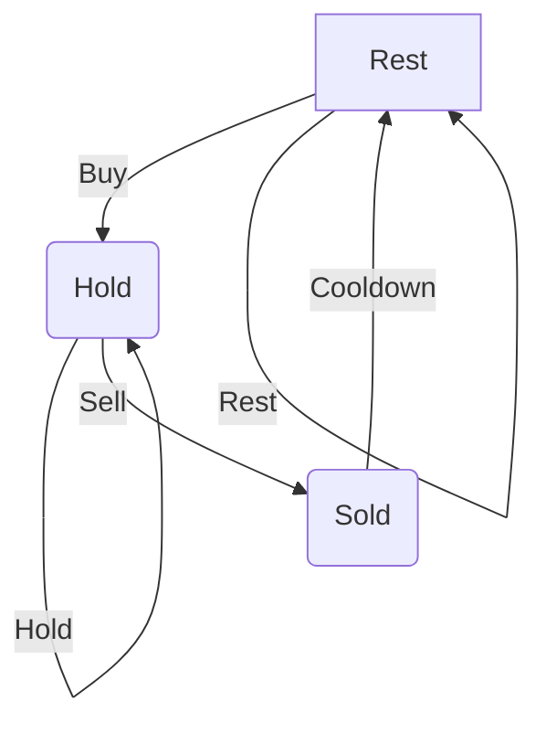

### **Introduction**

🧩 1. **State**

A **DP state** defines what subproblem you're solving.

**In other words:**

> It is a representation of the problem with a subset of inputs that leads to the full solution.

**Examples:**

* `dp[i]` = the optimal solution (e.g., max/min/count/etc.) considering the first `i` elements.
* `dp[i][j]` = the solution when considering the first `i` items and a total capacity of `j`.
* `dp[mask]` = the result when a subset of elements (represented by bitmask `mask`) has been processed.
* `F(n)` =the result (e.g., number of ways, max value, min cost, etc.) for input size or parameter n.

**You choose a state by answering:**

> What parameters do I need to uniquely define a subproblem?


🔁 2. **Transition**

A **transition** tells you how to compute the value of the current state using previously computed states.

**In other words:**

> It defines how to move from smaller subproblems to bigger ones.

**Example:**

If `dp[i]` is the number of ways to reach step `i`, and you can take 1 or 2 steps at a time:

```
dp[i] = dp[i-1] + dp[i-2]
```

Transitions are based on:

* Choices you can make
* Constraints of the problem
* Recurrence relations


🧱 3. **Base Case**

A **base case** is where your DP starts — the smallest or simplest subproblem that can be solved directly.

**In other words:**

> It provides the initial value(s) to build the rest of the DP table.

**Example:**

If you are counting the number of ways to climb stairs:

```
dp[0] = 1   # 1 way to stay at ground level (do nothing)
dp[1] = 1   # 1 way to take the first step
```

You **must always define** the base case correctly — it anchors your solution.


### **Optimization Techniques**

- Space Optimization (Reducing DP Array Dimensions, rolling arrays or swap between two arrays)
- State Compression (Bitmask DP)
- Convex Hull Trick / Li Chao Tree (for certain DP recurrences)
- Divide and Conquer Optimization
- Monotonic Queue Optimization
- Knuth’s Optimization

### **Misc.**

- DP on Trees for hierarchical structures
- DP with Binary Search for range-based decisions


## Problems List

### **1. Fibonacci Variations**

**Examples:** 

- [Climbing Stairs](https://leetcode.com/problems/climbing-stairs/) - Count distinct ways to reach the top by taking 1
  or 2 steps.

- [Min Cost Climbing Stairs](https://leetcode.com/problems/min-cost-climbing-stairs/) - Find the minimum cost to reach
  the top when each step has a cost.

- [House Robber](https://leetcode.com/problems/house-robber/) - Maximize money stolen without robbing adjacent houses.

- [House Robber II](https://leetcode.com/problems/house-robber-ii/) - House Robber problem with houses arranged in a
  circle.

- [Decode Ways](https://leetcode.com/problems/decode-ways/) - Count the number of ways to decode a string of digits.

**2. Grids (Path Problems)**

**Examples:** 

- [Unique Paths](https://leetcode.com/problems/unique-paths/) - Count unique paths from top-left to bottom-right in an
  empty grid.

- [Unique Paths II](https://leetcode.com/problems/unique-paths-ii/) - Count unique paths in a grid with obstacles.

- [Minimum Path Sum](https://leetcode.com/problems/minimum-path-sum/) - Find the minimum sum path from top-left to
  bottom-right.

- [Minimum Falling Path Sum](https://leetcode.com/problems/find-the-safest-path-in-a-grid/) - Find the minimum sum
  falling path in a matrix.

- [Triangle](https://leetcode.com/problems/triangle/description/) - Find the minimum path sum from top to bottom in a
  triangle.


 ### **3. Subsequences(Knapsack, Subset, Coin Change, Partition)** 

 **Examples:**

- [Partition Equal Subset Sum](https://leetcode.com/problems/partition-equal-subset-sum/)  - Check if subset exists with some target

  - Check if sum is even, then divide the sum by 2, then check if subset sum is equal to half of sum
  - Its a `0/1 Knapsack Problem`

  - ```java
      // Iterative Solution
      boolean iterative(int[] nums, int targetSum) {
          boolean[][] dp = new boolean[nums.length + 1][targetSum + 1];

          for (int i = 0; i <= nums.length; i++)
              dp[i][0] = true; // For any set of numbers, you can always form a sum of 0 by taking no elements at all

          for (int i = 1; i <= nums.length; i++) {
              for (int j = 1; j <= targetSum; j++) {

                  if (nums[i - 1] <= j) {
                      // dp[i - 1][j] - Can we form excluding current item
                      // dp[i - 1][j - nums[i - 1]] - Can we form excluding current item and remaining capacity
                      dp[i][j] = dp[i - 1][j] || dp[i - 1][j - nums[i - 1]];
                  } else {
                      dp[i][j] = dp[i - 1][j];
                  }
              }
          }
          return dp[nums.length][targetSum];
      }
    ``` 
- [Coin Change](https://leetcode.com/problems/coin-change/)  - Find minimum number of coins to make a sum, `same coins can be used more than once`

  - Recurrence Relation: `dp[i][j] = min(dp[i-1][j], dp[i][j-coins[i-1]] + 1)`
  - Base Case: `dp[0][j] = inf, dp[i][0] = 0`  
  - Variations **Unbounded Knapsack problem**
  - Exclude the current item: `dp[i-1][j]`
  - Include the current item: `dp[i][j-coins[i-1]] + 1`
  
  ```java
      public static int iterative(int[] coins, int amount) {
        int[][] dp = new int[coins.length + 1][amount + 1];

        for (int i = 0; i <= coins.length; i++) {
            dp[i][0] = 0;
        }

        for (int j = 1; j <= amount; j++) {
            dp[0][j] = amount + 1;
        }

        for (int i = 1; i <= coins.length; i++) {
            for (int j = 1; j <= amount; j++) {

                if (coins[i - 1] <= j) {
                    dp[i][j] = Math.min(dp[i - 1][j], 1 + dp[i][j - coins[i - 1]]);
                } else {
                    dp[i][j] = dp[i - 1][j];
                }
            }
        }

        return dp[coins.length][amount] > amount ? -1 : dp[coins.length][amount];
    }
  ```


- [Coin Change 2](https://leetcode.com/problems/coin-change-ii/description/)  - Find number of ways to make a sum, `same coins can be used more than once`

  - Recurrence Relation: `dp[i][j] = dp[i - 1][j] + dp[i][j - coins[i - 1]]` 
  - Base Case : ` dp[i][0] = 1`
  - Variations **Unbounded Knapsack problem**
  - Exclude the current item: `dp[i-1][j]`
  - Include the current item: `dp[i][j-coins[i-1]]`


  ```java
    public static int Iterative(int amount, int[] coins) {
        int[][] dp = new int[coins.length + 1][amount + 1];

        for (int i = 0; i <= coins.length; i++) {
            dp[i][0] = 1;
        }

        for (int i = 1; i <= coins.length; i++) {
            for (int j = 1; j <= amount; j++) {

                if (coins[i - 1] <= j) {
                    dp[i][j] = dp[i - 1][j] + dp[i][j - coins[i - 1]];
                } else {
                    dp[i][j] = dp[i - 1][j];
                }
            }
        }

        return dp[coins.length][amount];
    }
  ```
  
- [Combination Sum IV](https://leetcode.com/problems/combination-sum-iv/) - Number of ways(no. of Subsequence) to make a target sum, `same number can be used more than once`

- [Target Sum](https://leetcode.com/problems/target-sum/) - Number of ways to make a target sum, using `+` and `-` operator, Same number can be used more than once

- [Rod Cutting](https://leetcode.com/discuss/interview-question/4889192/4-Solutions-or-Top-DownBottom-Up-or-Best-Explanation-Using-Comments-or-C%2B%2B-Code) - Maximize profit by cutting a rod into smaller pieces

- [Longest Increasing Subsequence](https://leetcode.com/problems/longest-increasing-subsequence/)  - Length of longest increasing subsequence

  - Recurrence Relation: `dp[i] = max(dp[i], dp[j] + 1)`
  - Base Case : ` dp[i] = 1`
     
  - Recursion logic for each previous values check, if there is a increasing subsequence

  ```java
    // Iterative Solution
    public static int iterative(int[] nums) {
        int n = nums.length;
        int[] dp = new int[n];
        Arrays.fill(dp, 1);

        for (int i = 0; i < n; i++) {
            for (int j = 0; j < i; j++) {
                if (nums[i] > nums[j]) {
                    dp[i] = Math.max(dp[i], dp[j] + 1);
                }
            }
        }

        return dp[n - 1];
    }
  ```


 ### **4. String(Subsequence, Substring, Edit Distance, Wildcard)** 

 **Examples:**

- [Longest Common Subsequence](https://leetcode.com/problems/longest-common-subsequence/) - Longest common subsequence between two strings

   ```java
      public static int iterative(String str1, String str2) {
        int m = str1.length();
        int n = str2.length();
        int[][] dp = new int[m + 1][n + 1];

        for (int i = 0; i <= m; i++) {
            dp[i][0] = 0;
        }

        for (int j = 0; j <= n; j++) {
            dp[0][j] = 0;
        }

        for (int i = 1; i <= m; i++) {
            for (int j = 1; j <= n; j++) {
                if (str1.charAt(i - 1) == str2.charAt(j - 1)) {
                    dp[i][j] = dp[i - 1][j - 1] + 1;
                } else {
                    dp[i][j] = Math.max(dp[i - 1][j], dp[i][j - 1]);
                }
            }
        }

        return dp[m][n];
    }
   ```

- [Longest Palindromic Substring](https://leetcode.com/problems/longest-palindromic-substring/)  - Longest palindromic substring in a string


   ```java

     public static String iterative(String s) {
        String result = "";
        boolean[][] dp = new boolean[s.length()][s.length()];

        for (int i = 0; i < s.length(); i++) {
            dp[i][i] = true;
        }

        for (int i = 0; i < s.length(); i++) {
            for (int j = 0; j <= i; j++) {
                if (s.charAt(i) == s.charAt(j) && (i - j <= 2 || dp[j + 1][i - 1])) {
                    dp[j][i] = true;

                    if (i - j + 1 > result.length()) {
                        result = s.substring(j, Math.min(i + 1, s.length()));
                    }
                }
            }
        }

        return result;
    }

   ```

- [Longest Palindromic Subsequence](https://leetcode.com/problems/longest-palindromic-subsequence/)  - Longest palindromic subsequence in a string

  ```java
    public static int iterative(String s) {
        int n = s.length();

        int[][] dp = new int[n][n];

        for (int i = 0; i < n; i++) dp[i][i] = 1;

        for (int j = 0; j < n; j++) {
            for (int i = j - 1; i >= 0; i--) {
                if (s.charAt(i) == s.charAt(j)) {
                    dp[i][j] = 2 + dp[i + 1][j - 1];
                } else {

                    dp[i][j] = Math.max(dp[i + 1][j], dp[i][j - 1]);
                }
            }
        }

        return dp[0][n - 1];
    }
  ```


- [Distinct Subsequences](https://leetcode.com/problems/distinct-subsequences/)  - Number of distinct subsequences of `s` which equals `t`

  ```java
     public static int iterative(String s, String t) {
        int m = t.length(); // Target
        int n = s.length(); // Source
        int[][] dp = new int[m + 1][n + 1];

        for (int j = 0; j <= n; j++) {
            // The first row is set to 1 because there's one way to match an empty string t in any prefix of s: by deleting all characters.
            dp[0][j] = 1;
        }

        for (int i = 1; i <= m; i++) {
            for (int j = 1; j <= n; j++) {
                if (t.charAt(i - 1) == s.charAt(j - 1)) {
                    dp[i][j] = dp[i - 1][j - 1] + dp[i][j - 1];
                } else {
                    dp[i][j] = dp[i][j - 1];
                }
            }
        }

        return dp[t.length()][s.length()];
    }
  ```

- [Interleaving String](https://leetcode.com/problems/interleaving-string/)  - find target string s2 by interleaving substring of s1 and s2

  ```java

    public static boolean iterative(String s1, String s2, String s3) {
        int n = s1.length(), m = s2.length();

        if (n + m != s3.length()) return false;

        boolean[][] dp = new boolean[n + 1][m + 1];

        dp[0][0] = true;

        // Fill first column (considering only s1)
        for (int i = 1; i <= n; i++) {
            dp[i][0] = dp[i - 1][0] && s1.charAt(i - 1) == s3.charAt(i - 1);
        }

        // Fill first row (considering only s2)
        for (int j = 1; j <= m; j++) {
            dp[0][j] = dp[0][j - 1] && s2.charAt(j - 1) == s3.charAt(j - 1);
        }

        // Fill the DP table
        for (int i = 1; i <= n; i++) {
            for (int j = 1; j <= m; j++) {
                int k = i + j - 1;
                dp[i][j] = (s1.charAt(i - 1) == s3.charAt(k) && dp[i - 1][j]) || (s2.charAt(j - 1) == s3.charAt(k) && dp[i][j - 1]);
            }
        }

        return dp[n][m];
    }

  ```

- [Edit Distance (Levenshtein Distance)](https://leetcode.com/problems/edit-distance/) - minimum number of operations required to convert word1 to word2, `insert, delete, replace`

- [Regular Expression Matching](https://leetcode.com/problems/regular-expression-matching/)

- [Wildcard Matching](https://leetcode.com/problems/wildcard-matching/)  


### **5. Optimizations(State Machines, Maximum Subarray )** 

**State Machines**


Excellent notes\! Your understanding of why this problem maps to a Deterministic Finite State Machine (DFSM) is perfectly correct. 

**State Machines for Stock Optimization**

This problem is perfectly modeled by a **Deterministic Finite State Machine (DFSM)** because for any given state and action, the next state is uniquely determined. The goal is to find the path of actions that maximizes profit.

**1. Defining the States**

The key to solving this with a state machine is to define states based on what actions you are *allowed* to take on any given day `i`. This leads to three distinct states representing the maximum profit achievable up to that day.

  * **`Hold`**: The maximum profit on day `i` if you **are holding a stock**.

      * *Possible actions today*: Sell or continue to hold.

  * **`Sold`**: The maximum profit on day `i` if you **sell a stock on this day**.

      * *Constraint*: This state forces you into a "cooldown" on day `i+1`.

  * **`Rest`**: The maximum profit on day `i` if you **do not hold a stock and are not in cooldown**.

      * *Possible actions today*: Buy or continue to rest.

**2. Visualizing State Transitions**

A diagram makes the relationships much clearer:



*This diagram shows the actions that cause transitions between states.*

**3. Deriving the DP Recurrence Relations (The Core Logic)**

The state machine model directly translates into a Dynamic Programming solution. We calculate the maximum profit for each state for every day `i`.

Let `price = prices[i]`.

  * **`hold[i]`**: How can we be in the `Hold` state today?

    1.  We were already holding yesterday (`hold[i-1]`) and did nothing.
    2.  We were `Rest`ing yesterday (`rest[i-1]`) and decided to **buy** today.

    > $$hold[i] = \max(hold[i-1], rest[i-1] - \text{price})$$

  * **`sold[i]`**: How can we be in the `Sold` state today?

    1.  We must have been in the `Hold` state yesterday (`hold[i-1]`) and decided to **sell** today.

    > $$sold[i] = hold[i-1] + \text{price}$$

  * **`rest[i]`**: How can we be in the `Rest` state today?

    1.  We were already `Rest`ing yesterday (`rest[i-1]`) and did nothing.
    2.  We `Sold` yesterday (`sold[i-1]`) and are now forced into cooldown, which ends in the `Rest` state.

    > $$rest[i] = \max(rest[i-1], sold[i-1])$$

**Final Answer:** The maximum profit at the end is the maximum of the final `Sold` and `Rest` states, since you can't end with a profit if you are still holding a stock.

> $$\text{max\_profit} = \max(sold[n-1], rest[n-1])$$


**Examples:**

**1. Maximum Subarray/Contiguous Subarray Problems**

- [Maximum Subarray (Kadane’s Algorithm)](https://leetcode.com/problems/maximum-subarray/) - Find the largest sum of a contiguous subarray. 
 
  - Can be solved using `Kadane's Algorithm`
  
- [Maximum Sum Circular Subarray](https://leetcode.com/problems/maximum-sum-circular-subarray/) - Find the maximum sum of a circular subarray.  

  - Can be solved using `Kadane's Algorithm`

- [Maximum Product Subarray](https://leetcode.com/problems/maximum-product-subarray/) - Find the largest product of a contiguous subarray.

  ```java
    public static int maxProduct(int[] nums) {
        if (nums == null || nums.length == 0) return 0;

        int maxProd = nums[0]; // Maximum product so far
        int minProd = nums[0]; // Minimum product so far
        int result = nums[0];  // Final result


        for (int i = 1; i < nums.length; i++) {
            if (nums[i] < 0) {
                int temp = maxProd;
                maxProd = minProd;
                minProd = temp;
            }

            // Update maxProd and minProd
            maxProd = Math.max(nums[i], maxProd * nums[i]);
            minProd = Math.min(nums[i], minProd * nums[i]);

            result = Math.max(result, maxProd);
        }

        return result;
    }
  ```

- [Best Time to Buy and Sell Stock](https://leetcode.com/problems/best-time-to-buy-and-sell-stock/) 

- [Best Time to Buy and Sell Stock II](https://leetcode.com/problems/best-time-to-buy-and-sell-stock-ii/)  

- [Best Time to Buy and Sell Stock III](https://leetcode.com/problems/best-time-to-buy-and-sell-stock-iii/) 

   ```java
     public static int maxProfit(int[] prices) {
        if (prices == null || prices.length == 0) return 0;

        int minPrice1 = Integer.MAX_VALUE;
        int minPrice2 = Integer.MAX_VALUE;
        int profit1 = 0;
        int profit2 = 0;

        for (int price : prices) {
            minPrice1 = Math.min(minPrice1, price);
            profit1 = Math.max(profit1, price - minPrice1);

            minPrice2 = Math.min(minPrice2, price - profit1);
            profit2 = Math.max(profit2, price - minPrice2);
        }

        return profit2;
    }
   ```

- [Best Time to Buy and Sell Stock with Cooldown](https://leetcode.com/problems/best-time-to-buy-and-sell-stock-with-cooldown/) 

  ```java
      public static int maxProfit(int[] prices) {
          if (prices == null || prices.length == 0) return 0;

          int n = prices.length;

          int hold = -prices[0];
          int sold = 0;
          int cooldown = 0;

          for (int i = 1; i < n; i++) {
              int prevHold = hold;
              hold = Math.max(hold, cooldown - prices[i]);
              cooldown = Math.max(cooldown, sold);
              sold = prevHold + prices[i];
          }

          return Math.max(sold, cooldown);
      }
  ```

- [Best Time to Buy and Sell Stock IV](https://leetcode.com/problems/best-time-to-buy-and-sell-stock-iv/)  

  ```java

    public static int maxProfit(int k, int[] prices) {
        int[] buy = new int[k + 1], sell = new int[k + 1];
        Arrays.fill(buy, Integer.MIN_VALUE);

        for (int price : prices) {
            for (int i = 1; i <= k; i++) {
                buy[i] = Math.max(buy[i], sell[i - 1] - price);
                sell[i] = Math.max(sell[i], buy[i] + price);
            }
        }
        return sell[k];
    }

  ```
 
 ### **6. Interval DP(MCM)**  

 **Examples:**

  - [Minimum Cost to Cut a Stick](https://leetcode.com/problems/minimum-cost-to-cut-a-stick/description/)

  - [Burst Balloons](https://leetcode.com/problems/burst-balloons/description/)


### **7. Bitmasking and Partitioning**  

**Examples:**

- [Palindrome Partitioning 2](https://leetcode.com/problems/palindrome-partitioning-ii/) - Partition a string into the minimum number of palindromic substrings. 

- [Word Break](https://leetcode.com/problems/word-break/) - Check if a string can be segmented into a sequence of dictionary words.  

- [Partition to K Equal Sum Subsets](https://leetcode.com/problems/partition-to-k-equal-sum-subsets/)  - Partition a set of numbers into `k` subsets where each subset has the same sum

- [Word Break II](https://leetcode.com/problems/word-break-ii/)  - Break a sentence into words using a dictionary of words


### **8. Game Theory(Minimax)**

- [Stone Game](https://leetcode.com/problems/stone-game/) - Two players take turns removing stones from piles. Determine if the first player can win. 

- [Predict the Winner](https://leetcode.com/problems/predict-the-winner/) - Determine if the first player can guarantee a win with optimal moves.  
