# **Introduction**

## The Building Blocks of a Graph

At its heart, a graph is a simple structure used to model relationships between objects.

* **Vertices (or Nodes):** These are the fundamental entities or points in the graph. Think of them as cities on a map, people in a social network, or web pages on the internet.
* **Edges (or Links/Arcs):** These are the connections between pairs of vertices. They represent the relationship between the entities, like roads between cities, friendships between people, or hyperlinks between web pages.

A graph is formally defined as a pair of sets: `G = (V, E)`, where `V` is the set of vertices and `E` is the set of edges.

### Examples

**Social Networks**

Social platforms model human connections and interactions as graphs.

* **Vertices:** User profiles.
* **Edges:** The relationship between users.
    * **Undirected Edge:** On Facebook, a "friendship" is mutual, creating an undirected edge. If you are friends with someone, they are also friends with you.
    * **Directed Edge:** On Twitter or Instagram, a "follow" is a directed edge. You can follow someone without them following you back.


**Transportation and Maps**

Navigation systems like Google Maps or Waze use weighted graphs to find the best routes.

* **Vertices:** Specific locations, such as cities, street intersections, airports, or train stations.
* **Edges:** The paths connecting these locations, like roads, highways, flight paths, or railway tracks. These edges are typically **weighted** by values such as:
    * **Distance** (kilometers or miles)
    * **Travel Time** (which can change based on real-time traffic)
    * **Cost** (tolls or ticket prices)


**Recommendation Engines**

Services like Netflix, Spotify, and Amazon use graphs to suggest content or products you might like.

* **Vertices:** Two types of nodes exist: **Users** and **Items** (e.g., movies, songs, products). This forms a *bipartite graph*.
* **Edges:** An edge connects a User to an Item. The edge can be **weighted** by the user's interaction, such as:
    * The rating a user gave a movie (e.g., 1 to 5 stars).
    * The number of times a user has listened to a song.
    * A simple binary value indicating whether a user purchased a product.

The engine recommends items by finding users who are "close" to you in the graph (i.e., have similar tastes) and then suggesting items they liked that you haven't seen yet.


## Types of Graphs: A Visual Vocabulary

Graphs come in various flavors, each with its own specific characteristics and uses.

### **Based on Edge Direction**

* **Undirected Graph:** Edges have no direction. If an edge connects vertex A to vertex B, it also connects B to A. This is like a two-way street or a friendship on Facebook.

* **Directed Graph (Digraph):** Edges have a direction, usually indicated by an arrow. An edge from A to B doesn't necessarily mean there's an edge from B to A. This is like a one-way street or following someone on Twitter.


### **Based on Edge and Vertex Properties**

* **Weighted Graph:** Each edge is assigned a numerical weight or cost. This weight can represent distance, time, or capacity. For example, a map with distances between cities would be a weighted graph.

* **Unweighted Graph:** Edges have no assigned weights. The focus is purely on the connections themselves.

* **Simple Graph:**

  

* **Multigraph:** 

  

* **Complete Graph:**
  
  

* **Bipartite Graph:** A graph whose vertices can be divided into two disjoint and independent sets, U and V, such that every edge connects a vertex in U to one in V.

  

* **Tree:** A connected graph with no cycles. Trees are fundamental data structures in computer science.


### Fundamental Properties of Graphs 💡

**Degree of a Vertex:** 

In an undirected graph, the degree of a vertex is the number of edges connected to it. In a directed graph, we have:  
-  **In-degree:** The number of incoming edges.
-  **Out-degree:** The number of outgoing edges.

**Path:**

- **Path in an Undirected Graph**

  In an undirected graph, a path is like a trail you can walk between nodes. The direction doesn't matter.

  Consider this graph:

  ```
        A --------- B --------- E
        |           |
        |           |
        C --------- D
  ```

    * A valid path from **A** to **E** is the sequence of vertices: `A → B → E`.
    * Another valid path from **A** to **E** is: `A → C → D → B → E`.
    * The sequence `A → E` is **not** a path because there is no direct edge connecting them.


- **Path in a Directed Graph**

  In a directed graph, a path is like a one-way street. You must follow the direction of the arrows.

  Consider this graph:

  ```
        A ---------> B
        |            |
        v            v
        C ---------> D <--------- E
  ```

    * A valid path from **A** to **D** is the sequence: `A → C → D`.
    * Another valid path is: `A → B → D`.
    * The sequence `A → C → B` is **not** a valid path because you cannot go from C to B against the arrow's direction.


**Cycle**

A cycle is a path that starts and ends at the same vertex, forming a loop.

  * **In an Undirected Graph:** A cycle is a path where you can travel from a node, visit other nodes, and return to the start without reusing an edge.

    ```
       A --------- B
       |           |
       |           |
       D --------- C
    ```

    The path `A → B → C → D → A` is a cycle.

  * **In a Directed Graph:** A cycle must follow the direction of the arrows.

    ```
       A ---------> B
       ^            |
       |            |
       |            v
       D <--------- C
    ```

    The path `A → B → C → D → A` is a directed cycle. A graph with no cycles is called **acyclic**.   


- **Cycle with One Vertex :** A cycle with just one vertex is only possible if that vertex has an edge that connects back to itself. This is called a **self-loop**.

    * **Undirected Graph:** A self-loop on vertex A creates a cycle of length 1.

      ```
        ---
      /   \
      (     )
      \   /
        -A-
      ```

      The path starts at A, traverses the loop, and ends at A.

    * **Directed Graph:** Similarly, a directed edge starting and ending at the same vertex forms a cycle.

      ```
        -->--
      /     \
      (   A   )
      \     /
        --<--
      ```

  **Without a self-loop, a single vertex cannot form a cycle.**

- **Cycle with Two Vertices**

  * **Undirected Graph:** In a **simple graph** (where there are no parallel edges), a two-vertex setup is **not considered a cycle**.

    ```
       A --------- B
    ```

    The path `A → B → A` is just traversing the same edge back and forth, which doesn't count as a true cycle. To be a cycle, a path typically can't immediately reuse the same edge in reverse.

    However, a cycle *can* exist if you have **parallel edges** (making it a **multigraph**).

    ```
          /-----\
       A           B
          \-----/
    ```

    Here, you can go from `A` to `B` on the top edge and return from `B` to `A` on the bottom edge. This forms a valid cycle of length 2.

  * **Directed Graph:** A cycle with two vertices is very common and straightforward. It happens when there is an edge from A to B **and** an edge from B back to A.

    ```
         ------>
       A         B
         <------
    ```

    The path `A → B → A` is a valid directed cycle because it follows two different directed edges.


**Connected Graph**

This term primarily applies to **undirected graphs**. A graph is connected if there is a path between every pair of vertices. In simple terms, the graph is "all one piece."

  * **Connected Graph:** You can get from any node to any other node.

    ```
       A --- B --- C
             |
             D
    ```

  * **Disconnected Graph:** The graph is made of two or more separate components.

    ```
       A --- B      C --- D
    ```

    You cannot get from node A to node C.

For **directed graphs**, the equivalent concepts are "weakly connected" (if the underlying undirected version is connected) and "strongly connected."

**Strongly Connected Graph**

This term is specifically for **directed graphs**. A directed graph is strongly connected if for every pair of vertices (A, B), there is a path from A to B **and** a path from B back to A.

  * **Strongly Connected:** Every node can reach every other node.

    ```
       A <-------> B
       ^ \       / ^
       |  \     /  |
       |   \   /   |
       |    > v <  |
       +----- C ---+
    ```

    From A, you can get to B and C. From B, you can get to A and C. From C, you can get to A and B.

  * **Weakly Connected:**

    ```
       A ---------> B ---------> C
    ```

    You can get from A to C, but you **cannot** get back from C to A. Therefore, it is not strongly connected.


* **Adjacency:** Two vertices are **adjacent** if they are connected by an edge.


### Minimum Sapnning Tree

A **Minimum Spanning Tree (MST)** is the cheapest possible way to connect all the "dots" (vertices) in a weighted graph into a single tree structure without forming any cycles.

**Analogy: Connecting a New Neighborhood**

Imagine you're a city planner tasked with providing internet to a new neighborhood. You have a map of all the houses (**vertices**) and the potential cable routes between them. Digging along each route has a different cost (**edge weights**).

Your goal is to **connect every single house** to the network, directly or indirectly, using the **least amount of cable** to minimize the total cost.

  * A **Spanning Tree** is any layout that connects all houses without creating redundant loops (cycles). A loop would be wasteful—like running a cable from House A to B, then B to C, and also directly from C back to A.
  * The **Minimum Spanning Tree** is the specific layout that achieves this with the absolute lowest total cost. You're finding the cheapest possible "backbone" for the network.

**Example**

**Original Graph with All Possible Connections:**

```
      (1)
   A ------- B
   | \     / |
   |  \   /  |
(4)|   (5)  |(2)
   |    \ /   |
   |     X    |
   |    / \   |
(3)|   /   \  |(6)
   |  /     \ |
   C ------- D
      (7)
```

There are many ways to connect all four vertices, but we want the cheapest one. An MST algorithm would select the following edges:

1.  **A – B (Cost 1):** The cheapest edge overall.
2.  **B – D (Cost 2):** The next cheapest edge.
3.  **A – C (Cost 3):** The next cheapest. We can add this because it doesn't form a cycle. We don't add A-B-D-A or anything similar.


# **Patterns and Algorithms**


## BFS Variations

### 1\. Standard BFS

**Concept:**
Standard BFS is used to traverse a graph or tree level by level. It guarantees the shortest path in an **unweighted** graph. It uses a **Queue (FIFO)** data structure to ensure nodes are processed in the order they are discovered.

**Mermaid Logic:**
This diagram visualizes how BFS explores "concentric circles" (levels) moving away from the start node.

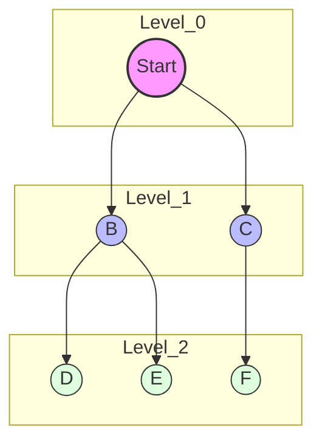

**Java Template:**

```java
public int standardBFS(List<List<Integer>> graph, int start, int target) {
    Queue<Integer> queue = new LinkedList<>();
    Set<Integer> visited = new HashSet<>();

    queue.offer(start);
    visited.add(start);
    int level = 0;

    while (!queue.isEmpty()) {
        int size = queue.size(); // Process level by level
        for (int i = 0; i < size; i++) {
            int curr = queue.poll();

            if (curr == target) return level;

            for (int neighbor : graph.get(curr)) {
                if (!visited.contains(neighbor)) {
                    visited.add(neighbor);
                    queue.offer(neighbor);
                }
            }
        }
        level++;
    }
    return -1; // Target not reachable
}
```

-----

### 2\. Multi-Source BFS

**Concept:**
Instead of initializing the queue with a single node, we initialize it with **all** source nodes simultaneously. This effectively calculates the shortest distance from *any* source to all other reachable nodes. Think of it as dropping multiple pebbles into a pond at once; the ripples expand and eventually merge.

**Mermaid Logic:**
Notice how `Source 1` and `Source 2` start the expansion at the exact same time (Level 0).

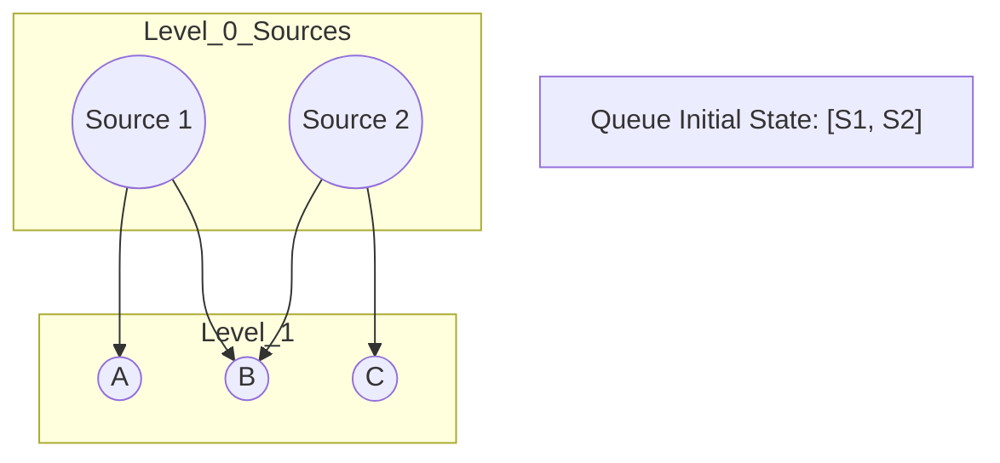

**Java Template:**

```java
public int[][] multiSourceBFS(char[][] grid) {
    int rows = grid.length, cols = grid[0].length;
    Queue<int[]> queue = new LinkedList<>();
    int[][] dist = new int[rows][cols];

    // Initialize with ALL sources
    for (int r = 0; r < rows; r++) {
        for (int c = 0; c < cols; c++) {
            if (grid[r][c] == 'SOURCE') {
                queue.offer(new int[]{r, c});
                dist[r][c] = 0;
            } else {
                dist[r][c] = Integer.MAX_VALUE; // Unvisited
            }
        }
    }

    int[][] dirs = {{0,1}, {0,-1}, {1,0}, {-1,0}};

    while (!queue.isEmpty()) {
        int[] curr = queue.poll();
        int r = curr[0], c = curr[1];

        for (int[] d : dirs) {
            int nr = r + d[0], nc = c + d[1];
            // Check bounds and if we found a shorter path
            if (nr >= 0 && nr < rows && nc >= 0 && nc < cols) {
                if (dist[nr][nc] > dist[r][c] + 1) {
                    dist[nr][nc] = dist[r][c] + 1;
                    queue.offer(new int[]{nr, nc});
                }
            }
        }
    }
    return dist;
}
```

-----

### 3\. 0-1 BFS

**Concept:**
This pattern is used when edge weights are either $0$ or $1$. It uses a **Deque (Double-Ended Queue)** instead of a standard Queue.

  * **Weight 0:** Push to the **FRONT** (prioritize processing immediately).
  * **Weight 1:** Push to the **BACK** (process later, like standard BFS).
    This is more efficient than Dijkstra's algorithm for this specific case ($O(V+E)$ vs $O(E \log V)$).

**Mermaid Logic:**
The decision diamond shows where the node is added based on the edge cost.

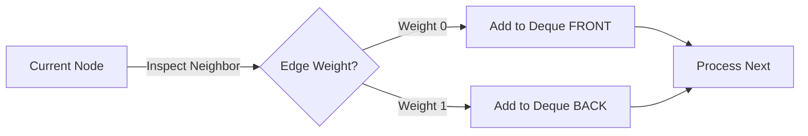

**Java Template:**

```java
public int zeroOneBFS(int n, List<List<int[]>> graph, int start, int end) {
    Deque<Integer> deque = new ArrayDeque<>();
    int[] dist = new int[n];
    Arrays.fill(dist, Integer.MAX_VALUE);

    deque.offerFirst(start);
    dist[start] = 0;

    while (!deque.isEmpty()) {
        int u = deque.pollFirst(); // Always take from front

        if (u == end) return dist[u];

        for (int[] edge : graph.get(u)) {
            int v = edge[0];
            int weight = edge[1]; // 0 or 1

            if (dist[u] + weight < dist[v]) {
                dist[v] = dist[u] + weight;
                if (weight == 0) {
                    deque.offerFirst(v); // High priority
                } else {
                    deque.offerLast(v);  // Low priority
                }
            }
        }
    }
    return -1;
}
```

-----

### 4\. BFS with Bitmasking (Stateful BFS)

**Concept:**
In standard BFS, if you visit a node, you mark it as visited and never return. In Stateful BFS, you can revisit a node **if you are in a different state** (e.g., holding a new key).

  * **State:** Usually defined as `{currentNode, currentMask}`.
  * **Visited Array:** Becomes 2D (or 3D): `visited[row][col][mask]`.

**Mermaid Logic:**
Here, Node A can be visited again because the state (keys held) is different.

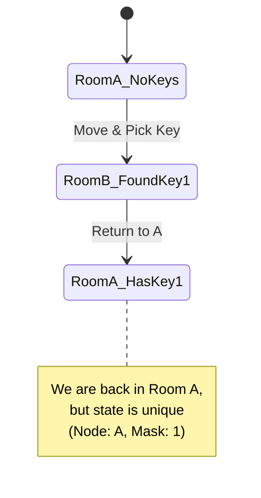

**Java Template:**

```java
class State {
    int r, c, mask, dist;
    State(int r, int c, int mask, int dist) {
        this.r = r; this.c = c; this.mask = mask; this.dist = dist;
    }
}

public int shortestPathAllKeys(String[] grid) {
    int m = grid.length, n = grid[0].length();
    // Dimensions: Row, Col, KeyState (up to 64 for bitmask usually)
    boolean[][][] visited = new boolean[m][n][64]; 
    Queue<State> q = new LinkedList<>();

    // ... (Initialization code finding start node) ...
    // q.offer(new State(startR, startC, 0, 0));
    // visited[startR][startC][0] = true;

    while (!q.isEmpty()) {
        State curr = q.poll();
        
        // Logic to check bounds, walls, and keys
        // If key found: newMask = curr.mask | (1 << keyIndex)
        // If !visited[nr][nc][newMask]:
        //     visited[nr][nc][newMask] = true
        //     q.offer(new State(nr, nc, newMask, curr.dist + 1))
    }
    return -1;
}
```

-----

### 5\. Bidirectional BFS

**Concept:**
Instead of searching from Source $\rightarrow$ Target, we search from **Source $\rightarrow$ Middle $\leftarrow$ Target** simultaneously.
This drastically reduces the search space (branching factor) because two small circles have a smaller area than one giant circle covering the same distance.

  * **Optimization:** Always expand the *smaller* set of nodes in the next iteration to balance the search.

**Mermaid Logic:**
The search terminates immediately when the "Frontier Top" intersects with the "Frontier Bottom".

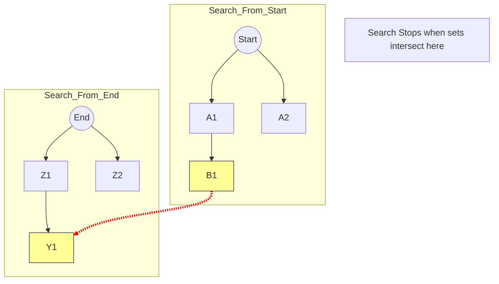

**Java Template:**
*Note: Using `Set` is often easier than `Queue` for checking intersections.*

```java
public int bidirectionalBFS(Set<String> beginSet, Set<String> endSet, Set<String> wordList, int level) {
    if (beginSet.isEmpty() || endSet.isEmpty()) return -1;

    // Optimization: Always expand the smaller frontier
    if (beginSet.size() > endSet.size()) {
        return bidirectionalBFS(endSet, beginSet, wordList, level);
    }

    Set<String> nextLevel = new HashSet<>();
    
    for (String word : beginSet) {
        // Generate all possible neighbors
        // List<String> neighbors = getNeighbors(word);
        
        for (String neighbor : neighbors) {
            if (endSet.contains(neighbor)) return level + 1; // Meet in middle
            
            if (wordList.contains(neighbor)) {
                nextLevel.add(neighbor);
                wordList.remove(neighbor); // Mark visited
            }
        }
    }
    
    return bidirectionalBFS(nextLevel, endSet, wordList, level + 1);
}
```

## **DFS Variations**


### 1\. Standard Recursive DFS (Flood Fill / Connected Components)

  * **What it does:** Visits every node in a connected component. Once a node is visited, it is marked and **never visited again**. This is used for counting islands, flood fill, or checking connectivity.
  * **Key Behavior:** "Dive deep, mark visited, never look back."

The diagram shows a single deep path being fully explored before the next branch is touched.

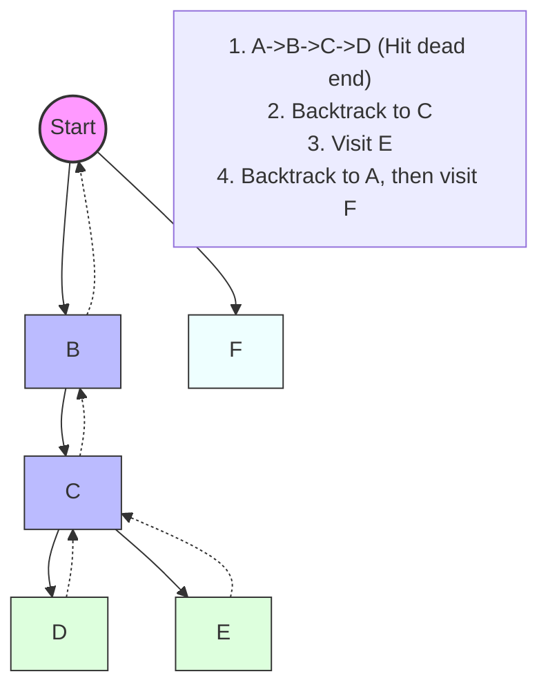

**Java Template:**

```java
public void dfs(char[][] grid, int r, int c, boolean[][] visited) {
    int rows = grid.length, cols = grid[0].length;
    
    // Base cases: out of bounds or already visited or invalid cell
    if (r < 0 || c < 0 || r >= rows || c >= cols || visited[r][c] || grid[r][c] == '0') {
        return;
    }

    visited[r][c] = true; // Mark as visited permanently

    // Recurse in all 4 directions
    dfs(grid, r + 1, c, visited);
    dfs(grid, r - 1, c, visited);
    dfs(grid, r, c + 1, visited);
    dfs(grid, r, c - 1, visited);
}
```

-----

### 2\. Iterative DFS (Using Stack)

  * **What it does:** Mimics the recursive stack using an explicit `Stack` data structure.
  * **Why use it?** To avoid `StackOverflowError` on very deep graphs (recursion limit is usually \~10,000 frames) or when recursion is forbidden.

Explicitly pushing nodes to a Stack LIFO (Last-In-First-Out).

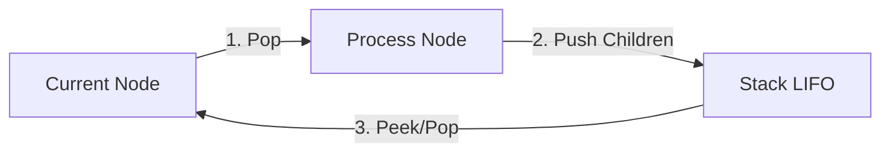

**Java Template:**

```java
public void iterativeDFS(Node start) {
    Stack<Node> stack = new Stack<>();
    Set<Node> visited = new HashSet<>();
    
    stack.push(start);
    visited.add(start);
    
    while(!stack.isEmpty()) {
        Node curr = stack.pop();
        // Process current node
        System.out.println(curr.val);
        
        for(Node neighbor : curr.neighbors) {
            if(!visited.contains(neighbor)) {
                visited.add(neighbor);
                stack.push(neighbor);
            }
        }
    }
}
```

-----

### 3\. Backtracking DFS (Find All Paths)

  * **What it does:** Explores a path, and when it returns (backtracks), it **undoes** the "visited" state. This allows the same node to be used in *different* paths.
  * **Key Difference:** In Standard DFS, you mark `visited = true` and leave it. In Backtracking, you mark `visited = true`, recurse, and then mark `visited = false` (clean up).

Notice the "Reset" step. This is the hallmark of backtracking.

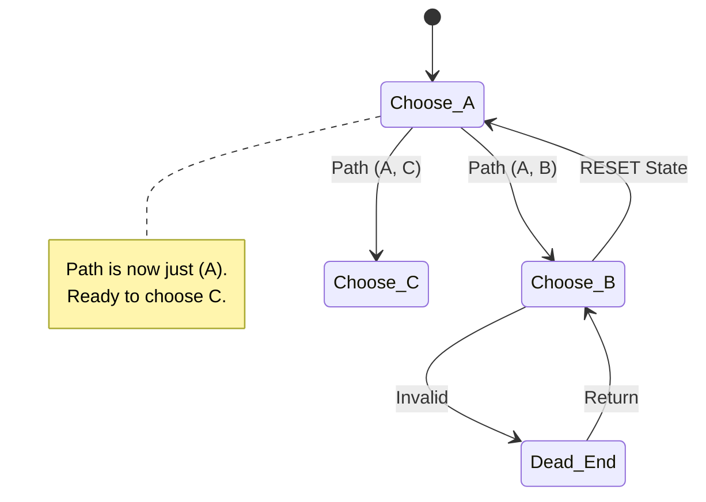

**Java Template:**

```java
public boolean backtrack(char[][] board, String word, int i, int j, int index, boolean[][] visited) {
    if (index == word.length()) return true; // Goal reached
    
    if (i < 0 || i >= board.length || j < 0 || j >= board[0].length || 
        visited[i][j] || board[i][j] != word.charAt(index)) {
        return false;
    }
    
    // 1. Choose (Mark visited)
    visited[i][j] = true;
    
    // 2. Explore (Recurse)
    boolean found = backtrack(board, word, i+1, j, index+1, visited) ||
                    backtrack(board, word, i-1, j, index+1, visited) ||
                    backtrack(board, word, i, j+1, index+1, visited) ||
                    backtrack(board, word, i, j-1, index+1, visited);
    
    // 3. Un-Choose (Backtrack / Cleanup)
    visited[i][j] = false; 
    
    return found;
}
```

-----

### 4\. Cycle Detection DFS (Three Colors)

  * **What it does:** Detects cycles in a **Directed Graph**. It distinguishes between "visited in the past" (safe) and "visited in the current recursion stack" (cycle\!).
  * **The 3 States:**
    1.  **0 (White):** Unvisited.
    2.  **1 (Gray):** Visiting (currently in the recursion stack).
    3.  **2 (Black):** Visited (fully processed).

A cycle is detected *only* if we point back to a "Gray" node (one that is currently being visited).

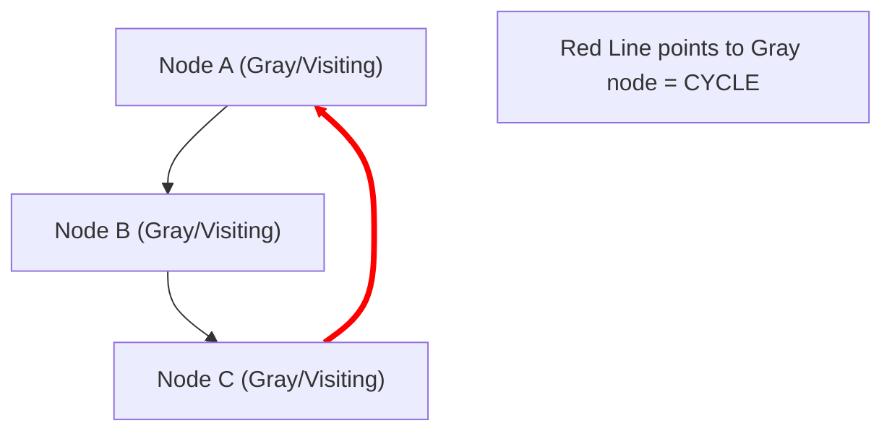

**Java Template:**

```java
public boolean hasCycle(List<List<Integer>> graph, int u, int[] state) {
    if (state[u] == 1) return true;  // Found a node currently in stack -> CYCLE!
    if (state[u] == 2) return false; // Already fully processed -> Safe
    
    state[u] = 1; // Mark as "Visiting"
    
    for (int v : graph.get(u)) {
        if (hasCycle(graph, v, state)) return true;
    }
    
    state[u] = 2; // Mark as "Visited"
    return false;
}
```

-----

### 5\. Topological Sort DFS

  * **What it does:** Orders nodes linearly such that for every edge $U \to V$, $U$ comes before $V$. Essential for dependency resolution (e.g., build systems, course prerequisites).
  * **How:** Perform a standard DFS, but add the node to a stack **only after** visiting all its children (Post-Order). Then reverse the stack.

We only add to the "Result Stack" when we are *leaving* the node (returning from recursion).

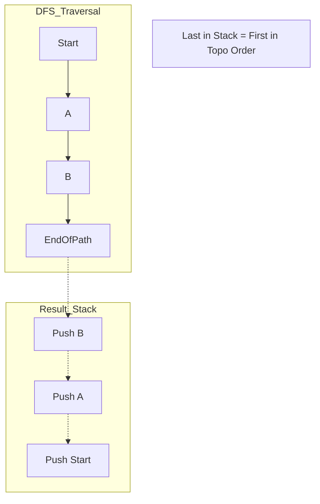

**Java Template:**

```java
Stack<Integer> stack = new Stack<>(); // To store result

public void topoDFS(List<List<Integer>> graph, int u, boolean[] visited) {
    visited[u] = true;
    
    for (int v : graph.get(u)) {
        if (!visited[v]) {
            topoDFS(graph, v, visited);
        }
    }
    
    // Push to stack ONLY after children are done
    stack.push(u); 
}

// To get result: Pop everything from stack
```


### 6\. Time-Stamp DFS (Tarjan’s Bridge-Finding Algorithm)

  * **What it does:** Uses DFS to assign a "discovery time" and a "low-link value" to every node. It identifies **"Bridges"** (edges that, if removed, disconnect the graph).
  * **The Logic:** If a node `u` has a child `v`, and `v` cannot reach back to `u` or `u`'s ancestors (i.e., `low[v] > disc[u]`), then the edge `u-v` is a bridge.

The diagram shows the "back edge" (dotted) allowing the child to reach an ancestor, updating its "Low Link" value.

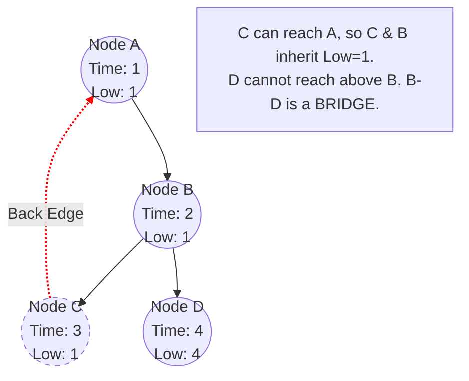

**Java Template:**

```java
int time = 0;
public void dfs(int u, int parent, List<List<Integer>> graph, int[] disc, int[] low, List<List<Integer>> bridges) {
    disc[u] = low[u] = ++time; // Initialize times
    
    for (int v : graph.get(u)) {
        if (v == parent) continue; // Don't go back to immediate parent
        
        if (disc[v] != 0) {
            // Back-edge found: Minimize low-link
            low[u] = Math.min(low[u], disc[v]);
        } else {
            // Tree-edge: Recurse
            dfs(v, u, graph, disc, low, bridges);
            // On return, propagate low-link from child to parent
            low[u] = Math.min(low[u], low[v]);
            
            // Bridge check
            if (low[v] > disc[u]) {
                bridges.add(Arrays.asList(u, v));
            }
        }
    }
}
```

-----

### 7\. Eulerian Path DFS (Hierholzer's Algorithm)

  * **What it does:** Finds a path that visits **every edge exactly once**. This is different from standard DFS which visits *nodes*.
  * **Key Trick:** It's a "Post-Order Edge Removal" DFS. You eagerly follow edges, delete them as you cross them, and add the node to the result path *only when you get stuck* (no more outgoing edges).

We spiral deep into the graph, deleting edges. The path is built in reverse order as the recursion unwinds.

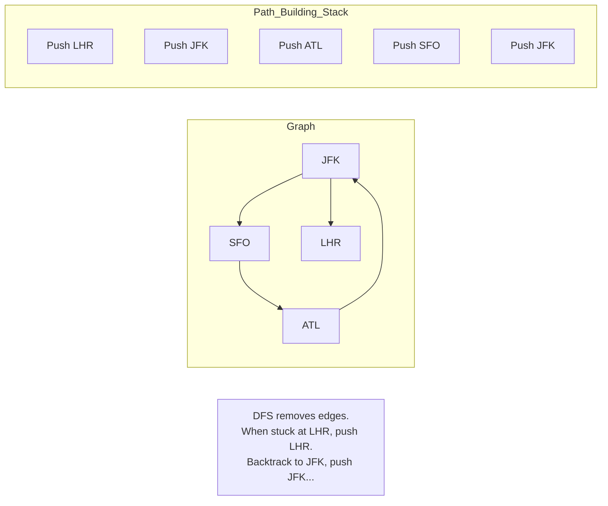

**Java Template:**

```java
// Use PriorityQueue for lexical order (if required by problem like #332)
Map<String, PriorityQueue<String>> graph = new HashMap<>();
LinkedList<String> route = new LinkedList<>();

public void dfs(String u) {
    PriorityQueue<String> arrivals = graph.get(u);
    
    while (arrivals != null && !arrivals.isEmpty()) {
        // Eagerly consume the edge (Poll removes it)
        String next = arrivals.poll();
        dfs(next);
    }
    // Add to front only when stuck (Post-Order)
    route.addFirst(u);
}
```

## **Cycle Detection**

### Unidirected Graph - `DFS with Parent Tracking`

```java
    class Graph {
        private int V; // Number of vertices
        private ArrayList<ArrayList<Integer>> adj; // Adjacency list

        Graph(int v) {
            V = v;
            adj = new ArrayList<>(v);
            for (int i = 0; i < v; ++i)
                adj.add(new ArrayList<>());
        }

        void addEdge(int v, int w) {
            adj.get(v).add(w);
            adj.get(w).add(v); // Undirected graph, so add edge in both directions
        }
    }

    private boolean isCyclic(int u, boolean[] visited, int parent) {
        visited[u] = true;

        for (int v : adj.get(u)) {
            if (!visited[v]) {
                // Case 1: Not visited. Recurse, setting 'u' as the parent of 'v'.
                if (isCyclic(v, visited, u))
                    return true;
            }
            // Case 2: Visited, AND not the parent. Cycle detected!
            else if (v != parent) {
                return true;
            }
            // Case 3 (implied): Visited AND is the parent. Ignore.
        }
        return false;
    }

    private boolean isCyclicAlt1(int u, boolean[] visited, int parent) {
        visited[u] = true;

        for (int v : adj.get(u)) {

            // --- Case 3: Skip the parent link ---
            if (v == parent) {
                continue;
            }

            // --- Case 2: Visited, NOT the parent, therefore a Cycle ---
            if (visited[v]) {
                return true;
            }

            // --- Case 1: Not visited (must be here if we didn't hit Case 3 or 2) ---
            // Recurse, setting 'u' as the parent of 'v'.
            if (isCyclicAlt1(v, visited, u)) {
                return true;
            }
        }
        return false;
    }
```

### Directed Graph  - `Three-State DFS Marking`


We use three states to categorize the vertices during the DFS traversal:

1.  **WHITE (0):** The node is **unvisited**.
2.  **GRAY (1):** The node is currently being visited (it is in the **recursion stack** of the current DFS path).
3.  **BLACK (2):** The node and all its descendants have been fully explored.

When visiting a node $u$:

  * If we find a neighbor $v$ that is **GRAY**, it means $v$ is an ancestor of $u$ in the current path. Since the edge is $u \to v$, this creates a **back edge** and, therefore, a **cycle is detected**.
  * If we find a neighbor $v$ that is **BLACK**, it means the path through $v$ has been fully explored and contains no cycle back to $u$'s ancestors, so we skip it.
  * If we find a neighbor $v$ that is **WHITE**, we move to $v$, changing its state to GRAY.


```java
import java.util.ArrayList;

class DirectedGraph {
    private int V;
    private ArrayList<ArrayList<Integer>> adj;
    
    // States: 0=WHITE (unvisited), 1=GRAY (visiting), 2=BLACK (visited/done)
    private final int WHITE = 0;
    private final int GRAY = 1;
    private final int BLACK = 2;

    DirectedGraph(int v) {
        V = v;
        adj = new ArrayList<>(v);
        for (int i = 0; i < v; ++i)
            adj.add(new ArrayList<>());
    }

    void addEdge(int v, int w) {
        adj.get(v).add(w); // Directed edge: v -> w
    }

    private boolean isCyclicUtil(int u, int[] color) {
        // 1. Mark the current node as GRAY (in recursion stack)
        color[u] = GRAY;

        for (int v : adj.get(u)) {
            
            if (color[v] == GRAY) {
                // Cycle detected! Edge to a node already in the current path.
                return true;
            }

            if (color[v] == WHITE) {
                // Recurse on unvisited (WHITE) node.
                if (isCyclicUtil(v, color))
                    return true;
            }
            // If color[v] == BLACK, we skip it, as it's fully explored.
        }

        // 2. Mark the current node as BLACK (done exploring)
        color[u] = BLACK;
        return false;
    }
}
```

## **Topological Sorting(DAGs)**

### Method 1: Depth-First Search (DFS)


```java

class TopologicalSortDFS {
    private int V; // Number of vertices
    private List<List<Integer>> adj; // Adjacency list

    // Constants for the three-state coloring method
    private final int WHITE = 0; // Unvisited
    private final int GRAY = 1;  // Currently being visited (in recursion stack)
    private final int BLACK = 2; // Finished processing

    TopologicalSortDFS(int v) {
        V = v;
        adj = new ArrayList<>(v);
        for (int i = 0; i < v; ++i)
            adj.add(new LinkedList<>());
    }

    void addEdge(int u, int v) {
        adj.get(u).add(v);
    }

    private boolean sortUtil(int u, int[] color, Stack<Integer> stack) {
        // 1. Mark the current node as GRAY (it is now in the recursion stack)
        color[u] = GRAY;

        for (int v : adj.get(u)) {
            
            // --- CYCLE DETECTION CHECK ---
            if (color[v] == GRAY) {
                // If the neighbor 'v' is GRAY, it means 'v' is an ancestor of 'u'
                // in the current DFS path. The edge u -> v forms a back edge (a cycle).
                return true; // Cycle detected
            }

            // Case: Neighbor is WHITE (unvisited)
            if (color[v] == WHITE) {
                // Recurse. If the recursive call finds a cycle, propagate it immediately.
                if (sortUtil(v, color, stack)) {
                    return true;
                }
            }
            // If color[v] is BLACK, we ignore it, as that path is fully processed.
        }
        
        // 2. Mark the current node as BLACK (finished exploring its dependencies)
        color[u] = BLACK;
        
        // 3. PUSH the current vertex onto the stack for the topological order
        stack.push(u);
        
        return false; // No cycle found starting from this node
    }

    public void topologicalSort() {
        Stack<Integer> stack = new Stack<>();
        int[] color = new int[V]; // Initializes to WHITE (0) by default
        boolean cycleFound = false;

        // Call the recursive helper for every unvisited vertex
        for (int i = 0; i < V; i++) {
            if (color[i] == WHITE) {
                if (sortUtil(i, color, stack)) {
                    cycleFound = true;
                    break;
                }
            }
        }
    }
}

```

### Method 2: Kahn's Algorithm (In-Degree Based)

```java

class TopologicalSortKahn {
    private int V;
    private List<List<Integer>> adj;

    TopologicalSortKahn(int v) {
        V = v;
        adj = new ArrayList<>(v);
        for (int i = 0; i < v; ++i)
            adj.add(new LinkedList<>());
    }

    void addEdge(int u, int v) {
        adj.get(u).add(v);
    }

    public void topologicalSort() {
        // Step 1: Compute In-degrees
        int[] inDegree = new int[V];
        for (int u = 0; u < V; u++) {
            for (int v : adj.get(u)) {
                inDegree[v]++;
            }
        }

        // Step 2: Initialize Queue with all vertices having 0 in-degree
        Queue<Integer> q = new LinkedList<>();
        for (int i = 0; i < V; i++) {
            if (inDegree[i] == 0)
                q.add(i);
        }

        // To track the number of nodes in the sort (detect cycles)
        int count = 0; 
        List<Integer> topOrder = new ArrayList<>();

        // Step 3: Process nodes
        while (!q.isEmpty()) {
            int u = q.poll();
            topOrder.add(u);
            count++;

            // Step 4: For every neighbor v of u
            for (int v : adj.get(u)) {
                // Decrement in-degree of v and enqueue if it becomes 0
                inDegree[v]--;
                if (inDegree[v] == 0){
                   q.add(v);
                }     
            }
        }

        // Cycle Detection Check
        if (count != V) {
            System.out.println("Graph has a cycle. Topological Sort is NOT possible.");
            return;
        }

        System.out.println(topOrder);
    }
}
```

## **Minimum Spanning Tree (MST)**

### **Kruskal's Algorithm**  

  - Uses edges, sorts them, and adds them one by one to form the MST

### **Prim's Algorithm** 
  - Uses nodes, expanding the MST from a starting node

```java
public class Prims {
    public List<List<Edge>> graph;
    public int V;

    public Prims(int v) {
        this.V = v;
        this.graph = new ArrayList<>();

        for (int i = 0; i < V; i++) {
            graph.add(new ArrayList<>());
        }
    }

    public static class Edge {
        public int dest;
        public int weight;

        public Edge(int dest, int weight) {
            this.dest = dest;
            this.weight = weight;
        }
    }

    public void addEdge(int src, int dest, int weight) {
        graph.get(src).add(new Edge(dest, weight));
    }

    public List<Edge> findMST() {
        boolean[] visited = new boolean[V];
        // Create a priority queue, ascending order
        PriorityQueue<Edge> pq = new PriorityQueue<>((e1, e2) -> e1.weight - e2.weight);
        // Start with Vertex 0 (conceptual edge with weight 0).
        pq.add(new Edge(0, 0));
        List<Edge> result = new ArrayList<>();

        while (!pq.isEmpty()) {
            Edge edge = pq.poll();
            // Skip if the destination vertex is already in the MST (prevents cycles).
            if (visited[edge.dest]) continue;

            // Add the new vertex to the MST set.
            visited[edge.dest] = true;
            
            // Record the edge (except for the initial start edge).
            result.add(new Edge(edge.dest, edge.weight));
            
            // Expore the neighbors
            for (Edge neighbor : graph.get(edge.dest)) {
                // If the neighbor is not yet in the MST, add it as a new candidate edge.
                if (!visited[neighbor.dest]) {
                    pq.add(new Edge(neighbor.dest, neighbor.weight));
                }
            }
        }

        return result;
    }
}

```


## **Connected Components**


### Undirected Graph

**DFS**


```java
class DFSConnectedComponents {
    private int V;
    private List<List<Integer>> adj;

    public DFSConnectedComponents(int v) {
        this.V = v;
        this.adj = new ArrayList<>(v);
        for (int i = 0; i < v; ++i) {
            this.adj.add(new ArrayList<>());
        }
    }

    public void addEdge(int u, int v) {
        adj.get(u).add(v);
        adj.get(v).add(u); // Undirected
    }

    // DFS Helper Function: Explores and marks all nodes in the current component
    private void DFS(int u, boolean[] visited) {
        visited[u] = true;
        
        for (int v : adj.get(u)) {
            if (!visited[v]) {
                DFS(v, visited);
            }
        }
    }

    // Main Function: Counts the connected components
    public int countComponentsDFS() {
        boolean[] visited = new boolean[V];
        int count = 0;

        // Step 2 & 3: Iterate through all vertices and find unvisited ones
        for (int i = 0; i < V; i++) {
            if (!visited[i]) {
                // Found a new component
                DFS(i, visited);
                count++;
            }
        }
        return count;
    }
}
```


**BFS**

```java

import java.util.*;

class BFSConnectedComponents {
    private int V;
    private List<List<Integer>> adj;

    public BFSConnectedComponents(int v) {
        this.V = v;
        this.adj = new ArrayList<>(v);
        for (int i = 0; i < v; ++i) {
            this.adj.add(new ArrayList<>());
        }
    }

    public void addEdge(int u, int v) {
        adj.get(u).add(v);
        adj.get(v).add(u); // Undirected
    }

    // Main Function: Counts the connected components
    public int countComponentsBFS() {
        boolean[] visited = new boolean[V];
        int count = 0;

        // Step 2 & 3: Iterate through all vertices and find unvisited ones
        for (int i = 0; i < V; i++) {
            if (!visited[i]) {
                // Found a new component
                count++;
                
                // Step 4: Start iterative BFS traversal
                Queue<Integer> queue = new LinkedList<>();
                queue.add(i);
                visited[i] = true;

                while (!queue.isEmpty()) {
                    int u = queue.poll();
                    
                    for (int v : adj.get(u)) {
                        if (!visited[v]) {
                            visited[v] = true;
                            queue.add(v);
                        }
                    }
                }
            }
        }
        return count;
    }
}
```

### Directed Graph

#### Kosaraju's Algorithm

Finds all **Strongly Connected Components (SCCs)** in a directed graph using **two DFS passes** and a **transposed graph**.

**Core Idea:**

1. **First DFS** on the original graph to record **finish order** (nodes that finish last are pushed on top of the stack — like topological sort).
2. **Transpose** the graph (reverse all edges).
3. **Second DFS** on the transposed graph, processing nodes in **reverse finish order** (pop from stack). Each DFS tree found in this pass is one SCC.

**Why it works:** In the first DFS, a node that finishes last must be in a "source" SCC (one that can reach many others). When we reverse edges, that source SCC becomes a "sink" — it can no longer escape to other SCCs. So the second DFS from that node explores *only* its own SCC.

**Flow:**


**Time Complexity:** $O(V + E)$ — two full DFS passes + graph transposition.

```java
public class Kosaraju {
    private final int vertices;
    private final List<List<Integer>> graph;
    private final List<List<Integer>> transposedGraph;

    public Kosaraju(int vertices) {
        this.vertices = vertices;
        this.graph = new ArrayList<>(vertices);
        this.transposedGraph = new ArrayList<>(vertices);
        for (int i = 0; i < vertices; i++) {
            graph.add(new ArrayList<>());
            transposedGraph.add(new ArrayList<>());
        }
    }

    public void addEdge(int src, int dest) {
        graph.get(src).add(dest);
    }

    // ──────────────────────────────────────────────
    // STEP 1: First DFS — record finish order
    // ──────────────────────────────────────────────
    // We do a standard DFS and push each node onto the stack
    // AFTER all its descendants are fully explored (post-order).
    // This means the node with the latest finish time ends up on top.
    private void fillOrder(int v, boolean[] visited, Stack<Integer> stack) {
        visited[v] = true;

        for (int neighbor : graph.get(v)) {
            if (!visited[neighbor]) {
                fillOrder(neighbor, visited, stack);
            }
        }

        // Post-order push: v goes on the stack only after all
        // reachable nodes from v are already processed.
        stack.push(v);
    }

    // ──────────────────────────────────────────────
    // STEP 2: Transpose the graph (reverse all edges)
    // ──────────────────────────────────────────────
    // Original edge: u → v  becomes  v → u in the transposed graph.
    // This ensures that SCCs remain the same (an SCC has paths
    // in both directions, so reversing edges doesn't break them).
    private void createTransposedGraph() {
        for (int v = 0; v < vertices; v++) {
            for (int neighbor : graph.get(v)) {
                transposedGraph.get(neighbor).add(v); // reverse edge
            }
        }
    }

    // ──────────────────────────────────────────────
    // STEP 3: Second DFS on the transposed graph
    // ──────────────────────────────────────────────
    // Each DFS call from an unvisited node discovers exactly one SCC.
    private void dfsUtil(int v, boolean[] visited, List<Integer> component) {
        visited[v] = true;
        component.add(v);

        for (int neighbor : transposedGraph.get(v)) {
            if (!visited[neighbor]) {
                dfsUtil(neighbor, visited, component);
            }
        }
    }

    public List<List<Integer>> findSCCs() {
        Stack<Integer> stack = new Stack<>();
        boolean[] visited = new boolean[vertices];

        // Step 1: First DFS on original graph to get finish order.
        // Loop handles disconnected components.
        for (int i = 0; i < vertices; i++) {
            if (!visited[i]) {
                fillOrder(i, visited, stack);
            }
        }

        // Step 2: Build the transposed graph.
        createTransposedGraph();

        // Reset visited for the second pass
        Arrays.fill(visited, false);

        List<List<Integer>> sccs = new ArrayList<>();

        // Step 3: Pop nodes in reverse finish order and do DFS
        // on the transposed graph. Each DFS tree = one SCC.
        while (!stack.isEmpty()) {
            int v = stack.pop();
            if (!visited[v]) {
                List<Integer> component = new ArrayList<>();
                dfsUtil(v, visited, component);
                sccs.add(component);
            }
        }

        return sccs;
    }
}
```

**Walkthrough Example:**

```
Original Graph:
  0 → 1 → 2 → 0   (SCC: {0, 1, 2})
  2 → 3 → 4 → 3   (SCC: {3, 4})

Step 1 — First DFS finish order (stack, top → bottom): [0, 2, 1, 3, 4]
         (exact order depends on traversal, but source SCC finishes last)

Step 2 — Transposed Graph:
  1 → 0, 0 → 2, 2 → 1   (SCC stays connected)
  3 → 2, 4 → 3, 3 → 4   (SCC stays connected, but no path back to {0,1,2})

Step 3 — Second DFS (process stack top to bottom):
  Pop 0 → DFS finds {0, 2, 1} → SCC #1
  Pop 3 → DFS finds {3, 4}    → SCC #2
```

---

#### Tarjan's Algorithm

Finds all **SCCs** in a **single DFS pass** using **discovery times** and **low-link values**.

**Core Idea:**

- Assign each node a **discovery time** (`disc[u]`) when first visited.
- Track the **low-link value** (`low[u]`) — the smallest discovery time reachable from `u` through DFS tree edges and back edges.
- Maintain a **stack** of nodes in the current DFS path.
- A node `u` is the **root of an SCC** if `disc[u] == low[u]` — meaning it cannot reach any ancestor. Pop everything up to `u` from the stack; that's one SCC.

**Key terms:**

| Term | Meaning |
|:---|:---|
| `disc[u]` | When was node `u` first discovered? (a global timestamp) |
| `low[u]` | What is the earliest ancestor (by disc time) reachable from `u` or any of its descendants? |
| `inStack[u]` | Is `u` currently on the DFS stack? (only consider back-edges to nodes still on stack) |
| SCC root | A node where `disc[u] == low[u]` — the "oldest" node in its SCC |

**Flow:**

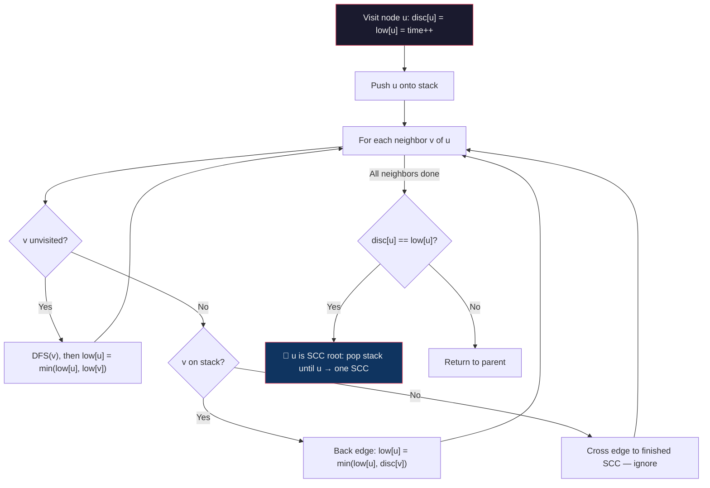

**Time Complexity:** $O(V + E)$ — single DFS pass.

```java
public class Tarjan {
    private int time = 0;            // global clock for discovery times
    private int[] disc;              // disc[u] = discovery time of node u
    private int[] low;               // low[u]  = lowest disc time reachable from u's subtree
    private boolean[] inStack;       // is node currently on the DFS stack?
    private Stack<Integer> stack;    // tracks the current DFS path
    private List<List<Integer>> sccs;
    private List<List<Integer>> graph;

    public List<List<Integer>> findSCCs(int n, List<List<Integer>> graph) {
        this.graph = graph;
        disc = new int[n];
        low = new int[n];
        inStack = new boolean[n];
        stack = new Stack<>();
        sccs = new ArrayList<>();

        Arrays.fill(disc, -1); // -1 means unvisited

        // Handle disconnected components
        for (int i = 0; i < n; i++) {
            if (disc[i] == -1) {
                dfs(i);
            }
        }
        return sccs;
    }

    private void dfs(int u) {
        // Assign discovery time and initialize low-link to itself
        disc[u] = low[u] = time++;
        stack.push(u);
        inStack[u] = true;

        for (int v : graph.get(u)) {
            if (disc[v] == -1) {
                // Case 1: v is unvisited — it's a tree edge.
                // Recurse into v, then propagate v's low-link up to u.
                dfs(v);
                low[u] = Math.min(low[u], low[v]);

            } else if (inStack[v]) {
                // Case 2: v is visited AND still on the stack — it's a back edge.
                // v is an ancestor in the current DFS path, so u can reach
                // as far back as disc[v].
                low[u] = Math.min(low[u], disc[v]);
            }
            // Case 3 (implicit): v is visited but NOT on stack.
            // v belongs to an already-completed SCC — ignore it.
        }

        // ──────────────────────────────────────────────
        // SCC Detection: If low[u] == disc[u], then u is the root
        // of its SCC. No node in this SCC can reach any ancestor
        // above u. Pop everything up to (and including) u — that's the SCC.
        // ──────────────────────────────────────────────
        if (disc[u] == low[u]) {
            List<Integer> component = new ArrayList<>();
            int v;
            do {
                v = stack.pop();
                inStack[v] = false;
                component.add(v);
            } while (u != v);

            sccs.add(component);
        }
    }
}
```

**Walkthrough Example:**

```
Graph: 0 → 1 → 2 → 0, 2 → 3 → 4 → 3

DFS from 0:
  Visit 0: disc=0, low=0, stack=[0]
  Visit 1: disc=1, low=1, stack=[0,1]
  Visit 2: disc=2, low=2, stack=[0,1,2]
    → Neighbor 0 is on stack → low[2] = min(2, disc[0]) = 0
  Visit 3: disc=3, low=3, stack=[0,1,2,3]
  Visit 4: disc=4, low=4, stack=[0,1,2,3,4]
    → Neighbor 3 is on stack → low[4] = min(4, disc[3]) = 3
    → disc[4] != low[4], return

  Back at 3: low[3] = min(3, low[4]) = 3
    → disc[3] == low[3] → SCC root! Pop until 3 → SCC: {4, 3}
    stack=[0,1,2]

  Back at 2: low[2] = min(0, low[3]=3) = 0
    → disc[2] != low[2], return
  Back at 1: low[1] = min(1, low[2]=0) = 0
    → disc[1] != low[1], return
  Back at 0: low[0] = 0
    → disc[0] == low[0] → SCC root! Pop until 0 → SCC: {2, 1, 0}

Result: [{4, 3}, {2, 1, 0}]
```

### Kosaraju vs Tarjan

| Aspect | Kosaraju | Tarjan |
|:---|:---|:---|
| **DFS passes** | 2 (original + transposed graph) | 1 |
| **Extra structure** | Transposed graph ($O(V+E)$ space) | Stack + disc/low arrays ($O(V)$ space) |
| **Time** | $O(V + E)$ | $O(V + E)$ |
| **Conceptual simplicity** | Easier to understand (two clean passes) | Trickier (low-link reasoning) |
| **Use case** | When you need the transposed graph anyway | When space matters or single-pass preferred |

## **Union Find**

A data structure (also called **Disjoint Set Union / DSU**) that tracks elements partitioned into disjoint (non-overlapping) sets. It supports two operations efficiently:

- **Find(x):** Which set does element `x` belong to? (returns the set's representative / root)
- **Union(x, y):** Merge the sets containing `x` and `y` into one.

### Core Idea

Each set is represented as a **tree** where every node points to its parent. The **root** of the tree is the representative of that set. Two elements are in the same set if and only if they have the same root.

### Two Key Optimizations

**1. Path Compression (in `find`)**

When finding the root of `x`, make every node along the path point **directly to the root**. This flattens the tree, making future lookups nearly $O(1)$.

```
Before find(4):       After find(4):
    0                   0
    |                 / | \
    1                1   2  4
    |                    |
    2                    3
    |
    3
    |
    4
```

**2. Union by Rank / Size (in `union`)**

When merging two sets, attach the **smaller** tree under the **larger** tree's root. This keeps trees shallow.

- **Rank:** Approximate tree height. Attach lower-rank root under higher-rank root.
- **Size:** Number of nodes. Attach smaller set under larger set.

### Template — Union by Rank

```java
public class UnionFind {
    private int[] parent; // parent[i] = parent of node i (root if parent[i] == i)
    private int[] rank;   // rank[i]   = approximate depth of subtree rooted at i

    public UnionFind(int n) {
        parent = new int[n];
        rank = new int[n];

        // Initially, each element is its own set (self-loop = root)
        for (int i = 0; i < n; i++) {
            parent[i] = i;
            rank[i] = 0;
        }
    }

    // Find the root/representative of the set containing x.
    // PATH COMPRESSION: recursively set each node's parent to the root.
    public int find(int x) {
        if (parent[x] != x) {
            parent[x] = find(parent[x]); // path compression
        }
        return parent[x];
    }

    // Merge the sets containing x and y.
    // UNION BY RANK: attach the shorter tree under the taller tree's root.
    public void union(int x, int y) {
        int rootX = find(x);
        int rootY = find(y);

        if (rootX == rootY) return; // already in the same set

        // Attach smaller-rank tree under larger-rank tree
        if (rank[rootX] < rank[rootY]) {
            parent[rootX] = rootY;
        } else if (rank[rootX] > rank[rootY]) {
            parent[rootY] = rootX;
        } else {
            // Same rank: pick one as root, increment its rank
            parent[rootY] = rootX;
            rank[rootX]++;
        }
    }

    // Optional: check if x and y are in the same set
    public boolean connected(int x, int y) {
        return find(x) == find(y);
    }
}
```

### Template — Union by Size

```java
public class UnionFindBySize {
    private int[] parent;
    private int[] size; // size[i] = number of nodes in the tree rooted at i

    public UnionFindBySize(int n) {
        parent = new int[n];
        size = new int[n];

        for (int i = 0; i < n; i++) {
            parent[i] = i;
            size[i] = 1; // each set starts with 1 element
        }
    }

    public int find(int x) {
        if (parent[x] != x) {
            parent[x] = find(parent[x]); // path compression
        }
        return parent[x];
    }

    // UNION BY SIZE: attach smaller set under larger set's root.
    public void union(int x, int y) {
        int rootX = find(x);
        int rootY = find(y);

        if (rootX == rootY) return;

        // Attach smaller tree under bigger tree
        if (size[rootX] < size[rootY]) {
            parent[rootX] = rootY;
            size[rootY] += size[rootX];
        } else {
            parent[rootY] = rootX;
            size[rootX] += size[rootY];
        }
    }
}
```

### Time Complexity

With both path compression and union by rank/size, the amortized time per operation is $O(\alpha(n))$, where $\alpha$ is the **inverse Ackermann function** — effectively constant ($\leq 4$ for any practical $n$).

| Operation | Amortized Time |
|:---|:---|
| `find(x)` | $O(\alpha(n))$ ≈ $O(1)$ |
| `union(x, y)` | $O(\alpha(n))$ ≈ $O(1)$ |
| Build from $n$ elements | $O(n)$ |

### When to Use

- **Kruskal's MST** — quickly check if adding an edge creates a cycle
- **Connected components** — dynamically track components as edges are added
- **Cycle detection** in undirected graphs — if `find(u) == find(v)` before `union(u, v)`, there's a cycle
- **Accounts Merge / Friend Circles** — group elements that share a common link
- Any problem about **grouping / partitioning** with incremental merges

## **Shortest Path Algorithms**

### **BFS(Unweighted graph)**

1.  **Start:** Begin at the designated starting node $S$.
2.  **Distance Tracking:** Maintain an array (or map) to store the **shortest distance** from $S$ to every other node. Initialize $S$'s distance to $0$ and all others to infinity (or $-1$ in a simple integer array).
3.  **Parent Tracking (Optional but Crucial):** Maintain a second array to store the **parent** of each node in the shortest path tree. This allows you to reconstruct the actual path after the BFS completes.
4.  **Traversal:** Use a **Queue** for standard BFS. When processing a node $u$, iterate through its neighbors $v$:
      * If $v$ has not been visited (or its distance is $-1$):
          * Set $v$'s distance to $u$'s distance plus 1.
          * Set $v$'s parent to $u$.
          * Enqueue $v$.


```java

public class ShortestPathBFS {
    
    private int V; // Number of vertices
    private List<List<Integer>> adj; // Adjacency list for the graph

    // Constructor to initialize the graph
    public ShortestPathBFS(int v) {
        this.V = v;
        this.adj = new ArrayList<>(v);
        for (int i = 0; i < v; ++i) {
            this.adj.add(new ArrayList<>());
        }
    }

    // Adds an edge between u and v (undirected)
    public void addEdge(int u, int v) {
        adj.get(u).add(v);
        adj.get(v).add(u);
    }


    public void shortestPath(int s, int target) {
        // Step 1: Initialize data structures. 
        // 'dist': Stores shortest distance from 's' (initialized to -1 for unvisited).
        // 'parent': Stores the predecessor node to reconstruct the path.
        int[] dist = new int[V];
        int[] parent = new int[V];
        Arrays.fill(dist, -1);
        Arrays.fill(parent, -1);
        
        Queue<Integer> queue = new LinkedList<>();

        // Step 2: Start BFS from the source node 's'.
        dist[s] = 0;
        queue.add(s);

        // Step 3: Core BFS Loop
        while (!queue.isEmpty()) {
            int u = queue.poll();

            for (int v : adj.get(u)) {
                // Check if neighbor 'v' has been visited.
                if (dist[v] == -1) {
                    // Step 3a: Update distance and parent.
                    // The distance is guaranteed to be the shortest path length.
                    dist[v] = dist[u] + 1; 
                    parent[v] = u; 
                    
                    // Step 3b: Enqueue the neighbor for next level exploration.
                    queue.add(v);
                }
            }
        }
        
        // Step 4: Output Results (Distance and Path)
        System.out.println("\n--- Results for Source Node " + s + " ---");
        System.out.println("Shortest Distance to Node " + target + ": " + (dist[target] == -1 ? "Unreachable" : dist[target]));
        
        System.out.print("Shortest Path to Node " + target + ": ");
        reconstructPath(s, target, parent);
    }
    
    // Reconstructs the path from the target back to the source using the parent array.
    private void reconstructPath(int s, int target, int[] parent) {
        if (parent[target] == -1 && target != s) {
            System.out.println("Path not found/Unreachable.");
            return;
        }

        LinkedList<Integer> path = new LinkedList<>();
        int curr = target;
        
        // Trace back from target using parent pointers
        while (curr != -1) {
            path.addFirst(curr); // Add at the beginning to reverse the order
            curr = parent[curr];
        }

        System.out.println(path);
    }
    
    
    // Main method for testing
    public static void main(String[] args) {
        // Graph with 5 vertices (0 to 4)
        ShortestPathBFS graph = new ShortestPathBFS(5);
        
        // Component 1: 0 -- 1 -- 2
        graph.addEdge(0, 1);
        graph.addEdge(1, 2);
        
        // Component 2: 3 -- 4
        graph.addEdge(3, 4);

        int source = 0;
        int target1 = 2; // Expected path: [0, 1, 2], Distance: 2
        int target2 = 4; // Expected: Unreachable

        // Test Case 1: Reachable Target
        graph.shortestPath(source, target1); 
        
        // Test Case 2: Unreachable Target
        graph.shortestPath(source, target2); 
    }
}

```

### **Dijkstra's Algorithm** 

Finds the shortest path from a **single source** to all other nodes in a graph with **non-negative** edge weights.

**Core Idea — Greedy Relaxation:**

1. Maintain a `dist[]` array initialized to $\infty$ (source = 0).
2. Use a **min-heap (priority queue)** to always process the **closest unvisited node** next.
3. For each neighbor, check if going through the current node gives a shorter path — this is called **relaxation**: `if dist[u] + weight(u,v) < dist[v] → update dist[v]`.
4. Once a node is popped from the heap, its shortest distance is **finalized** (greedy guarantee — works only because all weights are non-negative).

**Why no negative weights?** Dijkstra finalizes a node's distance when it's first popped from the heap. With negative edges, a later path could be shorter, violating this guarantee.

**Flow:**

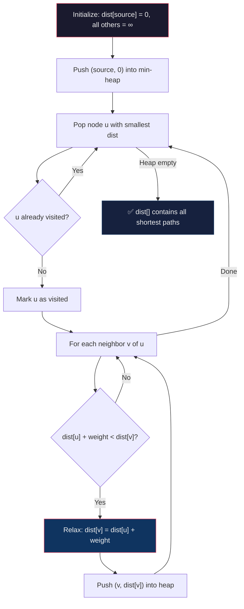

**Time Complexity:** $O((V + E) \log V)$ with a binary heap.

```java
public class Dijkstra {
    private List<List<int[]>> graph; // adjacency list: {dest, weight}
    private int V;

    public Dijkstra(int v) {
        this.V = v;
        this.graph = new ArrayList<>();
        for (int i = 0; i < V; i++) graph.add(new ArrayList<>());
    }

    public void addEdge(int src, int dest, int weight) {
        graph.get(src).add(new int[]{dest, weight});
    }

    public int[] dijkstra(int source) {
        // dist[v] = shortest known distance from source to v
        int[] dist = new int[V];
        Arrays.fill(dist, Integer.MAX_VALUE);
        dist[source] = 0;

        boolean[] visited = new boolean[V];

        // Min-heap ordered by distance: {node, distance}
        PriorityQueue<int[]> pq = new PriorityQueue<>((a, b) -> a[1] - b[1]);
        pq.add(new int[]{source, 0});

        while (!pq.isEmpty()) {
            int[] curr = pq.poll();
            int u = curr[0];

            // Skip if we've already finalized this node's distance.
            // This handles stale entries in the heap (we may push the
            // same node multiple times with different distances).
            if (visited[u]) continue;
            visited[u] = true; // distance to u is now final

            // Relaxation: try to improve distance to each neighbor
            for (int[] edge : graph.get(u)) {
                int v = edge[0], weight = edge[1];

                // If going through u gives a shorter path to v, update it
                if (dist[u] + weight < dist[v]) {
                    dist[v] = dist[u] + weight;
                    pq.add(new int[]{v, dist[v]}); // push updated distance
                }
            }
        }

        return dist; // dist[i] = shortest distance from source to i
    }
}
```

**Walkthrough Example:**

```
Graph (directed, weighted):
  0 →(2)→ 1 →(1)→ 2
  0 →(4)→ 2
  2 →(3)→ 3

Source = 0

Step 1: dist = [0, ∞, ∞, ∞],  heap = [(0,0)]
Step 2: Pop (0,0). Relax: dist[1]=2, dist[2]=4.  heap = [(1,2), (2,4)]
Step 3: Pop (1,2). Relax: dist[2]=min(4, 2+1)=3. heap = [(2,3), (2,4)]
Step 4: Pop (2,3). Relax: dist[3]=3+3=6.          heap = [(2,4), (3,6)]
Step 5: Pop (2,4). Already visited — skip.
Step 6: Pop (3,6). No neighbors.

Final: dist = [0, 2, 3, 6]
```

| Aspect | Detail |
|:---|:---|
| **Type** | Single-Source Shortest Path (SSSP) |
| **Weights** | Non-negative only |
| **Time** | $O((V + E) \log V)$ with min-heap |
| **Space** | $O(V + E)$ |
| **Negative edges?** | Does NOT work — use Bellman-Ford instead |

---

### **Bellman-Ford Algorithm**

Finds the shortest path from a **single source** to all other nodes. Unlike Dijkstra, it handles **negative edge weights** and can **detect negative-weight cycles**.

**Core Idea — Relax Everything, V-1 Times:**

1. Initialize `dist[source] = 0`, all others = $\infty$.
2. Repeat $V - 1$ times: scan **every edge** $(u, v, w)$ and relax it (`if dist[u] + w < dist[v] → update dist[v]`).
3. After $V - 1$ rounds, all shortest paths are found (a shortest path has at most $V - 1$ edges).
4. **Negative cycle check:** Do one more pass. If any edge can still be relaxed, a negative cycle exists (distances can decrease forever).

**Why V-1 iterations?** In a graph with $V$ nodes, the longest shortest path can have at most $V - 1$ edges. In each iteration, at least one more node gets its correct shortest distance. After $V - 1$ iterations, all nodes are resolved.

**Flow:**

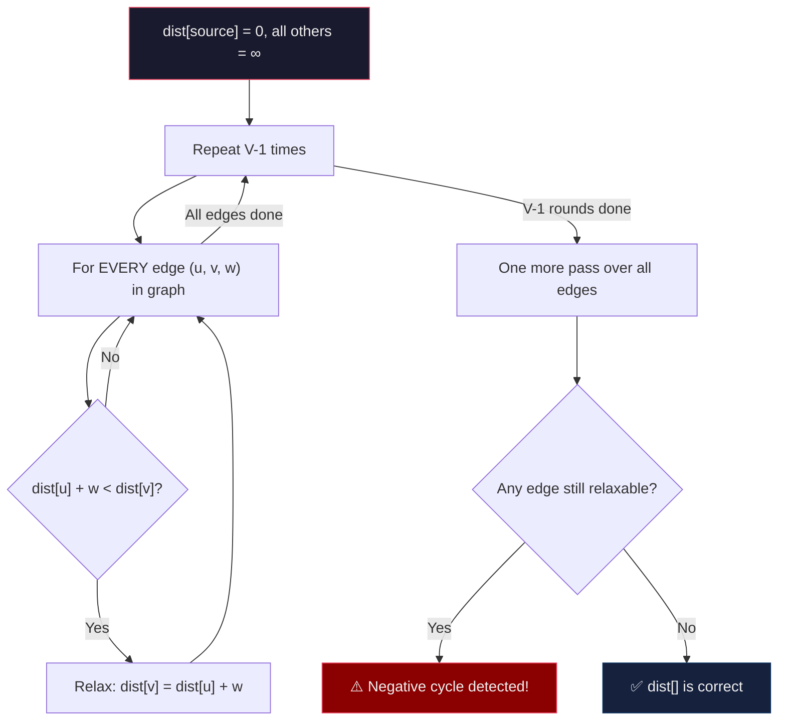

**Time Complexity:** $O(V \cdot E)$

```java
public class BellmanFord {
    private List<int[]> edges; // edge list: {src, dest, weight}
    private int V;

    public BellmanFord(int v) {
        this.V = v;
        this.edges = new ArrayList<>();
    }

    public void addEdge(int src, int dest, int weight) {
        edges.add(new int[]{src, dest, weight});
    }

    public int[] bellmanFord(int source) {
        // Step 1: Initialize distances
        int[] dist = new int[V];
        Arrays.fill(dist, Integer.MAX_VALUE);
        dist[source] = 0;

        // Step 2: Relax all edges V-1 times.
        // After iteration i, all shortest paths using at most (i+1) edges are correct.
        for (int i = 0; i < V - 1; i++) {
            for (int[] edge : edges) {
                int u = edge[0], v = edge[1], w = edge[2];

                // Only relax if u is reachable (dist[u] != ∞)
                // and going through u gives a shorter path to v
                if (dist[u] != Integer.MAX_VALUE && dist[u] + w < dist[v]) {
                    dist[v] = dist[u] + w;
                }
            }
        }

        // Step 3: Negative cycle detection.
        // If we can STILL relax an edge after V-1 rounds,
        // it means a negative cycle exists — distances can decrease indefinitely.
        for (int[] edge : edges) {
            int u = edge[0], v = edge[1], w = edge[2];
            if (dist[u] != Integer.MAX_VALUE && dist[u] + w < dist[v]) {
                throw new IllegalStateException("Negative weight cycle detected!");
            }
        }

        return dist;
    }
}
```

**Walkthrough Example:**

```
Graph:  0 →(6)→ 1,  0 →(7)→ 4,  1 →(-4)→ 3,  4 →(-3)→ 2,  2 →(-2)→ 3
Source = 0, V = 5

Initial: dist = [0, ∞, ∞, ∞, ∞]

Iteration 1 (relax all edges):
  Edge 0→1(6):  dist[1] = min(∞, 0+6) = 6
  Edge 0→4(7):  dist[4] = min(∞, 0+7) = 7
  Edge 1→3(-4): dist[3] = min(∞, 6-4) = 2
  Edge 4→2(-3): dist[2] = min(∞, 7-3) = 4
  Edge 2→3(-2): dist[3] = min(2, 4-2) = 2   (no change)
  dist = [0, 6, 4, 2, 7]

Iteration 2-4: No further changes (already converged).

Negative cycle check: No edge can be relaxed → no negative cycle.

Final: dist = [0, 6, 4, 2, 7]
```

### Dijkstra vs Bellman-Ford

| Aspect | Dijkstra | Bellman-Ford |
|:---|:---|:---|
| **Approach** | Greedy (finalize nearest node) | Iterative relaxation (all edges, V-1 times) |
| **Negative weights** | Not supported | Supported |
| **Negative cycle detection** | No | Yes |
| **Time** | $O((V+E) \log V)$ | $O(V \cdot E)$ |
| **When to use** | Non-negative weights, faster | Negative weights or cycle detection needed |

---

### **Floyd-Warshall Algorithm**

Finds the shortest path between **every pair of nodes** (All-Pairs Shortest Path). Works with **positive and negative** weights but **no negative cycles**.

**Core Idea — Try Every Intermediate Node:**

- Maintain a 2D matrix `dist[i][j]` = shortest distance from $i$ to $j$.
- For each potential **intermediate node** $k$ (0 to $V-1$), check: is the path $i \to k \to j$ shorter than the current $i \to j$?
- After considering all $V$ intermediate nodes, `dist[i][j]` holds the true shortest path.

**The key recurrence:**

$$dist[i][j] = \min(dist[i][j],\ dist[i][k] + dist[k][j])$$

"Is it cheaper to go directly from $i$ to $j$, or to go from $i$ to $k$ and then $k$ to $j$?"

**Flow:**

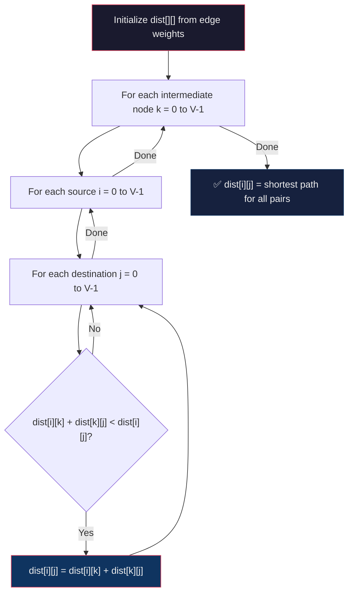

**Time Complexity:** $O(V^3)$

```java
public class FloydWarshall {
    private static final int INF = 99999; // Use a large value (not MAX_VALUE to avoid overflow)

    public int[][] floydWarshall(int[][] graph) {
        int V = graph.length;

        // Step 1: Initialize the distance matrix as a copy of the input.
        // dist[i][j] starts as the direct edge weight (or INF if no edge).
        int[][] dist = new int[V][V];
        for (int i = 0; i < V; i++) {
            System.arraycopy(graph[i], 0, dist[i], 0, V);
        }

        // Step 2: Try every node k as an intermediate point.
        //
        // Outer loop MUST be k (intermediate node).
        // After iteration k, dist[i][j] reflects the shortest path
        // from i to j using only intermediate nodes {0, 1, ..., k}.
        for (int k = 0; k < V; k++) {
            for (int i = 0; i < V; i++) {
                for (int j = 0; j < V; j++) {
                    // Is the path i → k → j shorter than the current i → j?
                    if (dist[i][k] + dist[k][j] < dist[i][j]) {
                        dist[i][j] = dist[i][k] + dist[k][j];
                    }
                }
            }
        }

        // Optional: Negative cycle detection.
        // If any dist[i][i] < 0, node i is part of a negative cycle.
        for (int i = 0; i < V; i++) {
            if (dist[i][i] < 0) {
                throw new IllegalStateException("Negative weight cycle detected!");
            }
        }

        return dist; // dist[i][j] = shortest distance from i to j
    }
}
```

**Walkthrough Example:**

```
Input adjacency matrix (4 nodes):
         0    1    2    3
    0 [  0,   5, INF,  10 ]
    1 [INF,   0,   3, INF ]
    2 [INF, INF,   0,   1 ]
    3 [INF, INF, INF,   0 ]

k=0 (paths through node 0): No improvement — node 0 has no incoming edges from others.

k=1 (paths through node 1):
  dist[0][2] = min(INF, dist[0][1] + dist[1][2]) = min(INF, 5+3) = 8
  dist[0][3] = min(10, dist[0][1] + dist[1][3]) = min(10, 5+INF) = 10  (no change)

k=2 (paths through node 2):
  dist[0][3] = min(10, dist[0][2] + dist[2][3]) = min(10, 8+1) = 9
  dist[1][3] = min(INF, dist[1][2] + dist[2][3]) = min(INF, 3+1) = 4

k=3 (paths through node 3): No further improvement.

Final:
         0    1    2    3
    0 [  0,   5,   8,   9 ]
    1 [INF,   0,   3,   4 ]
    2 [INF, INF,   0,   1 ]
    3 [INF, INF, INF,   0 ]
```

### Shortest Path Algorithm Comparison

| Algorithm | Type | Weights | Negative Cycles | Time |
|:---|:---|:---|:---|:---|
| **BFS** | Single-source | Unweighted | N/A | $O(V + E)$ |
| **Dijkstra** | Single-source | Non-negative | Not detected | $O((V+E) \log V)$ |
| **Bellman-Ford** | Single-source | Any (incl. negative) | Detected | $O(V \cdot E)$ |
| **Floyd-Warshall** | All-pairs | Any (incl. negative) | Detected (`dist[i][i] < 0`) | $O(V^3)$ |