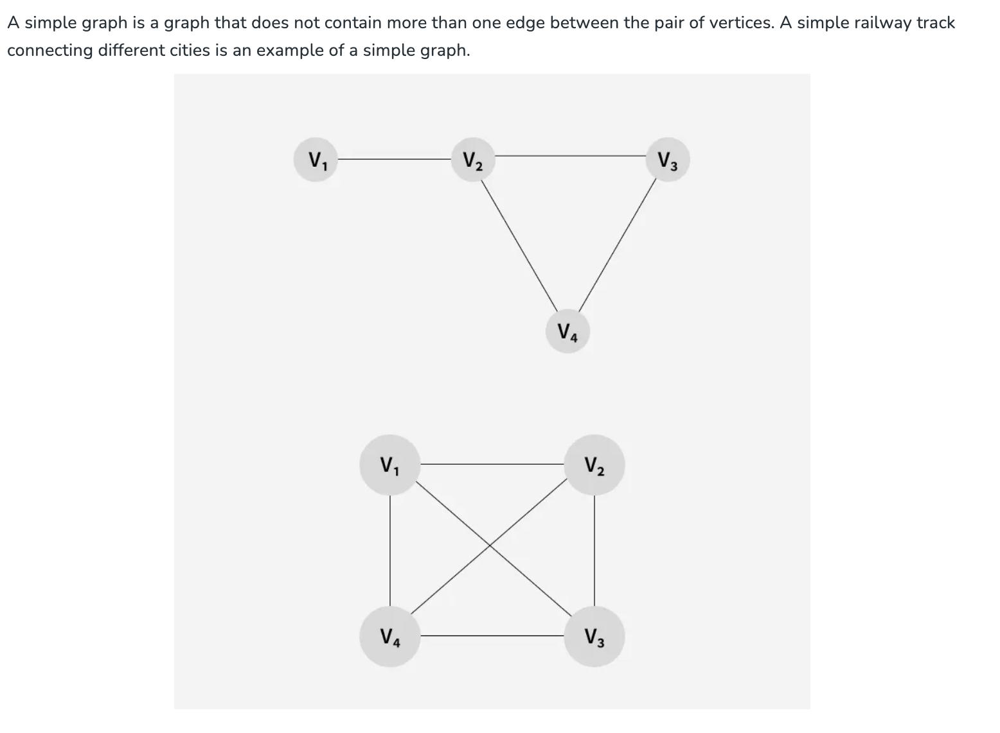
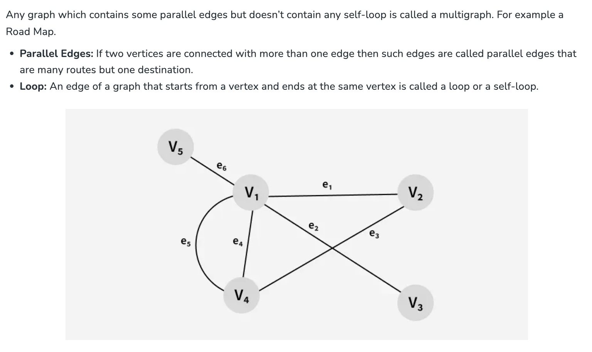
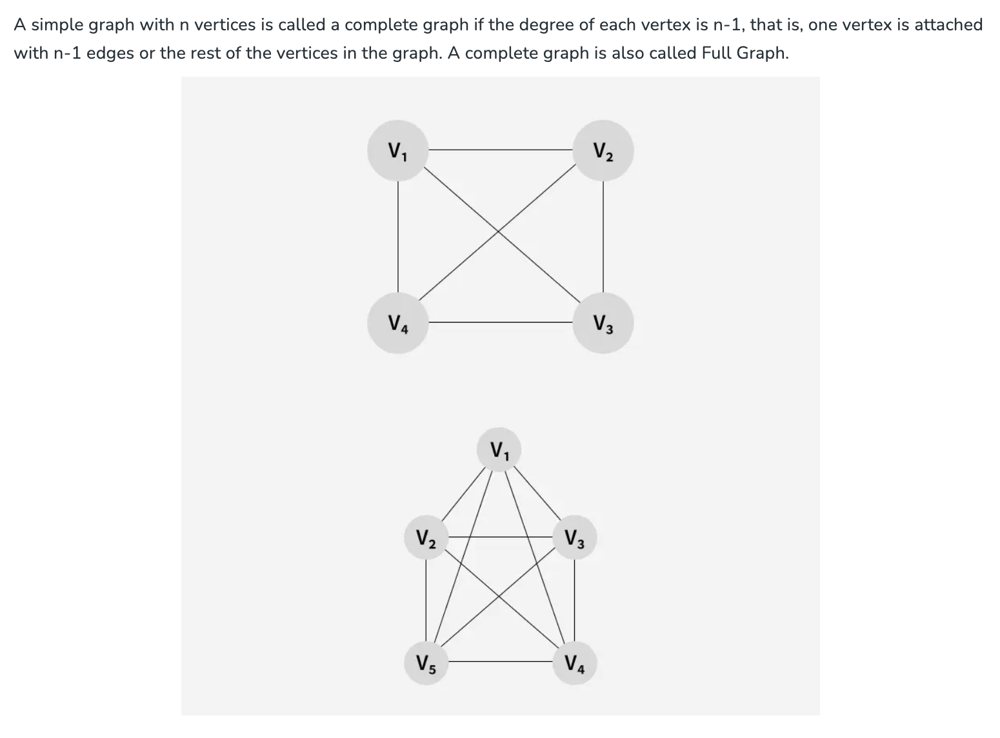
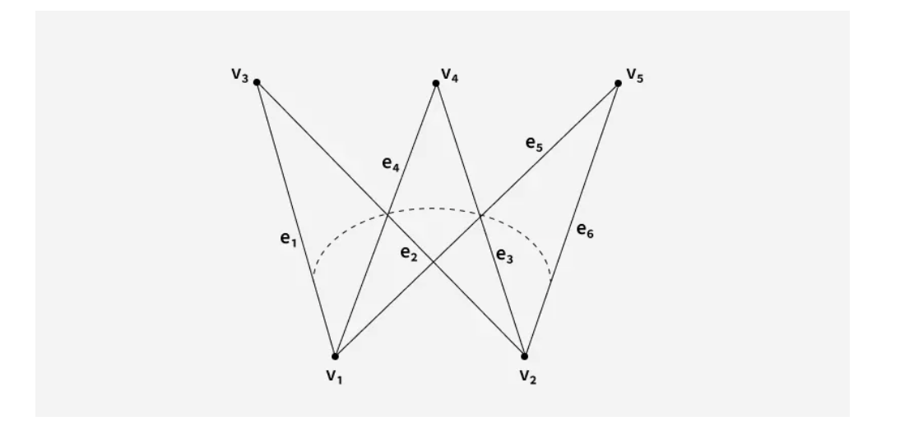
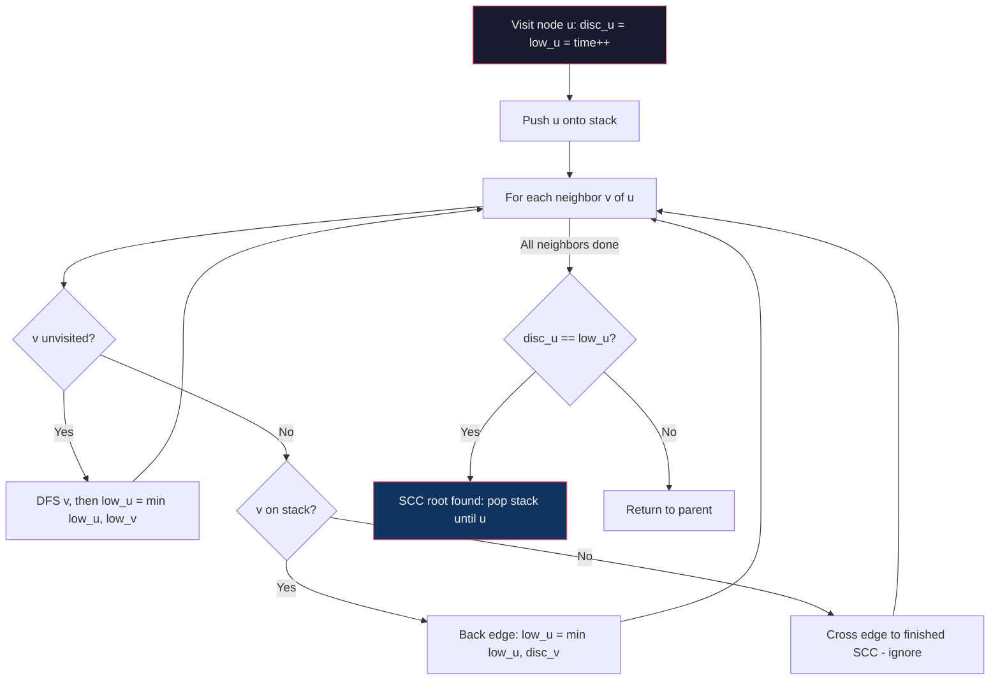
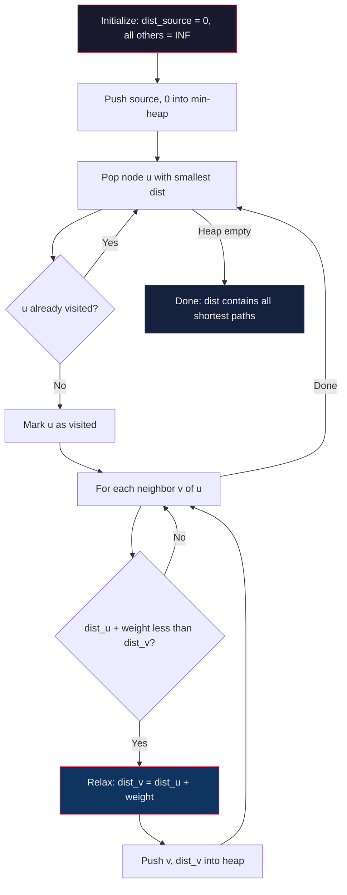
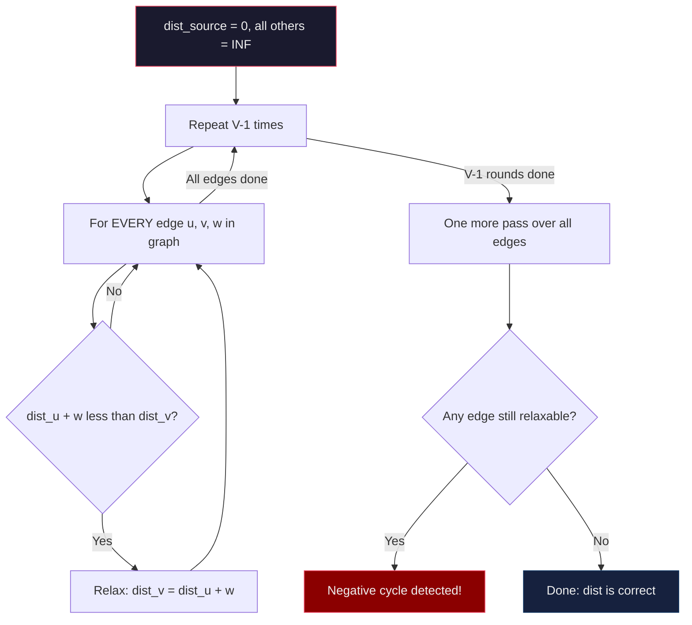
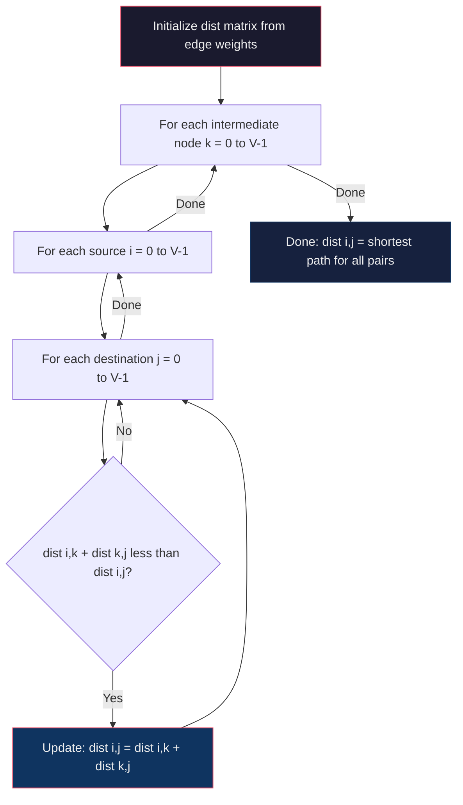

## Table of Contents

- [Introduction](#introduction)
  - [The Building Blocks of a Graph](#the-building-blocks-of-a-graph)
  - [Types of Graphs: A Visual Vocabulary](#types-of-graphs-a-visual-vocabulary)
- [Patterns and Algorithms](#patterns-and-algorithms)
  - [BFS Variations](#bfs-variations)
    - [1. Standard BFS](#1-standard-bfs)
    - [2. Multi-Source BFS](#2-multi-source-bfs)
    - [3. 0-1 BFS](#3-0-1-bfs)
    - [4. Stateful BFS (BFS + Bitmask)](#4-stateful-bfs-bfs--bitmask)
    - [5. Bidirectional BFS](#5-bidirectional-bfs)
  - [DFS Variations](#dfs-variations)
    - [1. Standard DFS (Flood Fill / Connected Components)](#1-standard-dfs-flood-fill--connected-components)
    - [2. Backtracking DFS (Find All Paths / Combinations)](#2-backtracking-dfs-find-all-paths--combinations)
    - [3. Cycle Detection DFS (3-Color / Directed Graph)](#3-cycle-detection-dfs-3-color--directed-graph)
    - [4. Topological Sort DFS (Post-Order)](#4-topological-sort-dfs-post-order)
    - [5. Tarjan's Bridge-Finding DFS](#5-tarjans-bridge-finding-dfs)
    - [6. Eulerian Path DFS (Hierholzer's Algorithm)](#6-eulerian-path-dfs-hierholzers-algorithm)
  - [Cycle Detection](#cycle-detection)
    - [Undirected Graph — DFS with Parent Tracking](#unidirected-graph---dfs-with-parent-tracking)
    - [Directed Graph — Three-State DFS Marking](#directed-graph----three-state-dfs-marking)
  - [Topological Sorting (DAGs)](#topological-sortingdags)
    - [Method 1: DFS](#method-1-depth-first-search-dfs)
    - [Method 2: Kahn's Algorithm (In-Degree)](#method-2-kahns-algorithm-in-degree-based)
  - [Minimum Spanning Tree (MST)](#minimum-spanning-tree-mst)
    - [Kruskal's Algorithm](#kruskals-algorithm)
    - [Prim's Algorithm](#prims-algorithm)
  - [Connected Components](#connected-components)
    - [Undirected Graph](#undirected-graph)
    - [Directed Graph — Kosaraju's Algorithm](#directed-graph)
    - [Directed Graph — Tarjan's Algorithm](#tarjans-algorithm)
  - [Union Find](#union-find)
  - [Shortest Path Algorithms](#shortest-path-algorithms)
    - [BFS (Unweighted)](#bfsunweighted-graph)
    - [Dijkstra's Algorithm](#dijkstras-algorithm)
    - [Bellman-Ford Algorithm](#bellman-ford-algorithm)
    - [Floyd-Warshall Algorithm](#floyd-warshall-algorithm)
    - [Comparison Table](#shortest-path-algorithm-comparison)

---

# **Introduction**

## The Building Blocks of a Graph

A graph `G = (V, E)` models **relationships** between objects: **Vertices** (nodes/entities) connected by **Edges** (links/relationships).

```
   Vertex A ●─────── edge ───────● Vertex B
```

### Real-World Examples

| Domain | Vertices | Edges | Edge Type |
|---|---|---|---|
| **Social (Facebook)** | User profiles | Friendships | Undirected (mutual) |
| **Social (Twitter)** | User profiles | Follows | Directed (one-way) |
| **Maps (Google Maps)** | Locations | Roads/routes | Weighted (distance, time, cost) |
| **Recommendations (Netflix)** | Users + Items | Interactions | Bipartite, weighted (rating, plays) |

---

## Types of Graphs: A Visual Vocabulary

| Category | Type | Key Property | Analogy |
|---|---|---|---|
| **Direction** | Undirected | Edge A–B works both ways | Two-way street, Facebook friendship |
| | Directed (Digraph) | Edge A→B ≠ B→A | One-way street, Twitter follow |
| **Weight** | Weighted | Edges carry a cost/value | Road with distance |
| | Unweighted | Only connections matter | Plain friendship graph |
| **Structure** | Simple | No self-loops or parallel edges | — |
| | Multigraph | Parallel edges allowed | Multiple flights between cities |
| | Complete | Every pair connected | Everyone knows everyone |
| | Bipartite | Two disjoint sets; edges only cross between them | Users ↔ Movies |
| | Tree | Connected, **no cycles**, `n-1` edges | Org chart, file system |

   

---

## Fundamental Properties 💡

### Degree
| Graph | Measure | Meaning |
|---|---|---|
| Undirected | **Degree** | # edges touching the vertex |
| Directed | **In-degree** | # incoming edges |
| Directed | **Out-degree** | # outgoing edges |

### Path — a walk between vertices
Directed paths **must follow arrows**; undirected paths ignore direction.

```
  Undirected                     Directed
  A ─── B ─── E                  A ──▶ B
  │     │                        │     │
  C ─── D                        ▼     ▼
                                 C ──▶ D ◀── E
  A→B→E ✓   A→C→D→B→E ✓          A→C→D ✓   A→B→D ✓
  A→E ✗ (no edge)                A→C→B ✗ (against arrow)
```

### Cycle — a path that returns to its start

```
  Undirected cycle               Directed cycle
  A ─── B                        A ──▶ B
  │     │                        ▲     │
  D ─── C                        │     ▼
  A→B→C→D→A ✓                    D ◀── C   →  A→B→C→D→A ✓
```

| Vertices | Undirected | Directed |
|---|---|---|
| **1** | Cycle only via self-loop | Cycle only via self-loop |
| **2** | ✗ in simple graph (edge reuse); ✓ only in multigraph | ✓ if A→B **and** B→A |
| **3+** | Standard cycle | Standard cycle (following arrows) |

> A graph with **no cycles** is **acyclic**. A directed acyclic graph = **DAG** (basis for topological sort).

### Connectivity

| Term | Applies to | Definition |
|---|---|---|
| **Connected** | Undirected | Path exists between every pair — "all one piece" |
| **Disconnected** | Undirected | Splits into ≥ 2 separate components |
| **Strongly Connected** | Directed | For every pair (A,B): path A→B **and** B→A |
| **Weakly Connected** | Directed | Connected only if you ignore edge directions |
| **Adjacent** | Both | Two vertices joined by an edge |

```
  Connected          Disconnected        Strongly Connected    Weakly Connected
  A─B─C              A─B    C─D           A ⇄ B                 A ──▶ B ──▶ C
    │                                      ⤡ ⤢                  (can't return
    D                (A can't reach C)      C  (all reach all)    C → A)
```

---

## Minimum Spanning Tree (Preview)

An **MST** is the cheapest set of edges that connects **all** vertices with **no cycles**.

> **Analogy — wiring a neighborhood:** connect every house to the network using the least total cable. Any loop is wasteful (a redundant cable). The MST is the cheapest "backbone."

```
        (1)
     A ─────── B          MST picks cheapest edges that add
     │ \     / │          a new vertex without forming a cycle:
  (4)│ (5)\/(2)│(6)         1. A–B (1)
     │   /\    │            2. B–D (2)
  (3)│  /  \   │            3. A–C (3)
     C ─────── D          Total cost = 6   (see MST section for algorithms)
        (7)
```

# **Patterns and Algorithms**

## Which Graph Algorithm? — Decision Tree

```
What are you solving?
│
├─ Traversal / reachability / connected components
│     ├─ Level-by-level or shortest hops ........... BFS
│     └─ Go deep / explore fully ................... DFS
│
├─ Shortest path
│     ├─ Unweighted ................................ BFS
│     ├─ Weights 0/1 ............................... 0-1 BFS (deque)
│     ├─ Non-negative weights ...................... Dijkstra
│     ├─ Negative weights allowed .................. Bellman-Ford
│     └─ All pairs ................................. Floyd-Warshall
│
├─ Ordering with dependencies (DAG) ............... Topological Sort (DFS or Kahn)
│
├─ Detect a cycle
│     ├─ Undirected ................................ DFS + parent tracking / Union-Find
│     └─ Directed .................................. DFS 3-color marking
│
├─ Connect all nodes at minimum cost .............. MST (Kruskal / Prim)
│
├─ Group / merge sets dynamically ................. Union-Find
│
└─ Strongly connected components .................. Kosaraju / Tarjan
```

## Complexity Cheat-Sheet

| Algorithm | Time | Space | Handles |
|---|---|---|---|
| BFS / DFS | O(V + E) | O(V) | Unweighted traversal |
| 0-1 BFS | O(V + E) | O(V) | Weights ∈ {0, 1} |
| Dijkstra | O(E log V) | O(V) | Non-negative weights |
| Bellman-Ford | O(V · E) | O(V) | Negative weights, detects neg cycles |
| Floyd-Warshall | O(V³) | O(V²) | All-pairs shortest path |
| Topological Sort | O(V + E) | O(V) | DAG ordering |
| Kruskal (MST) | O(E log E) | O(V) | Sparse graphs |
| Prim (MST) | O(E log V) | O(V) | Dense graphs |
| Union-Find | O(α(V)) ≈ O(1) | O(V) | Dynamic connectivity |
| Kosaraju / Tarjan | O(V + E) | O(V) | Strongly connected components |


## BFS Variations

### 1. Standard BFS

**Analogy:** Ripples in a pond — you drop a stone and waves spread outward in uniform rings. Every node at distance 1 is reached before any node at distance 2.

Use when you need the **shortest path in an unweighted graph**. Process nodes level by level using a Queue (FIFO).

```java
public int standardBFS(List<List<Integer>> graph, int start, int target) {
    Queue<Integer> queue = new LinkedList<>();
    Set<Integer> visited = new HashSet<>();
    queue.offer(start);
    visited.add(start);
    int level = 0;

    while (!queue.isEmpty()) {
        int size = queue.size();
        for (int i = 0; i < size; i++) {
            int curr = queue.poll();
            if (curr == target) return level;
            for (int neighbor : graph.get(curr)) {
                if (!visited.contains(neighbor)) {
                    visited.add(neighbor);
                    queue.offer(neighbor);
                }
            }
        }
        level++;
    }
    return -1;
}
```

---

### 2. Multi-Source BFS

**Analogy:** Multiple fires burning simultaneously. Each fire spreads outward at the same rate — the first fire to reach a cell "owns" it. Seed the queue with **all sources at once** (distance 0).

Use when you need the shortest distance from *any* source — e.g., "distance to nearest 0" in a matrix.

```java
public int[][] multiSourceBFS(char[][] grid) {
    int rows = grid.length, cols = grid[0].length;
    Queue<int[]> queue = new LinkedList<>();
    int[][] dist = new int[rows][cols];

    for (int r = 0; r < rows; r++)
        for (int c = 0; c < cols; c++)
            if (grid[r][c] == 'S') queue.offer(new int[]{r, c});
            else dist[r][c] = Integer.MAX_VALUE;

    int[][] dirs = {{0,1},{0,-1},{1,0},{-1,0}};
    while (!queue.isEmpty()) {
        int[] curr = queue.poll();
        int r = curr[0], c = curr[1];
        for (int[] d : dirs) {
            int nr = r + d[0], nc = c + d[1];
            if (nr >= 0 && nr < rows && nc >= 0 && nc < cols && dist[nr][nc] > dist[r][c] + 1) {
                dist[nr][nc] = dist[r][c] + 1;
                queue.offer(new int[]{nr, nc});
            }
        }
    }
    return dist;
}
```

---

### 3. 0-1 BFS

**Analogy:** A highway with free shortcuts (weight 0) and toll roads (weight 1). Free shortcuts let you jump ahead in line — they go to the **front** of the deque. Toll roads go to the **back**.

Use instead of Dijkstra when edge weights are only 0 or 1. O(V+E) vs O(E log V).

```java
public int zeroOneBFS(int n, List<List<int[]>> graph, int start, int end) {
    Deque<Integer> deque = new ArrayDeque<>();
    int[] dist = new int[n];
    Arrays.fill(dist, Integer.MAX_VALUE);
    deque.offerFirst(start);
    dist[start] = 0;

    while (!deque.isEmpty()) {
        int u = deque.pollFirst();
        if (u == end) return dist[u];
        for (int[] edge : graph.get(u)) {
            int v = edge[0], w = edge[1]; // w is 0 or 1
            if (dist[u] + w < dist[v]) {
                dist[v] = dist[u] + w;
                if (w == 0) deque.offerFirst(v);
                else        deque.offerLast(v);
            }
        }
    }
    return -1;
}
```

---

### 4. Stateful BFS (BFS + Bitmask)

**Analogy:** You’re navigating a dungeon. You can re-enter Room A if you now hold a key you didn’t have before. The **state is (position, keys held)** — not just position.

Use when a node can be revisited in a different state (e.g., collected keys, flipped switches). `visited[node][mask]` instead of `visited[node]`.

```java
// State = (row, col, keyMask)
boolean[][][] visited = new boolean[m][n][1 << numKeys];
Queue<int[]> q = new LinkedList<>();
// q.offer(new int[]{startR, startC, 0});

while (!q.isEmpty()) {
    int[] curr = q.poll();
    int r = curr[0], c = curr[1], mask = curr[2];
    // if key at (nr,nc): newMask = mask | (1 << keyIndex)
    // if !visited[nr][nc][newMask]: enqueue
}
```

---

### 5. Bidirectional BFS

**Analogy:** Two people walking toward each other through a maze. They cover the same total distance, but each walks only half — the search space shrinks from O(b^d) to O(b^(d/2)).

Use for shortest path when the graph is large and the target is known. Always expand the **smaller frontier** to stay balanced.

```java
public int bidirectionalBFS(Set<String> beginSet, Set<String> endSet, Set<String> wordList, int level) {
    if (beginSet.isEmpty() || endSet.isEmpty()) return -1;
    if (beginSet.size() > endSet.size())
        return bidirectionalBFS(endSet, beginSet, wordList, level);

    Set<String> nextLevel = new HashSet<>();
    for (String word : beginSet) {
        for (String neighbor : getNeighbors(word)) {
            if (endSet.contains(neighbor)) return level + 1;
            if (wordList.contains(neighbor)) {
                nextLevel.add(neighbor);
                wordList.remove(neighbor);
            }
        }
    }
    return bidirectionalBFS(nextLevel, endSet, wordList, level + 1);
}
```

## **DFS Variations**

### 1. Standard DFS (Flood Fill / Connected Components)

**Analogy:** Painting a room — you dip your roller once and spread paint to every connected surface. Once a wall is painted, you never paint it again.

Use for counting connected components, flood fill, or any "visit everything reachable" problem.

```java
public void dfs(char[][] grid, int r, int c, boolean[][] visited) {
    if (r < 0 || c < 0 || r >= grid.length || c >= grid[0].length
            || visited[r][c] || grid[r][c] == ‘0’) return;

    visited[r][c] = true;
    dfs(grid, r+1, c, visited);
    dfs(grid, r-1, c, visited);
    dfs(grid, r, c+1, visited);
    dfs(grid, r, c-1, visited);
}
```

---

### 2. Backtracking DFS (Find All Paths / Combinations)

**Analogy:** Trying outfits — you put on a shirt, then try every pant option. When done, you **take the shirt off** and try the next one. The "un-choose" step is what makes it backtracking.

Key difference from standard DFS: after recursing, **undo** the visited mark so the same cell can be used on a different path.

```java
public boolean backtrack(char[][] board, String word, int i, int j, int index, boolean[][] visited) {
    if (index == word.length()) return true;
    if (i < 0 || i >= board.length || j < 0 || j >= board[0].length
            || visited[i][j] || board[i][j] != word.charAt(index)) return false;

    visited[i][j] = true;  // choose
    boolean found = backtrack(board, word, i+1, j, index+1, visited) ||
                    backtrack(board, word, i-1, j, index+1, visited) ||
                    backtrack(board, word, i, j+1, index+1, visited) ||
                    backtrack(board, word, i, j-1, index+1, visited);
    visited[i][j] = false; // un-choose
    return found;
}
```

---

### 3. Cycle Detection DFS (3-Color / Directed Graph)

**Analogy:** Following a trail with glow sticks. A **yellow** glow stick means "I’m currently on this trail." If you find a yellow stick ahead of you, you’ve looped back — that’s a cycle. A **green** stick means "this trail was fully explored, safe to skip."

- **0 (White):** Unvisited
- **1 (Gray):** In current recursion stack
- **2 (Black):** Fully processed

```java
public boolean hasCycle(List<List<Integer>> graph, int u, int[] state) {
    if (state[u] == 1) return true;  // back edge to current path = cycle
    if (state[u] == 2) return false;

    state[u] = 1;
    for (int v : graph.get(u))
        if (hasCycle(graph, v, state)) return true;
    state[u] = 2;
    return false;
}
```

---

### 4. Topological Sort DFS (Post-Order)

**Analogy:** Getting dressed — you must finish putting on each layer before deciding what’s "done." A node is added to the result **only after all its dependencies are resolved** (post-order). Reversing the post-order gives you the correct dependency sequence.

Use for course scheduling, build order, or any dependency resolution.

```java
Stack<Integer> result = new Stack<>();

public void topoDFS(List<List<Integer>> graph, int u, boolean[] visited) {
    visited[u] = true;
    for (int v : graph.get(u))
        if (!visited[v]) topoDFS(graph, v, visited);
    result.push(u); // push AFTER all children are done
}
// Pop result stack for topological order
```

---

### 5. Tarjan’s Bridge-Finding DFS

**Analogy:** A bridge over a river is critical infrastructure — remove it and the two sides disconnect. Each node tracks the **earliest ancestor it can reach** (`low`). If a child can’t reach back above its parent, the edge to that child is a bridge.

- `disc[u]` — discovery time
- `low[u]` — earliest time reachable via back-edges
- Bridge condition: `low[v] > disc[u]`

```java
int time = 0;

public void dfs(int u, int parent, List<List<Integer>> graph,
                int[] disc, int[] low, List<List<Integer>> bridges) {
    disc[u] = low[u] = ++time;
    for (int v : graph.get(u)) {
        if (v == parent) continue;
        if (disc[v] != 0) {
            low[u] = Math.min(low[u], disc[v]);
        } else {
            dfs(v, u, graph, disc, low, bridges);
            low[u] = Math.min(low[u], low[v]);
            if (low[v] > disc[u])
                bridges.add(Arrays.asList(u, v));
        }
    }
}
```

---

### 6. Eulerian Path DFS (Hierholzer’s Algorithm)

**Analogy:** Drawing a figure without lifting your pen, using every stroke exactly once. You greedily follow edges and **delete them as you cross**. When you get stuck (no more edges), you add the dead-end node to the path. Unwinding builds the path in reverse.

```java
Map<String, PriorityQueue<String>> graph = new HashMap<>();
LinkedList<String> route = new LinkedList<>();

public void dfs(String u) {
    PriorityQueue<String> next = graph.get(u);
    while (next != null && !next.isEmpty())
        dfs(next.poll());
    route.addFirst(u); // add only when stuck (post-order)
}
```

## **Cycle Detection**

### Unidirected Graph - `DFS with Parent Tracking`

```java
    class Graph {
        private int V; // Number of vertices
        private ArrayList<ArrayList<Integer>> adj; // Adjacency list

        Graph(int v) {
            V = v;
            adj = new ArrayList<>(v);
            for (int i = 0; i < v; ++i)
                adj.add(new ArrayList<>());
        }

        void addEdge(int v, int w) {
            adj.get(v).add(w);
            adj.get(w).add(v); // Undirected graph, so add edge in both directions
        }
    }

    private boolean isCyclic(int u, boolean[] visited, int parent) {
        visited[u] = true;

        for (int v : adj.get(u)) {
            if (!visited[v]) {
                // Case 1: Not visited. Recurse, setting 'u' as the parent of 'v'.
                if (isCyclic(v, visited, u))
                    return true;
            }
            // Case 2: Visited, AND not the parent. Cycle detected!
            else if (v != parent) {
                return true;
            }
            // Case 3 (implied): Visited AND is the parent. Ignore.
        }
        return false;
    }

    private boolean isCyclicAlt1(int u, boolean[] visited, int parent) {
        visited[u] = true;

        for (int v : adj.get(u)) {

            // --- Case 3: Skip the parent link ---
            if (v == parent) {
                continue;
            }

            // --- Case 2: Visited, NOT the parent, therefore a Cycle ---
            if (visited[v]) {
                return true;
            }

            // --- Case 1: Not visited (must be here if we didn't hit Case 3 or 2) ---
            // Recurse, setting 'u' as the parent of 'v'.
            if (isCyclicAlt1(v, visited, u)) {
                return true;
            }
        }
        return false;
    }
```

### Directed Graph  - `Three-State DFS Marking`


We use three states to categorize the vertices during the DFS traversal:

1.  **WHITE (0):** The node is **unvisited**.
2.  **GRAY (1):** The node is currently being visited (it is in the **recursion stack** of the current DFS path).
3.  **BLACK (2):** The node and all its descendants have been fully explored.

When visiting a node $u$:

  * If we find a neighbor $v$ that is **GRAY**, it means $v$ is an ancestor of $u$ in the current path. Since the edge is $u \to v$, this creates a **back edge** and, therefore, a **cycle is detected**.
  * If we find a neighbor $v$ that is **BLACK**, it means the path through $v$ has been fully explored and contains no cycle back to $u$'s ancestors, so we skip it.
  * If we find a neighbor $v$ that is **WHITE**, we move to $v$, changing its state to GRAY.


```java
import java.util.ArrayList;

class DirectedGraph {
    private int V;
    private ArrayList<ArrayList<Integer>> adj;
    
    // States: 0=WHITE (unvisited), 1=GRAY (visiting), 2=BLACK (visited/done)
    private final int WHITE = 0;
    private final int GRAY = 1;
    private final int BLACK = 2;

    DirectedGraph(int v) {
        V = v;
        adj = new ArrayList<>(v);
        for (int i = 0; i < v; ++i)
            adj.add(new ArrayList<>());
    }

    void addEdge(int v, int w) {
        adj.get(v).add(w); // Directed edge: v -> w
    }

    private boolean isCyclicUtil(int u, int[] color) {
        // 1. Mark the current node as GRAY (in recursion stack)
        color[u] = GRAY;

        for (int v : adj.get(u)) {
            
            if (color[v] == GRAY) {
                // Cycle detected! Edge to a node already in the current path.
                return true;
            }

            if (color[v] == WHITE) {
                // Recurse on unvisited (WHITE) node.
                if (isCyclicUtil(v, color))
                    return true;
            }
            // If color[v] == BLACK, we skip it, as it's fully explored.
        }

        // 2. Mark the current node as BLACK (done exploring)
        color[u] = BLACK;
        return false;
    }
}
```

## **Topological Sorting(DAGs)**

### Method 1: Depth-First Search (DFS)


```java

class TopologicalSortDFS {
    private int V; // Number of vertices
    private List<List<Integer>> adj; // Adjacency list

    // Constants for the three-state coloring method
    private final int WHITE = 0; // Unvisited
    private final int GRAY = 1;  // Currently being visited (in recursion stack)
    private final int BLACK = 2; // Finished processing

    TopologicalSortDFS(int v) {
        V = v;
        adj = new ArrayList<>(v);
        for (int i = 0; i < v; ++i)
            adj.add(new LinkedList<>());
    }

    void addEdge(int u, int v) {
        adj.get(u).add(v);
    }

    private boolean sortUtil(int u, int[] color, Stack<Integer> stack) {
        // 1. Mark the current node as GRAY (it is now in the recursion stack)
        color[u] = GRAY;

        for (int v : adj.get(u)) {
            
            // --- CYCLE DETECTION CHECK ---
            if (color[v] == GRAY) {
                // If the neighbor 'v' is GRAY, it means 'v' is an ancestor of 'u'
                // in the current DFS path. The edge u -> v forms a back edge (a cycle).
                return true; // Cycle detected
            }

            // Case: Neighbor is WHITE (unvisited)
            if (color[v] == WHITE) {
                // Recurse. If the recursive call finds a cycle, propagate it immediately.
                if (sortUtil(v, color, stack)) {
                    return true;
                }
            }
            // If color[v] is BLACK, we ignore it, as that path is fully processed.
        }
        
        // 2. Mark the current node as BLACK (finished exploring its dependencies)
        color[u] = BLACK;
        
        // 3. PUSH the current vertex onto the stack for the topological order
        stack.push(u);
        
        return false; // No cycle found starting from this node
    }

    public void topologicalSort() {
        Stack<Integer> stack = new Stack<>();
        int[] color = new int[V]; // Initializes to WHITE (0) by default
        boolean cycleFound = false;

        // Call the recursive helper for every unvisited vertex
        for (int i = 0; i < V; i++) {
            if (color[i] == WHITE) {
                if (sortUtil(i, color, stack)) {
                    cycleFound = true;
                    break;
                }
            }
        }
    }
}

```

### Method 2: Kahn's Algorithm (In-Degree Based)

```java

class TopologicalSortKahn {
    private int V;
    private List<List<Integer>> adj;

    TopologicalSortKahn(int v) {
        V = v;
        adj = new ArrayList<>(v);
        for (int i = 0; i < v; ++i)
            adj.add(new LinkedList<>());
    }

    void addEdge(int u, int v) {
        adj.get(u).add(v);
    }

    public void topologicalSort() {
        // Step 1: Compute In-degrees
        int[] inDegree = new int[V];
        for (int u = 0; u < V; u++) {
            for (int v : adj.get(u)) {
                inDegree[v]++;
            }
        }

        // Step 2: Initialize Queue with all vertices having 0 in-degree
        Queue<Integer> q = new LinkedList<>();
        for (int i = 0; i < V; i++) {
            if (inDegree[i] == 0)
                q.add(i);
        }

        // To track the number of nodes in the sort (detect cycles)
        int count = 0; 
        List<Integer> topOrder = new ArrayList<>();

        // Step 3: Process nodes
        while (!q.isEmpty()) {
            int u = q.poll();
            topOrder.add(u);
            count++;

            // Step 4: For every neighbor v of u
            for (int v : adj.get(u)) {
                // Decrement in-degree of v and enqueue if it becomes 0
                inDegree[v]--;
                if (inDegree[v] == 0){
                   q.add(v);
                }     
            }
        }

        // Cycle Detection Check
        if (count != V) {
            System.out.println("Graph has a cycle. Topological Sort is NOT possible.");
            return;
        }

        System.out.println(topOrder);
    }
}
```

## **Minimum Spanning Tree (MST)**

### **Kruskal's Algorithm**  

  - Uses edges, sorts them, and adds them one by one to form the MST

### **Prim's Algorithm** 
  - Uses nodes, expanding the MST from a starting node

```java
public class Prims {
    public List<List<Edge>> graph;
    public int V;

    public Prims(int v) {
        this.V = v;
        this.graph = new ArrayList<>();

        for (int i = 0; i < V; i++) {
            graph.add(new ArrayList<>());
        }
    }

    public static class Edge {
        public int dest;
        public int weight;

        public Edge(int dest, int weight) {
            this.dest = dest;
            this.weight = weight;
        }
    }

    public void addEdge(int src, int dest, int weight) {
        graph.get(src).add(new Edge(dest, weight));
    }

    public List<Edge> findMST() {
        boolean[] visited = new boolean[V];
        // Create a priority queue, ascending order
        PriorityQueue<Edge> pq = new PriorityQueue<>((e1, e2) -> e1.weight - e2.weight);
        // Start with Vertex 0 (conceptual edge with weight 0).
        pq.add(new Edge(0, 0));
        List<Edge> result = new ArrayList<>();

        while (!pq.isEmpty()) {
            Edge edge = pq.poll();
            // Skip if the destination vertex is already in the MST (prevents cycles).
            if (visited[edge.dest]) continue;

            // Add the new vertex to the MST set.
            visited[edge.dest] = true;
            
            // Record the edge (except for the initial start edge).
            result.add(new Edge(edge.dest, edge.weight));
            
            // Expore the neighbors
            for (Edge neighbor : graph.get(edge.dest)) {
                // If the neighbor is not yet in the MST, add it as a new candidate edge.
                if (!visited[neighbor.dest]) {
                    pq.add(new Edge(neighbor.dest, neighbor.weight));
                }
            }
        }

        return result;
    }
}

```


## **Connected Components**


### Undirected Graph

**DFS**


```java
class DFSConnectedComponents {
    private int V;
    private List<List<Integer>> adj;

    public DFSConnectedComponents(int v) {
        this.V = v;
        this.adj = new ArrayList<>(v);
        for (int i = 0; i < v; ++i) {
            this.adj.add(new ArrayList<>());
        }
    }

    public void addEdge(int u, int v) {
        adj.get(u).add(v);
        adj.get(v).add(u); // Undirected
    }

    // DFS Helper Function: Explores and marks all nodes in the current component
    private void DFS(int u, boolean[] visited) {
        visited[u] = true;
        
        for (int v : adj.get(u)) {
            if (!visited[v]) {
                DFS(v, visited);
            }
        }
    }

    // Main Function: Counts the connected components
    public int countComponentsDFS() {
        boolean[] visited = new boolean[V];
        int count = 0;

        // Step 2 & 3: Iterate through all vertices and find unvisited ones
        for (int i = 0; i < V; i++) {
            if (!visited[i]) {
                // Found a new component
                DFS(i, visited);
                count++;
            }
        }
        return count;
    }
}
```


**BFS**

```java

import java.util.*;

class BFSConnectedComponents {
    private int V;
    private List<List<Integer>> adj;

    public BFSConnectedComponents(int v) {
        this.V = v;
        this.adj = new ArrayList<>(v);
        for (int i = 0; i < v; ++i) {
            this.adj.add(new ArrayList<>());
        }
    }

    public void addEdge(int u, int v) {
        adj.get(u).add(v);
        adj.get(v).add(u); // Undirected
    }

    // Main Function: Counts the connected components
    public int countComponentsBFS() {
        boolean[] visited = new boolean[V];
        int count = 0;

        // Step 2 & 3: Iterate through all vertices and find unvisited ones
        for (int i = 0; i < V; i++) {
            if (!visited[i]) {
                // Found a new component
                count++;
                
                // Step 4: Start iterative BFS traversal
                Queue<Integer> queue = new LinkedList<>();
                queue.add(i);
                visited[i] = true;

                while (!queue.isEmpty()) {
                    int u = queue.poll();
                    
                    for (int v : adj.get(u)) {
                        if (!visited[v]) {
                            visited[v] = true;
                            queue.add(v);
                        }
                    }
                }
            }
        }
        return count;
    }
}
```

### Directed Graph

#### Kosaraju's Algorithm

Finds all **Strongly Connected Components (SCCs)** in a directed graph using **two DFS passes** and a **transposed graph**.

**Core Idea:**

1. **First DFS** on the original graph to record **finish order** (nodes that finish last are pushed on top of the stack — like topological sort).
2. **Transpose** the graph (reverse all edges).
3. **Second DFS** on the transposed graph, processing nodes in **reverse finish order** (pop from stack). Each DFS tree found in this pass is one SCC.

**Why it works:** In the first DFS, a node that finishes last must be in a "source" SCC (one that can reach many others). When we reverse edges, that source SCC becomes a "sink" — it can no longer escape to other SCCs. So the second DFS from that node explores *only* its own SCC.

**Flow:**


**Time Complexity:** $O(V + E)$ — two full DFS passes + graph transposition.

```java
public class Kosaraju {
    private final int vertices;
    private final List<List<Integer>> graph;
    private final List<List<Integer>> transposedGraph;

    public Kosaraju(int vertices) {
        this.vertices = vertices;
        this.graph = new ArrayList<>(vertices);
        this.transposedGraph = new ArrayList<>(vertices);
        for (int i = 0; i < vertices; i++) {
            graph.add(new ArrayList<>());
            transposedGraph.add(new ArrayList<>());
        }
    }

    public void addEdge(int src, int dest) {
        graph.get(src).add(dest);
    }

    // ──────────────────────────────────────────────
    // STEP 1: First DFS — record finish order
    // ──────────────────────────────────────────────
    // We do a standard DFS and push each node onto the stack
    // AFTER all its descendants are fully explored (post-order).
    // This means the node with the latest finish time ends up on top.
    private void fillOrder(int v, boolean[] visited, Stack<Integer> stack) {
        visited[v] = true;

        for (int neighbor : graph.get(v)) {
            if (!visited[neighbor]) {
                fillOrder(neighbor, visited, stack);
            }
        }

        // Post-order push: v goes on the stack only after all
        // reachable nodes from v are already processed.
        stack.push(v);
    }

    // ──────────────────────────────────────────────
    // STEP 2: Transpose the graph (reverse all edges)
    // ──────────────────────────────────────────────
    // Original edge: u → v  becomes  v → u in the transposed graph.
    // This ensures that SCCs remain the same (an SCC has paths
    // in both directions, so reversing edges doesn't break them).
    private void createTransposedGraph() {
        for (int v = 0; v < vertices; v++) {
            for (int neighbor : graph.get(v)) {
                transposedGraph.get(neighbor).add(v); // reverse edge
            }
        }
    }

    // ──────────────────────────────────────────────
    // STEP 3: Second DFS on the transposed graph
    // ──────────────────────────────────────────────
    // Each DFS call from an unvisited node discovers exactly one SCC.
    private void dfsUtil(int v, boolean[] visited, List<Integer> component) {
        visited[v] = true;
        component.add(v);

        for (int neighbor : transposedGraph.get(v)) {
            if (!visited[neighbor]) {
                dfsUtil(neighbor, visited, component);
            }
        }
    }

    public List<List<Integer>> findSCCs() {
        Stack<Integer> stack = new Stack<>();
        boolean[] visited = new boolean[vertices];

        // Step 1: First DFS on original graph to get finish order.
        // Loop handles disconnected components.
        for (int i = 0; i < vertices; i++) {
            if (!visited[i]) {
                fillOrder(i, visited, stack);
            }
        }

        // Step 2: Build the transposed graph.
        createTransposedGraph();

        // Reset visited for the second pass
        Arrays.fill(visited, false);

        List<List<Integer>> sccs = new ArrayList<>();

        // Step 3: Pop nodes in reverse finish order and do DFS
        // on the transposed graph. Each DFS tree = one SCC.
        while (!stack.isEmpty()) {
            int v = stack.pop();
            if (!visited[v]) {
                List<Integer> component = new ArrayList<>();
                dfsUtil(v, visited, component);
                sccs.add(component);
            }
        }

        return sccs;
    }
}
```

**Walkthrough Example:**

```
Original Graph:
  0 → 1 → 2 → 0   (SCC: {0, 1, 2})
  2 → 3 → 4 → 3   (SCC: {3, 4})

Step 1 — First DFS finish order (stack, top → bottom): [0, 2, 1, 3, 4]
         (exact order depends on traversal, but source SCC finishes last)

Step 2 — Transposed Graph:
  1 → 0, 0 → 2, 2 → 1   (SCC stays connected)
  3 → 2, 4 → 3, 3 → 4   (SCC stays connected, but no path back to {0,1,2})

Step 3 — Second DFS (process stack top to bottom):
  Pop 0 → DFS finds {0, 2, 1} → SCC #1
  Pop 3 → DFS finds {3, 4}    → SCC #2
```

---

#### Tarjan's Algorithm

Finds all **SCCs** in a **single DFS pass** using **discovery times** and **low-link values**.

**Core Idea:**

- Assign each node a **discovery time** (`disc[u]`) when first visited.
- Track the **low-link value** (`low[u]`) — the smallest discovery time reachable from `u` through DFS tree edges and back edges.
- Maintain a **stack** of nodes in the current DFS path.
- A node `u` is the **root of an SCC** if `disc[u] == low[u]` — meaning it cannot reach any ancestor. Pop everything up to `u` from the stack; that's one SCC.

**Key terms:**

| Term | Meaning |
|:---|:---|
| `disc[u]` | When was node `u` first discovered? (a global timestamp) |
| `low[u]` | What is the earliest ancestor (by disc time) reachable from `u` or any of its descendants? |
| `inStack[u]` | Is `u` currently on the DFS stack? (only consider back-edges to nodes still on stack) |
| SCC root | A node where `disc[u] == low[u]` — the "oldest" node in its SCC |

**Flow:**



**Time Complexity:** $O(V + E)$ — single DFS pass.

```java
public class Tarjan {
    private int time = 0;            // global clock for discovery times
    private int[] disc;              // disc[u] = discovery time of node u
    private int[] low;               // low[u]  = lowest disc time reachable from u's subtree
    private boolean[] inStack;       // is node currently on the DFS stack?
    private Stack<Integer> stack;    // tracks the current DFS path
    private List<List<Integer>> sccs;
    private List<List<Integer>> graph;

    public List<List<Integer>> findSCCs(int n, List<List<Integer>> graph) {
        this.graph = graph;
        disc = new int[n];
        low = new int[n];
        inStack = new boolean[n];
        stack = new Stack<>();
        sccs = new ArrayList<>();

        Arrays.fill(disc, -1); // -1 means unvisited

        // Handle disconnected components
        for (int i = 0; i < n; i++) {
            if (disc[i] == -1) {
                dfs(i);
            }
        }
        return sccs;
    }

    private void dfs(int u) {
        // Assign discovery time and initialize low-link to itself
        disc[u] = low[u] = time++;
        stack.push(u);
        inStack[u] = true;

        for (int v : graph.get(u)) {
            if (disc[v] == -1) {
                // Case 1: v is unvisited — it's a tree edge.
                // Recurse into v, then propagate v's low-link up to u.
                dfs(v);
                low[u] = Math.min(low[u], low[v]);

            } else if (inStack[v]) {
                // Case 2: v is visited AND still on the stack — it's a back edge.
                // v is an ancestor in the current DFS path, so u can reach
                // as far back as disc[v].
                low[u] = Math.min(low[u], disc[v]);
            }
            // Case 3 (implicit): v is visited but NOT on stack.
            // v belongs to an already-completed SCC — ignore it.
        }

        // ──────────────────────────────────────────────
        // SCC Detection: If low[u] == disc[u], then u is the root
        // of its SCC. No node in this SCC can reach any ancestor
        // above u. Pop everything up to (and including) u — that's the SCC.
        // ──────────────────────────────────────────────
        if (disc[u] == low[u]) {
            List<Integer> component = new ArrayList<>();
            int v;
            do {
                v = stack.pop();
                inStack[v] = false;
                component.add(v);
            } while (u != v);

            sccs.add(component);
        }
    }
}
```

**Walkthrough Example:**

```
Graph: 0 → 1 → 2 → 0, 2 → 3 → 4 → 3

DFS from 0:
  Visit 0: disc=0, low=0, stack=[0]
  Visit 1: disc=1, low=1, stack=[0,1]
  Visit 2: disc=2, low=2, stack=[0,1,2]
    → Neighbor 0 is on stack → low[2] = min(2, disc[0]) = 0
  Visit 3: disc=3, low=3, stack=[0,1,2,3]
  Visit 4: disc=4, low=4, stack=[0,1,2,3,4]
    → Neighbor 3 is on stack → low[4] = min(4, disc[3]) = 3
    → disc[4] != low[4], return

  Back at 3: low[3] = min(3, low[4]) = 3
    → disc[3] == low[3] → SCC root! Pop until 3 → SCC: {4, 3}
    stack=[0,1,2]

  Back at 2: low[2] = min(0, low[3]=3) = 0
    → disc[2] != low[2], return
  Back at 1: low[1] = min(1, low[2]=0) = 0
    → disc[1] != low[1], return
  Back at 0: low[0] = 0
    → disc[0] == low[0] → SCC root! Pop until 0 → SCC: {2, 1, 0}

Result: [{4, 3}, {2, 1, 0}]
```

### Kosaraju vs Tarjan

| Aspect | Kosaraju | Tarjan |
|:---|:---|:---|
| **DFS passes** | 2 (original + transposed graph) | 1 |
| **Extra structure** | Transposed graph ($O(V+E)$ space) | Stack + disc/low arrays ($O(V)$ space) |
| **Time** | $O(V + E)$ | $O(V + E)$ |
| **Conceptual simplicity** | Easier to understand (two clean passes) | Trickier (low-link reasoning) |
| **Use case** | When you need the transposed graph anyway | When space matters or single-pass preferred |

## **Union Find**

A data structure (also called **Disjoint Set Union / DSU**) that tracks elements partitioned into disjoint (non-overlapping) sets. It supports two operations efficiently:

- **Find(x):** Which set does element `x` belong to? (returns the set's representative / root)
- **Union(x, y):** Merge the sets containing `x` and `y` into one.

### Core Idea

Each set is represented as a **tree** where every node points to its parent. The **root** of the tree is the representative of that set. Two elements are in the same set if and only if they have the same root.

### Two Key Optimizations

**1. Path Compression (in `find`)**

When finding the root of `x`, make every node along the path point **directly to the root**. This flattens the tree, making future lookups nearly $O(1)$.

```
Before find(4):       After find(4):
    0                   0
    |                 / | \
    1                1   2  4
    |                    |
    2                    3
    |
    3
    |
    4
```

**2. Union by Rank / Size (in `union`)**

When merging two sets, attach the **smaller** tree under the **larger** tree's root. This keeps trees shallow.

- **Rank:** Approximate tree height. Attach lower-rank root under higher-rank root.
- **Size:** Number of nodes. Attach smaller set under larger set.

### Template — Union by Rank

```java
public class UnionFind {
    private int[] parent; // parent[i] = parent of node i (root if parent[i] == i)
    private int[] rank;   // rank[i]   = approximate depth of subtree rooted at i

    public UnionFind(int n) {
        parent = new int[n];
        rank = new int[n];

        // Initially, each element is its own set (self-loop = root)
        for (int i = 0; i < n; i++) {
            parent[i] = i;
            rank[i] = 0;
        }
    }

    // Find the root/representative of the set containing x.
    // PATH COMPRESSION: recursively set each node's parent to the root.
    public int find(int x) {
        if (parent[x] != x) {
            parent[x] = find(parent[x]); // path compression
        }
        return parent[x];
    }

    // Merge the sets containing x and y.
    // UNION BY RANK: attach the shorter tree under the taller tree's root.
    public void union(int x, int y) {
        int rootX = find(x);
        int rootY = find(y);

        if (rootX == rootY) return; // already in the same set

        // Attach smaller-rank tree under larger-rank tree
        if (rank[rootX] < rank[rootY]) {
            parent[rootX] = rootY;
        } else if (rank[rootX] > rank[rootY]) {
            parent[rootY] = rootX;
        } else {
            // Same rank: pick one as root, increment its rank
            parent[rootY] = rootX;
            rank[rootX]++;
        }
    }

    // Optional: check if x and y are in the same set
    public boolean connected(int x, int y) {
        return find(x) == find(y);
    }
}
```

### Template — Union by Size

```java
public class UnionFindBySize {
    private int[] parent;
    private int[] size; // size[i] = number of nodes in the tree rooted at i

    public UnionFindBySize(int n) {
        parent = new int[n];
        size = new int[n];

        for (int i = 0; i < n; i++) {
            parent[i] = i;
            size[i] = 1; // each set starts with 1 element
        }
    }

    public int find(int x) {
        if (parent[x] != x) {
            parent[x] = find(parent[x]); // path compression
        }
        return parent[x];
    }

    // UNION BY SIZE: attach smaller set under larger set's root.
    public void union(int x, int y) {
        int rootX = find(x);
        int rootY = find(y);

        if (rootX == rootY) return;

        // Attach smaller tree under bigger tree
        if (size[rootX] < size[rootY]) {
            parent[rootX] = rootY;
            size[rootY] += size[rootX];
        } else {
            parent[rootY] = rootX;
            size[rootX] += size[rootY];
        }
    }
}
```

### Time Complexity

With both path compression and union by rank/size, the amortized time per operation is $O(\alpha(n))$, where $\alpha$ is the **inverse Ackermann function** — effectively constant ($\leq 4$ for any practical $n$).

| Operation | Amortized Time |
|:---|:---|
| `find(x)` | $O(\alpha(n))$ ≈ $O(1)$ |
| `union(x, y)` | $O(\alpha(n))$ ≈ $O(1)$ |
| Build from $n$ elements | $O(n)$ |

### When to Use

- **Kruskal's MST** — quickly check if adding an edge creates a cycle
- **Connected components** — dynamically track components as edges are added
- **Cycle detection** in undirected graphs — if `find(u) == find(v)` before `union(u, v)`, there's a cycle
- **Accounts Merge / Friend Circles** — group elements that share a common link
- Any problem about **grouping / partitioning** with incremental merges

## **Shortest Path Algorithms**

### **BFS(Unweighted graph)**

1.  **Start:** Begin at the designated starting node $S$.
2.  **Distance Tracking:** Maintain an array (or map) to store the **shortest distance** from $S$ to every other node. Initialize $S$'s distance to $0$ and all others to infinity (or $-1$ in a simple integer array).
3.  **Parent Tracking (Optional but Crucial):** Maintain a second array to store the **parent** of each node in the shortest path tree. This allows you to reconstruct the actual path after the BFS completes.
4.  **Traversal:** Use a **Queue** for standard BFS. When processing a node $u$, iterate through its neighbors $v$:
      * If $v$ has not been visited (or its distance is $-1$):
          * Set $v$'s distance to $u$'s distance plus 1.
          * Set $v$'s parent to $u$.
          * Enqueue $v$.


```java

public class ShortestPathBFS {
    
    private int V; // Number of vertices
    private List<List<Integer>> adj; // Adjacency list for the graph

    // Constructor to initialize the graph
    public ShortestPathBFS(int v) {
        this.V = v;
        this.adj = new ArrayList<>(v);
        for (int i = 0; i < v; ++i) {
            this.adj.add(new ArrayList<>());
        }
    }

    // Adds an edge between u and v (undirected)
    public void addEdge(int u, int v) {
        adj.get(u).add(v);
        adj.get(v).add(u);
    }


    public void shortestPath(int s, int target) {
        // Step 1: Initialize data structures. 
        // 'dist': Stores shortest distance from 's' (initialized to -1 for unvisited).
        // 'parent': Stores the predecessor node to reconstruct the path.
        int[] dist = new int[V];
        int[] parent = new int[V];
        Arrays.fill(dist, -1);
        Arrays.fill(parent, -1);
        
        Queue<Integer> queue = new LinkedList<>();

        // Step 2: Start BFS from the source node 's'.
        dist[s] = 0;
        queue.add(s);

        // Step 3: Core BFS Loop
        while (!queue.isEmpty()) {
            int u = queue.poll();

            for (int v : adj.get(u)) {
                // Check if neighbor 'v' has been visited.
                if (dist[v] == -1) {
                    // Step 3a: Update distance and parent.
                    // The distance is guaranteed to be the shortest path length.
                    dist[v] = dist[u] + 1; 
                    parent[v] = u; 
                    
                    // Step 3b: Enqueue the neighbor for next level exploration.
                    queue.add(v);
                }
            }
        }
        
        // Step 4: Output Results (Distance and Path)
        System.out.println("\n--- Results for Source Node " + s + " ---");
        System.out.println("Shortest Distance to Node " + target + ": " + (dist[target] == -1 ? "Unreachable" : dist[target]));
        
        System.out.print("Shortest Path to Node " + target + ": ");
        reconstructPath(s, target, parent);
    }
    
    // Reconstructs the path from the target back to the source using the parent array.
    private void reconstructPath(int s, int target, int[] parent) {
        if (parent[target] == -1 && target != s) {
            System.out.println("Path not found/Unreachable.");
            return;
        }

        LinkedList<Integer> path = new LinkedList<>();
        int curr = target;
        
        // Trace back from target using parent pointers
        while (curr != -1) {
            path.addFirst(curr); // Add at the beginning to reverse the order
            curr = parent[curr];
        }

        System.out.println(path);
    }
    
    
    // Main method for testing
    public static void main(String[] args) {
        // Graph with 5 vertices (0 to 4)
        ShortestPathBFS graph = new ShortestPathBFS(5);
        
        // Component 1: 0 -- 1 -- 2
        graph.addEdge(0, 1);
        graph.addEdge(1, 2);
        
        // Component 2: 3 -- 4
        graph.addEdge(3, 4);

        int source = 0;
        int target1 = 2; // Expected path: [0, 1, 2], Distance: 2
        int target2 = 4; // Expected: Unreachable

        // Test Case 1: Reachable Target
        graph.shortestPath(source, target1); 
        
        // Test Case 2: Unreachable Target
        graph.shortestPath(source, target2); 
    }
}

```

### **Dijkstra's Algorithm** 

Finds the shortest path from a **single source** to all other nodes in a graph with **non-negative** edge weights.

**Core Idea — Greedy Relaxation:**

1. Maintain a `dist[]` array initialized to $\infty$ (source = 0).
2. Use a **min-heap (priority queue)** to always process the **closest unvisited node** next.
3. For each neighbor, check if going through the current node gives a shorter path — this is called **relaxation**: `if dist[u] + weight(u,v) < dist[v] → update dist[v]`.
4. Once a node is popped from the heap, its shortest distance is **finalized** (greedy guarantee — works only because all weights are non-negative).

**Why no negative weights?** Dijkstra finalizes a node's distance when it's first popped from the heap. With negative edges, a later path could be shorter, violating this guarantee.

**Flow:**



**Time Complexity:** $O((V + E) \log V)$ with a binary heap.

```java
public class Dijkstra {
    private List<List<int[]>> graph; // adjacency list: {dest, weight}
    private int V;

    public Dijkstra(int v) {
        this.V = v;
        this.graph = new ArrayList<>();
        for (int i = 0; i < V; i++) graph.add(new ArrayList<>());
    }

    public void addEdge(int src, int dest, int weight) {
        graph.get(src).add(new int[]{dest, weight});
    }

    public int[] dijkstra(int source) {
        // dist[v] = shortest known distance from source to v
        int[] dist = new int[V];
        Arrays.fill(dist, Integer.MAX_VALUE);
        dist[source] = 0;

        boolean[] visited = new boolean[V];

        // Min-heap ordered by distance: {node, distance}
        PriorityQueue<int[]> pq = new PriorityQueue<>((a, b) -> a[1] - b[1]);
        pq.add(new int[]{source, 0});

        while (!pq.isEmpty()) {
            int[] curr = pq.poll();
            int u = curr[0];

            // Skip if we've already finalized this node's distance.
            // This handles stale entries in the heap (we may push the
            // same node multiple times with different distances).
            if (visited[u]) continue;
            visited[u] = true; // distance to u is now final

            // Relaxation: try to improve distance to each neighbor
            for (int[] edge : graph.get(u)) {
                int v = edge[0], weight = edge[1];

                // If going through u gives a shorter path to v, update it
                if (dist[u] + weight < dist[v]) {
                    dist[v] = dist[u] + weight;
                    pq.add(new int[]{v, dist[v]}); // push updated distance
                }
            }
        }

        return dist; // dist[i] = shortest distance from source to i
    }
}
```

**Walkthrough Example:**

```
Graph (directed, weighted):
  0 →(2)→ 1 →(1)→ 2
  0 →(4)→ 2
  2 →(3)→ 3

Source = 0

Step 1: dist = [0, ∞, ∞, ∞],  heap = [(0,0)]
Step 2: Pop (0,0). Relax: dist[1]=2, dist[2]=4.  heap = [(1,2), (2,4)]
Step 3: Pop (1,2). Relax: dist[2]=min(4, 2+1)=3. heap = [(2,3), (2,4)]
Step 4: Pop (2,3). Relax: dist[3]=3+3=6.          heap = [(2,4), (3,6)]
Step 5: Pop (2,4). Already visited — skip.
Step 6: Pop (3,6). No neighbors.

Final: dist = [0, 2, 3, 6]
```

| Aspect | Detail |
|:---|:---|
| **Type** | Single-Source Shortest Path (SSSP) |
| **Weights** | Non-negative only |
| **Time** | $O((V + E) \log V)$ with min-heap |
| **Space** | $O(V + E)$ |
| **Negative edges?** | Does NOT work — use Bellman-Ford instead |

---

### **Bellman-Ford Algorithm**

Finds the shortest path from a **single source** to all other nodes. Unlike Dijkstra, it handles **negative edge weights** and can **detect negative-weight cycles**.

**Core Idea — Relax Everything, V-1 Times:**

1. Initialize `dist[source] = 0`, all others = $\infty$.
2. Repeat $V - 1$ times: scan **every edge** $(u, v, w)$ and relax it (`if dist[u] + w < dist[v] → update dist[v]`).
3. After $V - 1$ rounds, all shortest paths are found (a shortest path has at most $V - 1$ edges).
4. **Negative cycle check:** Do one more pass. If any edge can still be relaxed, a negative cycle exists (distances can decrease forever).

**Why V-1 iterations?** In a graph with $V$ nodes, the longest shortest path can have at most $V - 1$ edges. In each iteration, at least one more node gets its correct shortest distance. After $V - 1$ iterations, all nodes are resolved.

**Flow:**



**Time Complexity:** $O(V \cdot E)$

```java
public class BellmanFord {
    private List<int[]> edges; // edge list: {src, dest, weight}
    private int V;

    public BellmanFord(int v) {
        this.V = v;
        this.edges = new ArrayList<>();
    }

    public void addEdge(int src, int dest, int weight) {
        edges.add(new int[]{src, dest, weight});
    }

    public int[] bellmanFord(int source) {
        // Step 1: Initialize distances
        int[] dist = new int[V];
        Arrays.fill(dist, Integer.MAX_VALUE);
        dist[source] = 0;

        // Step 2: Relax all edges V-1 times.
        // After iteration i, all shortest paths using at most (i+1) edges are correct.
        for (int i = 0; i < V - 1; i++) {
            for (int[] edge : edges) {
                int u = edge[0], v = edge[1], w = edge[2];

                // Only relax if u is reachable (dist[u] != ∞)
                // and going through u gives a shorter path to v
                if (dist[u] != Integer.MAX_VALUE && dist[u] + w < dist[v]) {
                    dist[v] = dist[u] + w;
                }
            }
        }

        // Step 3: Negative cycle detection.
        // If we can STILL relax an edge after V-1 rounds,
        // it means a negative cycle exists — distances can decrease indefinitely.
        for (int[] edge : edges) {
            int u = edge[0], v = edge[1], w = edge[2];
            if (dist[u] != Integer.MAX_VALUE && dist[u] + w < dist[v]) {
                throw new IllegalStateException("Negative weight cycle detected!");
            }
        }

        return dist;
    }
}
```

**Walkthrough Example:**

```
Graph:  0 →(6)→ 1,  0 →(7)→ 4,  1 →(-4)→ 3,  4 →(-3)→ 2,  2 →(-2)→ 3
Source = 0, V = 5

Initial: dist = [0, ∞, ∞, ∞, ∞]

Iteration 1 (relax all edges):
  Edge 0→1(6):  dist[1] = min(∞, 0+6) = 6
  Edge 0→4(7):  dist[4] = min(∞, 0+7) = 7
  Edge 1→3(-4): dist[3] = min(∞, 6-4) = 2
  Edge 4→2(-3): dist[2] = min(∞, 7-3) = 4
  Edge 2→3(-2): dist[3] = min(2, 4-2) = 2   (no change)
  dist = [0, 6, 4, 2, 7]

Iteration 2-4: No further changes (already converged).

Negative cycle check: No edge can be relaxed → no negative cycle.

Final: dist = [0, 6, 4, 2, 7]
```

### Dijkstra vs Bellman-Ford

| Aspect | Dijkstra | Bellman-Ford |
|:---|:---|:---|
| **Approach** | Greedy (finalize nearest node) | Iterative relaxation (all edges, V-1 times) |
| **Negative weights** | Not supported | Supported |
| **Negative cycle detection** | No | Yes |
| **Time** | $O((V+E) \log V)$ | $O(V \cdot E)$ |
| **When to use** | Non-negative weights, faster | Negative weights or cycle detection needed |

---

### **Floyd-Warshall Algorithm**

Finds the shortest path between **every pair of nodes** (All-Pairs Shortest Path). Works with **positive and negative** weights but **no negative cycles**.

**Core Idea — Try Every Intermediate Node:**

- Maintain a 2D matrix `dist[i][j]` = shortest distance from $i$ to $j$.
- For each potential **intermediate node** $k$ (0 to $V-1$), check: is the path $i \to k \to j$ shorter than the current $i \to j$?
- After considering all $V$ intermediate nodes, `dist[i][j]` holds the true shortest path.

**The key recurrence:**

$$dist[i][j] = \min(dist[i][j],\ dist[i][k] + dist[k][j])$$

"Is it cheaper to go directly from $i$ to $j$, or to go from $i$ to $k$ and then $k$ to $j$?"

**Flow:**



**Time Complexity:** $O(V^3)$

```java
public class FloydWarshall {
    private static final int INF = 99999; // Use a large value (not MAX_VALUE to avoid overflow)

    public int[][] floydWarshall(int[][] graph) {
        int V = graph.length;

        // Step 1: Initialize the distance matrix as a copy of the input.
        // dist[i][j] starts as the direct edge weight (or INF if no edge).
        int[][] dist = new int[V][V];
        for (int i = 0; i < V; i++) {
            System.arraycopy(graph[i], 0, dist[i], 0, V);
        }

        // Step 2: Try every node k as an intermediate point.
        //
        // Outer loop MUST be k (intermediate node).
        // After iteration k, dist[i][j] reflects the shortest path
        // from i to j using only intermediate nodes {0, 1, ..., k}.
        for (int k = 0; k < V; k++) {
            for (int i = 0; i < V; i++) {
                for (int j = 0; j < V; j++) {
                    // Is the path i → k → j shorter than the current i → j?
                    if (dist[i][k] + dist[k][j] < dist[i][j]) {
                        dist[i][j] = dist[i][k] + dist[k][j];
                    }
                }
            }
        }

        // Optional: Negative cycle detection.
        // If any dist[i][i] < 0, node i is part of a negative cycle.
        for (int i = 0; i < V; i++) {
            if (dist[i][i] < 0) {
                throw new IllegalStateException("Negative weight cycle detected!");
            }
        }

        return dist; // dist[i][j] = shortest distance from i to j
    }
}
```

**Walkthrough Example:**

```
Input adjacency matrix (4 nodes):
         0    1    2    3
    0 [  0,   5, INF,  10 ]
    1 [INF,   0,   3, INF ]
    2 [INF, INF,   0,   1 ]
    3 [INF, INF, INF,   0 ]

k=0 (paths through node 0): No improvement — node 0 has no incoming edges from others.

k=1 (paths through node 1):
  dist[0][2] = min(INF, dist[0][1] + dist[1][2]) = min(INF, 5+3) = 8
  dist[0][3] = min(10, dist[0][1] + dist[1][3]) = min(10, 5+INF) = 10  (no change)

k=2 (paths through node 2):
  dist[0][3] = min(10, dist[0][2] + dist[2][3]) = min(10, 8+1) = 9
  dist[1][3] = min(INF, dist[1][2] + dist[2][3]) = min(INF, 3+1) = 4

k=3 (paths through node 3): No further improvement.

Final:
         0    1    2    3
    0 [  0,   5,   8,   9 ]
    1 [INF,   0,   3,   4 ]
    2 [INF, INF,   0,   1 ]
    3 [INF, INF, INF,   0 ]
```

### Shortest Path Algorithm Comparison

| Algorithm | Type | Weights | Negative Cycles | Time |
|:---|:---|:---|:---|:---|
| **BFS** | Single-source | Unweighted | N/A | $O(V + E)$ |
| **Dijkstra** | Single-source | Non-negative | Not detected | $O((V+E) \log V)$ |
| **Bellman-Ford** | Single-source | Any (incl. negative) | Detected | $O(V \cdot E)$ |
| **Floyd-Warshall** | All-pairs | Any (incl. negative) | Detected (`dist[i][i] < 0`) | $O(V^3)$ |