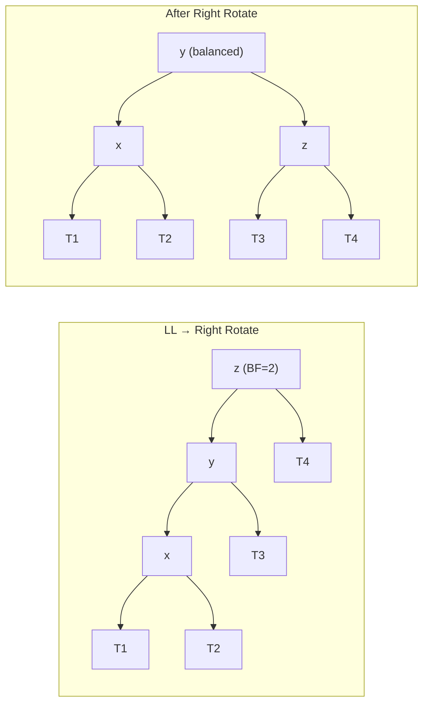
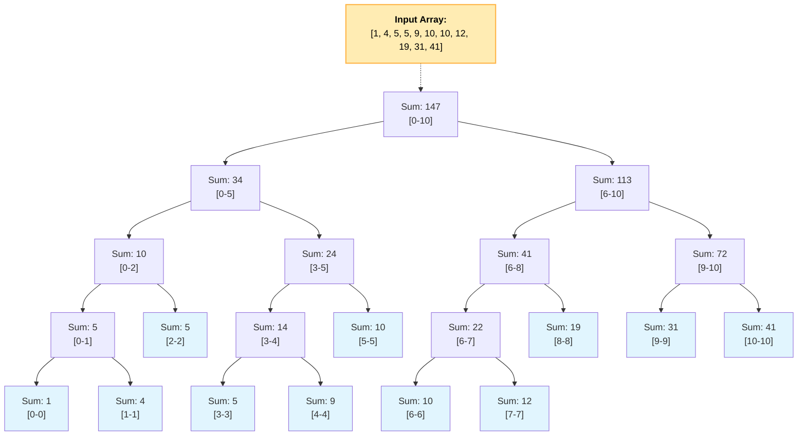
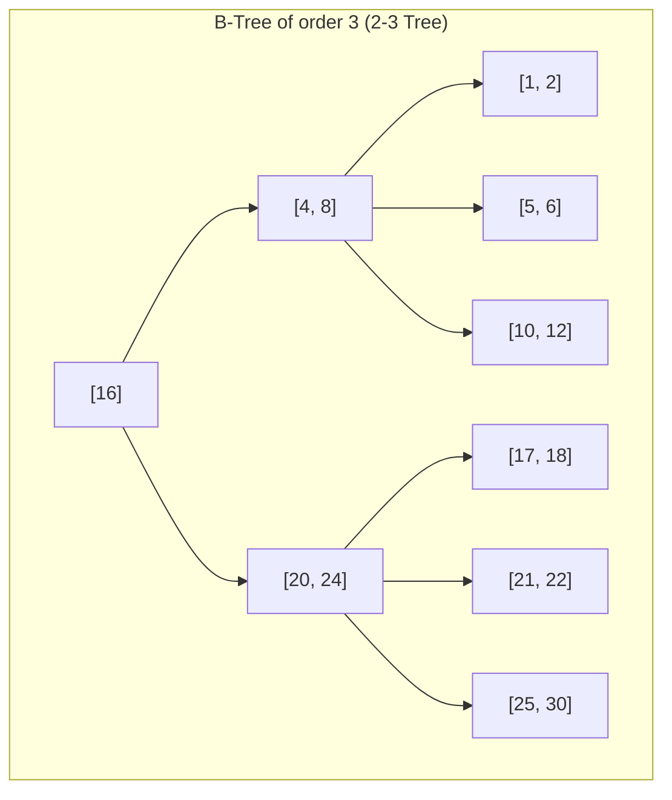
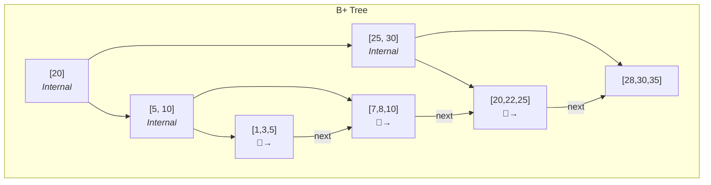
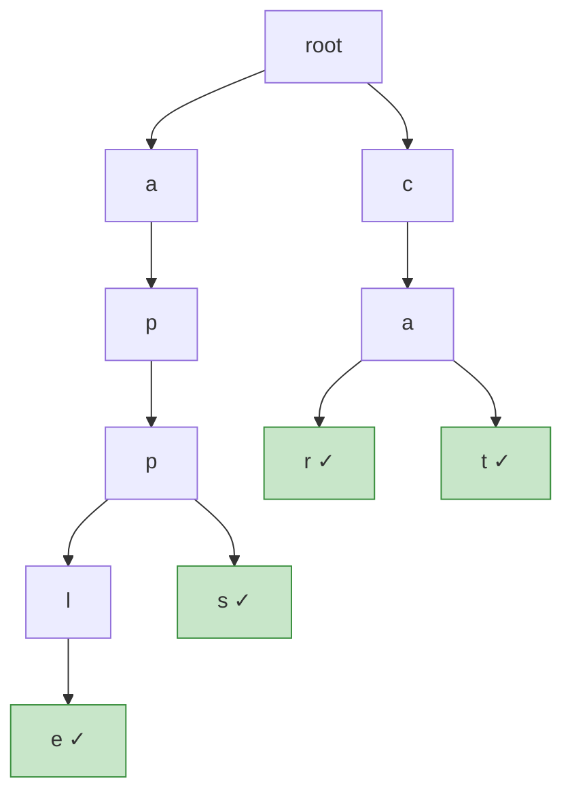

# Algorithms and Data Structures

## String


### 1\. Hashing & Frequency Counting

This is the most frequent pattern. The core idea is to use a hash map (or an array as a frequency map) to store counts of characters or words.

**Key Data Structures:** `HashMap<Character, Integer>`, `int[26]`, `int[128]`, `HashSet`

**Common Problems:**

  * Anagram detection (`s1` and `s2` have the same character counts).
  * Isomorphic strings (character mapping).
  * Finding duplicates or the first unique character.

**[Top K Frequent Words](https://leetcode.com/problems/top-k-frequent-words/)**

This problem is a classic combination of two patterns: **Hashing + Heap**.

1.  **Hashing**: Use a `HashMap<String, Integer>` to store the frequency of each word.
2.  **Heap (`PriorityQueue`)**: Use a `PriorityQueue` to find the top `k` elements efficiently. You need a custom comparator to handle the sorting logic.

*Your code snippet is perfect for this:*

```java
// Custom comparator for the PriorityQueue
// 1. Sort by frequency in descending order.
// 2. If frequencies are equal, sort alphabetically (lexicographically) in ascending order.
Queue<String> queue = new PriorityQueue<>((a, b) -> {
    if (map.get(a).equals(map.get(b))) {
        return a.compareTo(b); 
    } else {
        return map.get(b) - map.get(a);
    }
});
```

### 2\. Two Pointers

This technique uses two pointers to iterate through the string, often leading to optimal $O(N)$ time and $O(1)$ space solutions.

**Common Approaches:**

  * **Converging Pointers**: Pointers start at opposite ends and move toward the center (e.g., palindrome check).
  * **Diverging Pointers**: Pointers start at the same place and move outwards (e.g., expand around center).
  * **Read/Write Pointers**: One pointer reads ahead while the other writes to modify the string/array in place.

**[String Compression](https://leetcode.com/problems/string-compression/)**

This is a perfect example of the **Read/Write Pointers** approach.

  * A `read` pointer scans the array to find groups of consecutive identical characters.
  * A `write` pointer stays at the position where the next compressed character and count should be written.
  * Your description is spot on: "Count the adjacent characters using a forward inner while loop then add the character and count to the result."

### 3\. Palindrome-Specific Techniques

**[Palindromic Substrings](https://leetcode.com/problems/palindromic-substrings/)**

Your approach is the standard and most efficient one for this problem.

  * **Technique**: **Expand Around Center**.
  * **Logic**: Every palindrome has a center. This center can be a single character (for odd-length palindromes like "racecar") or the space between two characters (for even-length palindromes like "aabbaa"). We iterate through all possible centers and expand outwards as long as the characters match.

*Your code snippet is an excellent implementation:*

```java
int countSubstrings(String s) {
    int n = s.length();
    int ans = 0;
    for (int i = 0; i < n; i++) {
        // Expand around a single character center (odd length)
        ans += expandAndCount(s, i, i);
        // Expand around a two-character center (even length)
        ans += expandAndCount(s, i, i + 1);
    }
    return ans;
}

int expandAndCount(String s, int left, int right) {
    int count = 0;
    while (left >= 0 && right < s.length() && s.charAt(left) == s.charAt(right)) {
        count++; // Found a valid palindrome
        left--;
        right++;
    }
    return count;
}
```

### 4\. Sliding Window

A powerful technique for finding a substring that satisfies a certain condition. A "window" is maintained by two pointers, and it expands and contracts as it moves through the string.

**Common Problems:**

  * Longest Substring Without Repeating Characters.
  * Minimum Window Substring.
  * Finding all anagrams of a pattern string.

### 5\. Advanced Techniques & Unique Patterns

**[Shortest Distance to a Character](https://leetcode.com/problems/shortest-distance-to-a-character/)**

This problem has several clever solutions.

  * **Your Approach (TreeSet)**: This is an interesting solution.

    1.  Store the indices of the target character in a `TreeSet`.
    2.  For each index `i` in the string, use `TreeSet.floor(i)` and `TreeSet.ceiling(i)` to find the nearest target indices on both sides. This works and has a time complexity of $O(N \log K)$, where K is the number of target characters.

  * **Alternative Common Pattern (Two-Pass)**: This is an important $O(N)$ pattern to know.

    1.  **Left-to-Right Pass**: Iterate from left to right. `dist[i]` is the distance from `i` to the *previous* occurrence of the target character. `dist[i] = dist[i-1] + 1`.
    2.  **Right-to-Left Pass**: Iterate from right to left. Update `dist[i]` by comparing with the distance to the *next* occurrence. `dist[i] = min(dist[i], dist[i+1] + 1)`.

### 6\. Dynamic Programming on Strings

Used for optimization problems where the solution is built upon solutions to subproblems. Usually involves a 2D `dp` table.

**Common Problems:**

  * **Longest Common Subsequence**: `dp[i][j]` = LCS of `s1[0..i]` and `s2[0..j]`.
  * **Edit Distance**: `dp[i][j]` = min edits to make `s1[0..i]` equal to `s2[0..j]`.
  * **Word Break**: `dp[i]` = true if `s[0..i]` can be segmented.

### 7\. Backtracking & Recursion

Used for generating all possible combinations or permutations of strings that satisfy a condition.

**Common Problems:**

  * Generate Parentheses.
  * Letter Combinations of a Phone Number.
  * Palindrome Partitioning.

### 8\. Tries (Prefix Trees)

A specialized tree data structure used for problems involving prefixes and dictionaries.

**Common Problems:**

  * Implement an Autocomplete System.
  * Word Search II (finding words from a dictionary in a 2D grid).

---

## Binary Search

### **Standard Binary Search & Its Variations**

#### Template 1: Exact Match (`while (low <= high)`)

This template is ideal for when you are searching for an exact element and can exit as soon as it's found. The loop terminates when `low > high`.

```java
int low = 0, high = nums.length - 1;
while (low <= high) {
    int mid = low + (high - low) / 2;
    if (nums[mid] == target) {
        return mid; // Found
    } else if (nums[mid] < target) {
        low = mid + 1;
    } else {
        high = mid - 1;
    }
}
return -1; // Not found
```


#### The "Leftmost" Boundary (Round Down)

This template is designed to find the `lower_bound`—the index of the first element that is greater than or equal to the target.

```java
// Finds the FIRST element >= target
int low = 0, high = nums.length - 1;
while (low < high) {
    int mid = low + (high - low) / 2; // Standard mid, rounds down
    if (nums[mid] >= target) {
        high = mid;
    } else {
        low = mid + 1;
    }
}
// After loop, low == high. Check if this candidate is the target.
return nums.length > 0 && nums[low] == target ? low : -1;
```

**Use Cases for Template 2:**

1.  **The first occurrence of an element.**
2.  **The `ceil` of a number:** Finding the smallest element `>= target`.
3.  **Search Insert Position:** This template directly solves this problem (the final `low` is the answer).
4.  Any problem that requires finding the **leftmost boundary** or the first time a condition becomes true.


#### The "Rightmost" Boundary (Round Up)

This template is designed to find the index of the last element that is less than or equal to the target.

```java
// Finds the LAST element <= target
int low = 0, high = nums.length - 1;
while (low < high) {
    int mid = low + (high - low + 1) / 2; // CRITICAL: Rounds UP
    if (nums[mid] <= target) {
        low = mid;
    } else {
        high = mid - 1;
    }
}
// After loop, low == high. Check if this candidate is the target.
return nums.length > 0 && nums[low] == target ? low : -1;
```

**Use Cases for Template 3:**

1.  **The last occurrence of an element.**
2.  **The `floor` of a number:** Finding the largest element `<= target`.
3.  Any problem that requires finding the **rightmost boundary** or the last time a condition is true.

### Binary Search on the Answer

This is a powerful technique for optimization problems that ask for the "minimum possible" or "maximum possible" value that satisfies a certain condition.

**Explanation:**
Instead of searching for an element in an array, you binary search on the *range of possible answers*. For each `mid` value (which is a potential answer), you have a validation function `isPossible(mid)` that checks if it's feasible to achieve the goal with that value. The search space is monotonic: if an answer `X` is possible, all answers "better" than `X` (e.g., `X+1` for maximization, `X-1` for minimization) are also possible.

**Template:**

1.  **Define the Search Space:** Determine the `low` (minimum possible answer) and `high` (maximum possible answer).
2.  **Create a Validation Function:** `boolean isPossible(value)`.
3.  **Binary Search:**
    * If `isPossible(mid)` is true, it means `mid` is a potential answer. We try for a "better" one (e.g., smaller for minimization problems, so `high = mid - 1`).
    * If `isPossible(mid)` is false, `mid` is not a valid answer, so we must consider "worse" answers (e.g., `low = mid + 1`).

**Examples:**

* [Koko Eating Bananas](https://leetcode.com/problems/koko-eating-bananas/):
    * **Answer Range:** Speed `k` can be from `1` to `max(piles)`.
    * **`isPossible(speed)`:** Can Koko eat all bananas within `h` hours at the given `speed`?
* [Capacity to Ship Packages Within D Days](https://leetcode.com/problems/capacity-to-ship-packages-within-d-days/):
    * **Answer Range:** Capacity can be from `max(weights)` to `sum(weights)`.
    * **`isPossible(capacity)`:** Can all packages be shipped within `D` days with the given `capacity`?
* [Minimum Number of Days to Make m Bouquets](https://leetcode.com/problems/minimum-number-of-days-to-make-m-bouquets/description/):
    * **Answer Range:** Days can be from `1` to `max(bloomDay)`.
    * **`isPossible(days)`:** Can we make `m` bouquets if we wait for the given number of `days`?

### Searching in Rotated Sorted Arrays

This pattern applies to an array that was sorted and then rotated some number of times. The array consists of two sorted subarrays.

**Explanation:**

At each step, perform two checks:

1.  **Find the sorted half:** Is `[low...mid]` or `[mid...high]` sorted?
    * For `nums = [4, 5, 6, 7, 0, 1, 2]`, if `mid` points to `7`, the left half `[4, 5, 6, 7]` is the sorted one.

2.  **Locate the target:** Is the `target` within the range of that sorted half? If yes, search it; if no, search the other half.
    * If `target = 5`, it is within the sorted half's range `[4...7]`, so you search that part.
    * If `target = 1`, it is not in that range, so you must search the other half `[0, 1, 2]`.

**Template:**

```java
while (low <= high) {
    int mid = low + (high - low) / 2;
    if (nums[mid] == target) return mid;

    // Check if the left half (low...mid) is sorted
    if (nums[low] <= nums[mid]) {
        if (target >= nums[low] && target < nums[mid]) {
            high = mid - 1; // Target is in the sorted left half
        } else {
            low = mid + 1;  // Target is in the right half
        }
    } 
    // Otherwise, the right half (mid...high) must be sorted
    else {
        if (target > nums[mid] && target <= nums[high]) {
            low = mid + 1; // Target is in the sorted right half
        } else {
            high = mid - 1; // Target is in the left half
        }
    }
}
```

**Examples:**

* [Search in Rotated Sorted Array](https://leetcode.com/problems/search-in-rotated-sorted-array/)
* [Find Minimum in Rotated Sorted Array](https://leetcode.com/problems/find-minimum-in-rotated-sorted-array/)
* [Find Minimum in Rotated Sorted Array (with Duplicates)](https://leetcode.com/problems/find-minimum-in-rotated-sorted-array-ii/)

### Searching on Monotonic(Peaks/Valleys)

This pattern is used on arrays where values increase and then decrease (a "mountain" or bitonic array), and the goal is to find the peak element.

**Explanation:**

The strategy is to find the peak by checking the "slope" at the midpoint. By comparing `nums[mid]` with its right neighbor `nums[mid+1]`, you can tell if you are on an upward or downward slope, allowing you to discard half the array.

Let's use the example `nums = [0, 2, 4, 6, 3, 1]`. The peak is `6`.

* **Initial Step:** `low = 0`, `high = 5`. Let's say `mid = 2` (`nums[mid] = 4`).

    * We compare `nums[mid]` (4) with `nums[mid+1]` (6).
    * Since `4 < 6`, we are on the **uphill** slope. This means the peak must be to the right of `mid`.
    * **Action:** We discard the left half by setting `low = mid + 1`.

* **Next Step:** The search space is now `[3, 5]`. Let's say `mid = 4` (`nums[mid] = 3`).

    * We compare `nums[mid]` (3) with `nums[mid+1]` (1).
    * Since `3 > 1`, we are on the **downhill** slope. This means `mid` could be the peak, or the peak is to its left.
    * **Action:** We discard the right half by setting `high = mid`.

The loop continues until `low` and `high` converge on the single index of the peak element.

**Template:**

This template uses the `while (low < high)` structure, which is perfect for converging on a single point.

```java
/**
 * Finds the index of a peak element in a mountain array.
 */
int findPeakElement(int[] nums) {
    int low = 0;
    int high = nums.length - 1;

    while (low < high) {
        int mid = low + (high - low) / 2;
        
        // Check the slope at mid
        if (nums[mid] < nums[mid + 1]) {
            // Uphill slope: Peak is to the right of mid.
            low = mid + 1;
        } else {
            // Downhill slope: mid could be the peak, or the peak is to the left.
            high = mid;
        }
    }
    
    // The loop terminates when low == high, which is the index of the peak.
    return low;
}
```


### Searching in 2D Matrices

Binary search can be adapted to 2D matrices that have specific sorting properties.

**Explanation:**
There are two main sub-patterns:

1.  **Matrix as a Flattened 1D Array:** If the matrix is sorted such that the last element of row `i` is less than the first element of row `i+1`, you can treat the entire `M x N` matrix as a single sorted array of length `M*N`. An index `mid` in this virtual array maps to `matrix[mid / N][mid % N]`.

    * **Example:** [Search a 2D Matrix](https://leetcode.com/problems/search-a-2d-matrix/)

2.  **Staircase / Saddleback Search:** If each row is sorted and each column is sorted, you can't flatten it. Instead, start at a strategic corner (e.g., top-right or bottom-left).

    * From the **top-right** corner:
        * If `target` is smaller than the current element, it can't be in this column (all elements below are larger), so move left (`col--`).
        * If `target` is larger, it can't be in this row (all elements to the left are smaller), so move down (`row++`).
    * This approach eliminates one row or one column at each step.
    * **Example:** [Search a 2D Matrix II](https://leetcode.com/problems/search-a-2d-matrix-ii/)

### Binary Search on Real Numbers**

This pattern is for finding a value in a continuous range, like the square root of a number, where absolute precision is needed.

**Explanation:**
The core logic is the same, but the termination condition changes. Instead of the loop ending when `low` and `high` cross, it runs for a fixed number of iterations (e.g., 100) or until the search space `(high - low)` is smaller than a tiny epsilon value (e.g., `1e-7`). This guarantees the answer is found to the desired precision.

**Template (for Square Root):**

```java
double low = 0, high = x;
double epsilon = 1e-7; // Desired precision

while ((high - low) > epsilon) {
    double mid = low + (high - low) / 2;
    if (mid * mid > x) {
        high = mid;
    } else {
        low = mid;
    }
}
// 'low' or 'high' is the answer to the required precision
```

**Example:**

* [Minimize Max Distance to Gas Station](https://leetcode.com/problems/minimize-max-distance-to-gas-station/description/)

---

## Linked List

### **The Two Pointer Technique (Fast & Slow)**

### **The Sentinel (Dummy) Node**

### **Reversing a Linked List**

### **Using a Hash Map for Visited Nodes**

### **Merging & Splitting (Divide and Conquer)**

### **Cycle Analysis (Advanced Two Pointers)**


---

## Stack


### **LIFO Basics (Reversal and "Undo")**


### **Complex Simulation & State Tracking**


### **Parentheses, Paths, and Expression Evaluation**


### Three Main Patterns of Problems

You can generally group these problems into three categories of increasing complexity.

#### 1. Validation Problems (e.g., "Valid Parentheses")

* **The Question:** Is this sequence valid?
* **The Strategy:** Use the stack as a checklist of required closing items.
    * **Push Condition:** When you see an "opening" character (`(`, `{`, `[`), push its required "closing" counterpart onto the stack.
    * **Pop Condition (The Trigger):** When you see a "closing" character.
    * **Pop Logic:** Pop from the stack and check if the popped character matches the current closing character. If it doesn't match, or if the stack was empty, the string is invalid.
    * **Final Check:** After the loop, the stack must be empty. If it's not, there are unfinished tasks (unclosed parentheses), and the string is invalid.

#### 2. Processing & Transformation Problems (Your `RemoveOutermostParentheses` is a perfect example)

* **The Question:** Simplify, process, or remove parts of a sequence.
* **The Strategy:** Use the stack to track the "current valid state" or "depth." Your decision for the current character often depends on the state of the stack.
    * **Push/Pop Conditions:** These are defined by the problem. In your code, you always push `(` and pop `)`.
    * **Core Logic:** The most important part is the condition under which you add to your result. Your code brilliantly uses the stack's size as a proxy for depth.
        * For an opening `(`: You check `if (!stack.isEmpty())`. This asks, "Am I already inside another pair of parentheses?" If yes, this `(` is not an outermost one, so we keep it.
        * For a closing `)`: You `pop()` first, then check `if (!stack.isEmpty())`. This asks, "After closing this pair, am I still inside another pair?" If yes, this `)` was not an outermost one, so we keep it.
    * **Another Example:** For "Simplify Path", you push directory names. If you see `..`, you pop. If you see `.`, you do nothing. The final stack contents are used to build the result.

#### 3. Expression Evaluation Problems (e.g., "Basic Calculator")

* **The Question:** Calculate the result of an arithmetic expression.
* **The Strategy:** This is the most advanced pattern and often requires **two stacks**: one for numbers (operands) and one for operators.
    * **The Challenge:** You have to handle operator precedence (`*` and `/` before `+` and `-`).
    * **The Logic:**
        1.  When you see a number, push it to the `number stack`.
        2.  When you see an operator, look at the top of the `operator stack`.
        3.  If the operator on the stack has higher or equal precedence than your current operator, you must perform that operation first. Pop the operator, pop two numbers, calculate the result, and push the result back onto the `number stack`.
        4.  Repeat this until the operator on the stack has lower precedence, then push your current operator.
        5.  Parentheses are handled by recursively solving the sub-expression or by pushing them onto the operator stack to create a "wall" that ignores precedence until a closing parenthesis is found.

### **Monotonic Stack (Next/Previous Greater/Smaller)**


### A Mental Checklist for Any New Problem

When you encounter a new problem of this type, ask yourself these questions:

1.  **What am I putting on the stack?** (Characters, numbers, indices?)
2.  **What is the "Push" condition?** (When do I add to the stack?)
3.  **What is the "Trigger" for a reaction?** (What character makes me look at the stack? A `)`, an operator, etc.?)
4.  **What is the "Pop" logic?** (When the trigger occurs, what do I do? Do I just pop? Do I compare the popped item? Do I use it in a calculation?)
5.  **How is the final result built?** (Is it a boolean? Is it the last number on the stack? Do I build a string from the stack's contents?)

---

## Sliding Widow

### **Fixed-Size Sliding Window**

### **Variable-Size Sliding Window (Two Pointers)**

### **Counting Subarrays with the "At Most K" Trick**

### **Sliding Window with an Auxiliary Data Structure**


---
## Trees

### **TRAVERSALS**

`Note : Visualize with 3 nodes`

  1. **Inorder Iterative(Left-Root-Right)**  

  - Initialize `current variable` with root, push left node until its null
  - Pop last left node process it, then initialize current variable with right node

  2. **Preorder Iterative(Left-Root-Right)**

  - First add root to stack
  - While stack is not empty pop from stack process the element, then push right node and then left node

  3. **Postorder Iterative(Left-Root-Right)**
  
  - Create two stack input and output
  - Push root to a input stack, the pop from stack, then push the element to ouput stack
  - Push left node to input stack and right node to input stack


### **BINARY SEARCH TREE (BST)**

A Binary Search Tree is a node-based binary tree with a special ordering property that allows for fast lookups, insertions, and deletions.

#### Properties

  * **BST Invariant:** For any given node `N`:
      * All values in its **left subtree** are **less than** `N`'s value.
      * All values in its **right subtree** are **greater than** `N`'s value.
      * Both its left and right subtrees must also be binary search trees.
  * **No Duplicate Nodes:** A standard BST does not allow duplicate values.
  * **In-order Traversal:** An in-order traversal of a BST yields its nodes' values in **sorted ascending order**.
  * **Time Complexity:** For a balanced BST, operations like search, insertion, and deletion take $O(\log n)$ time. In the worst case (a skewed or degenerate tree), they take $O(n)$ time.

#### Operations

**Insertion**

To insert a value, you traverse the tree from the root. If the new value is less than the current node's value, you go left; otherwise, you go right. You continue until you reach a `null` spot, where you insert the new node.

```java
TreeNode insert(TreeNode root, int key) {
    if (root == null) {
        return new TreeNode(key);
    }
    if (key < root.val) {
        // Recursively insert into the left subtree
        root.left = insert(root.left, key);
    } else if (key > root.val) {
        // Recursively insert into the right subtree
        root.right = insert(root.right, key);
    }
    // Return the (possibly modified) root of the subtree
    return root;
}
```

**Deletion**

Deletion is more complex and handles three cases for the node to be deleted:

1.  **No children (leaf node):** Simply remove the node.
2.  **One child:** Replace the node with its child.
3.  **Two children:** Find the node's **in-order successor** (the smallest value in its right subtree), replace the node's value with the successor's value, and then recursively delete the successor node.


```java
TreeNode delete(TreeNode root, int key) {
    if (root == null) return null;

    if (key < root.val) {
        root.left = delete(root.left, key);
    } else if (key > root.val) {
        root.right = delete(root.right, key);
    } else { // Found the node to delete
        // Case 1 & 2: Node with one or no child
        if (root.left == null) return root.right;
        if (root.right == null) return root.left;

        // Case 3: Node with two children
        // Find the in-order successor (smallest value in the right subtree)
        TreeNode successor = findMin(root.right);
        root.val = successor.val; // Replace node's value with successor's
        root.right = delete(root.right, root.val); // Delete the successor
    }
    return root;
}

// Helper to find the minimum value node in a subtree
TreeNode findMin(TreeNode node) {
    while (node.left != null) {
        node = node.left;
    }
    return node;
}
```

### **AVL Tree**

An **AVL Tree** (Adelson-Velsky & Landis) is a self-balancing BST where the **balance factor** of every node is in $\{-1, 0, 1\}$.

$$\text{Balance Factor}(node) = \text{height}(node.left) - \text{height}(node.right)$$

After every insertion or deletion, the tree checks balance factors bottom-up and applies **rotations** to restore balance. This guarantees $O(\log n)$ for search, insert, and delete.

**Four Rotation Cases:**

| Case | Trigger | Rotation |
|------|---------|----------|
| Left-Left (LL) | BF > 1 and inserted in left subtree of left child | Right Rotate |
| Right-Right (RR) | BF < -1 and inserted in right subtree of right child | Left Rotate |
| Left-Right (LR) | BF > 1 and inserted in right subtree of left child | Left Rotate on left child, then Right Rotate |
| Right-Left (RL) | BF < -1 and inserted in left subtree of right child | Right Rotate on right child, then Left Rotate |



```java
public class AVLTree {

    private static class Node {
        int key, height;
        Node left, right;

        Node(int key) {
            this.key = key;
            this.height = 1; // new node is a leaf with height 1
        }
    }

    private Node root;

    // ── Height & Balance Factor ──────────────────────────────────
    private int height(Node n) {
        return (n == null) ? 0 : n.height;
    }

    private int balanceFactor(Node n) {
        return (n == null) ? 0 : height(n.left) - height(n.right);
    }

    private void updateHeight(Node n) {
        n.height = 1 + Math.max(height(n.left), height(n.right));
    }

    // ── Rotations ────────────────────────────────────────────────
    //
    //  Right Rotate (y):         Left Rotate (x):
    //       y            x            x            y
    //      / \    →     / \          / \    →     / \
    //     x   T3      T1   y       T1   y      x   T3
    //    / \              / \          / \     / \
    //  T1   T2          T2   T3     T2   T3  T1  T2
    //
    private Node rightRotate(Node y) {
        Node x = y.left;
        Node T2 = x.right;

        x.right = y;       // rotate
        y.left = T2;

        updateHeight(y);   // update y first (it's now lower)
        updateHeight(x);
        return x;          // new root of this subtree
    }

    private Node leftRotate(Node x) {
        Node y = x.right;
        Node T2 = y.left;

        y.left = x;        // rotate
        x.right = T2;

        updateHeight(x);   // update x first (it's now lower)
        updateHeight(y);
        return y;           // new root of this subtree
    }

    // ── Rebalance ────────────────────────────────────────────────
    // Called after insert/delete. Checks BF and applies the
    // appropriate single or double rotation.
    private Node rebalance(Node node) {
        updateHeight(node);
        int bf = balanceFactor(node);

        // Left-heavy
        if (bf > 1) {
            if (balanceFactor(node.left) < 0) {
                node.left = leftRotate(node.left); // LR case
            }
            return rightRotate(node);              // LL case
        }

        // Right-heavy
        if (bf < -1) {
            if (balanceFactor(node.right) > 0) {
                node.right = rightRotate(node.right); // RL case
            }
            return leftRotate(node);                  // RR case
        }

        return node; // balanced
    }

    // ── Insert ───────────────────────────────────────────────────
    public void insert(int key) {
        root = insert(root, key);
    }

    private Node insert(Node node, int key) {
        if (node == null) return new Node(key);

        if (key < node.key)      node.left  = insert(node.left, key);
        else if (key > node.key) node.right = insert(node.right, key);
        else                     return node; // duplicate keys not allowed

        return rebalance(node);
    }

    // ── Delete ───────────────────────────────────────────────────
    public void delete(int key) {
        root = delete(root, key);
    }

    private Node delete(Node node, int key) {
        if (node == null) return null;

        if (key < node.key)      node.left  = delete(node.left, key);
        else if (key > node.key) node.right = delete(node.right, key);
        else {
            // Found node to delete
            if (node.left == null)  return node.right;
            if (node.right == null) return node.left;

            // Two children: replace with in-order successor (smallest in right subtree)
            Node successor = node.right;
            while (successor.left != null) successor = successor.left;
            node.key = successor.key;
            node.right = delete(node.right, successor.key);
        }

        return rebalance(node);
    }

    // ── Search ───────────────────────────────────────────────────
    public boolean search(int key) {
        Node curr = root;
        while (curr != null) {
            if (key == curr.key)      return true;
            else if (key < curr.key)  curr = curr.left;
            else                      curr = curr.right;
        }
        return false;
    }
}
```

**Walkthrough — Insert 10, 20, 30, 25, 28:**

```
Insert 10:       Insert 20:        Insert 30 (RR):     Insert 25:          Insert 28 (RL at 30):
  10                10                 20                  20                    20
                      \               /  \                /  \                  /  \
                      20            10    30            10    30              10    28
                                                            /                    /  \
                                                          25                  25    30
```

**Complexity:**

| Operation | Time | Space |
|-----------|------|-------|
| Search | $O(\log n)$ | $O(1)$ iterative |
| Insert | $O(\log n)$ | $O(\log n)$ stack |
| Delete | $O(\log n)$ | $O(\log n)$ stack |

**When to use:** When you need guaranteed $O(\log n)$ lookups and the dataset has frequent lookups relative to inserts/deletes. AVL trees are more strictly balanced than Red-Black trees, so lookups are slightly faster but insertions/deletions may be slightly slower due to more rotations.


### **RED-BLACK TREE**

A **Red-Black Tree** is a self-balancing BST where each node stores an extra bit: its **color** (Red or Black). The coloring rules ensure the tree stays approximately balanced.

**Properties (Invariants):**

1. Every node is either **Red** or **Black**.
2. The **root** is always Black.
3. Every `null` leaf (NIL) is Black.
4. If a node is Red, **both its children must be Black** (no two consecutive reds).
5. Every path from a node to its descendant NIL leaves has the **same number of Black nodes** (black-height).

These rules guarantee: $h \le 2 \log_2(n+1)$, so all operations are $O(\log n)$.

**Fixing Violations After Insert (new node is always Red):**

| Case | Uncle Color | Action |
|------|-------------|--------|
| 1 | Uncle is **Red** | Recolor parent & uncle to Black, grandparent to Red. Move up. |
| 2 | Uncle is **Black**, node is inner child | Rotate node's parent (transforms to Case 3) |
| 3 | Uncle is **Black**, node is outer child | Rotate grandparent + recolor |

```java
public class RedBlackTree {

    private static final boolean RED   = true;
    private static final boolean BLACK = false;

    private static class Node {
        int key;
        boolean color;
        Node left, right, parent;

        Node(int key) {
            this.key   = key;
            this.color = RED; // new nodes are always Red
        }
    }

    private Node root;
    private final Node NIL; // sentinel for null leaves

    public RedBlackTree() {
        NIL = new Node(0);
        NIL.color = BLACK;
        NIL.left = NIL.right = NIL.parent = NIL;
        root = NIL;
    }

    // ── Rotations ────────────────────────────────────────────────
    private void leftRotate(Node x) {
        Node y = x.right;
        x.right = y.left;
        if (y.left != NIL) y.left.parent = x;

        y.parent = x.parent;
        if (x.parent == NIL)           root = y;
        else if (x == x.parent.left)   x.parent.left = y;
        else                           x.parent.right = y;

        y.left = x;
        x.parent = y;
    }

    private void rightRotate(Node y) {
        Node x = y.left;
        y.left = x.right;
        if (x.right != NIL) x.right.parent = y;

        x.parent = y.parent;
        if (y.parent == NIL)           root = x;
        else if (y == y.parent.left)   y.parent.left = x;
        else                           y.parent.right = x;

        x.right = y;
        y.parent = x;
    }

    // ── Insert ───────────────────────────────────────────────────
    public void insert(int key) {
        Node z = new Node(key);
        z.left = z.right = z.parent = NIL;

        // Standard BST insert
        Node parent = NIL, curr = root;
        while (curr != NIL) {
            parent = curr;
            if (key < curr.key)      curr = curr.left;
            else if (key > curr.key) curr = curr.right;
            else                     return; // duplicate
        }
        z.parent = parent;
        if (parent == NIL)           root = z;
        else if (key < parent.key)   parent.left = z;
        else                         parent.right = z;

        // Fix Red-Black violations
        insertFixup(z);
    }

    // ── Insert Fixup ─────────────────────────────────────────────
    // We only violate Property 4 (red parent + red child).
    // Walk up the tree, handling 3 symmetric cases per side.
    private void insertFixup(Node z) {
        while (z.parent.color == RED) {
            if (z.parent == z.parent.parent.left) {
                Node uncle = z.parent.parent.right;

                if (uncle.color == RED) {
                    // Case 1: Uncle is Red → recolor and move up
                    z.parent.color = BLACK;
                    uncle.color = BLACK;
                    z.parent.parent.color = RED;
                    z = z.parent.parent;
                } else {
                    if (z == z.parent.right) {
                        // Case 2: z is right child → left rotate to make it Case 3
                        z = z.parent;
                        leftRotate(z);
                    }
                    // Case 3: z is left child → right rotate grandparent + recolor
                    z.parent.color = BLACK;
                    z.parent.parent.color = RED;
                    rightRotate(z.parent.parent);
                }
            } else {
                // Mirror: parent is right child of grandparent
                Node uncle = z.parent.parent.left;

                if (uncle.color == RED) {
                    z.parent.color = BLACK;
                    uncle.color = BLACK;
                    z.parent.parent.color = RED;
                    z = z.parent.parent;
                } else {
                    if (z == z.parent.left) {
                        z = z.parent;
                        rightRotate(z);
                    }
                    z.parent.color = BLACK;
                    z.parent.parent.color = RED;
                    leftRotate(z.parent.parent);
                }
            }
        }
        root.color = BLACK; // ensure root is always Black
    }

    // ── Search ───────────────────────────────────────────────────
    public boolean search(int key) {
        Node curr = root;
        while (curr != NIL) {
            if (key == curr.key)      return true;
            else if (key < curr.key)  curr = curr.left;
            else                      curr = curr.right;
        }
        return false;
    }
}
```

**Walkthrough — Insert 10, 20, 30, 15:**

```
Insert 10 (root→Black):     Insert 20:             Insert 30 (Case 3):     Insert 15 (Case 1):
    10(B)                     10(B)                     20(B)                   20(B)
                                \                      /    \                  /    \
                               20(R)                10(R)  30(R)           10(B)  30(B)
                                                                             \
                                                                            15(R)
```

**AVL vs Red-Black Tree:**

| Property | AVL Tree | Red-Black Tree |
|----------|----------|----------------|
| Balance | Strictly balanced (BF ∈ {-1,0,1}) | Approximately balanced (h ≤ 2 log n) |
| Rotations per insert | Up to $O(\log n)$ | At most 2 |
| Rotations per delete | Up to $O(\log n)$ | At most 3 |
| Lookup speed | Slightly faster | Slightly slower |
| Insert/Delete speed | Slightly slower | Slightly faster |
| Use case | Read-heavy workloads | Write-heavy workloads (Java `TreeMap`, Linux kernel) |


### **SEGMENT TREE**



**How it works:**
- Each node stores an aggregate (here: sum) of a contiguous subarray.
- The root covers the entire array `[0, n-1]`.
- Its left child covers `[0, mid]`, right child covers `[mid+1, n-1]`, and so on recursively until each leaf covers a single element.

**Tree layout (stored in a flat array, 0-indexed):**
- Node `i`'s left child = `2*i + 1`
- Node `i`'s right child = `2*i + 2`
- We allocate `4*n` space to safely hold all nodes.

**Time:** Build $O(n)$, Query $O(\log n)$, Update $O(\log n)$

```java
public class SegmentTree {

    private final int[] tree; // internal array storing node values
    private final int n;      // size of the original array

    public SegmentTree(int[] arr) {
        n = arr.length;
        tree = new int[4 * n]; // 4*n guarantees enough space for any n
        buildTree(arr, 0, 0, n - 1);
    }

    // ── BUILD ────────────────────────────────────────────────────
    // Recursively construct the tree bottom-up.
    //   node  = index in tree[] for the current segment
    //   start = left boundary of the segment this node covers
    //   end   = right boundary of the segment this node covers
    //
    // Base case: leaf (start == end) → store the array element.
    // Recursive: build left & right children, then merge (sum).
    // ─────────────────────────────────────────────────────────────
    public void buildTree(int[] arr, int node, int start, int end) {
        if (start == end) {
            // Leaf: covers exactly one element arr[start]
            tree[node] = arr[start];
        } else {
            int mid = (start + end) / 2;
            buildTree(arr, 2 * node + 1, start, mid);      // left child
            buildTree(arr, 2 * node + 2, mid + 1, end);    // right child
            tree[node] = tree[2 * node + 1] + tree[2 * node + 2]; // merge
        }
    }

    // ── QUERY ────────────────────────────────────────────────────
    // Find the sum of elements in range [l, r].
    //
    // Three cases at each node covering [start, end]:
    //   1. NO OVERLAP:    [start, end] completely outside [l, r] → return 0
    //   2. TOTAL OVERLAP: [start, end] completely inside [l, r]  → return tree[node]
    //   3. PARTIAL OVERLAP: split into children and combine
    // ─────────────────────────────────────────────────────────────
    public int query(int l, int r) {
        return query(0, 0, n - 1, l, r);
    }

    private int query(int node, int start, int end, int l, int r) {
        if (start > r || end < l) return 0;            // no overlap
        if (start >= l && end <= r) return tree[node];  // total overlap

        int mid = (start + end) / 2;
        int leftSum  = query(2 * node + 1, start, mid, l, r);
        int rightSum = query(2 * node + 2, mid + 1, end, l, r);
        return leftSum + rightSum;
    }

    // ── POINT UPDATE ─────────────────────────────────────────────
    // Set arr[index] = value, then propagate changes up the tree.
    //
    // Walk from root toward the leaf that holds arr[index].
    // At each level, go left or right depending on where index falls.
    // Once at the leaf, set its value. On the way back up,
    // recalculate each ancestor as the sum of its two children.
    // ─────────────────────────────────────────────────────────────
    public void update(int index, int value) {
        update(0, 0, n - 1, index, value);
    }

    private void update(int node, int start, int end, int index, int value) {
        if (start == end) {
            tree[node] = value; // leaf node — update
            return;
        }

        int mid = (start + end) / 2;
        if (index <= mid) {
            update(2 * node + 1, start, mid, index, value);     // go left
        } else {
            update(2 * node + 2, mid + 1, end, index, value);   // go right
        }
        tree[node] = tree[2 * node + 1] + tree[2 * node + 2];  // recalculate
    }
}
```


### **B-TREE**

A **B-Tree** of order $m$ is a self-balancing multi-way search tree optimized for systems that read/write large blocks of data (databases, file systems). Unlike binary trees, each node can hold **multiple keys** and have **multiple children**, minimizing disk I/O by keeping the tree height very small.

**Properties of a B-Tree of order $m$:**

| Property | Rule |
|----------|------|
| Max keys per node | $m - 1$ |
| Max children per node | $m$ |
| Min keys (non-root internal) | $\lceil m/2 \rceil - 1$ |
| Min children (non-root internal) | $\lceil m/2 \rceil$ |
| Root | At least 1 key (if non-empty) |
| Leaves | All at the same depth |
| Key ordering | Within a node, keys are sorted. Child $i$ contains keys between key $i-1$ and key $i$. |

**Height:** $h \le \log_{\lceil m/2 \rceil} \frac{n+1}{2}$ → very flat even for millions of entries.



**Operations Overview:**

- **Search:** Like BST search but at each node, scan through multiple keys to decide which child to follow. $O(\log n)$.
- **Insert:** Find the correct leaf. If the leaf is full ($m-1$ keys), **split** it: move the median key up to the parent. Splits may cascade up to the root, which is the only way the tree grows taller.
- **Delete:** Find and remove the key. If a node underflows (fewer than $\lceil m/2 \rceil - 1$ keys), fix by **borrowing** from a sibling or **merging** with a sibling.

```java
public class BTree {

    private static final int ORDER = 3; // 2-3 tree (min degree t = 2)
    private static final int MAX_KEYS = ORDER - 1;
    private static final int MIN_KEYS = (ORDER + 1) / 2 - 1; // ceil(m/2) - 1

    private static class Node {
        int numKeys;
        int[] keys = new int[MAX_KEYS];
        Node[] children = new Node[ORDER];
        boolean isLeaf;

        Node(boolean isLeaf) {
            this.isLeaf = isLeaf;
        }
    }

    private Node root;

    public BTree() {
        root = new Node(true);
    }

    // ── Search ───────────────────────────────────────────────────
    // At each node, find the first key ≥ target.
    // If found, return true. Otherwise, recurse into the child.
    public boolean search(int key) {
        return search(root, key);
    }

    private boolean search(Node node, int key) {
        int i = 0;
        while (i < node.numKeys && key > node.keys[i]) i++;

        if (i < node.numKeys && key == node.keys[i]) return true;
        if (node.isLeaf) return false;
        return search(node.children[i], key);
    }

    // ── Insert ───────────────────────────────────────────────────
    // If root is full, split it first (tree grows one level).
    // Then insert into the non-full tree.
    public void insert(int key) {
        Node r = root;
        if (r.numKeys == MAX_KEYS) {
            Node newRoot = new Node(false);
            newRoot.children[0] = r;
            splitChild(newRoot, 0, r);
            root = newRoot;
            insertNonFull(newRoot, key);
        } else {
            insertNonFull(r, key);
        }
    }

    // Insert key into a node that is guaranteed not full.
    // If leaf → shift keys right and insert.
    // If internal → find correct child; split it if full, then recurse.
    private void insertNonFull(Node node, int key) {
        int i = node.numKeys - 1;

        if (node.isLeaf) {
            while (i >= 0 && key < node.keys[i]) {
                node.keys[i + 1] = node.keys[i]; // shift right
                i--;
            }
            node.keys[i + 1] = key;
            node.numKeys++;
        } else {
            while (i >= 0 && key < node.keys[i]) i--;
            i++;
            if (node.children[i].numKeys == MAX_KEYS) {
                splitChild(node, i, node.children[i]);
                if (key > node.keys[i]) i++;
            }
            insertNonFull(node.children[i], key);
        }
    }

    // ── Split Child ──────────────────────────────────────────────
    // Node y = parent.children[index] is full.
    // Create a new node z, move the upper half of y's keys to z,
    // promote the median key to parent.
    private void splitChild(Node parent, int index, Node y) {
        Node z = new Node(y.isLeaf);
        int mid = MAX_KEYS / 2;

        // Move upper keys from y to z
        z.numKeys = MAX_KEYS - mid - 1;
        for (int j = 0; j < z.numKeys; j++) {
            z.keys[j] = y.keys[mid + 1 + j];
        }

        // Move upper children if not leaf
        if (!y.isLeaf) {
            for (int j = 0; j <= z.numKeys; j++) {
                z.children[j] = y.children[mid + 1 + j];
            }
        }

        y.numKeys = mid;

        // Shift parent's children/keys right to make room
        for (int j = parent.numKeys; j > index; j--) {
            parent.children[j + 1] = parent.children[j];
        }
        parent.children[index + 1] = z;

        for (int j = parent.numKeys - 1; j >= index; j--) {
            parent.keys[j + 1] = parent.keys[j];
        }
        parent.keys[index] = y.keys[mid]; // promote median
        parent.numKeys++;
    }
}
```

**Walkthrough — Insert 10, 20, 5, 30, 15 into B-Tree of order 3:**

```
Insert 10:        Insert 20:          Insert 5 (full→split):    Insert 30:         Insert 15:
  [10]              [10, 20]                [10]                   [10]               [10, 20]
                                           /    \                 /    \              /   |   \
                                         [5]   [20]            [5]  [20, 30]       [5] [15]  [30]
```

**Complexity (B-Tree of order $m$, $n$ keys):**

| Operation | Time |
|-----------|------|
| Search | $O(\log n)$ |
| Insert | $O(\log n)$ |
| Delete | $O(\log n)$ |
| Height | $O(\log_m n)$ — very flat |


### **B+ TREE**

A **B+ Tree** is a variation of a B-Tree with two key differences:

1. **All data lives in leaf nodes only.** Internal nodes store only keys as "road signs" for navigation.
2. **Leaf nodes are linked** in a doubly/singly linked list, enabling efficient range scans.

This is the data structure behind virtually all database indexes (MySQL InnoDB, PostgreSQL, SQLite).

**Why B+ Tree over B-Tree for databases?**

| Feature | B-Tree | B+ Tree |
|---------|--------|---------|
| Data location | Any node | Leaves only |
| Leaf linking | No | Yes (linked list) |
| Range queries | Must traverse tree | Sequential scan via leaf links |
| Internal node fan-out | Lower (keys + data) | Higher (keys only → more keys per node) |
| Cache/Disk efficiency | Good | Better (internal nodes fit more in memory) |



**Key Operations:**

- **Search:** Navigate internal nodes (like B-Tree) until you reach a leaf. All searches end at a leaf.
- **Range Query:** Find the starting leaf, then follow the linked list pointers — no need to re-traverse the tree.
- **Insert:** Insert into the correct leaf. If the leaf overflows, split it and **copy** the middle key up (not move, since data stays in leaves).
- **Delete:** Remove from the leaf. Handle underflow by borrowing or merging.

```java
public class BPlusTree {

    private static final int ORDER = 4; // max children per internal node
    private static final int MAX_KEYS = ORDER - 1;

    // ── Leaf Node ────────────────────────────────────────────────
    // Stores actual key-value pairs. Linked to the next leaf.
    static class LeafNode {
        int numKeys;
        int[] keys = new int[MAX_KEYS];
        int[] values = new int[MAX_KEYS]; // data/record pointers
        LeafNode next; // pointer to next leaf for range scans
    }

    // ── Internal Node ────────────────────────────────────────────
    // Stores only keys as separators (road signs).
    // children[i] covers keys < keys[i]; children[numKeys] covers keys ≥ keys[numKeys-1].
    static class InternalNode {
        int numKeys;
        int[] keys = new int[MAX_KEYS];
        Object[] children = new Object[ORDER]; // InternalNode or LeafNode
    }

    private Object root; // can be InternalNode or LeafNode
    private LeafNode firstLeaf; // head of the leaf linked list

    public BPlusTree() {
        LeafNode leaf = new LeafNode();
        root = leaf;
        firstLeaf = leaf;
    }

    // ── Search (exact key lookup) ────────────────────────────────
    // Navigate internal nodes until we reach a leaf, then linear scan.
    public int search(int key) {
        LeafNode leaf = findLeaf(key);
        for (int i = 0; i < leaf.numKeys; i++) {
            if (leaf.keys[i] == key) return leaf.values[i];
        }
        return -1; // not found
    }

    // ── Range Query ──────────────────────────────────────────────
    // Find the first leaf containing startKey, then follow next pointers.
    public List<Integer> rangeQuery(int startKey, int endKey) {
        List<Integer> result = new ArrayList<>();
        LeafNode leaf = findLeaf(startKey);

        while (leaf != null) {
            for (int i = 0; i < leaf.numKeys; i++) {
                if (leaf.keys[i] >= startKey && leaf.keys[i] <= endKey) {
                    result.add(leaf.values[i]);
                }
                if (leaf.keys[i] > endKey) return result;
            }
            leaf = leaf.next; // follow linked list
        }
        return result;
    }

    // Navigate from root to the leaf that would contain key
    private LeafNode findLeaf(int key) {
        Object node = root;
        while (node instanceof InternalNode) {
            InternalNode internal = (InternalNode) node;
            int i = 0;
            while (i < internal.numKeys && key >= internal.keys[i]) i++;
            node = internal.children[i];
        }
        return (LeafNode) node;
    }
}
```

**Database Index Example:**

```
SQL: SELECT * FROM users WHERE age BETWEEN 25 AND 35;

B+ Tree Index on 'age':

Internal:        [20 | 30 | 40]
                /    |     |    \
Leaves:  [15,18,20]→[22,25,28]→[30,32,35]→[38,40,45]
              ↑ start here        ↑ stop here

1. Navigate to leaf containing 25 → [22,25,28]
2. Scan forward via next pointers: 25, 28, 30, 32, 35 → done
3. No random I/O — all sequential reads!
```


### **EULER TOUR TECHNIQUE**

A **Range Query in a Tree** is a problem where you need to calculate a value (like a sum, minimum, or maximum) for a specific set of nodes within a tree. Unlike arrays where a "range" is simply indices $[L, R]$, trees are non-linear, so "range" usually refers to one of two things:
1.  **Subtree Query:** "What is the sum of values in the entire subtree rooted at node $X$?"
2.  **Path Query:** "What is the minimum value on the path between node $U$ and node $V$?"

Standard tree traversal is too slow if you have thousands of queries. The **Euler Tour** technique solves this by "flattening" the tree into a linear array. Once the tree is an array, you can use standard fast tools like **Segment Trees** or **Fenwick Trees** to answer these queries in $O(\log N)$ time.


#### Problems Solved by Euler Tour

#### A. Subtree Queries (Sum/Min/Max)
* **Problem:** You have a tree where nodes have values. You need to update the value of a node and find the sum of values in any given subtree.
* **Euler Solution:**
    1.  Flatten the tree into an array using Entry/Exit times.
    2.  Build a **Segment Tree** or **Fenwick Tree** on this array.
    3.  A "Subtree Sum of $u$" becomes a standard "Range Sum Query" on indices $[\text{Entry}[u], \text{Exit}[u]]$.

#### B. Ancestor Checking
* **Problem:** Check if node $U$ is an ancestor of node $V$.
* **Euler Solution:** Node $U$ is an ancestor of $V$ if and only if $U$'s interval completely encloses $V$'s interval.
    $$\text{Entry}[U] \le \text{Entry}[V] \quad \text{AND} \quad \text{Exit}[U] \ge \text{Exit}[V]$$

#### C. Lowest Common Ancestor (LCA)
* **Problem:** Find the lowest shared ancestor of nodes $U$ and $V$.
* **Euler Solution:** By recording nodes in a specific Euler tour order (adding the node to a list every time the DFS visits it, not just entry/exit), the LCA problem reduces to a **Range Minimum Query (RMQ)**. The LCA is the node with the minimum depth that appears in the tour between the first occurrence of $U$ and the first occurrence of $V$.

#### D. Path Queries (Advanced)
* **Problem:** Find the sum of values on the path between $U$ and $V$.
* **Euler Solution:** While Euler Tour primarily solves subtree problems, it is a building block for **Heavy-Light Decomposition (HLD)**, which chains multiple Euler tours together to solve path queries in $O(\log^2 N)$. Alternatively, for simple path sums, you can use the formula:
    $$\text{Path}(u, v) = \text{Prefix}(u) + \text{Prefix}(v) - 2 \times \text{Prefix}(\text{LCA}(u, v))$$
    *(Where `Prefix` is the sum from root to the node).*

#### Java Implementation

```java
public class EulerTour {

    private final List<List<Integer>> adj; // adjacency list of the tree
    private final int n;                   // number of nodes

    private int[] tin;    // tin[u]  = entry time (when DFS first visits u)
    private int[] tout;   // tout[u] = exit time (when DFS finishes u's subtree)
    private int[] order;  // order[t] = which node has entry time t (the flat array)
    private int timer;    // global clock, incremented at each new visit

    public EulerTour(int n) {
        this.n = n;
        this.adj = new ArrayList<>();
        for (int i = 0; i < n; i++) adj.add(new ArrayList<>());
    }

    public void addEdge(int u, int v) {
        adj.get(u).add(v);
        adj.get(v).add(u);
    }

    // ── Compute the tour ─────────────────────────────────────────
    // After this call:
    //   tin[u]   = position in the flat array where node u appears
    //   tout[u]  = last position belonging to u's subtree
    //   order[i] = the node at position i in the flat array
    //
    // Subtree of u → contiguous range [tin[u], tout[u]] in order[].
    // ─────────────────────────────────────────────────────────────
    public void computeTour(int root) {
        tin = new int[n];
        tout = new int[n];
        order = new int[n];
        timer = 0;
        dfs(root, -1);
    }

    private void dfs(int u, int parent) {
        // Record entry time: u is the (timer)-th node we visit
        tin[u] = timer;
        order[timer] = u;
        timer++;

        // Visit all children (skip parent to avoid going back up)
        for (int v : adj.get(u)) {
            if (v != parent) {
                dfs(v, u);
            }
        }

        // Record exit time: all descendants of u have been visited
        tout[u] = timer - 1;
    }

    public int tin(int u)  { return tin[u]; }
    public int tout(int u) { return tout[u]; }
    public int[] getOrder() { return order; }
}
```

**Combining Euler Tour + Segment Tree for subtree queries:**

```java
// 1. Build the tree and compute Euler Tour
EulerTour et = new EulerTour(n);
// ... addEdge() calls ...
et.computeTour(root);

// 2. Build a flat array in Euler order: flat[i] = val[order[i]]
int[] flat = new int[n];
for (int i = 0; i < n; i++) {
    flat[i] = val[et.getOrder()[i]];
}

// 3. Build Segment Tree over the flat array
SegmentTree seg = new SegmentTree(flat);

// 4. Subtree sum of node u → range query [tin[u], tout[u]]
int subtreeSum = seg.query(et.tin(u), et.tout(u));

// 5. Update node u's value → point update at tin[u]
seg.update(et.tin(u), newValue);

// 6. Ancestor check: u is ancestor of v iff tin[u] <= tin[v] && tout[u] >= tout[v]
boolean isAncestor = (et.tin(u) <= et.tin(v) && et.tout(u) >= et.tout(v));
```

**Walkthrough Example:**

```
Tree (rooted at 0):         Node values: val = {1, 2, 3, 4, 5, 6}

        0 (val=1)
       / \
      1   2 (val=3)
     / \    \
    3   4    5 (val=6)
 (val=4)(val=5)

Euler Tour from root 0:
  Node:  0  1  2  3  4  5
  tin:  [0, 1, 4, 2, 3, 5]
  tout: [5, 3, 5, 2, 3, 5]
  order:[0, 1, 3, 4, 2, 5]
  flat: [1, 2, 4, 5, 3, 6]

Subtree of node 1 → query(1, 3) → flat[1]+flat[2]+flat[3] = 2+4+5 = 11 ✓
Subtree of node 0 → query(0, 5) → 1+2+4+5+3+6 = 21                  ✓
Is 0 ancestor of 4? → tin[0]=0 <= tin[4]=3 && tout[0]=5 >= tout[4]=3 → YES ✓
```

---
## Backtracking


### The Common Locations for Pruning

Let's break down where pruning happens using our examples. There are generally two main places:

#### 1\. While Iterating Through Choices (Inside a `for` loop)

This is the most common place for pruning in **generation-style** problems (like combinations, subsets, permutations). Before you commit to a choice and make a recursive call, you check if that choice is valid or promising.

**Example 1: `Permutations` (Validity Prune)**

```java
for (int num : nums) {
    // PRUNING HAPPENS HERE
    // Checks: "Is this choice valid according to the rules?"
    if (tempList.contains(num)) {
        continue; // Don't explore paths with duplicate numbers.
    }
    
    tempList.add(num);
    helper(...); // Only explore valid choices
    tempList.remove(...);
}
```

Here, you prune **before** making the recursive call to avoid exploring a branch that violates the problem's core rules (e.g., using a number more than once).

**Example 2: `Combinations` (Optimization Prune)**

```java
for (int i = start; i <= n; i++) {
    // PRUNING CAN HAPPEN HERE
    // Asks: "Is it still possible to find a solution from here?"
    if (/* elements needed > elements available */) {
        break; // Stop exploring choices that can't possibly work.
    }

    path.add(i);
    backtrack(...);
    path.remove(...);
}
```

Here, you prune to make the algorithm more efficient by looking ahead and realizing that even if you make a choice, you won't have enough remaining options to complete a valid solution.

#### 2\. At the Start of the Recursive Call (As a Guard Clause)

This is very common in **pathfinding-style** problems on a grid or graph (like a maze). The function is called with a new state (e.g., new coordinates), and the very first thing it does is validate that state.

**Example: `RatInMaze` (Validity Prune)**

```java
public static void helper(int[][] arr, int row, int col, ...) {
    // Base case for success
    if (row == m - 1 && col == n - 1) { ... }

    // PRUNING HAPPENS HERE
    // Checks: "Is the current state (my location) valid?"
    if (row < 0 || col < 0 || row >= m || col >= n || arr[row][col] == 0) {
        return; // This path is invalid (out of bounds or a wall), so stop.
    }

    // Mark visited and explore neighbors
    arr[row][col] = 0; 
    helper(arr, row + 1, col, ...); // Down
    // ... other directions
    arr[row][col] = 1;
}
```

---

## **Trie**

A **Trie** (prefix tree) is a tree-like data structure where each node represents a single character. Paths from root to marked nodes form stored words. The key advantage: operations depend on **word length** $L$, not the number of stored words $n$.

**Time Complexity:**

| Operation | Time |
|-----------|------|
| Insert | $O(L)$ |
| Search | $O(L)$ |
| StartsWith (prefix) | $O(L)$ |
| Delete | $O(L)$ |

where $L$ = length of the word/prefix.



Words stored: `apple`, `apps`, `car`, `cat`. Green nodes have `isWord = true`.

### **Array-Based Trie (lowercase a-z only)**

Each node has a fixed array of 26 children. Fast lookups but uses more memory.

```java
public class Trie {

    private final TrieNode root;

    private static class TrieNode {
        boolean isWord;                        // marks end of a complete word
        TrieNode[] children = new TrieNode[26]; // one slot per letter a-z
    }

    public Trie() {
        root = new TrieNode();
    }

    // ── Insert ───────────────────────────────────────────────────
    // Walk down the trie character by character.
    // Create new nodes for characters that don't exist yet.
    // Mark the final node as a complete word.
    public void insert(String word) {
        TrieNode curr = root;
        for (char ch : word.toCharArray()) {
            int idx = ch - 'a';
            if (curr.children[idx] == null) {
                curr.children[idx] = new TrieNode();
            }
            curr = curr.children[idx];
        }
        curr.isWord = true;
    }

    // ── Search ───────────────────────────────────────────────────
    // Walk down the trie. If any character is missing, word doesn't exist.
    // If we reach the end, check isWord (prefix "app" exists but isn't a word).
    public boolean search(String word) {
        TrieNode node = getNode(word);
        return node != null && node.isWord;
    }

    // ── Starts With ──────────────────────────────────────────────
    // Same as search, but we don't need isWord — just check if the path exists.
    public boolean startsWith(String prefix) {
        return getNode(prefix) != null;
    }

    // ── Helper: traverse to the node representing the last char ──
    private TrieNode getNode(String str) {
        TrieNode curr = root;
        for (char ch : str.toCharArray()) {
            int idx = ch - 'a';
            if (curr.children[idx] == null) return null;
            curr = curr.children[idx];
        }
        return curr;
    }
}
```

### **HashMap-Based Trie (any character)**

Uses a `HashMap` per node instead of a fixed array. Supports any character set (uppercase, digits, Unicode) and uses less memory when the alphabet is sparse.

```java
public class TrieWithMap {

    private final TrieNode root;

    private static class TrieNode {
        HashMap<Character, TrieNode> children = new HashMap<>();
        boolean isWord;
    }

    public TrieWithMap() {
        root = new TrieNode();
    }

    public void insert(String word) {
        TrieNode curr = root;
        for (char ch : word.toCharArray()) {
            // computeIfAbsent: get child or create it in one step
            curr = curr.children.computeIfAbsent(ch, c -> new TrieNode());
        }
        curr.isWord = true;
    }

    public boolean search(String word) {
        TrieNode node = getNode(word);
        return node != null && node.isWord;
    }

    public boolean startsWith(String prefix) {
        return getNode(prefix) != null;
    }

    private TrieNode getNode(String str) {
        TrieNode curr = root;
        for (char ch : str.toCharArray()) {
            curr = curr.children.get(ch);
            if (curr == null) return null;
        }
        return curr;
    }
}
```

### **Array vs Map Trie**

| | Array `TrieNode[26]` | HashMap |
|-|---------------------|---------|
| Lookup per char | $O(1)$ array index | $O(1)$ amortized hash |
| Memory per node | 26 pointers (fixed) | Only allocated children |
| Character set | a-z only | Any character |
| Best for | Leetcode, lowercase English | Real-world, mixed char sets |

### **Common Trie Patterns in Leetcode**

**1. Word Search II (LC 212) — Trie + Backtracking:**

```java
// Build a Trie from the word list, then DFS on the board.
// At each cell, follow the Trie pointer. If no child matches, prune.
// If isWord is true, add to results.
// This avoids re-searching the board for each word independently.
```

**2. Longest Common Prefix — Walk Trie until branching:**

```java
public String longestCommonPrefix(String[] strs) {
    Trie trie = new Trie();
    for (String s : strs) trie.insert(s);

    StringBuilder prefix = new StringBuilder();
    TrieNode curr = trie.root;
    while (true) {
        // Count non-null children
        int childCount = 0;
        int nextIdx = -1;
        for (int i = 0; i < 26; i++) {
            if (curr.children[i] != null) {
                childCount++;
                nextIdx = i;
            }
        }
        // Stop if branching or a word ends here
        if (childCount != 1 || curr.isWord) break;
        prefix.append((char) ('a' + nextIdx));
        curr = curr.children[nextIdx];
    }
    return prefix.toString();
}
```

**3. Auto-Complete / Prefix Matching — DFS from prefix node:**

```java
// 1. Navigate to the node for the prefix
// 2. DFS from that node to collect all words below it
public List<String> autocomplete(String prefix) {
    List<String> results = new ArrayList<>();
    TrieNode node = getNode(prefix);
    if (node == null) return results;
    dfs(node, new StringBuilder(prefix), results);
    return results;
}

private void dfs(TrieNode node, StringBuilder path, List<String> results) {
    if (node.isWord) results.add(path.toString());
    for (int i = 0; i < 26; i++) {
        if (node.children[i] != null) {
            path.append((char) ('a' + i));
            dfs(node.children[i], path, results);
            path.deleteCharAt(path.length() - 1); // backtrack
        }
    }
}
```

**Walkthrough — Insert "cat", "car", "card", then search/prefix:**

```
After inserting "cat", "car", "card":

root
 └─ c
    └─ a
       ├─ t ✓ (isWord=true)  → search("cat")=true
       └─ r ✓ (isWord=true)  → search("car")=true
          └─ d ✓              → search("card")=true

startsWith("ca")  → true  (node 'a' exists under 'c')
search("ca")      → false (node 'a' has isWord=false)
startsWith("dog") → false (no 'd' child at root)
```