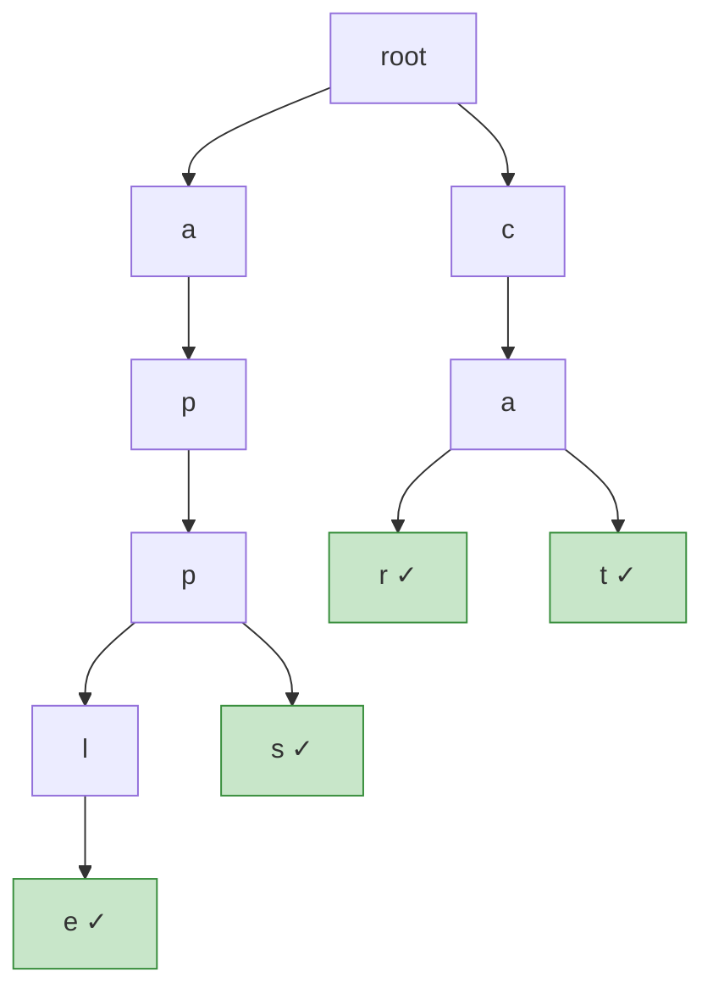

# Algorithms and Data Structures

## String


### 1\. Hashing & Frequency Counting

This is the most frequent pattern. The core idea is to use a hash map (or an array as a frequency map) to store counts of characters or words.

**Key Data Structures:** `HashMap<Character, Integer>`, `int[26]`, `int[128]`, `HashSet`

**Common Problems:**

  * Anagram detection (`s1` and `s2` have the same character counts).
  * Isomorphic strings (character mapping).
  * Finding duplicates or the first unique character.

**[Top K Frequent Words](https://leetcode.com/problems/top-k-frequent-words/)**

This problem is a classic combination of two patterns: **Hashing + Heap**.

1.  **Hashing**: Use a `HashMap<String, Integer>` to store the frequency of each word.
2.  **Heap (`PriorityQueue`)**: Use a `PriorityQueue` to find the top `k` elements efficiently. You need a custom comparator to handle the sorting logic.

*Your code snippet is perfect for this:*

```java
// Custom comparator for the PriorityQueue
// 1. Sort by frequency in descending order.
// 2. If frequencies are equal, sort alphabetically (lexicographically) in ascending order.
Queue<String> queue = new PriorityQueue<>((a, b) -> {
    if (map.get(a).equals(map.get(b))) {
        return a.compareTo(b); 
    } else {
        return map.get(b) - map.get(a);
    }
});
```

### 2\. Two Pointers

This technique uses two pointers to iterate through the string, often leading to optimal $O(N)$ time and $O(1)$ space solutions.

**Common Approaches:**

  * **Converging Pointers**: Pointers start at opposite ends and move toward the center (e.g., palindrome check).
  * **Diverging Pointers**: Pointers start at the same place and move outwards (e.g., expand around center).
  * **Read/Write Pointers**: One pointer reads ahead while the other writes to modify the string/array in place.

**[String Compression](https://leetcode.com/problems/string-compression/)**

This is a perfect example of the **Read/Write Pointers** approach.

  * A `read` pointer scans the array to find groups of consecutive identical characters.
  * A `write` pointer stays at the position where the next compressed character and count should be written.
  * Your description is spot on: "Count the adjacent characters using a forward inner while loop then add the character and count to the result."

### 3\. Palindrome-Specific Techniques

**[Palindromic Substrings](https://leetcode.com/problems/palindromic-substrings/)**

Your approach is the standard and most efficient one for this problem.

  * **Technique**: **Expand Around Center**.
  * **Logic**: Every palindrome has a center. This center can be a single character (for odd-length palindromes like "racecar") or the space between two characters (for even-length palindromes like "aabbaa"). We iterate through all possible centers and expand outwards as long as the characters match.

*Your code snippet is an excellent implementation:*

```java
int countSubstrings(String s) {
    int n = s.length();
    int ans = 0;
    for (int i = 0; i < n; i++) {
        // Expand around a single character center (odd length)
        ans += expandAndCount(s, i, i);
        // Expand around a two-character center (even length)
        ans += expandAndCount(s, i, i + 1);
    }
    return ans;
}

int expandAndCount(String s, int left, int right) {
    int count = 0;
    while (left >= 0 && right < s.length() && s.charAt(left) == s.charAt(right)) {
        count++; // Found a valid palindrome
        left--;
        right++;
    }
    return count;
}
```

### 4\. Sliding Window

A powerful technique for finding a substring that satisfies a certain condition. A "window" is maintained by two pointers, and it expands and contracts as it moves through the string.

**Common Problems:**

  * Longest Substring Without Repeating Characters.
  * Minimum Window Substring.
  * Finding all anagrams of a pattern string.

### 5\. Advanced Techniques & Unique Patterns

**[Shortest Distance to a Character](https://leetcode.com/problems/shortest-distance-to-a-character/)**

This problem has several clever solutions.

  * **Your Approach (TreeSet)**: This is an interesting solution.

    1.  Store the indices of the target character in a `TreeSet`.
    2.  For each index `i` in the string, use `TreeSet.floor(i)` and `TreeSet.ceiling(i)` to find the nearest target indices on both sides. This works and has a time complexity of $O(N \log K)$, where K is the number of target characters.

  * **Alternative Common Pattern (Two-Pass)**: This is an important $O(N)$ pattern to know.

    1.  **Left-to-Right Pass**: Iterate from left to right. `dist[i]` is the distance from `i` to the *previous* occurrence of the target character. `dist[i] = dist[i-1] + 1`.
    2.  **Right-to-Left Pass**: Iterate from right to left. Update `dist[i]` by comparing with the distance to the *next* occurrence. `dist[i] = min(dist[i], dist[i+1] + 1)`.

### 6\. Dynamic Programming on Strings

Used for optimization problems where the solution is built upon solutions to subproblems. Usually involves a 2D `dp` table.

**Common Problems:**

  * **Longest Common Subsequence**: `dp[i][j]` = LCS of `s1[0..i]` and `s2[0..j]`.
  * **Edit Distance**: `dp[i][j]` = min edits to make `s1[0..i]` equal to `s2[0..j]`.
  * **Word Break**: `dp[i]` = true if `s[0..i]` can be segmented.

### 7\. Backtracking & Recursion

Used for generating all possible combinations or permutations of strings that satisfy a condition.

**Common Problems:**

  * Generate Parentheses.
  * Letter Combinations of a Phone Number.
  * Palindrome Partitioning.

### 8\. Tries (Prefix Trees)

A specialized tree data structure used for problems involving prefixes and dictionaries.

**Common Problems:**

  * Implement an Autocomplete System.
  * Word Search II (finding words from a dictionary in a 2D grid).

---

## Binary Search

### **Standard Binary Search & Its Variations**

#### Template 1: Exact Match (`while (low <= high)`)

This template is ideal for when you are searching for an exact element and can exit as soon as it's found. The loop terminates when `low > high`.

```java
int low = 0, high = nums.length - 1;
while (low <= high) {
    int mid = low + (high - low) / 2;
    if (nums[mid] == target) {
        return mid; // Found
    } else if (nums[mid] < target) {
        low = mid + 1;
    } else {
        high = mid - 1;
    }
}
return -1; // Not found
```


#### The "Leftmost" Boundary (Round Down)

This template is designed to find the `lower_bound`—the index of the first element that is greater than or equal to the target.

```java
// Finds the FIRST element >= target
int low = 0, high = nums.length - 1;
while (low < high) {
    int mid = low + (high - low) / 2; // Standard mid, rounds down
    if (nums[mid] >= target) {
        high = mid;
    } else {
        low = mid + 1;
    }
}
// After loop, low == high. Check if this candidate is the target.
return nums.length > 0 && nums[low] == target ? low : -1;
```

**Use Cases for Template 2:**

1.  **The first occurrence of an element.**
2.  **The `ceil` of a number:** Finding the smallest element `>= target`.
3.  **Search Insert Position:** This template directly solves this problem (the final `low` is the answer).
4.  Any problem that requires finding the **leftmost boundary** or the first time a condition becomes true.


#### The "Rightmost" Boundary (Round Up)

This template is designed to find the index of the last element that is less than or equal to the target.

```java
// Finds the LAST element <= target
int low = 0, high = nums.length - 1;
while (low < high) {
    int mid = low + (high - low + 1) / 2; // CRITICAL: Rounds UP
    if (nums[mid] <= target) {
        low = mid;
    } else {
        high = mid - 1;
    }
}
// After loop, low == high. Check if this candidate is the target.
return nums.length > 0 && nums[low] == target ? low : -1;
```

**Use Cases for Template 3:**

1.  **The last occurrence of an element.**
2.  **The `floor` of a number:** Finding the largest element `<= target`.
3.  Any problem that requires finding the **rightmost boundary** or the last time a condition is true.

### Binary Search on the Answer

This is a powerful technique for optimization problems that ask for the "minimum possible" or "maximum possible" value that satisfies a certain condition.

**Explanation:**
Instead of searching for an element in an array, you binary search on the *range of possible answers*. For each `mid` value (which is a potential answer), you have a validation function `isPossible(mid)` that checks if it's feasible to achieve the goal with that value. The search space is monotonic: if an answer `X` is possible, all answers "better" than `X` (e.g., `X+1` for maximization, `X-1` for minimization) are also possible.

**Template:**

1.  **Define the Search Space:** Determine the `low` (minimum possible answer) and `high` (maximum possible answer).
2.  **Create a Validation Function:** `boolean isPossible(value)`.
3.  **Binary Search:**
    * If `isPossible(mid)` is true, it means `mid` is a potential answer. We try for a "better" one (e.g., smaller for minimization problems, so `high = mid - 1`).
    * If `isPossible(mid)` is false, `mid` is not a valid answer, so we must consider "worse" answers (e.g., `low = mid + 1`).

**Examples:**

* [Koko Eating Bananas](https://leetcode.com/problems/koko-eating-bananas/):
    * **Answer Range:** Speed `k` can be from `1` to `max(piles)`.
    * **`isPossible(speed)`:** Can Koko eat all bananas within `h` hours at the given `speed`?
* [Capacity to Ship Packages Within D Days](https://leetcode.com/problems/capacity-to-ship-packages-within-d-days/):
    * **Answer Range:** Capacity can be from `max(weights)` to `sum(weights)`.
    * **`isPossible(capacity)`:** Can all packages be shipped within `D` days with the given `capacity`?
* [Minimum Number of Days to Make m Bouquets](https://leetcode.com/problems/minimum-number-of-days-to-make-m-bouquets/description/):
    * **Answer Range:** Days can be from `1` to `max(bloomDay)`.
    * **`isPossible(days)`:** Can we make `m` bouquets if we wait for the given number of `days`?

### Searching in Rotated Sorted Arrays

This pattern applies to an array that was sorted and then rotated some number of times. The array consists of two sorted subarrays.

**Explanation:**

At each step, perform two checks:

1.  **Find the sorted half:** Is `[low...mid]` or `[mid...high]` sorted?
    * For `nums = [4, 5, 6, 7, 0, 1, 2]`, if `mid` points to `7`, the left half `[4, 5, 6, 7]` is the sorted one.

2.  **Locate the target:** Is the `target` within the range of that sorted half? If yes, search it; if no, search the other half.
    * If `target = 5`, it is within the sorted half's range `[4...7]`, so you search that part.
    * If `target = 1`, it is not in that range, so you must search the other half `[0, 1, 2]`.

**Template:**

```java
while (low <= high) {
    int mid = low + (high - low) / 2;
    if (nums[mid] == target) return mid;

    // Check if the left half (low...mid) is sorted
    if (nums[low] <= nums[mid]) {
        if (target >= nums[low] && target < nums[mid]) {
            high = mid - 1; // Target is in the sorted left half
        } else {
            low = mid + 1;  // Target is in the right half
        }
    } 
    // Otherwise, the right half (mid...high) must be sorted
    else {
        if (target > nums[mid] && target <= nums[high]) {
            low = mid + 1; // Target is in the sorted right half
        } else {
            high = mid - 1; // Target is in the left half
        }
    }
}
```

**Examples:**

* [Search in Rotated Sorted Array](https://leetcode.com/problems/search-in-rotated-sorted-array/)
* [Find Minimum in Rotated Sorted Array](https://leetcode.com/problems/find-minimum-in-rotated-sorted-array/)
* [Find Minimum in Rotated Sorted Array (with Duplicates)](https://leetcode.com/problems/find-minimum-in-rotated-sorted-array-ii/)

### Searching on Monotonic(Peaks/Valleys)

This pattern is used on arrays where values increase and then decrease (a "mountain" or bitonic array), and the goal is to find the peak element.

**Explanation:**

The strategy is to find the peak by checking the "slope" at the midpoint. By comparing `nums[mid]` with its right neighbor `nums[mid+1]`, you can tell if you are on an upward or downward slope, allowing you to discard half the array.

Let's use the example `nums = [0, 2, 4, 6, 3, 1]`. The peak is `6`.

* **Initial Step:** `low = 0`, `high = 5`. Let's say `mid = 2` (`nums[mid] = 4`).

    * We compare `nums[mid]` (4) with `nums[mid+1]` (6).
    * Since `4 < 6`, we are on the **uphill** slope. This means the peak must be to the right of `mid`.
    * **Action:** We discard the left half by setting `low = mid + 1`.

* **Next Step:** The search space is now `[3, 5]`. Let's say `mid = 4` (`nums[mid] = 3`).

    * We compare `nums[mid]` (3) with `nums[mid+1]` (1).
    * Since `3 > 1`, we are on the **downhill** slope. This means `mid` could be the peak, or the peak is to its left.
    * **Action:** We discard the right half by setting `high = mid`.

The loop continues until `low` and `high` converge on the single index of the peak element.

**Template:**

This template uses the `while (low < high)` structure, which is perfect for converging on a single point.

```java
/**
 * Finds the index of a peak element in a mountain array.
 */
int findPeakElement(int[] nums) {
    int low = 0;
    int high = nums.length - 1;

    while (low < high) {
        int mid = low + (high - low) / 2;
        
        // Check the slope at mid
        if (nums[mid] < nums[mid + 1]) {
            // Uphill slope: Peak is to the right of mid.
            low = mid + 1;
        } else {
            // Downhill slope: mid could be the peak, or the peak is to the left.
            high = mid;
        }
    }
    
    // The loop terminates when low == high, which is the index of the peak.
    return low;
}
```


### Searching in 2D Matrices

Binary search can be adapted to 2D matrices that have specific sorting properties.

**Explanation:**
There are two main sub-patterns:

1.  **Matrix as a Flattened 1D Array:** If the matrix is sorted such that the last element of row `i` is less than the first element of row `i+1`, you can treat the entire `M x N` matrix as a single sorted array of length `M*N`. An index `mid` in this virtual array maps to `matrix[mid / N][mid % N]`.

    * **Example:** [Search a 2D Matrix](https://leetcode.com/problems/search-a-2d-matrix/)

2.  **Staircase / Saddleback Search:** If each row is sorted and each column is sorted, you can't flatten it. Instead, start at a strategic corner (e.g., top-right or bottom-left).

    * From the **top-right** corner:
        * If `target` is smaller than the current element, it can't be in this column (all elements below are larger), so move left (`col--`).
        * If `target` is larger, it can't be in this row (all elements to the left are smaller), so move down (`row++`).
    * This approach eliminates one row or one column at each step.
    * **Example:** [Search a 2D Matrix II](https://leetcode.com/problems/search-a-2d-matrix-ii/)

### Binary Search on Real Numbers**

This pattern is for finding a value in a continuous range, like the square root of a number, where absolute precision is needed.

**Explanation:**
The core logic is the same, but the termination condition changes. Instead of the loop ending when `low` and `high` cross, it runs for a fixed number of iterations (e.g., 100) or until the search space `(high - low)` is smaller than a tiny epsilon value (e.g., `1e-7`). This guarantees the answer is found to the desired precision.

**Template (for Square Root):**

```java
double low = 0, high = x;
double epsilon = 1e-7; // Desired precision

while ((high - low) > epsilon) {
    double mid = low + (high - low) / 2;
    if (mid * mid > x) {
        high = mid;
    } else {
        low = mid;
    }
}
// 'low' or 'high' is the answer to the required precision
```

**Example:**

* [Minimize Max Distance to Gas Station](https://leetcode.com/problems/minimize-max-distance-to-gas-station/description/)

---

## Linked List

### **The Sentinel (Dummy) Node**

A dummy head node simplifies edge cases (empty list, deleting head, inserting at head).

```java
// Delete all nodes with value = val
ListNode deleteDuplicates(ListNode head, int val) {
    ListNode dummy = new ListNode(0, head); // dummy → head → ...
    ListNode prev = dummy;
    while (prev.next != null) {
        if (prev.next.val == val) prev.next = prev.next.next;
        else prev = prev.next;
    }
    return dummy.next;
}
```

### **Two Pointers (Fast & Slow)**

```
  Find middle:                    Detect cycle:
  slow moves 1, fast moves 2     if fast meets slow → cycle

  1 → 2 → 3 → 4 → 5             1 → 2 → 3 → 4
      s       f                           ↑       ↓
          s           f                   7 ← 6 ← 5
              s  (done, fast=null)        s,f meet at some node
  middle = slow = 3
```

```java
// Find middle node
ListNode slow = head, fast = head;
while (fast != null && fast.next != null) {
    slow = slow.next;
    fast = fast.next.next;
}
// slow = middle

// Detect cycle (Floyd's)
ListNode slow = head, fast = head;
while (fast != null && fast.next != null) {
    slow = slow.next;
    fast = fast.next.next;
    if (slow == fast) return true; // cycle found
}
return false;

// Find cycle start: after detection, reset one pointer to head
slow = head;
while (slow != fast) {
    slow = slow.next;
    fast = fast.next; // both move 1 step
}
return slow; // cycle start
```

### **Reversing a Linked List**

```
  Before:  1 → 2 → 3 → 4 → null
  After:   4 → 3 → 2 → 1 → null

  Each step: save next, flip pointer, advance prev & curr

  prev=null, curr=1     prev=1, curr=2     prev=2, curr=3     prev=3, curr=4
  null ← 1   2→3→4     null←1←2   3→4     null←1←2←3   4     null←1←2←3←4
```

```java
// Iterative reverse
ListNode prev = null, curr = head;
while (curr != null) {
    ListNode next = curr.next;
    curr.next = prev;
    prev = curr;
    curr = next;
}
return prev; // new head

// Reverse between positions left and right (1-indexed)
ListNode reverseBetween(ListNode head, int left, int right) {
    ListNode dummy = new ListNode(0, head);
    ListNode pre = dummy;
    for (int i = 1; i < left; i++) pre = pre.next;

    ListNode curr = pre.next;
    for (int i = 0; i < right - left; i++) {
        ListNode next = curr.next;
        curr.next = next.next;
        next.next = pre.next;
        pre.next = next;
    }
    return dummy.next;
}
```

### **Merge Two Sorted Lists**

```java
ListNode mergeTwoLists(ListNode l1, ListNode l2) {
    ListNode dummy = new ListNode(0), tail = dummy;
    while (l1 != null && l2 != null) {
        if (l1.val <= l2.val) { tail.next = l1; l1 = l1.next; }
        else                  { tail.next = l2; l2 = l2.next; }
        tail = tail.next;
    }
    tail.next = (l1 != null) ? l1 : l2;
    return dummy.next;
}
```

### **Common Patterns Summary**

| Pattern | When to Use | Key Idea |
|---------|-------------|----------|
| Dummy node | Insert/delete at head, merge lists | Avoid null checks |
| Fast & slow | Find middle, detect cycle, find kth from end | Two speeds |
| Reverse | Reverse whole/partial list | Flip `.next` pointers |
| Hash set | Detect duplicates, find intersection | Store visited nodes |


---

## Stack


### **1. Parentheses Validation**

Use stack to match opening brackets with closing brackets.

```java
// Valid Parentheses — O(n) time, O(n) space
boolean isValid(String s) {
    Deque<Character> stack = new ArrayDeque<>();
    for (char c : s.toCharArray()) {
        if (c == '(') stack.push(')');
        else if (c == '{') stack.push('}');
        else if (c == '[') stack.push(']');
        else if (stack.isEmpty() || stack.pop() != c) return false;
    }
    return stack.isEmpty();
}
```

```
  Input: "({[]})"

  Step:  (        ({       ({[      ({[]     ({       (        done
  Stack: [)]      [),}]    [),},]]  [),}]    [)]      []       empty ✓
         push )   push }   push ]   match ]  match }  match )
```

### **2. Expression Evaluation**

Two approaches: use operator precedence or simplify with sign tracking.

```java
// Basic Calculator II: "3+2*2" → 7
// Process * and / immediately, defer + and - by pushing to stack
int calculate(String s) {
    Deque<Integer> stack = new ArrayDeque<>();
    int num = 0;
    char op = '+';
    for (int i = 0; i < s.length(); i++) {
        char c = s.charAt(i);
        if (Character.isDigit(c)) num = num * 10 + (c - '0');
        if ((!Character.isDigit(c) && c != ' ') || i == s.length() - 1) {
            switch (op) {
                case '+': stack.push(num); break;
                case '-': stack.push(-num); break;
                case '*': stack.push(stack.pop() * num); break;
                case '/': stack.push(stack.pop() / num); break;
            }
            op = c;
            num = 0;
        }
    }
    int result = 0;
    for (int n : stack) result += n;
    return result;
}
```

### **3. Monotonic Stack (Next/Previous Greater/Smaller)**

Maintain a stack in increasing/decreasing order to find next greater/smaller element in $O(n)$.

```
  Next Greater Element for [2, 1, 2, 4, 3]

  i=0: num=2, stack=[]       → push 2         stack=[2]
  i=1: num=1, stack=[2]      → 1<2, push 1    stack=[2,1]
  i=2: num=2, stack=[2,1]    → 2>1, pop 1→ans[1]=2
                              → 2=2, push 2    stack=[2,2]
  i=3: num=4, stack=[2,2]    → 4>2, pop 2→ans[2]=4
                              → 4>2, pop 2→ans[0]=4
                              → push 4         stack=[4]
  i=4: num=3, stack=[4]      → 3<4, push 3    stack=[4,3]

  Remaining in stack → ans[3]=-1, ans[4]=-1
  Result: [4, 2, 4, -1, -1]
```

```java
// Next Greater Element — O(n)
int[] nextGreater(int[] nums) {
    int n = nums.length;
    int[] ans = new int[n];
    Arrays.fill(ans, -1);
    Deque<Integer> stack = new ArrayDeque<>(); // stores indices

    for (int i = 0; i < n; i++) {
        while (!stack.isEmpty() && nums[stack.peek()] < nums[i]) {
            ans[stack.pop()] = nums[i];
        }
        stack.push(i);
    }
    return ans;
}
```

**Monotonic Stack Variants:**

| Problem | Stack Order | Condition to Pop |
|---------|------------|------------------|
| Next Greater Element | Decreasing | `nums[stack.peek()] < nums[i]` |
| Next Smaller Element | Increasing | `nums[stack.peek()] > nums[i]` |
| Previous Greater | Decreasing | Process before push |
| Largest Rectangle in Histogram | Increasing | `heights[stack.peek()] >= heights[i]` |

---

## Sliding Window

### **1. Fixed-Size Sliding Window**

Window size is given. Slide the window one step at a time, add the new element, remove the old.

```
  Max sum of subarray of size k=3:  nums = [2, 1, 5, 1, 3, 2]

  [2, 1, 5] 1, 3, 2  → sum=8
   2 [1, 5, 1] 3, 2  → sum=7  (add 1, remove 2)
   2, 1 [5, 1, 3] 2  → sum=9  (add 3, remove 1)  ← max
   2, 1, 5 [1, 3, 2] → sum=6  (add 2, remove 5)
```

```java
// Max sum of subarray of size k — O(n)
int maxSumSubarray(int[] nums, int k) {
    int windowSum = 0, maxSum = 0;
    for (int i = 0; i < nums.length; i++) {
        windowSum += nums[i];
        if (i >= k) windowSum -= nums[i - k]; // shrink: remove leftmost
        if (i >= k - 1) maxSum = Math.max(maxSum, windowSum);
    }
    return maxSum;
}
```

### **2. Variable-Size Sliding Window (Two Pointers)**

Expand right to include, shrink left when condition breaks. Track the best window.

```
  Longest substring without repeating chars: "abcabcbb"

  [a] b c a b c b b     → len=1
  [a b] c a b c b b     → len=2
  [a b c] a b c b b     → len=3
   a [b c a] b c b b    → len=3 (shrink: 'a' repeated, move left past first 'a')
   a b [c a b] c b b    → len=3
   a b c [a b c] b b    → len=3
   a b c a b [c b] b    → len=2 (shrink: 'b' repeated)
   a b c a b c [b] b    → len=1
  Answer: 3
```

```java
// Longest substring without repeating characters — O(n)
int lengthOfLongestSubstring(String s) {
    Map<Character, Integer> lastSeen = new HashMap<>();
    int maxLen = 0, left = 0;

    for (int right = 0; right < s.length(); right++) {
        char c = s.charAt(right);
        if (lastSeen.containsKey(c) && lastSeen.get(c) >= left) {
            left = lastSeen.get(c) + 1; // shrink window past duplicate
        }
        lastSeen.put(c, right);
        maxLen = Math.max(maxLen, right - left + 1);
    }
    return maxLen;
}
```

**Variable window template:**

```java
int left = 0;
for (int right = 0; right < n; right++) {
    // expand: add nums[right] to window state
    while (/* window is invalid */) {
        // shrink: remove nums[left] from window state
        left++;
    }
    // update answer with current window [left, right]
}
```

### **3. Counting Subarrays with the "At Most K" Trick**

Count subarrays with **exactly K** distinct = `atMost(K) - atMost(K-1)`.

```java
// Subarrays with exactly K distinct integers
int subarraysWithKDistinct(int[] nums, int k) {
    return atMost(nums, k) - atMost(nums, k - 1);
}

int atMost(int[] nums, int k) {
    Map<Integer, Integer> freq = new HashMap<>();
    int left = 0, count = 0;
    for (int right = 0; right < nums.length; right++) {
        freq.merge(nums[right], 1, Integer::sum);
        while (freq.size() > k) {
            int val = nums[left++];
            freq.merge(val, -1, Integer::sum);
            if (freq.get(val) == 0) freq.remove(val);
        }
        count += right - left + 1; // all subarrays ending at right
    }
    return count;
}
```

### **4. Sliding Window with Auxiliary Data Structure**

Use a `Deque` (monotonic) or `TreeMap` for max/min in current window.

```
  Sliding window maximum, k=3:  nums = [1, 3, -1, -3, 5, 3]

  Window        Deque (stores indices, front=max)  Max
  [1, 3, -1]   [1(3), 2(-1)]                       3
  [3, -1, -3]  [1(3), 2(-1), 3(-3)]                3
  [-1, -3, 5]  [4(5)]                               5
  [-3, 5, 3]   [4(5), 5(3)]                         5

  Result: [3, 3, 5, 5]
```

```java
// Sliding window maximum — O(n) using monotonic deque
int[] maxSlidingWindow(int[] nums, int k) {
    Deque<Integer> dq = new ArrayDeque<>(); // stores indices
    int[] result = new int[nums.length - k + 1];

    for (int i = 0; i < nums.length; i++) {
        // Remove indices outside window
        while (!dq.isEmpty() && dq.peekFirst() < i - k + 1) dq.pollFirst();
        // Remove smaller elements (maintain decreasing order)
        while (!dq.isEmpty() && nums[dq.peekLast()] < nums[i]) dq.pollLast();
        dq.offerLast(i);
        if (i >= k - 1) result[i - k + 1] = nums[dq.peekFirst()];
    }
    return result;
}
```

### **Sliding Window Patterns Summary**

| Pattern | Window Size | Key Idea | Example Problem |
|---------|-------------|----------|-----------------|
| Fixed | Given `k` | Add right, remove left when `i >= k` | Max sum subarray of size k |
| Variable (shrink) | Dynamic | Expand right, shrink left when invalid | Longest substring without repeats |
| At Most K trick | Dynamic | `exactly(K) = atMost(K) - atMost(K-1)` | Subarrays with K distinct |
| With Deque/Map | Given `k` | Monotonic deque for O(1) max/min | Sliding window maximum |

---
## Backtracking

Backtracking = DFS + choose/explore/unchoose. Build candidates incrementally, abandon a path as soon as it can't lead to a valid solution.

**Template:**

```java
void backtrack(List<List<Integer>> result, List<Integer> path, /* state */) {
    if (/* base case: path is complete */) {
        result.add(new ArrayList<>(path)); // copy!
        return;
    }
    for (/* each choice */) {
        if (/* prune: skip invalid/unpromising choices */) continue;
        path.add(choice);           // choose
        backtrack(result, path, /* updated state */);  // explore
        path.removeLast();          // unchoose (backtrack)
    }
}
```

### **Core Problem Types**

#### 1. Subsets — pick any combination of elements

```
  nums = [1, 2, 3]     Decision tree (include or skip each element):

                          []
                    /            \
                  [1]             []
                /     \         /    \
            [1,2]     [1]    [2]     []
            / \       / \    / \    / \
        [1,2,3][1,2][1,3][1][2,3][2][3][]
```

```java
// Subsets — O(2^n)
void subsets(int[] nums, int start, List<Integer> path, List<List<Integer>> result) {
    result.add(new ArrayList<>(path)); // every node is a valid subset
    for (int i = start; i < nums.length; i++) {
        path.add(nums[i]);
        subsets(nums, i + 1, path, result); // i+1: don't reuse elements
        path.removeLast();
    }
}
```

#### 2. Permutations — use all elements in every order

```
  nums = [1, 2, 3]

               []
          /    |    \
        [1]   [2]   [3]
       / \    / \    / \
    [1,2][1,3][2,1][2,3][3,1][3,2]
     |     |    |    |    |    |
  [1,2,3]...  ...  ...  ...  [3,2,1]
```

```java
// Permutations — O(n!)
void permute(int[] nums, List<Integer> path, boolean[] used, List<List<Integer>> result) {
    if (path.size() == nums.length) {
        result.add(new ArrayList<>(path));
        return;
    }
    for (int i = 0; i < nums.length; i++) {
        if (used[i]) continue;           // prune: already used
        used[i] = true;
        path.add(nums[i]);
        permute(nums, path, used, result);
        path.removeLast();
        used[i] = false;
    }
}
```

#### 3. Combinations — pick exactly k elements

```java
// Combinations C(n, k) — O(C(n,k))
void combine(int n, int k, int start, List<Integer> path, List<List<Integer>> result) {
    if (path.size() == k) {
        result.add(new ArrayList<>(path));
        return;
    }
    // Pruning: need (k - path.size()) more, only (n - i + 1) available
    for (int i = start; i <= n - (k - path.size()) + 1; i++) {
        path.add(i);
        combine(n, k, i + 1, path, result);
        path.removeLast();
    }
}
```

#### 4. Grid/Path search — explore all directions, mark visited

```java
// Rat in Maze — find all paths from (0,0) to (m-1,n-1)
void solve(int[][] grid, int row, int col, String path, List<String> result) {
    int m = grid.length, n = grid[0].length;
    if (row == m - 1 && col == n - 1) { result.add(path); return; }
    if (row < 0 || col < 0 || row >= m || col >= n || grid[row][col] == 0) return;

    grid[row][col] = 0;  // mark visited
    solve(grid, row + 1, col, path + "D", result);
    solve(grid, row, col + 1, path + "R", result);
    solve(grid, row - 1, col, path + "U", result);
    solve(grid, row, col - 1, path + "L", result);
    grid[row][col] = 1;  // unmark (backtrack)
}
```

### **Handling Duplicates**

When input has duplicates (e.g., `[1, 2, 2]`), sort first, then skip consecutive duplicates at the same decision level:

```java
Arrays.sort(nums);
for (int i = start; i < nums.length; i++) {
    if (i > start && nums[i] == nums[i - 1]) continue; // skip duplicate at same level
    path.add(nums[i]);
    backtrack(nums, i + 1, path, result);
    path.removeLast();
}
```

```
  nums = [1, 2, 2] (sorted)

  Without dedup:  [1,2], [1,2] ← duplicate subsets!
  With dedup:     at i=2, nums[2]==nums[1] and i>start → skip
                  Result: [], [1], [1,2], [1,2,2], [2], [2,2]  ✓
```

### **Where Pruning Happens**

| Location | When | Example |
|----------|------|---------|
| Inside `for` loop (before recurse) | Generation problems: skip invalid/duplicate choices | Permutations: `if (used[i]) continue` |
| Inside `for` loop (break early) | Optimization: not enough elements left | Combinations: `i <= n - (k - path.size()) + 1` |
| Start of recursive call (guard) | Grid/graph: validate current state | Maze: bounds check, wall check, visited check |

### **Quick Reference**

| Problem Type | Loop starts at | Reuse? | Base case |
|-------------|---------------|--------|-----------|
| Subsets | `i = start` | No (`i+1`) | Every call adds to result |
| Subsets with dup | `i = start` + skip | No (`i+1`) | Every call adds to result |
| Permutations | `i = 0` | No (`used[]`) | `path.size() == n` |
| Combinations | `i = start` | No (`i+1`) | `path.size() == k` |
| Combination Sum (reuse) | `i = start` | Yes (`i`) | `target == 0` |
| Grid search | 4 directions | No (mark/unmark) | Reached destination |

---

## **Trie**

A **Trie** (prefix tree) is a tree-like data structure where each node represents a single character. Paths from root to marked nodes form stored words. The key advantage: operations depend on **word length** $L$, not the number of stored words $n$.

**Time Complexity:**

| Operation | Time |
|-----------|------|
| Insert | $O(L)$ |
| Search | $O(L)$ |
| StartsWith (prefix) | $O(L)$ |
| Delete | $O(L)$ |

where $L$ = length of the word/prefix.



Words stored: `apple`, `apps`, `car`, `cat`. Green nodes have `isWord = true`.

### **Array-Based Trie (lowercase a-z only)**

Each node has a fixed array of 26 children. Fast lookups but uses more memory.

```java
public class Trie {

    private final TrieNode root;

    private static class TrieNode {
        boolean isWord;                        // marks end of a complete word
        TrieNode[] children = new TrieNode[26]; // one slot per letter a-z
    }

    public Trie() {
        root = new TrieNode();
    }

    // ── Insert ───────────────────────────────────────────────────
    // Walk down the trie character by character.
    // Create new nodes for characters that don't exist yet.
    // Mark the final node as a complete word.
    public void insert(String word) {
        TrieNode curr = root;
        for (char ch : word.toCharArray()) {
            int idx = ch - 'a';
            if (curr.children[idx] == null) {
                curr.children[idx] = new TrieNode();
            }
            curr = curr.children[idx];
        }
        curr.isWord = true;
    }

    // ── Search ───────────────────────────────────────────────────
    // Walk down the trie. If any character is missing, word doesn't exist.
    // If we reach the end, check isWord (prefix "app" exists but isn't a word).
    public boolean search(String word) {
        TrieNode node = getNode(word);
        return node != null && node.isWord;
    }

    // ── Starts With ──────────────────────────────────────────────
    // Same as search, but we don't need isWord — just check if the path exists.
    public boolean startsWith(String prefix) {
        return getNode(prefix) != null;
    }

    // ── Helper: traverse to the node representing the last char ──
    private TrieNode getNode(String str) {
        TrieNode curr = root;
        for (char ch : str.toCharArray()) {
            int idx = ch - 'a';
            if (curr.children[idx] == null) return null;
            curr = curr.children[idx];
        }
        return curr;
    }
}
```

### **HashMap-Based Trie (any character)**

Uses a `HashMap` per node instead of a fixed array. Supports any character set (uppercase, digits, Unicode) and uses less memory when the alphabet is sparse.

```java
public class TrieWithMap {

    private final TrieNode root;

    private static class TrieNode {
        HashMap<Character, TrieNode> children = new HashMap<>();
        boolean isWord;
    }

    public TrieWithMap() {
        root = new TrieNode();
    }

    public void insert(String word) {
        TrieNode curr = root;
        for (char ch : word.toCharArray()) {
            // computeIfAbsent: get child or create it in one step
            curr = curr.children.computeIfAbsent(ch, c -> new TrieNode());
        }
        curr.isWord = true;
    }

    public boolean search(String word) {
        TrieNode node = getNode(word);
        return node != null && node.isWord;
    }

    public boolean startsWith(String prefix) {
        return getNode(prefix) != null;
    }

    private TrieNode getNode(String str) {
        TrieNode curr = root;
        for (char ch : str.toCharArray()) {
            curr = curr.children.get(ch);
            if (curr == null) return null;
        }
        return curr;
    }
}
```

### **Array vs Map Trie**

| | Array `TrieNode[26]` | HashMap |
|-|---------------------|---------|
| Lookup per char | $O(1)$ array index | $O(1)$ amortized hash |
| Memory per node | 26 pointers (fixed) | Only allocated children |
| Character set | a-z only | Any character |
| Best for | Leetcode, lowercase English | Real-world, mixed char sets |

### **Common Trie Patterns in Leetcode**

**1. Word Search II (LC 212) — Trie + Backtracking:**

```java
// Build a Trie from the word list, then DFS on the board.
// At each cell, follow the Trie pointer. If no child matches, prune.
// If isWord is true, add to results.
// This avoids re-searching the board for each word independently.
```

**2. Longest Common Prefix — Walk Trie until branching:**

```java
public String longestCommonPrefix(String[] strs) {
    Trie trie = new Trie();
    for (String s : strs) trie.insert(s);

    StringBuilder prefix = new StringBuilder();
    TrieNode curr = trie.root;
    while (true) {
        // Count non-null children
        int childCount = 0;
        int nextIdx = -1;
        for (int i = 0; i < 26; i++) {
            if (curr.children[i] != null) {
                childCount++;
                nextIdx = i;
            }
        }
        // Stop if branching or a word ends here
        if (childCount != 1 || curr.isWord) break;
        prefix.append((char) ('a' + nextIdx));
        curr = curr.children[nextIdx];
    }
    return prefix.toString();
}
```

**3. Auto-Complete / Prefix Matching — DFS from prefix node:**

```java
// 1. Navigate to the node for the prefix
// 2. DFS from that node to collect all words below it
public List<String> autocomplete(String prefix) {
    List<String> results = new ArrayList<>();
    TrieNode node = getNode(prefix);
    if (node == null) return results;
    dfs(node, new StringBuilder(prefix), results);
    return results;
}

private void dfs(TrieNode node, StringBuilder path, List<String> results) {
    if (node.isWord) results.add(path.toString());
    for (int i = 0; i < 26; i++) {
        if (node.children[i] != null) {
            path.append((char) ('a' + i));
            dfs(node.children[i], path, results);
            path.deleteCharAt(path.length() - 1); // backtrack
        }
    }
}
```

**Walkthrough — Insert "cat", "car", "card", then search/prefix:**

```
After inserting "cat", "car", "card":

root
 └─ c
    └─ a
       ├─ t ✓ (isWord=true)  → search("cat")=true
       └─ r ✓ (isWord=true)  → search("car")=true
          └─ d ✓              → search("card")=true

startsWith("ca")  → true  (node 'a' exists under 'c')
search("ca")      → false (node 'a' has isWord=false)
startsWith("dog") → false (no 'd' child at root)
```