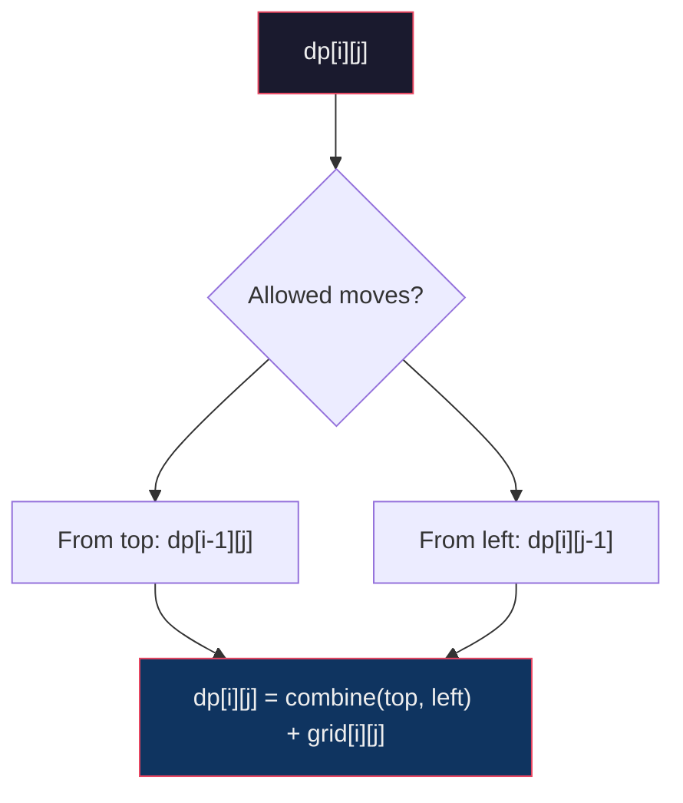
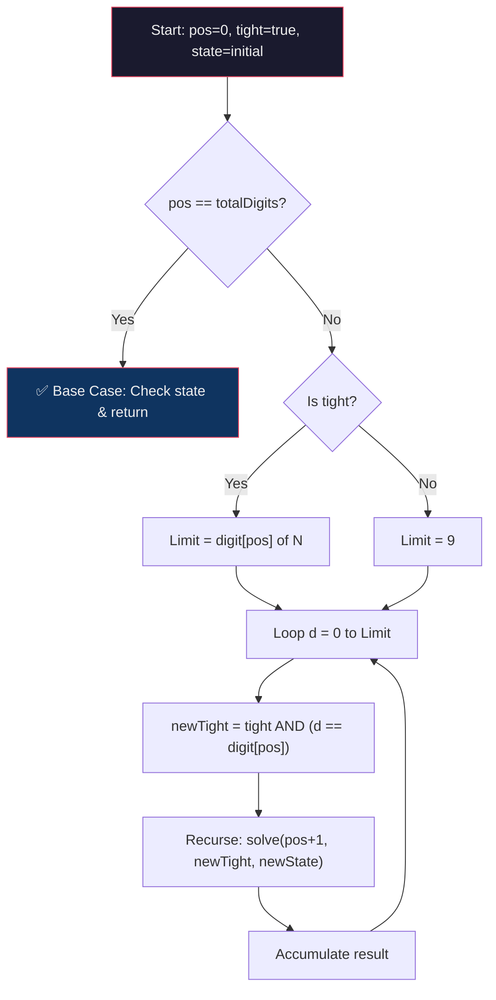
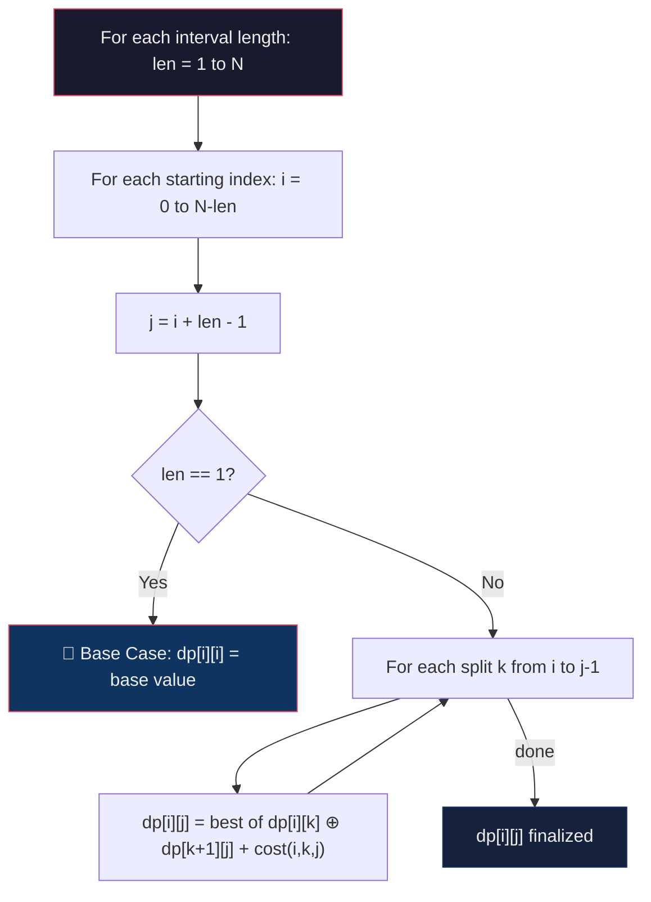
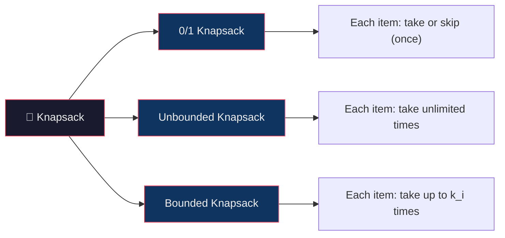
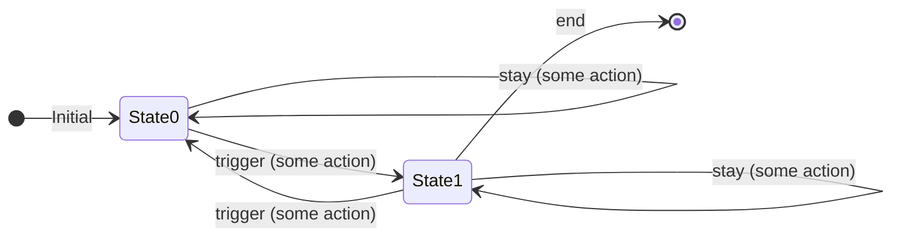
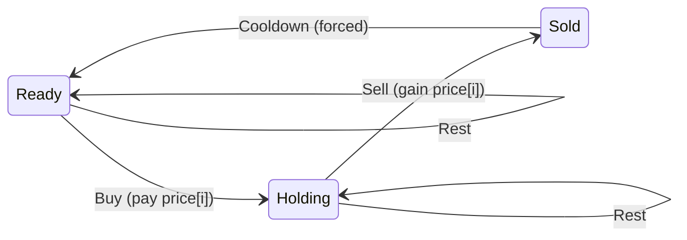
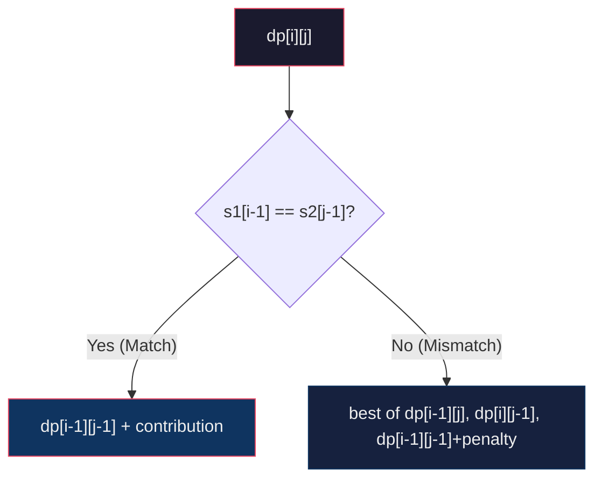
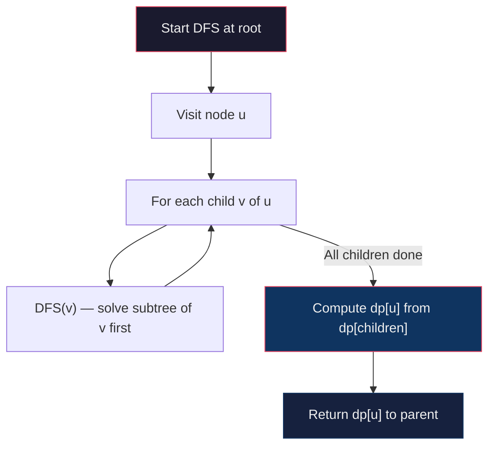

# **Introduction**

🧩 1. **State**

A **DP state** defines what subproblem you're solving.

**In other words:**

> It is a representation of the problem with a subset of inputs that leads to the full solution.

**Examples:**

* `dp[i]` = the optimal solution (e.g., max/min/count/etc.) considering the first `i` elements.
* `dp[i][j]` = the solution when considering the first `i` items and a total capacity of `j`.
* `dp[mask]` = the result when a subset of elements (represented by bitmask `mask`) has been processed.
* `F(n)` =the result (e.g., number of ways, max value, min cost, etc.) for input size or parameter n.

**You choose a state by answering:**

> What parameters do I need to uniquely define a subproblem?


🔁 2. **Transition**

A **transition** tells you how to compute the value of the current state using previously computed states.

**In other words:**

> It defines how to move from smaller subproblems to bigger ones.

**Example:**

If `dp[i]` is the number of ways to reach step `i`, and you can take 1 or 2 steps at a time:

```
dp[i] = dp[i-1] + dp[i-2]
```

Transitions are based on:

* Choices you can make
* Constraints of the problem
* Recurrence relations
    - Recurrence Relation is an equation that defines the solution to a larger problem in terms of the solutions to its smaller, overlapping subproblems.
    - It defines the relationship between the problem and its subproblems

Notes
- A **transition rule** (or transition function) defines how a system moves from one state to another in response to an input or event.

- An **induction rule** is a method of mathematical proof used to establish that a given statement is true for all natural numbers (or any well-ordered set).

    - **Key Idea:** It establishes a chain of reasoning. If the first case is true, and there's a rule that shows if any case is true then the next one must also be true, it follows that all subsequent cases are true.

🧱 3. **Base Case**

A **base case** is where your DP starts — the smallest or simplest subproblem that can be solved directly.

**In other words:**

> It provides the initial value(s) to build the rest of the DP table.

**Example:**

If you are counting the number of ways to climb stairs:

```
dp[0] = 1   # 1 way to stay at ground level (do nothing)
dp[1] = 1   # 1 way to take the first step
```

You **must always define** the base case correctly — it anchors your solution.

---


# State 

### Comprehensive DP State & Category Reference

| Category | Typical State | Description |
| :--- | :--- | :--- |
| **Linear DP (1D)** | $dp[i]$ | The optimal result for the first $i$ elements. The transition typically depends on one or more previous indices (e.g., $i-1, i-2$). |
| **Grid / Path Finding** | $dp[i][j]$ | The result (min cost, total paths) to reach cell $(i, j)$ from a starting point, usually constrained by "right" and "down" moves. |
| **0/1 Knapsack** | $dp[i][w]$ | The maximum value achieved using a subset of the first $i$ items without exceeding capacity $w$. Each item is used at most once. |
| **Unbounded Knapsack** | $dp[w]$ | The maximum value for capacity $w$ where items can be reused infinitely. The state often ignores the item index to optimize space. |
| **LCS / String DP** | $dp[i][j]$ | The optimal value (common length, edit distance) when comparing the prefix of String A (length $i$) and String B (length $j$). |
| **LIS (Subsequence)** | $dp[i]$ | The length of the longest subsequence that **ends specifically at index $i$**. This requires checking all $j < i$ where $arr[j] < arr[i]$. |
| **Interval DP** | $dp[i][j]$ | The optimal result for a sub-range $[i, j]$. Solutions are built by merging smaller intervals $[i, k]$ and $[k+1, j]$. |
| **State Machine DP** | $dp[i][state]$ | The max profit/result on day $i$ given the current mode (e.g., Holding Stock, Cooldown, or Empty). Transitions represent actions like "Buy" or "Sell." |
| **Bitmask DP** | $dp[mask][i]$ | The optimal solution given a set of visited/used items (encoded in $mask$) with the last action occurring at item $i$. |
| **Digit DP** | $dp[pos][tight][cond]$ | The count of numbers satisfying a condition from the $pos$-th digit to the end. `tight` tracks if the number is still bounded by the input limit. |
| **DP on Trees** | $dp[u][status]$ | The optimal value for the subtree rooted at $u$. `status` defines a condition, such as whether node $u$ is included in an Independent Set. |
| **Game Theory DP** | $dp[i][j]$ | The maximum score the current player can get from the range $[i, j]$, assuming both players play optimally (Minimax). |
| **Probability DP** | $dp[i][j]$ | The probability of an event occurring after $i$ trials with $j$ specific outcomes, often used in dice or coin-flip problems. |

---

# Linear DP

The most fundamental DP pattern. Process elements **one by one** (left to right), and `dp[i]` depends on previous entries.

### Core Idea

- **State:** `dp[i]` = optimal value / count / boolean considering the first `i` elements (or ending at index `i`).
- **Transition:** `dp[i]` is computed from `dp[i-1]`, `dp[i-2]`, …, or from `dp[j]` for some `j < i`.
- **Direction:** Left to right, building on previously solved subproblems.

### Template — Climbing Stairs / Fibonacci Family

```java
// dp[i] = number of ways to reach step i (can take 1 or 2 steps)
int[] dp = new int[n + 1];
dp[0] = 1;
dp[1] = 1;

for (int i = 2; i <= n; i++) {
    dp[i] = dp[i - 1] + dp[i - 2]; // arrive from 1 step back or 2 steps back
}
// Answer: dp[n]
```

> **Space optimization:** When `dp[i]` only depends on the last 1–2 values, replace the array with variables.

```java
int prev2 = 1, prev1 = 1;
for (int i = 2; i <= n; i++) {
    int curr = prev1 + prev2;
    prev2 = prev1;
    prev1 = curr;
}
// Answer: prev1
```

### Template — Maximum Subarray (Kadane's Algorithm)

```java
// dp[i] = max sum of subarray ending at index i
// Transition: extend the previous subarray or start fresh at i
int maxEndingHere = nums[0];
int maxSoFar = nums[0];

for (int i = 1; i < nums.length; i++) {
    maxEndingHere = Math.max(nums[i], maxEndingHere + nums[i]); // start fresh or extend
    maxSoFar = Math.max(maxSoFar, maxEndingHere);               // track global best
}
// Answer: maxSoFar
```

### Template — House Robber (Take / Skip with Constraint)

```java
// dp[i] = max money robbing from house 0..i (can't rob two adjacent)
int[] dp = new int[n];
dp[0] = nums[0];
dp[1] = Math.max(nums[0], nums[1]);

for (int i = 2; i < n; i++) {
    dp[i] = Math.max(
        dp[i - 1],              // skip house i
        dp[i - 2] + nums[i]    // rob house i (must skip i-1)
    );
}
// Answer: dp[n - 1]
```

### When to Use

- **Counting** paths / ways (Climbing Stairs, Decode Ways)
- **Optimization** along a sequence (House Robber, Jump Game, Max Subarray)
- **Decision at each step** — take or skip, extend or restart
- Any problem where the answer at position `i` depends on **a few prior positions**

### Key Observations

| Aspect | Detail |
|:---|:---|
| **State** | `dp[i]` — answer at/up to index `i` |
| **Transition** | `dp[i]` from `dp[i-1]`, `dp[i-2]`, or `min/max` over `dp[j]` for `j < i` |
| **Base Case** | `dp[0]`, sometimes `dp[1]` |
| **Time** | $O(n)$ when each step looks back a constant number of positions |
| **Space** | $O(n)$, often reducible to $O(1)$ |

---

# Grid DP

Solve problems on a **2D grid** where you move from one corner to another, accumulating a cost or counting paths.

### Core Idea

- **State:** `dp[i][j]` = optimal value / count to reach cell `(i, j)`.
- **Transition:** Come from allowed directions (typically top or left: `dp[i-1][j]`, `dp[i][j-1]`).
- **Direction:** Row by row, left to right (so dependencies are already solved).

### Flow



### Template — Unique Paths (Count)

```java
// dp[i][j] = number of ways to reach cell (i, j) moving only right or down
int[][] dp = new int[m][n];

// Base: first row and first column have exactly one path each
for (int i = 0; i < m; i++) dp[i][0] = 1;
for (int j = 0; j < n; j++) dp[0][j] = 1;

for (int i = 1; i < m; i++) {
    for (int j = 1; j < n; j++) {
        dp[i][j] = dp[i - 1][j] + dp[i][j - 1]; // from top + from left
    }
}
// Answer: dp[m-1][n-1]
```

### Template — Minimum Path Sum

```java
// dp[i][j] = min cost to reach cell (i, j) from (0, 0)
int[][] dp = new int[m][n];
dp[0][0] = grid[0][0];

for (int i = 1; i < m; i++) dp[i][0] = dp[i - 1][0] + grid[i][0]; // first col: only from top
for (int j = 1; j < n; j++) dp[0][j] = dp[0][j - 1] + grid[0][j]; // first row: only from left

for (int i = 1; i < m; i++) {
    for (int j = 1; j < n; j++) {
        dp[i][j] = Math.min(dp[i - 1][j], dp[i][j - 1]) + grid[i][j];
    }
}
// Answer: dp[m-1][n-1]
```

> **Space optimization:** Since each row only depends on the current and previous row, use a 1D array of size `n`.

### When to Use

- **Unique Paths** — count paths through a grid (with/without obstacles)
- **Minimum / Maximum Path Sum** — optimize cost from corner to corner
- **Dungeon Game** — minimum starting health to reach the end (fill bottom-right to top-left)
- **Cherry Pickup** — two simultaneous traversals

### Key Observations

| Aspect | Detail |
|:---|:---|
| **State** | `dp[i][j]` — answer at cell `(i, j)` |
| **Transition** | From top `dp[i-1][j]` and/or left `dp[i][j-1]` (+ diag for some problems) |
| **Base Case** | `dp[0][0]`, first row, and first column |
| **Time** | $O(m \cdot n)$ |
| **Space** | $O(m \cdot n)$, reducible to $O(n)$ |

---

# LIS (Longest Increasing Subsequence)

Find the **longest strictly increasing subsequence** in an array. A foundational pattern that appears in many disguises.

### Core Idea

- **State:** `dp[i]` = length of the longest increasing subsequence **ending at index `i`**.
- **Transition:** For each `j < i` where `nums[j] < nums[i]`, we can extend `dp[j]` by 1.

### Template — $O(n^2)$ DP

```java
// dp[i] = length of LIS ending at index i
int[] dp = new int[n];
Arrays.fill(dp, 1); // every element is an LIS of length 1 by itself

int ans = 1;
for (int i = 1; i < n; i++) {
    for (int j = 0; j < i; j++) {
        if (nums[j] < nums[i]) {
            dp[i] = Math.max(dp[i], dp[j] + 1); // extend subsequence ending at j
        }
    }
    ans = Math.max(ans, dp[i]);
}
// Answer: ans
```

### Template — $O(n \log n)$ with Patience Sorting

Instead of storing LIS lengths, maintain `tails[]` where `tails[k]` = smallest ending element of any increasing subsequence of length `k+1`. Use binary search to place each element.

```java
// tails[k] = smallest tail element of any increasing subsequence of length k+1
List<Integer> tails = new ArrayList<>();

for (int num : nums) {
    int pos = Collections.binarySearch(tails, num);
    if (pos < 0) pos = -(pos + 1);   // insertion point

    if (pos == tails.size()) {
        tails.add(num);               // extends the longest subsequence
    } else {
        tails.set(pos, num);          // replace to keep smallest possible tail
    }
}
// Answer: tails.size()
```

> **Why this works:** `tails` is always sorted. Each element either extends the longest subsequence or makes an existing length's tail smaller (opening future possibilities). The length of `tails` equals the LIS length.

### Common Disguises

| Problem | Reduction to LIS |
|:---|:---|
| Longest Non-Decreasing Subsequence | Use `<=` instead of `<` |
| Longest Decreasing Subsequence | Reverse the array, then LIS |
| Minimum Deletions for Sorted Array | `n - LIS length` |
| Russian Doll Envelopes | Sort by width ↑, then LIS on height |
| Longest Chain of Pairs | Sort by end, then LIS on start |

### Key Observations

| Aspect | Detail |
|:---|:---|
| **State** | `dp[i]` = LIS length ending at `i` |
| **Transition** | `dp[i] = max(dp[j] + 1)` for all `j < i` where `nums[j] < nums[i]` |
| **Base Case** | `dp[i] = 1` (single element) |
| **Time** | $O(n^2)$ naive, $O(n \log n)$ with binary search |
| **Space** | $O(n)$ |

---

# Bitmask

Bitmasking is a powerful technique in Dynamic Programming (DP) used to represent the **state of a set** using a single integer.

### The Core Concept: Mapping Sets to Integers

Imagine you have a set of $N$ items (labeled $0$ to $N-1$). We can represent any subset of these items using an integer where the **$i$-th bit** corresponds to the **$i$-th item**.

* **Bit is 1:** The item is in the subset (Used/Visited/On).
* **Bit is 0:** The item is not in the subset (Available/Unvisited/Off).

#### Example

Suppose we have 3 tasks: $\{A, B, C\}$.

* Task $A$ is index $0$.
* Task $B$ is index $1$.
* Task $C$ is index $2$.

If we have completed Task A and Task C, but not B, our set is $\{A, C\}$.
In binary:

* Index 2 (C): **1**
* Index 1 (B): **0**
* Index 0 (A): **1**

The binary number is $101_2$, which is the decimal integer **5**.
In our DP table, `dp[5]` would store the result for the state where A and C are completed.

### Template — Bitmask DP (Travelling Salesman / Assignment)

**State:** `dp[mask]` (or `dp[mask][i]`) = optimal value when the set of visited/assigned elements is `mask` (and we're currently at element `i`).

**Classic: TSP — shortest route visiting all cities exactly once**

```java
// dp[mask][i] = min cost to visit the set of cities in 'mask', ending at city i
int[][] dp = new int[1 << n][n];
for (int[] row : dp) Arrays.fill(row, Integer.MAX_VALUE);
dp[1][0] = 0; // start at city 0, only city 0 visited

for (int mask = 1; mask < (1 << n); mask++) {
    for (int u = 0; u < n; u++) {
        if (dp[mask][u] == Integer.MAX_VALUE) continue;  // unreachable state
        if ((mask >> u & 1) == 0) continue;               // u must be in mask

        // Try extending to an unvisited city v
        for (int v = 0; v < n; v++) {
            if ((mask >> v & 1) == 1) continue;            // v already visited
            int newMask = mask | (1 << v);
            dp[newMask][v] = Math.min(dp[newMask][v],
                                      dp[mask][u] + dist[u][v]);
        }
    }
}

// Answer: min over all ending cities, with all cities visited
int fullMask = (1 << n) - 1;
int ans = Integer.MAX_VALUE;
for (int u = 0; u < n; u++) {
    ans = Math.min(ans, dp[fullMask][u] + dist[u][0]); // return to start
}
```

**Classic: Minimum Cost Assignment — assign n jobs to n workers**

```java
// dp[mask] = min cost to assign jobs in 'mask' to the first popcount(mask) workers
int[] dp = new int[1 << n];
Arrays.fill(dp, Integer.MAX_VALUE);
dp[0] = 0; // no jobs assigned

for (int mask = 0; mask < (1 << n); mask++) {
    if (dp[mask] == Integer.MAX_VALUE) continue;
    int worker = Integer.bitCount(mask); // next worker to assign
    if (worker == n) continue;

    // Try assigning each unassigned job to this worker
    for (int job = 0; job < n; job++) {
        if ((mask >> job & 1) == 1) continue; // job already assigned
        int newMask = mask | (1 << job);
        dp[newMask] = Math.min(dp[newMask], dp[mask] + cost[worker][job]);
    }
}

// Answer: dp[(1 << n) - 1]
```

### When to Use

- **TSP** — visit all nodes with minimum cost
- **Assignment problem** — match n items to n slots optimally
- **Subset DP** — iterate over subsets when $n \leq 20$
- Any problem where the **state is a subset** and $n$ is small enough ($2^n$ fits in memory)

### Key Observations

| Aspect | Detail |
|:---|:---|
| **State** | `dp[mask]` or `dp[mask][i]` — subset + optional position |
| **Transition** | Add/remove an element from the mask |
| **Base Case** | `dp[0] = 0` or `dp[{start}][start] = 0` |
| **Time** | $O(2^n \cdot n)$ or $O(2^n \cdot n^2)$ |
| **Space** | $O(2^n)$ or $O(2^n \cdot n)$ |
| **Constraint** | Typically $n \leq 20$ |

-----

### Essential Bitwise Operations

To manipulate these sets, you use bitwise operators. Let's say `mask` is your current integer representing the set, and `i` is the index of the element you are interested in.

| Operation | Code | Explanation |
| :--- | :--- | :--- |
| **Add** element $i$ | `mask | (1 << i)` | Sets the $i$-th bit to 1. |
| **Remove** element $i$ | `mask & ~(1 << i)` | Sets the $i$-th bit to 0. |
| **Check** if $i$ exists | `(mask >> i) & 1` | Returns 1 if present, 0 if not. |
| **Toggle** element $i$ | `mask ^ (1 << i)` | Flips 0 to 1, or 1 to 0. |
| **Set of all $N$ items** | `(1 << N) - 1` | Creates a mask of $N$ ones (e.g., $111_2$). |


# Digit DP

Count numbers in a range `[L, R]` that satisfy some **digit-level property** (e.g., sum of digits = K, no repeated digits, digits in non-decreasing order).

### Core Idea

Instead of checking every number from `L` to `R`, build numbers **digit by digit** from the most significant digit, tracking:
- **Position (`pos`):** Which digit are we placing? (left → right)
- **Tight constraint (`tight`):** Are we still bounded by the limit, or have we already gone below it?
- **Problem-specific state:** Sum of digits so far, last digit placed, a bitmask of digits used, etc.

### The `tight` Flag — Why It Matters

When building a number digit-by-digit up to a limit like `N = 3842`:

| Scenario | `tight` | Allowed digits for next position |
|:---|:---|:---|
| Digits placed so far **exactly match** the prefix of N | `true` | `0` to `N[pos]` (the corresponding digit of N) |
| A previous digit was **already smaller** than N's digit | `false` | `0` to `9` (any digit — we're already below N) |

> **`tight = true`** means: "I'm walking on the edge of the limit."
> **`tight = false`** means: "I've already gone below — I'm free."

### Flow



### Template

```java
// Count numbers from 0 to N that satisfy some property
int[] digits; // digits of N
int[][][] memo; // [pos][tight][state]

int solve(int pos, boolean tight, int state) {
    // Base case: all digits placed
    if (pos == digits.length) {
        return isValid(state) ? 1 : 0;
    }

    if (memo[pos][tight ? 1 : 0][state] != -1)
        return memo[pos][tight ? 1 : 0][state];

    int limit = tight ? digits[pos] : 9;
    int result = 0;

    for (int d = 0; d <= limit; d++) {
        boolean newTight = tight && (d == limit);
        int newState = transition(state, d); // problem-specific
        result += solve(pos + 1, newTight, newState);
    }

    return memo[pos][tight ? 1 : 0][state] = result;
}

// For range [L, R]: answer = solve(R) - solve(L - 1)
```

### When to Use

- "Count integers in `[L, R]` whose digits sum to X"
- "How many numbers up to N have no repeated digit?"
- "Count numbers where digits are non-decreasing"

### Key Observations

| Aspect | Detail |
|:---|:---|
| **State** | `(pos, tight, problem_specific_state)` |
| **Transition** | Place digit `d`, update `tight` and custom state |
| **Base Case** | `pos == len(digits)` → validate the accumulated state |
| **Range trick** | `count(L, R) = count(R) - count(L-1)` |

---

# Interval DP

Solve problems on **contiguous subarrays / subsequences** where the optimal solution for a range `[i, j]` depends on splitting it into smaller ranges.

### Core Idea

- **State:** `dp[i][j]` = optimal answer for the subarray/interval from index `i` to `j`.
- **Transition:** Try every possible split point `k` in `[i, j-1]`, combine `dp[i][k]` and `dp[k+1][j]` with some merge cost.
- **Direction:** Solve smaller intervals first, build up to larger ones (bottom-up by length).

### Flow



### Template

```java
// dp[i][j] = optimal (minimum) cost to solve the subproblem over the interval [i..j]
int[][] dp = new int[n][n];

// Base case: single-element intervals have no merge cost,
// so dp[i][i] is just the inherent value of element i.
for (int i = 0; i < n; i++) {
    dp[i][i] = baseValue(i);
}

// Build solutions bottom-up by increasing interval length.
// We solve all smaller subproblems before larger ones that depend on them.
for (int len = 2; len <= n; len++) {            // len = size of the interval
    for (int i = 0; i <= n - len; i++) {        // i   = left endpoint
        int j = i + len - 1;                    // j   = right endpoint
        dp[i][j] = Integer.MAX_VALUE;           // init to worst (we're minimizing)

        // Try every possible split point k in [i, j-1].
        // Splitting at k means we first solve [i..k] and [k+1..j]
        // independently, then pay mergeCost(i, k, j) to combine them.
        for (int k = i; k < j; k++) {
            int cost = dp[i][k]                 // optimal cost for left half
                     + dp[k + 1][j]             // optimal cost for right half
                     + mergeCost(i, k, j);      // cost to merge the two halves

            dp[i][j] = Math.min(dp[i][j], cost);
        }
    }
}

// Final answer: optimal cost for the entire interval [0..n-1]
return dp[0][n - 1];
```

### When to Use

- **Matrix Chain Multiplication** — minimize scalar multiplications
- **Burst Balloons** — maximize coins by popping balloons in optimal order
- **Minimum Cost to Merge Stones** — merge piles with cost = sum
- **Palindrome Partitioning** — minimum cuts to make all parts palindromes
- **Optimal BST** — minimize search cost

### Key Observations

| Aspect | Detail |
|:---|:---|
| **State** | `dp[i][j]` — answer for interval `[i..j]` |
| **Transition** | Split at every `k` in `[i..j-1]`, combine halves + merge cost |
| **Base Case** | `dp[i][i]` = trivial single-element answer |
| **Time** | $O(n^3)$ — three nested loops |
| **Space** | $O(n^2)$ |

---

# Knapsack

Select items under a **capacity constraint** to optimize value.

### Variants at a Glance



### 0/1 Knapsack

Each item can be taken **at most once**.

**State:** `dp[i][w]` = max value using first `i` items with capacity `w`

**Transition:**
```
dp[i][w] = max(
    dp[i-1][w],              // skip item i
    dp[i-1][w - wt[i]] + val[i]  // take item i (if w >= wt[i])
)
```

**Template (Space Optimized — 1D):**

```java
int[] dp = new int[capacity + 1];

for (int i = 0; i < n; i++) {
    // ⚠️ Traverse RIGHT to LEFT to avoid using item i twice
    for (int w = capacity; w >= weight[i]; w--) {
        dp[w] = Math.max(dp[w], dp[w - weight[i]] + value[i]);
    }
}
// Answer: dp[capacity]
```

> **Why reverse?** Going left-to-right would let `dp[w - weight[i]]` use the *updated* value (item `i` already included) — effectively taking item `i` multiple times.

### Unbounded Knapsack

Each item can be taken **any number of times**.

**Transition:**
```
dp[i][w] = max(
    dp[i-1][w],              // skip item i entirely
    dp[i][w - wt[i]] + val[i]    // take item i again (note: dp[i], not dp[i-1])
)
```

**Template (Space Optimized — 1D):**

```java
int[] dp = new int[capacity + 1];

for (int i = 0; i < n; i++) {
    // ⚠️ Traverse LEFT to RIGHT — reuse of item i is intentional
    for (int w = weight[i]; w <= capacity; w++) {
        dp[w] = Math.max(dp[w], dp[w - weight[i]] + value[i]);
    }
}
// Answer: dp[capacity]
```

### Direction Cheat Sheet

| Variant | Inner loop direction | Why |
|:---|:---|:---|
| **0/1** | `w = capacity` down to `weight[i]` | Prevent reusing item `i` |
| **Unbounded** | `w = weight[i]` up to `capacity` | Allow reusing item `i` |

### Common Disguises

Many problems are knapsacks in disguise:

| Problem | Knapsack Type | Items | Capacity | Value |
|:---|:---|:---|:---|:---|
| Subset Sum | 0/1 | Numbers | Target sum | Existence (boolean) |
| Coin Change (min coins) | Unbounded | Coins | Amount | Minimize count |
| Coin Change (# ways) | Unbounded | Coins | Amount | Count combinations |
| Partition Equal Subset | 0/1 | Numbers | totalSum / 2 | Existence |
| Target Sum (+/-) | 0/1 | Numbers | Derived target | Count ways |

---

# State Machine DP

Model problems where you transition between **distinct states** at each step, and each state has its own rules.

### Core Idea

Instead of a single `dp[i]`, you maintain **multiple DP arrays** — one per state. At each step `i`, you decide which state to be in, and transitions between states follow specific rules.

### Flow (Generic)



### Classic Example: Best Time to Buy and Sell Stock with Cooldown

**States:**
- **Holding** — I own a stock
- **Not Holding (Sold)** — I just sold (cooldown next day)
- **Not Holding (Ready)** — I can buy



**Transition:**

```
hold[i]  = max(hold[i-1],  ready[i-1] - price[i])   // rest or buy
sold[i]  = hold[i-1] + price[i]                       // sell
ready[i] = max(ready[i-1], sold[i-1])                 // rest or come off cooldown
```

### Template

```java
// Define one variable per state
int hold  = Integer.MIN_VALUE; // haven't bought yet
int sold  = 0;
int ready = 0;

for (int price : prices) {
    int prevHold = hold;
    int prevSold = sold;
    int prevReady = ready;

    hold  = Math.max(prevHold, prevReady - price);  // rest or buy
    sold  = prevHold + price;                         // sell
    ready = Math.max(prevReady, prevSold);            // rest or cooldown done
}

return Math.max(sold, ready); // must not be holding at the end
```

### How to Design a State Machine DP

1. **Identify the states** — What distinct situations can you be in at each step?
2. **Draw transitions** — From each state, what actions can you take? Where do they lead?
3. **Define the DP** — One variable (or array) per state.
4. **Write transitions** — For each state, express it in terms of the previous step's states.
5. **Base cases** — What state do you start in?
6. **Answer** — Which state(s) are valid end states?

### When to Use

- **Stock buy/sell** problems (with/without cooldown, with transaction limits)
- **House Robber** (rob / skip — two states)
- **Paint House** (each color is a state)
- Any problem with **rules about what you can do based on what you just did**

---

# String DP

Solve problems on **one or two strings** where the answer depends on comparing characters and building up from substrings or subsequences.

### Two-String Problems (LCS Family)

**State:** `dp[i][j]` = answer considering `s1[0..i-1]` and `s2[0..j-1]`



**Template — Longest Common Subsequence (LCS):**

```java
int[][] dp = new int[m + 1][n + 1];
// Base: dp[0][j] = 0, dp[i][0] = 0 (empty string)

for (int i = 1; i <= m; i++) {
    for (int j = 1; j <= n; j++) {
        if (s1.charAt(i - 1) == s2.charAt(j - 1)) {
            dp[i][j] = dp[i - 1][j - 1] + 1; // match: extend
        } else {
            dp[i][j] = Math.max(dp[i - 1][j], dp[i][j - 1]); // skip one char
        }
    }
}
// Answer: dp[m][n]
```

### Single-String Problems (Palindrome Family)

**State:** `dp[i][j]` = answer for substring `s[i..j]`

**Template — Longest Palindromic Subsequence:**

```java
int[][] dp = new int[n][n];

// Base: every single char is a palindrome of length 1
for (int i = 0; i < n; i++) dp[i][i] = 1;

for (int len = 2; len <= n; len++) {
    for (int i = 0; i <= n - len; i++) {
        int j = i + len - 1;
        if (s.charAt(i) == s.charAt(j)) {
            dp[i][j] = dp[i + 1][j - 1] + 2;
        } else {
            dp[i][j] = Math.max(dp[i + 1][j], dp[i][j - 1]);
        }
    }
}
// Answer: dp[0][n-1]
```

### Edit Distance (Classic Two-String DP)

```java
// dp[i][j] = min operations to convert s1[0..i-1] to s2[0..j-1]
int[][] dp = new int[m + 1][n + 1];

for (int i = 0; i <= m; i++) dp[i][0] = i; // delete all
for (int j = 0; j <= n; j++) dp[0][j] = j; // insert all

for (int i = 1; i <= m; i++) {
    for (int j = 1; j <= n; j++) {
        if (s1.charAt(i - 1) == s2.charAt(j - 1)) {
            dp[i][j] = dp[i - 1][j - 1]; // no op
        } else {
            dp[i][j] = 1 + Math.min(
                dp[i - 1][j - 1], // replace
                Math.min(dp[i - 1][j],   // delete
                         dp[i][j - 1])    // insert
            );
        }
    }
}
```

### Common Problems

| Problem | Type | State | Key Transition |
|:---|:---|:---|:---|
| LCS | Two-string | `dp[i][j]` | Match → diagonal+1, else max(up, left) |
| Edit Distance | Two-string | `dp[i][j]` | Match → diagonal, else 1+min(diag, up, left) |
| Longest Palindromic Subseq | Single-string | `dp[i][j]` | Ends match → inner+2, else max(shrink left, shrink right) |
| Distinct Subsequences | Two-string | `dp[i][j]` | Match → dp[i-1][j-1]+dp[i-1][j], else dp[i-1][j] |
| Wildcard / Regex Matching | Two-string | `dp[i][j]` | Pattern-specific transitions |

---

# Tree DP

Compute optimal values on a **tree structure** by solving subproblems at each node using the answers from its children.

### Core Idea

- Root the tree (pick any node).
- **DFS post-order:** Solve children first, then combine their answers to solve the parent.
- **State:** `dp[node]` (or `dp[node][0/1]` if the node can be in different states).

### Flow



### Template — Generic Tree DP

```java
int[] dp;
List<List<Integer>> adj; // adjacency list

void dfs(int node, int parent) {
    dp[node] = baseValue; // e.g., 0, 1, value[node]

    for (int child : adj.get(node)) {
        if (child == parent) continue; // don't go back
        dfs(child, node);              // solve child first

        // Combine: dp[node] depends on dp[child]
        dp[node] = combine(dp[node], dp[child]);
    }
}

// Call: dfs(root, -1);
// Answer: dp[root]
```

### Classic Example: Tree Diameter (Longest Path)

```java
int diameter = 0;

int dfs(int node, int parent) {
    int maxDepth1 = 0, maxDepth2 = 0; // two longest paths down

    for (int child : adj.get(node)) {
        if (child == parent) continue;
        int childDepth = dfs(child, node) + 1;

        if (childDepth >= maxDepth1) {
            maxDepth2 = maxDepth1;
            maxDepth1 = childDepth;
        } else if (childDepth > maxDepth2) {
            maxDepth2 = childDepth;
        }
    }

    // Path through this node = maxDepth1 + maxDepth2
    diameter = Math.max(diameter, maxDepth1 + maxDepth2);

    return maxDepth1; // return longest single path to parent
}
```

### Classic Example: House Robber on Tree

Each node has a value. You can't rob two adjacent (parent-child) nodes.

```java
// dp[node][0] = max if node is NOT robbed
// dp[node][1] = max if node IS robbed
int[][] dp;

void dfs(int node, int parent) {
    dp[node][1] = value[node]; // rob this node
    dp[node][0] = 0;           // don't rob

    for (int child : adj.get(node)) {
        if (child == parent) continue;
        dfs(child, node);

        dp[node][0] += Math.max(dp[child][0], dp[child][1]); // child can be robbed or not
        dp[node][1] += dp[child][0];                          // child must NOT be robbed
    }
}
// Answer: max(dp[root][0], dp[root][1])
```

### When to Use

- **Diameter / longest path** in a tree
- **Max independent set** (House Robber III)
- **Subtree sum/count** problems
- **Rerooting technique** — compute answer for every node as root in $O(n)$
- Problems on trees where answer for a node depends on its **subtree**

### Key Observations

| Aspect | Detail |
|:---|:---|
| **Traversal** | Always **post-order DFS** (children before parent) |
| **State** | `dp[node]` or `dp[node][state]` (e.g., selected/not selected) |
| **Transition** | Combine children's DP values to compute parent's |
| **Base Case** | Leaf nodes — no children, answer is trivial |
| **Time** | $O(n)$ — each node visited once |
