# **Introduction**

## The Building Blocks of a Graph

At its heart, a graph is a simple structure used to model relationships between objects.

* **Vertices (or Nodes):** These are the fundamental entities or points in the graph. Think of them as cities on a map, people in a social network, or web pages on the internet.
* **Edges (or Links/Arcs):** These are the connections between pairs of vertices. They represent the relationship between the entities, like roads between cities, friendships between people, or hyperlinks between web pages.

A graph is formally defined as a pair of sets: `G = (V, E)`, where `V` is the set of vertices and `E` is the set of edges.

### Examples

**Social Networks**

Social platforms model human connections and interactions as graphs.

* **Vertices:** User profiles.
* **Edges:** The relationship between users.
    * **Undirected Edge:** On Facebook, a "friendship" is mutual, creating an undirected edge. If you are friends with someone, they are also friends with you.
    * **Directed Edge:** On Twitter or Instagram, a "follow" is a directed edge. You can follow someone without them following you back.


**Transportation and Maps**

Navigation systems like Google Maps or Waze use weighted graphs to find the best routes.

* **Vertices:** Specific locations, such as cities, street intersections, airports, or train stations.
* **Edges:** The paths connecting these locations, like roads, highways, flight paths, or railway tracks. These edges are typically **weighted** by values such as:
    * **Distance** (kilometers or miles)
    * **Travel Time** (which can change based on real-time traffic)
    * **Cost** (tolls or ticket prices)


**Recommendation Engines**

Services like Netflix, Spotify, and Amazon use graphs to suggest content or products you might like.

* **Vertices:** Two types of nodes exist: **Users** and **Items** (e.g., movies, songs, products). This forms a *bipartite graph*.
* **Edges:** An edge connects a User to an Item. The edge can be **weighted** by the user's interaction, such as:
    * The rating a user gave a movie (e.g., 1 to 5 stars).
    * The number of times a user has listened to a song.
    * A simple binary value indicating whether a user purchased a product.

The engine recommends items by finding users who are "close" to you in the graph (i.e., have similar tastes) and then suggesting items they liked that you haven't seen yet.


## Types of Graphs: A Visual Vocabulary

Graphs come in various flavors, each with its own specific characteristics and uses.

### **Based on Edge Direction**

* **Undirected Graph:** Edges have no direction. If an edge connects vertex A to vertex B, it also connects B to A. This is like a two-way street or a friendship on Facebook.

* **Directed Graph (Digraph):** Edges have a direction, usually indicated by an arrow. An edge from A to B doesn't necessarily mean there's an edge from B to A. This is like a one-way street or following someone on Twitter.


### **Based on Edge and Vertex Properties**

* **Weighted Graph:** Each edge is assigned a numerical weight or cost. This weight can represent distance, time, or capacity. For example, a map with distances between cities would be a weighted graph.

* **Unweighted Graph:** Edges have no assigned weights. The focus is purely on the connections themselves.

* **Simple Graph:**

  

* **Multigraph:** 

  

* **Complete Graph:**
  
  

* **Bipartite Graph:** A graph whose vertices can be divided into two disjoint and independent sets, U and V, such that every edge connects a vertex in U to one in V.

  

* **Tree:** A connected graph with no cycles. Trees are fundamental data structures in computer science.


### Fundamental Properties of Graphs 💡

**Degree of a Vertex:** 

In an undirected graph, the degree of a vertex is the number of edges connected to it. In a directed graph, we have:  
-  **In-degree:** The number of incoming edges.
-  **Out-degree:** The number of outgoing edges.

**Path:**

- **Path in an Undirected Graph**

  In an undirected graph, a path is like a trail you can walk between nodes. The direction doesn't matter.

  Consider this graph:

  ```
        A --------- B --------- E
        |           |
        |           |
        C --------- D
  ```

    * A valid path from **A** to **E** is the sequence of vertices: `A → B → E`.
    * Another valid path from **A** to **E** is: `A → C → D → B → E`.
    * The sequence `A → E` is **not** a path because there is no direct edge connecting them.


- **Path in a Directed Graph**

  In a directed graph, a path is like a one-way street. You must follow the direction of the arrows.

  Consider this graph:

  ```
        A ---------> B
        |            |
        v            v
        C ---------> D <--------- E
  ```

    * A valid path from **A** to **D** is the sequence: `A → C → D`.
    * Another valid path is: `A → B → D`.
    * The sequence `A → C → B` is **not** a valid path because you cannot go from C to B against the arrow's direction.


**Cycle**

A cycle is a path that starts and ends at the same vertex, forming a loop.

  * **In an Undirected Graph:** A cycle is a path where you can travel from a node, visit other nodes, and return to the start without reusing an edge.

    ```
       A --------- B
       |           |
       |           |
       D --------- C
    ```

    The path `A → B → C → D → A` is a cycle.

  * **In a Directed Graph:** A cycle must follow the direction of the arrows.

    ```
       A ---------> B
       ^            |
       |            |
       |            v
       D <--------- C
    ```

    The path `A → B → C → D → A` is a directed cycle. A graph with no cycles is called **acyclic**.   


- **Cycle with One Vertex :** A cycle with just one vertex is only possible if that vertex has an edge that connects back to itself. This is called a **self-loop**.

    * **Undirected Graph:** A self-loop on vertex A creates a cycle of length 1.

      ```
        ---
      /   \
      (     )
      \   /
        -A-
      ```

      The path starts at A, traverses the loop, and ends at A.

    * **Directed Graph:** Similarly, a directed edge starting and ending at the same vertex forms a cycle.

      ```
        -->--
      /     \
      (   A   )
      \     /
        --<--
      ```

  **Without a self-loop, a single vertex cannot form a cycle.**

- **Cycle with Two Vertices**

  * **Undirected Graph:** In a **simple graph** (where there are no parallel edges), a two-vertex setup is **not considered a cycle**.

    ```
       A --------- B
    ```

    The path `A → B → A` is just traversing the same edge back and forth, which doesn't count as a true cycle. To be a cycle, a path typically can't immediately reuse the same edge in reverse.

    However, a cycle *can* exist if you have **parallel edges** (making it a **multigraph**).

    ```
          /-----\
       A           B
          \-----/
    ```

    Here, you can go from `A` to `B` on the top edge and return from `B` to `A` on the bottom edge. This forms a valid cycle of length 2.

  * **Directed Graph:** A cycle with two vertices is very common and straightforward. It happens when there is an edge from A to B **and** an edge from B back to A.

    ```
         ------>
       A         B
         <------
    ```

    The path `A → B → A` is a valid directed cycle because it follows two different directed edges.


**Connected Graph**

This term primarily applies to **undirected graphs**. A graph is connected if there is a path between every pair of vertices. In simple terms, the graph is "all one piece."

  * **Connected Graph:** You can get from any node to any other node.

    ```
       A --- B --- C
             |
             D
    ```

  * **Disconnected Graph:** The graph is made of two or more separate components.

    ```
       A --- B      C --- D
    ```

    You cannot get from node A to node C.

For **directed graphs**, the equivalent concepts are "weakly connected" (if the underlying undirected version is connected) and "strongly connected."

**Strongly Connected Graph**

This term is specifically for **directed graphs**. A directed graph is strongly connected if for every pair of vertices (A, B), there is a path from A to B **and** a path from B back to A.

  * **Strongly Connected:** Every node can reach every other node.

    ```
       A <-------> B
       ^ \       / ^
       |  \     /  |
       |   \   /   |
       |    > v <  |
       +----- C ---+
    ```

    From A, you can get to B and C. From B, you can get to A and C. From C, you can get to A and B.

  * **Weakly Connected:**

    ```
       A ---------> B ---------> C
    ```

    You can get from A to C, but you **cannot** get back from C to A. Therefore, it is not strongly connected.


* **Adjacency:** Two vertices are **adjacent** if they are connected by an edge.


### Minimum Sapnning Tree

A **Minimum Spanning Tree (MST)** is the cheapest possible way to connect all the "dots" (vertices) in a weighted graph into a single tree structure without forming any cycles.

**Analogy: Connecting a New Neighborhood**

Imagine you're a city planner tasked with providing internet to a new neighborhood. You have a map of all the houses (**vertices**) and the potential cable routes between them. Digging along each route has a different cost (**edge weights**).

Your goal is to **connect every single house** to the network, directly or indirectly, using the **least amount of cable** to minimize the total cost.

  * A **Spanning Tree** is any layout that connects all houses without creating redundant loops (cycles). A loop would be wasteful—like running a cable from House A to B, then B to C, and also directly from C back to A.
  * The **Minimum Spanning Tree** is the specific layout that achieves this with the absolute lowest total cost. You're finding the cheapest possible "backbone" for the network.

**Example**

**Original Graph with All Possible Connections:**

```
      (1)
   A ------- B
   | \     / |
   |  \   /  |
(4)|   (5)  |(2)
   |    \ /   |
   |     X    |
   |    / \   |
(3)|   /   \  |(6)
   |  /     \ |
   C ------- D
      (7)
```

There are many ways to connect all four vertices, but we want the cheapest one. An MST algorithm would select the following edges:

1.  **A – B (Cost 1):** The cheapest edge overall.
2.  **B – D (Cost 2):** The next cheapest edge.
3.  **A – C (Cost 3):** The next cheapest. We can add this because it doesn't form a cycle. We don't add A-B-D-A or anything similar.


# **Patterns and Algorithms**


## BFS Variations

### 1\. Standard BFS

**Concept:**
Standard BFS is used to traverse a graph or tree level by level. It guarantees the shortest path in an **unweighted** graph. It uses a **Queue (FIFO)** data structure to ensure nodes are processed in the order they are discovered.

**Mermaid Logic:**
This diagram visualizes how BFS explores "concentric circles" (levels) moving away from the start node.

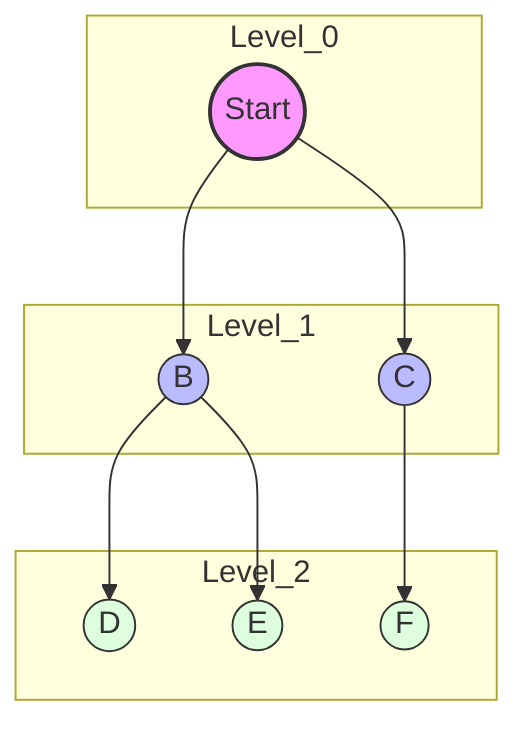

**Java Template:**

```java
public int standardBFS(List<List<Integer>> graph, int start, int target) {
    Queue<Integer> queue = new LinkedList<>();
    Set<Integer> visited = new HashSet<>();

    queue.offer(start);
    visited.add(start);
    int level = 0;

    while (!queue.isEmpty()) {
        int size = queue.size(); // Process level by level
        for (int i = 0; i < size; i++) {
            int curr = queue.poll();

            if (curr == target) return level;

            for (int neighbor : graph.get(curr)) {
                if (!visited.contains(neighbor)) {
                    visited.add(neighbor);
                    queue.offer(neighbor);
                }
            }
        }
        level++;
    }
    return -1; // Target not reachable
}
```

-----

### 2\. Multi-Source BFS

**Concept:**
Instead of initializing the queue with a single node, we initialize it with **all** source nodes simultaneously. This effectively calculates the shortest distance from *any* source to all other reachable nodes. Think of it as dropping multiple pebbles into a pond at once; the ripples expand and eventually merge.

**Mermaid Logic:**
Notice how `Source 1` and `Source 2` start the expansion at the exact same time (Level 0).

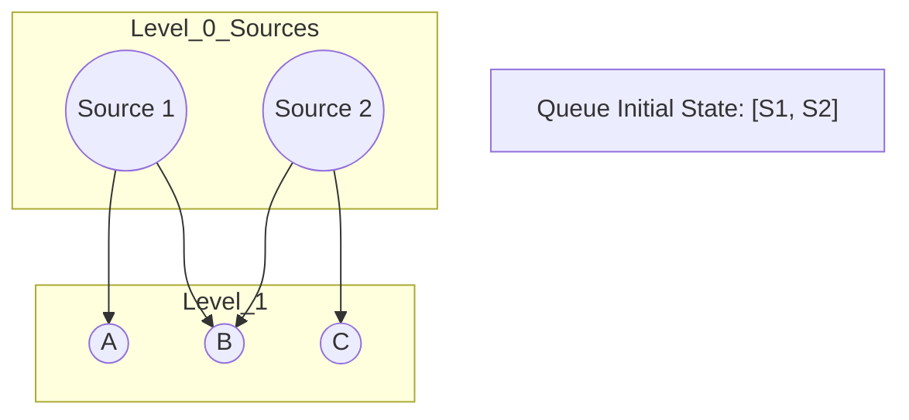

**Java Template:**

```java
public int[][] multiSourceBFS(char[][] grid) {
    int rows = grid.length, cols = grid[0].length;
    Queue<int[]> queue = new LinkedList<>();
    int[][] dist = new int[rows][cols];

    // Initialize with ALL sources
    for (int r = 0; r < rows; r++) {
        for (int c = 0; c < cols; c++) {
            if (grid[r][c] == 'SOURCE') {
                queue.offer(new int[]{r, c});
                dist[r][c] = 0;
            } else {
                dist[r][c] = Integer.MAX_VALUE; // Unvisited
            }
        }
    }

    int[][] dirs = {{0,1}, {0,-1}, {1,0}, {-1,0}};

    while (!queue.isEmpty()) {
        int[] curr = queue.poll();
        int r = curr[0], c = curr[1];

        for (int[] d : dirs) {
            int nr = r + d[0], nc = c + d[1];
            // Check bounds and if we found a shorter path
            if (nr >= 0 && nr < rows && nc >= 0 && nc < cols) {
                if (dist[nr][nc] > dist[r][c] + 1) {
                    dist[nr][nc] = dist[r][c] + 1;
                    queue.offer(new int[]{nr, nc});
                }
            }
        }
    }
    return dist;
}
```

-----

### 3\. 0-1 BFS

**Concept:**
This pattern is used when edge weights are either $0$ or $1$. It uses a **Deque (Double-Ended Queue)** instead of a standard Queue.

  * **Weight 0:** Push to the **FRONT** (prioritize processing immediately).
  * **Weight 1:** Push to the **BACK** (process later, like standard BFS).
    This is more efficient than Dijkstra's algorithm for this specific case ($O(V+E)$ vs $O(E \log V)$).

**Mermaid Logic:**
The decision diamond shows where the node is added based on the edge cost.

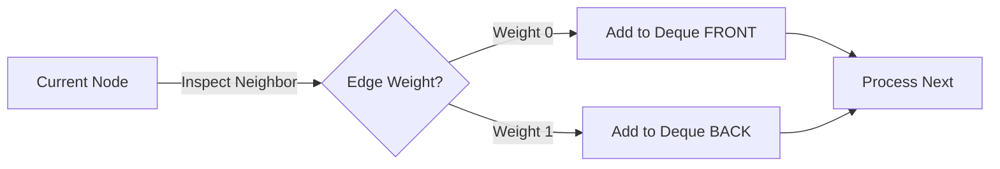

**Java Template:**

```java
public int zeroOneBFS(int n, List<List<int[]>> graph, int start, int end) {
    Deque<Integer> deque = new ArrayDeque<>();
    int[] dist = new int[n];
    Arrays.fill(dist, Integer.MAX_VALUE);

    deque.offerFirst(start);
    dist[start] = 0;

    while (!deque.isEmpty()) {
        int u = deque.pollFirst(); // Always take from front

        if (u == end) return dist[u];

        for (int[] edge : graph.get(u)) {
            int v = edge[0];
            int weight = edge[1]; // 0 or 1

            if (dist[u] + weight < dist[v]) {
                dist[v] = dist[u] + weight;
                if (weight == 0) {
                    deque.offerFirst(v); // High priority
                } else {
                    deque.offerLast(v);  // Low priority
                }
            }
        }
    }
    return -1;
}
```

-----

### 4\. BFS with Bitmasking (Stateful BFS)

**Concept:**
In standard BFS, if you visit a node, you mark it as visited and never return. In Stateful BFS, you can revisit a node **if you are in a different state** (e.g., holding a new key).

  * **State:** Usually defined as `{currentNode, currentMask}`.
  * **Visited Array:** Becomes 2D (or 3D): `visited[row][col][mask]`.

**Mermaid Logic:**
Here, Node A can be visited again because the state (keys held) is different.

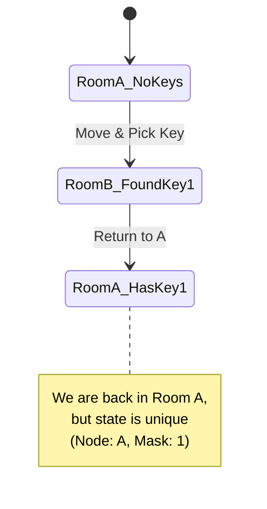

**Java Template:**

```java
class State {
    int r, c, mask, dist;
    State(int r, int c, int mask, int dist) {
        this.r = r; this.c = c; this.mask = mask; this.dist = dist;
    }
}

public int shortestPathAllKeys(String[] grid) {
    int m = grid.length, n = grid[0].length();
    // Dimensions: Row, Col, KeyState (up to 64 for bitmask usually)
    boolean[][][] visited = new boolean[m][n][64]; 
    Queue<State> q = new LinkedList<>();

    // ... (Initialization code finding start node) ...
    // q.offer(new State(startR, startC, 0, 0));
    // visited[startR][startC][0] = true;

    while (!q.isEmpty()) {
        State curr = q.poll();
        
        // Logic to check bounds, walls, and keys
        // If key found: newMask = curr.mask | (1 << keyIndex)
        // If !visited[nr][nc][newMask]:
        //     visited[nr][nc][newMask] = true
        //     q.offer(new State(nr, nc, newMask, curr.dist + 1))
    }
    return -1;
}
```

-----

### 5\. Bidirectional BFS

**Concept:**
Instead of searching from Source $\rightarrow$ Target, we search from **Source $\rightarrow$ Middle $\leftarrow$ Target** simultaneously.
This drastically reduces the search space (branching factor) because two small circles have a smaller area than one giant circle covering the same distance.

  * **Optimization:** Always expand the *smaller* set of nodes in the next iteration to balance the search.

**Mermaid Logic:**
The search terminates immediately when the "Frontier Top" intersects with the "Frontier Bottom".

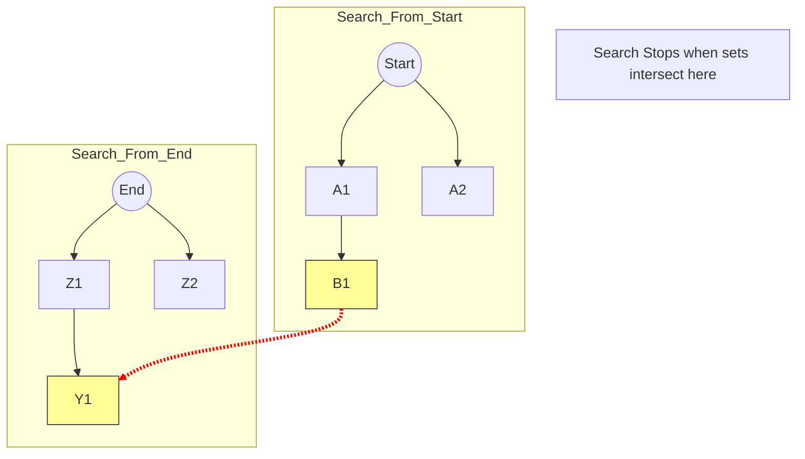

**Java Template:**
*Note: Using `Set` is often easier than `Queue` for checking intersections.*

```java
public int bidirectionalBFS(Set<String> beginSet, Set<String> endSet, Set<String> wordList, int level) {
    if (beginSet.isEmpty() || endSet.isEmpty()) return -1;

    // Optimization: Always expand the smaller frontier
    if (beginSet.size() > endSet.size()) {
        return bidirectionalBFS(endSet, beginSet, wordList, level);
    }

    Set<String> nextLevel = new HashSet<>();
    
    for (String word : beginSet) {
        // Generate all possible neighbors
        // List<String> neighbors = getNeighbors(word);
        
        for (String neighbor : neighbors) {
            if (endSet.contains(neighbor)) return level + 1; // Meet in middle
            
            if (wordList.contains(neighbor)) {
                nextLevel.add(neighbor);
                wordList.remove(neighbor); // Mark visited
            }
        }
    }
    
    return bidirectionalBFS(nextLevel, endSet, wordList, level + 1);
}
```

## **DFS Variations**


### 1\. Standard Recursive DFS (Flood Fill / Connected Components)

  * **What it does:** Visits every node in a connected component. Once a node is visited, it is marked and **never visited again**. This is used for counting islands, flood fill, or checking connectivity.
  * **Key Behavior:** "Dive deep, mark visited, never look back."
  * **LeetCode Problems:**
      * [200. Number of Islands](https://leetcode.com/problems/number-of-islands/)
      * [733. Flood Fill](https://leetcode.com/problems/flood-fill/)
      * [547. Number of Provinces](https://leetcode.com/problems/number-of-provinces/)

**Mermaid Logic:**
The diagram shows a single deep path being fully explored before the next branch is touched.

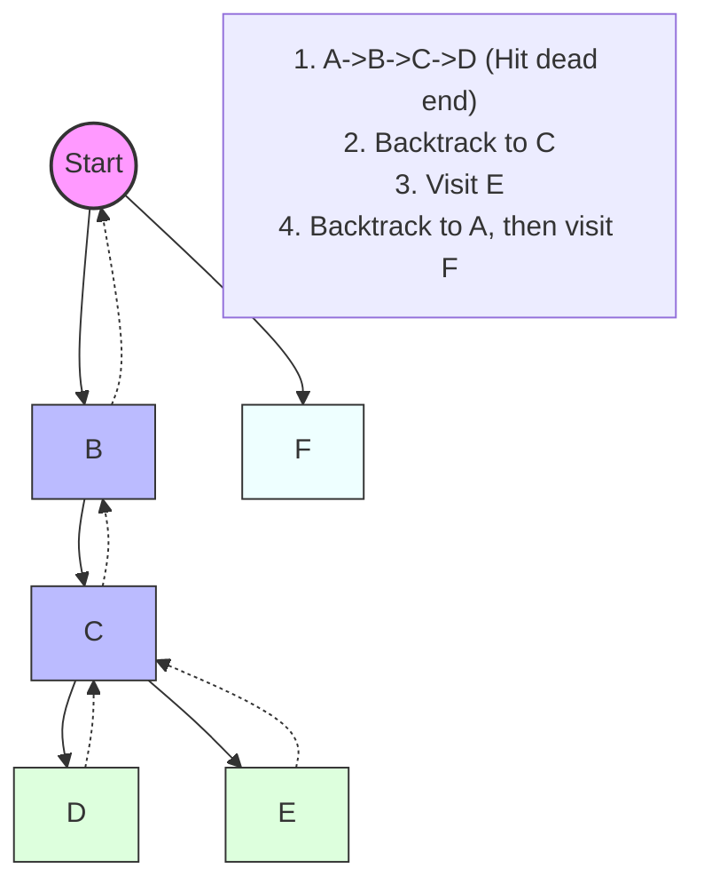

**Java Template:**

```java
public void dfs(char[][] grid, int r, int c, boolean[][] visited) {
    int rows = grid.length, cols = grid[0].length;
    
    // Base cases: out of bounds or already visited or invalid cell
    if (r < 0 || c < 0 || r >= rows || c >= cols || visited[r][c] || grid[r][c] == '0') {
        return;
    }

    visited[r][c] = true; // Mark as visited permanently

    // Recurse in all 4 directions
    dfs(grid, r + 1, c, visited);
    dfs(grid, r - 1, c, visited);
    dfs(grid, r, c + 1, visited);
    dfs(grid, r, c - 1, visited);
}
```

-----

### 2\. Iterative DFS (Using Stack)

  * **What it does:** Mimics the recursive stack using an explicit `Stack` data structure.
  * **Why use it?** To avoid `StackOverflowError` on very deep graphs (recursion limit is usually \~10,000 frames) or when recursion is forbidden.
  * **LeetCode Problems:**
      * [144. Binary Tree Preorder Traversal](https://leetcode.com/problems/binary-tree-preorder-traversal/)
      * [328. Odd Even Linked List](https://leetcode.com/problems/odd-even-linked-list/) (Logic often used here)

**Mermaid Logic:**
Explicitly pushing nodes to a Stack LIFO (Last-In-First-Out).

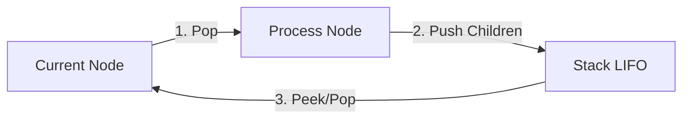

**Java Template:**

```java
public void iterativeDFS(Node start) {
    Stack<Node> stack = new Stack<>();
    Set<Node> visited = new HashSet<>();
    
    stack.push(start);
    visited.add(start);
    
    while(!stack.isEmpty()) {
        Node curr = stack.pop();
        // Process current node
        System.out.println(curr.val);
        
        for(Node neighbor : curr.neighbors) {
            if(!visited.contains(neighbor)) {
                visited.add(neighbor);
                stack.push(neighbor);
            }
        }
    }
}
```

-----

### 3\. Backtracking DFS (Find All Paths)

  * **What it does:** Explores a path, and when it returns (backtracks), it **undoes** the "visited" state. This allows the same node to be used in *different* paths.
  * **Key Difference:** In Standard DFS, you mark `visited = true` and leave it. In Backtracking, you mark `visited = true`, recurse, and then mark `visited = false` (clean up).
  * **LeetCode Problems:**
      * [79. Word Search](https://leetcode.com/problems/word-search/)
      * [46. Permutations](https://leetcode.com/problems/permutations/)
      * [51. N-Queens](https://leetcode.com/problems/n-queens/)

**Mermaid Logic:**
Notice the "Reset" step. This is the hallmark of backtracking.

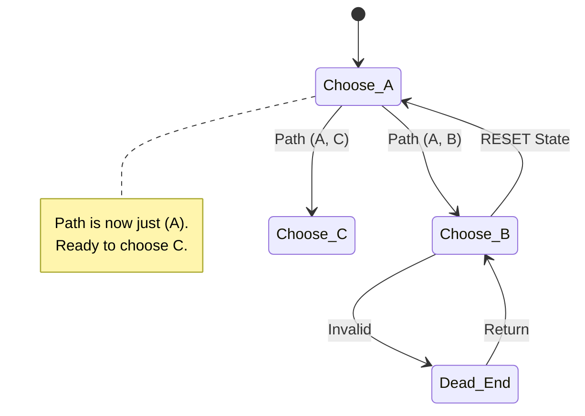

**Java Template:**

```java
public boolean backtrack(char[][] board, String word, int i, int j, int index, boolean[][] visited) {
    if (index == word.length()) return true; // Goal reached
    
    if (i < 0 || i >= board.length || j < 0 || j >= board[0].length || 
        visited[i][j] || board[i][j] != word.charAt(index)) {
        return false;
    }
    
    // 1. Choose (Mark visited)
    visited[i][j] = true;
    
    // 2. Explore (Recurse)
    boolean found = backtrack(board, word, i+1, j, index+1, visited) ||
                    backtrack(board, word, i-1, j, index+1, visited) ||
                    backtrack(board, word, i, j+1, index+1, visited) ||
                    backtrack(board, word, i, j-1, index+1, visited);
    
    // 3. Un-Choose (Backtrack / Cleanup)
    visited[i][j] = false; 
    
    return found;
}
```

-----

### 4\. Cycle Detection DFS (Three Colors)

  * **What it does:** Detects cycles in a **Directed Graph**. It distinguishes between "visited in the past" (safe) and "visited in the current recursion stack" (cycle\!).
  * **The 3 States:**
    1.  **0 (White):** Unvisited.
    2.  **1 (Gray):** Visiting (currently in the recursion stack).
    3.  **2 (Black):** Visited (fully processed).
  * **LeetCode Problems:**
      * [207. Course Schedule](https://leetcode.com/problems/course-schedule/)
      * [210. Course Schedule II](https://leetcode.com/problems/course-schedule-ii/)
      * [802. Find Eventual Safe States](https://leetcode.com/problems/find-eventual-safe-states/)

**Mermaid Logic:**
A cycle is detected *only* if we point back to a "Gray" node (one that is currently being visited).

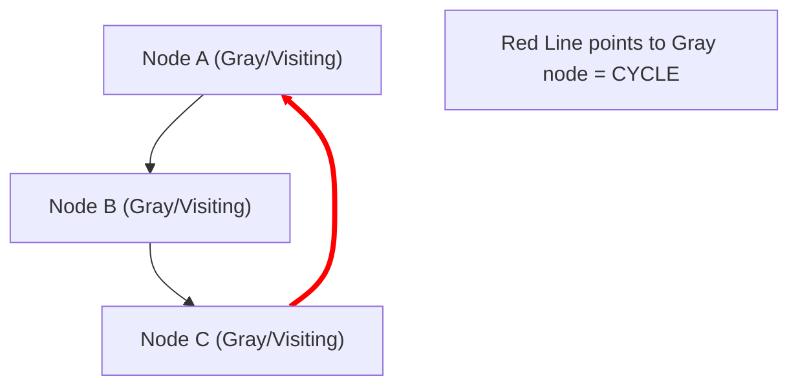

**Java Template:**

```java
public boolean hasCycle(List<List<Integer>> graph, int u, int[] state) {
    if (state[u] == 1) return true;  // Found a node currently in stack -> CYCLE!
    if (state[u] == 2) return false; // Already fully processed -> Safe
    
    state[u] = 1; // Mark as "Visiting"
    
    for (int v : graph.get(u)) {
        if (hasCycle(graph, v, state)) return true;
    }
    
    state[u] = 2; // Mark as "Visited"
    return false;
}
```

-----

### 5\. Topological Sort DFS

  * **What it does:** Orders nodes linearly such that for every edge $U \to V$, $U$ comes before $V$. Essential for dependency resolution (e.g., build systems, course prerequisites).
  * **How:** Perform a standard DFS, but add the node to a stack **only after** visiting all its children (Post-Order). Then reverse the stack.
  * **LeetCode Problems:**
      * [210. Course Schedule II](https://leetcode.com/problems/course-schedule-ii/)
      * [329. Longest Increasing Path in a Matrix](https://leetcode.com/problems/longest-increasing-path-in-a-matrix/) (Implicit topo sort)

**Mermaid Logic:**
We only add to the "Result Stack" when we are *leaving* the node (returning from recursion).

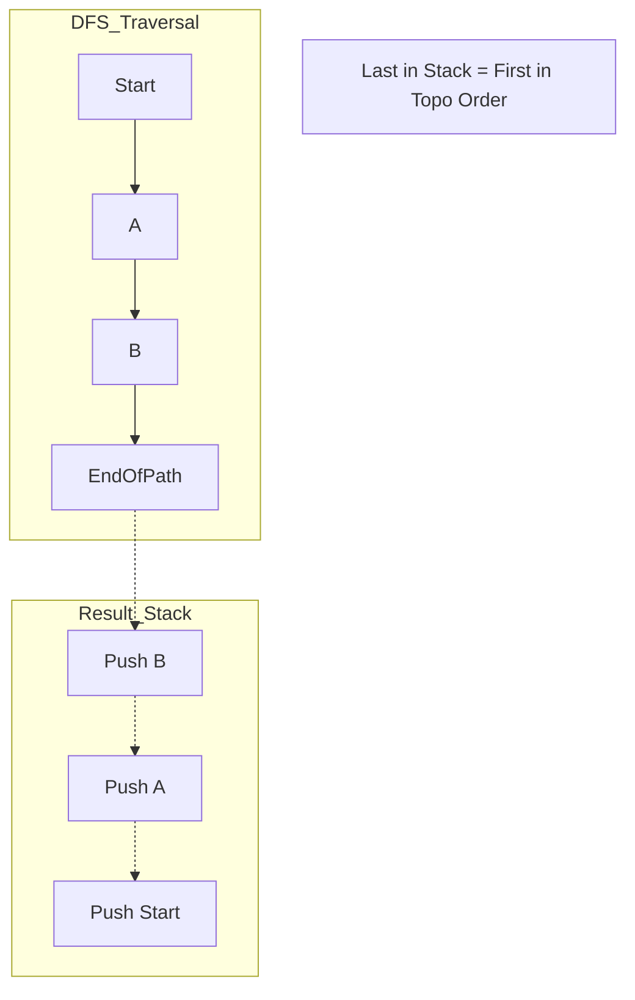

**Java Template:**

```java
Stack<Integer> stack = new Stack<>(); // To store result

public void topoDFS(List<List<Integer>> graph, int u, boolean[] visited) {
    visited[u] = true;
    
    for (int v : graph.get(u)) {
        if (!visited[v]) {
            topoDFS(graph, v, visited);
        }
    }
    
    // Push to stack ONLY after children are done
    stack.push(u); 
}

// To get result: Pop everything from stack
```


### 6\. Time-Stamp DFS (Tarjan’s Bridge-Finding Algorithm)

  * **What it does:** Uses DFS to assign a "discovery time" and a "low-link value" to every node. It identifies **"Bridges"** (edges that, if removed, disconnect the graph).
  * **The Logic:** If a node `u` has a child `v`, and `v` cannot reach back to `u` or `u`'s ancestors (i.e., `low[v] > disc[u]`), then the edge `u-v` is a bridge.
  * **LeetCode Problems:**
      * [1192. Critical Connections in a Network](https://leetcode.com/problems/critical-connections-in-a-network/) (Classic Hard problem)
      * [1489. Find Critical and Pseudo-Critical Edges in MST](https://leetcode.com/problems/find-critical-and-pseudo-critical-edges-in-minimum-spanning-tree/)

**Mermaid Logic:**
The diagram shows the "back edge" (dotted) allowing the child to reach an ancestor, updating its "Low Link" value.

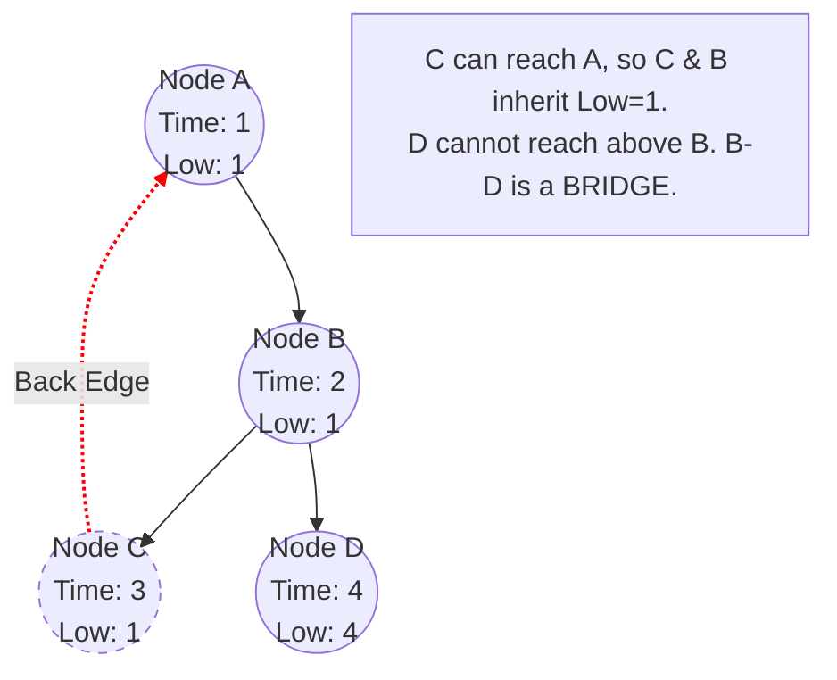

**Java Template:**

```java
int time = 0;
public void dfs(int u, int parent, List<List<Integer>> graph, int[] disc, int[] low, List<List<Integer>> bridges) {
    disc[u] = low[u] = ++time; // Initialize times
    
    for (int v : graph.get(u)) {
        if (v == parent) continue; // Don't go back to immediate parent
        
        if (disc[v] != 0) {
            // Back-edge found: Minimize low-link
            low[u] = Math.min(low[u], disc[v]);
        } else {
            // Tree-edge: Recurse
            dfs(v, u, graph, disc, low, bridges);
            // On return, propagate low-link from child to parent
            low[u] = Math.min(low[u], low[v]);
            
            // Bridge check
            if (low[v] > disc[u]) {
                bridges.add(Arrays.asList(u, v));
            }
        }
    }
}
```

-----

### 7\. Eulerian Path DFS (Hierholzer's Algorithm)

  * **What it does:** Finds a path that visits **every edge exactly once**. This is different from standard DFS which visits *nodes*.
  * **Key Trick:** It's a "Post-Order Edge Removal" DFS. You eagerly follow edges, delete them as you cross them, and add the node to the result path *only when you get stuck* (no more outgoing edges).
  * **LeetCode Problems:**
      * [332. Reconstruct Itinerary](https://leetcode.com/problems/reconstruct-itinerary/)
      * [753. Cracking the Safe](https://leetcode.com/problems/cracking-the-safe/)
      * [2097. Valid Arrangement of Pairs](https://leetcode.com/problems/valid-arrangement-of-pairs/)

**Mermaid Logic:**
We spiral deep into the graph, deleting edges. The path is built in reverse order as the recursion unwinds.

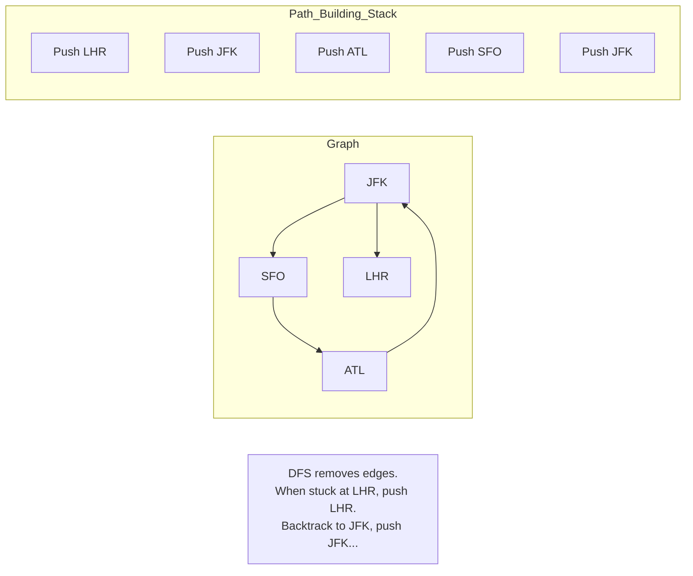

**Java Template:**

```java
// Use PriorityQueue for lexical order (if required by problem like #332)
Map<String, PriorityQueue<String>> graph = new HashMap<>();
LinkedList<String> route = new LinkedList<>();

public void dfs(String u) {
    PriorityQueue<String> arrivals = graph.get(u);
    
    while (arrivals != null && !arrivals.isEmpty()) {
        // Eagerly consume the edge (Poll removes it)
        String next = arrivals.poll();
        dfs(next);
    }
    // Add to front only when stuck (Post-Order)
    route.addFirst(u);
}
```

## **Connected Components**


## **Cycle Detection**

| **Topic**                                  | **Description**                                                                                                                                                                                                                                       | **Techniques to Detect Cycles**                                                                                                                       |
|--------------------------------------------|-------------------------------------------------------------------------------------------------------------------------------------------------------------------------------------------------------------------------------------------------------|-------------------------------------------------------------------------------------------------------------------------------------------------------|
| **Cycle Detection in an Undirected Graph** | A single edge between two vertices (`A <--> B`) **does not form a cycle** unless there is a self-loop (an edge from `A` to `A` or `B` to `B`).<br>A **cycle in an undirected graph must involve at least 3 vertices** (except when self-loops exist). | **DFS (Depth-First Search) with Parent Tracking**<br>**Union-Find (Disjoint Set Union)**                                                              |
| **Cycle Detection in a Directed Graph**    | A cycle in a directed graph can exist with just 2 vertices (`A -> B -> A`).                                                                                                                                                                           | **Cycle Detection using Colors" (Three-State DFS Marking Method)**<br>**Topological Sorting (Kahn's Algorithm - BFS)**                                |

**Examples:**

- [Redundant Connection](https://leetcode.com/problems/redundant-connection/description/) - Find the redundant connection in a graph that results in a cycle.


## **Topological Sorting in Directed Acyclic Graphs (DAGs)**

- Kahn’s Algorithm(Specific Topological Sort Algorithm) 


## **Minimum Spanning Tree (MST)**

- **Kruskal's Algorithm**  

  - Uses edges, sorts them, and adds them one by one to form the MST

- **Prim's Algorithm** 

  - Uses nodes, expanding the MST from a starting node


## **Shortest Path Algorithms**

**BFS(Unweighted graph)**

**Dijkstra's Algorithm(weighted graph with positive weights)** 

**Bellman-Ford Algorithm(weighted graph with negative weights)**

- Single-Source Shortest Path (SSSP) algorithm

**Floyd-Warshall Algorithm(weighted graph with negative weights)**

- Floyd-Warshall is an All-Pairs Shortest Path (APSP) algorithm.

